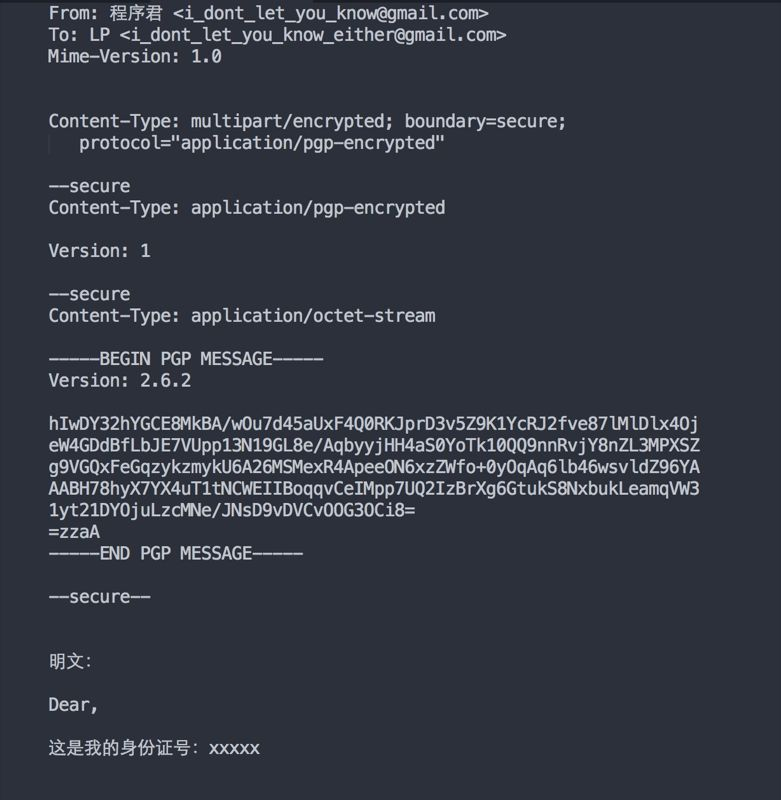
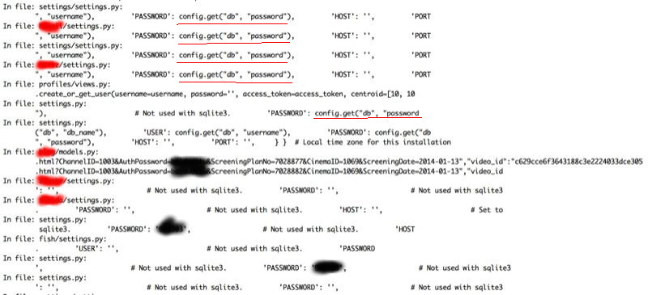

# 为什么你要懂点信息安全

 现在这个社会，数据库脱裤暴库事件，邮件泄露，信用卡信息泄漏，员工目录泄露等事件层出不穷，防不胜防。如果当你我的私人邮件成为监控者茶余饭后津津乐道的谈资，你我的身份信息，密码信息，银行卡成为骇客用来支付他们奢华生活的工具，你还会觉得信息安全还是和自己毫无关系么？

所以，即使一个人不从事安全领域相关的工作，也需要懂点安全知识。

首先，安全涵盖三个基本内容：可用性（Availability），完整性（Integrity）和机密性（Confidentiality），简称CIA。

可用性是指信息在需要的时候可以被授权的用户访问。比如在购物的时候，你的银行卡应该能够跟授权的商户完成交易。没有可用性的安全毫无价值，就跟埋在地底，无人知晓的财富一样。

完整性是指信息在生命周期内要原汁原味，不能被篡改。比如说你给朋友发封邮件，告诉他『晚上7点聚会』，这份邮件到达朋友手上的时候不该成为『晚上8点聚会』。没有完整性的安全毫无意义，甚至带来危险。

机密性是指未经授权，信息不能被访问。当你使用电脑进行网络交易时，为什么需要一个优盾？就是银行需要在整个交易的过程中保证任何信息都不会泄漏给网络中的第三方。没有机密性的安全不叫安全。

任何安全的手段都围绕着这三点构建，缺一不可。

安全涵盖的内容不外乎下面这些：

(1) 物理安全

(2) 操作安全

(3) 社会工程安全

(4) 网络通讯安全

(5) 应用程序安全

安全手段有下面内容（可能不全）：

(1) 访问控制

(2) 信息加密

(3) 灾难恢复

限于篇幅，本文先讲讲安全涵盖的内容。

首先非常重要的一点认识：对于信息安全，技术从来都是辅助手段，只是用于实现某个安全领域的要求；安全管理才是核心。仅仅追求安全技术是本末倒置。

为什么说安全的重点是管理？假设你有家公司，穷尽了各种高科技手段保护公司的信息资产，但如果窃密者尾随公司员工进入公司，大摇大摆走到打印机旁，拿走最近打印出的一叠文件，然后离开。你说技术在里面能起到什么作用？高级的门禁系统，加密的网络设备在这样的攻击面前一文不值。

了解了这一点，你就能明白为何我将物理安全，操作安全，社会工程安全放在首要地位。

物理安全很好理解。银行尽管有非常严密的技术安全体系，但还需要带有沉重铁门的地下金库，为何？因为就算你将电影中的各种监控手段（激光，热敏，温控等）应用地淋漓尽致，但如果劫匪攻得进来，逃得出去，监控再好有何用？所以厚重的铁门让你攻不进来，地底下的位置让你即使攻进来，想逃出去也很困难。这就是物理安全的重要之处。

操作安全也不难理解。它关乎日志，打补丁（弥补系统漏洞），以及潜在攻击的预防手段和攻击发生后的应对之策。在公司里的服务器上工作，如果你没有"sudo"权限，但执行了"sudo"命令，你会得到一个醒目的提示：「该操作将会被记录在案」（This incident will be recorded），这就是操作安全。它拉出了一条红线，告诉人有所为有所不为，如果做了不该做的事情，会有充分的记录来采取进一步的行动。

我们重点讲讲社会工程安全。社会工程学指的是通过与他人交往，来直接或者间接获得机密信息。在任何的安全体系里，人都是最薄弱的一环，所以是骇客攻击的重点，所有社会工程学攻击都建立在使人决断产生认知偏差的基础上。骇客也许伪装成某个弱势的女性，或者诈称是你多年未见的老朋友，或者以交易中介的形式出现，等等，来套取你的信息，进而进行下一步的攻击。根据wikipedia的介绍，社会工程学攻击有这些形式：

首先是 __假托（pretexting）__。某天你突然接到一个电话，说你的xxx亲人突然出事，在xxx医院治疗，速速汇款至某某账号。你心里一惊，连忙联系你的亲人，发现电话不通，于是在精神高度紧张中颤巍巍汇了钱过去。假托就要起到这样一种效果，通过合情合理的假象，紧张的气氛，让你陷入一种心理学称之为「隧道视角」（tunnel vision）的情境中，你的眼睛只能看到隧道终点的那丝光明。

当然，例子中的骗术广为人知，可能对大部分人都不奏效了，但难保骇客建立另外一种你没遇到过的情境，让你陷入到隧道视角中。

第二种手段是 __调虎离山（diversion theft）__。这个多看看抢银行的片子应该就很好理解 —— 押款车既定的路线重重安防，如果让其被迫改道，则实施攻击就容易多了。如果你电脑上有机密资料，想要获取的有心人可以临时叫你出去喝杯咖啡，另外的人就可以在其之上进行信息偷窃。

第三种手段是 __钓鱼（phishing）__。这个估计大家也有所耳闻 —— 给你发封邮件告诉你由于安全事故可能导致你xx银行的密码泄漏，然后给你个链接修改密码。打开的页面中，整个界面和xx银行的修改密码的界面高度一致，显著（或者不那么显著）的区别在于url有差异。如果你注意不到这点，输入了你的卡号和密码进行密码修改，那么你的银行卡的信息就被骇客获得，并由此可能被盗刷。

钓鱼还可能通过各种聊天工具，电话来进行。

第四种手段是 __下饵（baiting）__。这个手段就多的去了，你下载的软件，打开的电子邮件的附件都有可能被注入各种各样的恶意代码。人总是有弱点的，姜太公说：__「钓有三权：禄等以权，死等以权，官等以权」__。物质上的（禄），感情上的（死义），精神上的（官，权力）弱点都可以拿来『钓』。具体一些来说，就是马斯洛的需求金字塔的每个层级都能用来下饵。比如说骇客发个『最新最全2015年岛国片大全』，就能勾住有生理基本需求的人，发个『互联网公司高层薪资实名大揭密』就能钓到那些有社交需求的人。

第五种手段是 __等价交换（quid pro quo）__。心理学中人们对权威有一种盲从，甚至『怕屋及乌』，对特定的服饰也有敬畏感。当假扮的公司IT人员向你索要账户密码，你可能会乖乖就范；当西装革履的『纪委』人员把你拖走，你立马该招的不该招的都抖了出来；在异国他乡，穿着警服的问你要护照查看，你可能连反问的勇气都没有。所以，当骇客采取这些种种手段时，很容易攻破你的防线。

以上种种还只是社会工程学的一部分，凡心理学中谈到的人性的弱点（或者缺点）都能被深谙社会工程学之道的骇客采用，作为攻击的第一步。所以应对社会工程学之策，就是学点心理学，再看看社会工程学相关的书籍，知己知彼。

最后讲讲网络安全和应用程序安全。

网络安全是个很大的课题，无法用一两句话解释清楚。但它的目标很明确，就是让通讯双方的通讯内容在网络传输的过程中尽可能减少安全威胁。

比如说你访问gmail邮箱就要比163邮箱安全地多。因为gmail使用了https，在端对端进行了严格的加密，而163邮箱的一切传输都暴露在互联网之上，你的隐私就像披上了皇帝的新装。

但网络安全并不能保证信息安全。它只是你和通讯另一端之间假设了安全的通道。在里面的信息仍然会受到安全威胁。比如你太太（先确定是你太太哈）要你的身份证号，你用gmail给她回了封邮件：我的身份证号是xxx。这个信息只能保证在你和gmail之间是安全的，不代表gmail后面的组织（google）或者对gmail感兴趣的组织（NSA）不去破坏这种安全。前一阵子某网站被暴库，数据库里的密码都是明文的，这样即便网络在https的控制下是安全的，网路背后的系统不安全也无济于事 —— 这就是应用程序安全。

回到身份证号问题。最安全的途径是你先用你LP的PGP公钥对你的邮件内容加密，然后你LP用她的PGP私钥进行解密。这样，即便gmail被攻破，你的身份证号也是安全的。

比如说：

这是一个经过PGP加密的邮件，以S/MIME（如果不知道请google，很难一句话解释）的方式嵌入到一个正常的邮件中。它用接收者的公钥加密，只有接收者才能使用自己的私钥解密（一旦发出去之后，理论上连发送者都看不到里面的内容）。这样即使NSA攻陷了gmail，偷窥你的邮件，它也只能看到上面的密文，而无法得出下面明文中我的身份证号。

PGP和S/MIME在邮件上的应用早（大概十多年前）就有RFC定义，但一直无法推广开，几个原因：

(1) 应用了端对端的加密，那webmail就无法使用了（你无法通过mail.163.com/gmail.com等访问你的邮件了），很不方便。如果真要用，需要用户将其私钥上传给邮件提供商，这样就导致一种悖论。

(2) 即使你不用webmail，使用邮件客户端，你也不一定能用。首先你和你的小伙伴需要有各自的公钥私钥，其次你们需要知道各自的公钥，再次你们需要确认各自的公钥是各自的公钥。

(3) 即使满足了(2)，如果你换台电脑，如果该电脑里没有你之前的私钥，那也看不了别人发过来的邮件。

很麻烦吧？安全的漏洞就产生在各种麻烦中，比如说「操作安全」。

任何软件都有漏洞。如果一家公司号称自己的系统在发布时「零缺陷」，那是自欺欺人。软件工程的常态是「带着缺陷发布，只要缺陷无法被利用」（ship with bugs, as long as they are not easily exploitable）。发布时带的缺陷是漏洞（vulnerability），如果不被利用（exploit），就不存在实际的风险。就像windows里臭名昭著的WinNuke攻击，利用的就是windows里的一个存在了很久的漏洞 —— 但之前好多年，好多个版本的windows一样活得好好的。

风险管理的要点是：我们无法弥补所有的漏洞，但我们可以让漏洞无法被利用。所以有漏洞不怕，怕的是漏洞被人发现之后不去弥补。在有漏洞的系统前放台防火墙是一种让漏洞无法被利用的方法，「操作安全」中的打补丁，是另一种方式。你以为操作系统，各种系统软件，甚至你开发软件使用的框架，如 linux 定期发布安全更新是逗你玩的么？它们都是被暴露出来的漏洞的应对之策，有些真正解决了漏洞本身，有些只是让对应的攻击不奏效（漏洞无法被利用）。如果你的系统没有对应打补丁，那么，黑客只要能嗅探出你使用的软件版本，就能找到对应的方式来玩你。

当然，所谓「匹夫无罪，怀璧其罪」，你如果没有让别人觉得有攻击的价值，那么你很可能也不会受到攻击。

对于「社会工程学安全」，很多人不以为然，尤其是我们这群自视甚高的程序员，在知乎里或者微信里喷了我一脸吐沫。你如果真生活在「技术就是一切」的梦想里我也无法阻止，我只是说给愿意听的人。

「物必先腐也，而后虫生之」，堡垒都是从内部攻破的。社会工程学瞄准的就是这点。为了证明社会工程学离你有多近，程序君写了个脚本针对程序员做最基本的社会工程学嗅探（没用之前文章里讲得那些常用手段，因为对我而言可操作性差了点）。

我们知道程序员会使用github，很多人会把自己的个人项目放在上面。对于互联网应用，基本上都会连接数据库。所以，如果你用了这些框架：如django，rails，expressjs里面都会存用户名，数据库密码。理论上作者应该把这些敏感信息屏蔽，但实际呢？我们能否通过代码找到某个人常用的用户名和密码呢？

上图是我的脚本输出的信息。本来展示的信息要比图中的多得多，我可以直接打开有泄漏嫌疑的代码去进一步嗅探，但内容太多不好一一屏蔽，用 gimp 改图太费劲，所以我把很多输出注释掉了。

黑色的被我涂掉的内容是作者的密码，红色的是我不想让你看到的可能暴露作者身份的信息。红色划线的文字是我可以进一步嗅探这个repo中包含密码的其它文件。

这个嗅探是针对我的一个朋友。

我还嗅探了一些不认识的人，发现github简直是找寻一个用户惯用用户名和密码的宝库。有个哥们的好几个密码都是简单得以某字母开头，加八位生日，然后有一个数据库的root的密码是他的长长的英文名全写（包括姓）+生日（总共十八位之长），我也有理由相信这样的密码他会用在一些比较重要的场合，比如说邮箱密码 —— 我甚至抑制不住去猜他的gmail，来尝试这个密码是否他gmail的密码（当然我没功夫试啦）。

整个过程中我没有用任何高深的黑客知识（在此方向我基本是个小白），但通过探寻人性的弱点，和一点点脚本能力（几十行代码而已），我就可以获取到一些关键信息。

如果说看了本文，你还满头雾水不知道该采取什么样的安全措施，那么，程序君总结一下：

(1) 不要使用和自己身份相关的信息作为密码（设置密码的一个好方法是记下一个英文常句，然后将其首字母连起来，再用一个固定的规律加盐，比如说，第三个字母大写，第七个字母后加一个数字等等。

(2) 如果有敏感信息在网络中传输，请确保对方网址的正确性，以及全程是否使用了https。

(3) 对于网银，能用优盾就用优盾，文件证书在windows下不安全（windows下没有节操的软件太多了）

(4) 学些心理学 —— 知道人家怎样对你施加影响，以及怎么破

(5) 脑袋里装上十万个为什么，多质疑查证
