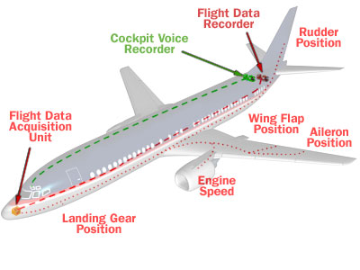
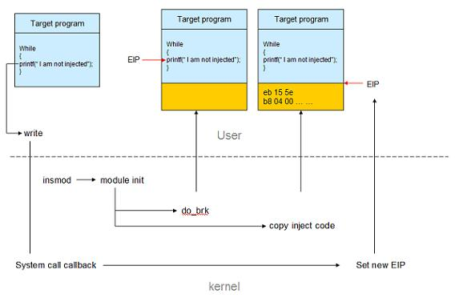

# 黑匣子

很多人看到这个标题的第一印象可能是 —— 这是要讲飞机上的黑匣子么？有点关系，但主要讲软件中的flight data recorder。不过我们先从黑匣子讲起。

Flight Data Recorder（FDR）用于记录飞机行驶过程中的各种关键数据，其规格如下：

* 电源：115V AC 或 28V DC
* 电源能力：30天不间断
* 使用期限：至多6年
* 包含水下定位装置
* 能记录25小时不间断数据
* 能经受1100度高温

FDR的硬件架构：

* CPU card
* Ana日志 card
* Discrete card
* Frequency card
* Audio card
* Power supply card

水下定位装置能在深达12000ft的水域正常工作，发送37.5khz的声音信号。

FDR会记录些什么？

* time
* pressure
* altitude
* airspeed
* vertical acceleration
* magnetic heading
* control-column position
* rudder-pedal position
* control-wheel position
* horizontal stablizer
* fuel flow

FDR（以及CVR, Cockpit Voice Recorder，记录机组人员及空乘的对话）对于定位航班失事的原因非常重要，因为它是进行RCA（Root Cause Analysis）的第一手资料。没有FDR，或者找不到FDR，基本上客机失事就会成为一个永远的谜团。

下图展示了FDR在飞机上的位置，以及数据的收集：

而越来越复杂的软件系统也有这样的问题。运行在客户端的软件，运行的过程中突然崩溃，很多时候单凭崩溃时产生的core很难找到问题的原因（请类比飞机碎片）。这时候，我们就要求助于软件系统中的FDR了。

最典型，也是最原始的FDR是日志。几乎所有的软件都有日志。通过分析系统崩溃前的日志，我们可以找到一些问题的原因，但很多问题依旧无法靠日志来进行找到根本原因，这是因为，日志的定位是记录系统的关键路径，关键路径有时候并不一定等同于关键数据。

打开调试开关，提供调试版本？很多问题是特定情况的突发事件，需要很隐晦条件才能触发，调试开关，调试版本这样的事后诸葛亮，只要问题不能复现，就没有用武之地。

这就是软件系统中的黑匣子FDR存在的价值和意义了。

网上关于软件系统中的FDR的信息还很少，除了我了解的systemtap的flight record mode（FRM）外，就是Java中对FDR的支持了。我们先看Java FDR。

Java FDR是建立在JVM中的，所以只要JVM使能了FDR，所有运行在其上的application都将受益（这又是indirection好处的一大佐证）。它提供几大功能：

(1) Tracer：tracer捕捉JVM和application中的runtime数据，包括GC，synchronization，compiler (JIT)，CPU usage，exceptions，I/O等等信息。

(2) Profiler：定期对系统采样（追踪系统的性能），或者on-demand profiling，当且仅当需要时可以打开进行全数据采集（对性能有较大影响，但仅在特定事件下或者特定配置下触发）。

(3) after-the-fact analysis：即事后分析。捕获的运行时数据会放在一片循环的缓存中（kernel memory或文件）。当意外事件发生时（比如崩溃），这片缓存中的数据被输出，用于定位问题。

我对Java和JVM几乎没有涉猎，所以以上理解都是皮毛，希望Java大牛来拍砖。

systemtap的飞行模式（FRM）是另外一种FDR。

如果你在linux下进行系统开发而没有涉猎systemtap，建议研究一下。systemtap给予你写段脚本runtime注入到目标软件中，从软件中获取信息的能力。这功能如此凶悍，所以你需要"sudo"的权限来运行systemtap。简单讲一下systemtap的原理：

(1) 首先用户可以撰写stap脚本，选择要注入的进程和函数

(2) stap脚本被编译成c文件，然后编译成kernel module，通过insmod加载进内存。

(3) kernel module初始化时会使用``do_brk()``为目标进程分配新的内存，把要注入的代码写入新的内存区域。

(4) 如果要probe的是某条指令，则将该指令替换成跳转到注入区执行；如果probe的是系统调用，则在系统调用中完成代码的注入。

(5) 当注入代码执行完毕后，恢复注入点的代码，并执行，对于目标进程而言就像正常执行一样。

下图是对系统调用 ``write`` 进行probe的一个示例：

这个原理和病毒基本一样。只不过，它的目的是在不用修改目标程序源代码的情况下，从目标中获取统计信息，达到运行时调试 / 性能剖析的功效。

如果打开systemtap的飞行模式，则其会不断往1MB（可配置）的一个内核缓冲区中写监控数据，并且在需要的时候输出进行分析。

对于FDR而言，有了称手的工具是远远不够的。最关键的是：究竟什么样的数据才是关键数据，值得记录，用以崩溃后的分析？如果采样太多的系统数据，会给系统本身的性能带来冲击，而且过多的数据杂音很大，反而不便于分析；如果采样的数据不够，无法进行根本原因分析，那么FDR就失去了应有的作用。

此外，对数据合理的可视化也非常重要，因为它能帮助人更好地理解数据间的关系，从而为根本原因分析提供线索。
