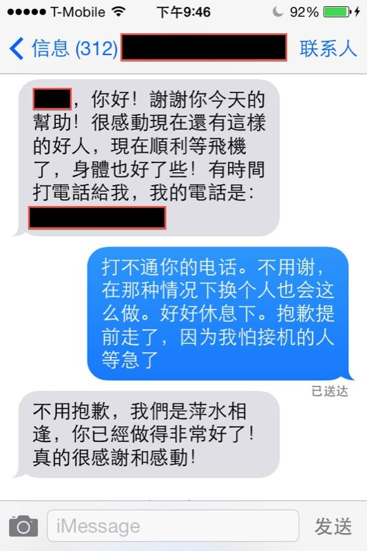

# CA985上的故事

经历了11小时的航班，程序君终于安全抵达旧金山。这次航班是个奇特的经历，一不小心，我学雷锋做了件好事，连机场的地勤人员都交口称赞，就差给我发条红领巾，颁个好人卡了。不过读完本文后我相信如果你处在我当时的位置，也会和我做出同样的选择的（甚至比我做得还好）。

事情是这样的。我要了个靠紧急出口的座位，位置不那么好，在中间，夹在靠走道和靠窗两个座位中间。左边一位去Santa Clara出差的大叔，右边是一位住在Las Vegas的大姐。大姐一切看着很正常，可飞机起飞后，她向空姐要了个到港后的轮椅服务。我忍不住问了她一句：「你看着好好的，为什么要轮椅呢？」于是她讲起她几年前遭受的车祸，以及之后的后遗症 —— 飞机降落的过程中，脑部供血会不足，她会浑身瘫软，没有力气，所以需要轮椅。我听了挺震惊，果然每个人都有自己的幸或不幸的故事。

大姐在美国定居了十几年，先是在SF开了家画廊，然后又随她先生搬去Vegas，现在在教小孩子画画，她给我展示她画的各种花卉，很漂亮；我一远离艺术的粗人，没啥拿得出手的作品给她看，只好展示我唯一的一件艺术珍品 —— 我家小宝。我给她看了小宝的照片，还有我做的小宝180天的视频。她自己没有孩子，但非常喜欢孩子，看着小宝的各种萌态，讲起她姐姐的孙辈叫他姨姥，满脸都是幸福。我问她回国探亲么？她说是。回唐山看父母。

「唐山？」

「是的。」她说，「我是从唐山大地震的废墟中爬出来的孩子，当时只有六七岁」。

我一下子被震住了，没想到这里还有个这样的故事。她说她家在唐山一个什么县里，也在震源中心处。地震发生后，她父亲砸烂窗户，领着全家的孩子，逃了出去。逃跑的路上，她还傻乎乎地觉得好玩，挺开心的。然后天上就在下雨，很大很大的雨，几近辗转后他们躲在军绿色的简易帐篷下，看热水汩汩地从地底往上冒。

我们就这样有一搭没一搭地聊着，地震，画家，画廊，车祸，vegas，我感觉她自己的故事够拍部电影了。期间我力所能及帮了她一些小忙，比如倒个水，扔个垃圾什么的。反正我的座位就在配餐室旁边。除了聊天，我自己的文章也没耽误，飞机上不敢睡觉（主要带了点贵重的东西，怕丢），就噼里啪啦写文章，写了两篇『途客们的旅行梦』，下周的文章基本搞定。

旧金山就在眼前，飞机在一点点下降，她的状况开始变差，突然她慌乱中抄起呕吐袋在那里干呕。我以为她就是普通的反胃，也就没问。等飞机停稳后，我问她怎么样了，她摇摇头，表情很痛苦。我问她有没有行李需要我帮忙拿下来，她说没有，但请求我呆会能不能稍等一下，等她的轮椅到了一起走，她有两个大件的行李需要帮忙提取一下。我想想也成，也不算太耽搁时间，于是就起身去取自己的包。等我回到座位上，她已经坐在了地上，依旧很痛苦。空姐上了问了问，也没有向上汇报，采取紧急措施。（后来大姐说，当时要是能提供氧气她会好受很多）。

后来机舱里人都基本走光了，空姐说轮椅服务来了，于是我掺起她向舱门走去（唉，空姐啊）。走到门口，轮椅还没来，空姐就安顿她先坐在第一排休息。这时候地勤的一个老头（似乎是个台湾人）不干了，说必须离开飞机，否则影响他的工作云云。乘务长和老头争吵了一会也没辙，只好把她扶到了机舱外。这是她又一屁股坐到了地上，神志似乎有点不清，嘴里喃喃道：我不是要了轮椅服务么，怎么还没到～乘务长就连忙解释轮椅可能被别人抢占了，她明明叫了三个的。随即又把坐在我对面的小空姐叫来一顿批评，说当时客人都瘫倒在地上了怎么没人通知。反正几拨人就在那里吵吵嚷嚷的，但没有人在真正解决问题。而且不知为何，乘务长和空姐们似乎都很赶时间，遇到这么大的事件，一个个还着急要走。最后可算是等到轮椅了，我们把大姐扶上轮椅，大姐状态稍好一点，拿出止疼药吃。我赶紧叫住一个空姐要水。

这时乘务长想起来问我是她的什么人，我说就是个路人甲，我坐她旁边。她希望我帮帮她取行李。后来我们一路走绿色通道到了关口。乘务长匆匆走了，临行前一再跟半迷糊的大姐解释她要了轮椅，但中间出了岔子，请她原谅，地勤人员马上会帮她云云。乘务长走后不一会来了一华一洋两个女官员。我跟她们说明了情况。洋官员问大姐需不需要救护车，大姐说不用，已经吃了药，半小时就好了。洋官员将信将疑，说她这个状态，不能给她上飞机。华人官员听我说我什么也不是，就是个路人甲，惊异之余给我连点了好几个赞。

我顺利过关。但大姐的护照绿卡似乎出了点岔子，办理清关的黑人官员执意要她去小黑屋（second office），我有点犯疑惑了，这是搞哪出啊？我该怎么办？一起去还是不去？我拖在后面，满脸黑线。好多次我都想干脆掉头出关，把路人甲进行到底 —— 但承诺的威力如此巨大，我根本无力反抗。看我拖在后面，华人官员等我了几步，我冲她耸耸肩，表示很无奈。她说你人真好，跟上吧，希望很快能办完。

在小黑屋里（过关出现问题的各路英雄都汇集到这个小黑屋里），洋官员小声嘟嘟囔囔说了几句，意思是她经历过类似的骗局，绿卡有问题的人装病以骗过清关的官员。我一惊，心里顿时哇凉哇凉的，难道我傻呵呵地被设了个套，这从头到尾都是个局？可大姐的样子一点也不像是在装病啊～

还好不是。我们在小黑屋里呆了一小会就办理完毕（看来是误会），然后就出去拿行李，顺利找到了我的行李和她的一件行李，等待她的第二件行李的时候，她的转机机票又出现了问题。我看了看表，我本该一个小时前就清关完毕的。。。现在行李没什么大问题，除了推轮椅的菲律宾小伙，还有这两个官员陪着她，机票的事情一时半会解决不了，我存在的价值已经不大了。

于是我说我怕接我的人等急了，我得走了 —— 现在也没什么我能帮上的忙。大姐把我叫过去，很用力地握了握我的手，说你是个好人。两位官员也挥手表示感谢。正要离开，菲律宾小伙也把我拉住和我握了握手，给我点了个大大的赞（You're a good guy）。嗯，看来回国之后，我真的可以考虑去秀水街给自己买一个好人证了。

后来大姐给我发了如下的短信：

希望她以后一切都好～

突然发现今天是母亲节，我想，这算是我送妈妈的一份特殊的礼物 —— 她会为我做的这件小事感到骄傲的～
