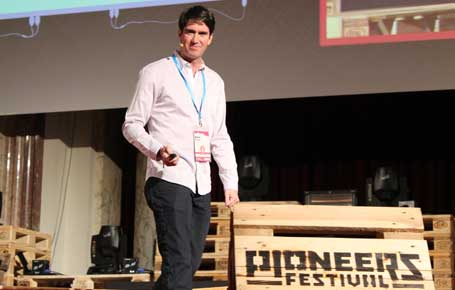
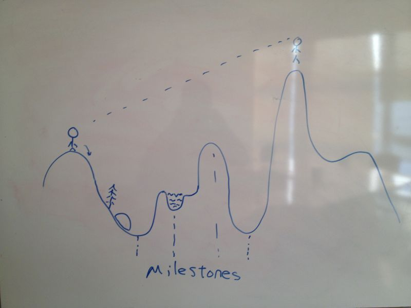

# 和 Siri 创始人 Adam 面对面

一月份来硅谷出差，就想参加一下本地的 meetup。可惜当时出差时间短短一周，要和各路英雄 social，又要没日没夜干活，所以尽管自己对两三场技术活动垂涎三尺，但还是无缘参加。这次出差时间稍长，一落地，我想到的第一件事就是赶紧看看 meetup。然后，就发现了三个比较不错的活动：一个是昨天晚上的 Adam Cheyer 的 tech talk，一个是5/21的 "search at LinkedIn"，还有一个是5/22的 "Best practices for software engineers"。

昨天一天忙得要死，老板上午一个会下午一个会督战。现在流行 war room，就这样战战兢兢呆了一个半小时，差不多到六点了，我实在忍不住了，跟老板说：「那啥，我要参加一个 Siri 的创始人主讲的技术研讨会，我能去么？我保证晚上回来和中国团队继续工作」（I'm going to attend a tech talk from cofounder of Siri...can I go now? I'll work with cnrd team later when I came back to hotel...）老板有点惊异，你丫挺能整啊，去吧去吧。我就屁颠屁颠走了，临行还不忘去站立会议刷个脸。

讲座的地方在 Santa Clara，穿 237 上 Great American Pkwy 就到，也就 10 分钟不到的路。可 6 点多的 237 堵得如东四环，我在辅路上刚一脚地板油把我的捷达提到 60mph，就遭遇了塞车，不得不又一脚地板刹把车将将停死在一辆 infiniti 后面。然后就是漫长得走走停停，半小时后才勉强出了 237。

当我最终累得像狗一样到达会场时，里面已经人山人海，就剩下几个最后一排的座位。看到 Siri 创始人的人气很高啊！签到的妹纸热心肠，看到我来自北京，连忙说今天还有两个来自香港的访客，极力要帮我引荐，带我转了半圈没找到，这时活动要开始了，她就悻悻离开做准备去了。

Adam 的演讲整整持续了一个小时，满满都是正能量，我挑我觉得重要的讲。

## 四十多岁创业，一整就整三

Adam 一开场就说他的创业方法和别人不大一样，因为他自己到了四十岁还没任何创业经验，然后他就几乎在同一时间里一拜齐做了三个初创企业: Siri，change.org，和Genetic Finance。关键时这三还都挺成功！Siri 装机量几十 M，投奔苹果后100M；change.org 大概 75M 用户，GF 有 1.5M 计算机，处理和金融，健康相关的难题。

牛人真是牛到你没脾气。

## Adam 使用的工具

Adam说其实这些都没啥，背后的方法和工具才是王道。"take what you want to take"。他提到了这以下方法论：

* Verbally Stated Goals (VSGs)
* "Do more than you think you can"
* Timing the future (Trends + Triggers)
* Do something hard
* Visualize it

这些观点我都很认同。

### VSG

那天晚上我感悟最大的一句话是："Life is a book and you're THE author. You're on your own to fill in the chapters"（你是人生这本书的作者。只有你自己才能书写一个个篇章）。

其实每个 VSGs 都是自己用来书写人生篇章的目标。他强调 VSGs 要 "Tell everyone you know"，这样有助于 "commit yourself to the goal"，以及"people help"。这想法我挺赞同，不过因人而异，很多人有了目标藏在心里完成的动力更大。我很赞同把人生看作一本书，然后构思人生大纲，然后书写每个篇章。注意这些 VSGs 不一定都要是高大上，也应该囊括柴米油盐酱醋茶。我认识的有些创业者的状态不对，生活中似乎除了创业就没有别的。

Adam举了他自己的一些 VSGs，这些VSGs在时间上有重叠，分别面向人生的不同方向。比如说：

* 1980-88: “Graduate!”
* 1988-92: “Foreign Perspective”
* 1992-93: “Learn again (in CA)”
* 1993-1999: “Where can I work for 10 years and not get bored?”

除了那些高大上的VSGs外，还有很多现实的：

* 1994-1998: Cann I truly fall in love?
* 1999-2003: How to earn money for a house and a child?

### Do more than you think you can

Adam说每个人都低估自己的能力，你每天做十件事会很有压力，即便减少到三件事一样也会很有压力。所以，尽可能多做点事，不吃亏。他说他去UCLA读书时已经在国外「荒废」了几年时光，他觉得自己没那么多时间花两年时间读个硕士学位，就给自己定了个9个月的目标 —— 当时UCLA的记录是15个月。然后他9个月后毕业了。

程序君自认为没有他那么高智商+高情商，但对于这点有切身感受。没做「程序人生」之前，一天时间也是很紧张地过去了，自己天天喊累；现在不但一周要写好几篇文章（每周大概要花7-14小时），还要运动健身（每周花在上面至少5-7小时），也是很紧张就过去了，但没觉得比之前累多少。

我们现在生活在一个比较悲催地年代。我记得小时候读过童第周的故事（也不知道是不是真的），他说：「我并不比别人笨。别人能办到的事，我经过努力，一定也能办到。」那个时代的高富帅们似乎懒一点，还会给屌丝们留点空间。现在不是这样 —— 让人超级伤感的是，那些智商情商都超高的人还TMD超级努力，还在谈 "do more than you think you can"，这压根不给人活路嘛。

当你看到一个高富帅+高智商比你还要努力，比你还要正能量，你会怎么想？我算是拜服。心态很重要 —— 我常常对自己说不要和别人比，跟自己比，让自己一天天过得更好更充实就可以了。要是一天到晚和这些几乎无解，就是扛上作弊器也拼不过的大老板拼 HP/MP，不是自讨苦吃么？

所以，为了自己的目标，每天比过去的自己更努力就好了。

### Timing the future

Adam列出了2004年他对未来10年的10个预测：

1. All media becomes digital
2. Structured: Disconnected -> Semantically Organized
3. Unstructured: Editor -> Collaborative
4. Unstructured & Structured -> Merge
5. Social Networking takes off
6. Personalization becomes ubiquitous
7. Public & Private Content -> Merge (in the Cloud)
8. Usable access is key
9. Applications are similarly transformed
10. Intelligent learning provides new insights

以上预测靠谱不靠谱，在过去的十年间他是否在不断地调整预测，这些都不重要。甚至预测本身的内容也不重要。真正重要的是他的思想：如果你想做什么「下一个大事」，那么坐下来，好好花些心思想想未来十年什么东西会起来。然后，结合你自己的长处，看看如何从里面分一杯羹。

预测未来是个不断学习的过程，我觉得没有什么秘籍，只有不断预测不断失败不断调整，你的感觉才会越来越好。Adam从自己的预测中选了几个他觉得能成的：

* Social networking takes off - change.org
* Usable access is key / application are similarly transformed - Siri
* Intelligent learning provides new insights - Genetic Finance

当你找到了想做的事情，需要看看时势（trend/trigger）如何。我们都说「时势造英雄」，当台风起来的时候，猪都能飞。Siri不是一蹴而就的，在之前的职业和研究生涯中，他思考过五十多种Siri的形态，但是Siri一直没有一个很好的载体，也没有很好的生态圈（eco system），比如说各种programmable web services —— 直到iphone出现。08年的时候，虽然iphone还是个小众产品，做手机的公司都在嘲笑 "Apple need to be a 'phone' company to make a 'phone'" —— 但iphone的势头已经非常不错，他们就决定要把Siri做成一个app。

我打算有空花个两天时间也好好预测一下未来十年会发生什么，然后想想自己能干点什么。

### Do something hard

Adam对成功项目/产品的定义是：

* 要么有50M+用户
* 要么有$50M+收入
* 要么做出了"differentiate technology"

基于此，他建议要做就做点市场容量够大，别人做不了的东西。「难搞」是个护城河，越「难搞」的东西，做得人就越少。于是「难搞」就把你和别人区分在两个世界中。

很多「难搞」的事情其实源于我们不理解而已。「机器学习」和「自然语言处理」是不是听上去很难很牛B？但是一个十五岁，高中还没毕业的孩子就能搞，你三十好几，四十好几的还好意思说这东西难搞？

Adam举的例子是Summly的创始人Nick D'Alosio。在这小家伙17岁的时候，他的公司被yahoo以$30M的现金并购了。就算Nick智商超高，他也才是个十几岁的孩子。如果他都敢去搞这些难搞的东西（事实上，summly 的愿景是summerize the web），我们这群成年人整天搞点社交，电商的小玩意儿，情何以堪？

Do something hard.

### Visualize it

最后一点，可视化你的目标。我之前写过一篇文章讲我曾跟我所在BU的CTO Oliver讨教过如何从一个engineer一步步升级到杰出工程师（distinguished engineer）。他站起身，在白板上画了一张图：

他指着小人说：这是你目前的位置，这是你想去的地方（DE）。它应该在你的脑海里深深印下。你会经历起起伏伏，遭遇到峡谷，溪流，乱石，雾霾，...。当你身处谷底时，你已经看不到你的目的地。很多人就此迷失。但如果你清醒地知道你要去哪儿，脑海中还保留着那份憧憬，那么你就能逢山开路，遇水填河，所有的阻碍都将成为一个个milestone，被踩在你的身后。

Oliver和Adam对实现目标的方法有着同样的工具。Adam说他在做Siri的时候，他在憧憬苹果实体店里放的app的样板广告中除了google/facebook/twitter等，还有siri，他甚至憧憬Siri能成功到在每个苹果店门口都挂一幅广告：Introducing Siri。

这就是在脑袋中可视化你的目标的重要性。它让这个目标就像一盏明灯一样，一直指引你走下去。

## It's all about people

当然，任何事情的成功离不开人。方法用得再好，也离不开人去使用和实现。所以：it's all about people。不解释。

Q&A的时候我本想问问：Do you think Siri meet your expectation? 但现场太火爆，轮不上我插话，听了一会后，我还是默默地离开吧。

meetup的slides请见：http://www.adam.cheyer.com/papers/StoriesParallel.pdf
