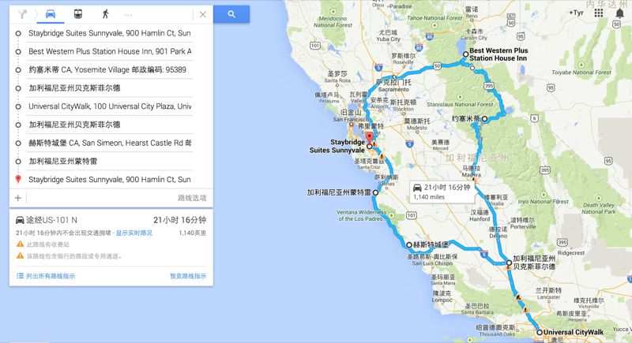

# 当我旅行的时候，我在想些什么

（一）

出差赶上了长达四天的小长假 —— 美国这边的长假，办公室直接关闭，想去公司都没门。放假前，老板跟我 1:1 talk 的时候还给我推荐了一堆地点，如king's castle，Hearst Castle等等。，不去哪转转还真对不起这难得的机遇。一个人旅游其实挺无聊，找这里的同事朋友吧，要么都拖家带口早有安排，要么假日要on call，最后只得孤家寡人上路。由于这两周忙完了工作忙各种活动，还写文章，所以旅游这事，列了个大纲，有一搭没一搭想着，一直拖到周四。我是这么打算的：

Day 1: south lake tahoe

Day 2: yosemite

Day 3: universal studio

Day 4: Hearst castle, 1号公路

本来南加州（LA附近）有个读者，Day 2/3的晚上可以去他那蹭蹭，但想到人家有女朋友的，长周末应该早有安排，就罢了。

周三晚上才把tahoe的酒店订了，周四晚上才把Day 2/3的酒店订了，住在在一个叫bakersfield的小镇，离universal studio比较近，方便往返。

今天（周五）早上出行前，才想起来把所有的地址抄下来，然后输到GPS里。也许是程序员的缘故，我是个严谨的自助旅行者，每次出行前都会花很多时间把一切东西规划好，整个旅程基本严丝合缝。但这次我却手忙脚乱，行程乱如麻，什么攻略也没看，什么信息也没打印。如果现在GPS突然坏了，我可能都不知道该怎么回sunnyvale了。:(

当我把一切理顺，油箱加满油，正式出发，已经是早上7:20了。所谓起个大早，赶个晚集，大抵如此。这次出差没带几张CD十分失策，FM换遍了频道，播的音乐都不是我的菜，突然怀念06年出差那些经典的FM曲目，如because of you。

关了难听的FM，开窗清醒一下大脑，以限速+10的速度稳稳地开车。这时我注意到GPS给地到达时间是11:20，天啊，要开4个小时！我脑袋嗡得一下炸了。我记得是只用三个小时多一点点啊。人已在高速，懊恼也没用。

继续开车，GPS用近乎嘲弄的女声一次又一次地告诉我"drive xxx miles then keep left/right"，在过了livermore之后我再也没有熟悉的地标，已经完全任她摆布。她告诉我开12 mile然后靠左行驶，我迅速将其换算成大概10分钟，然后安安稳稳开十分钟，等待下一个指示。把自己的命运交给GPS其实挺矬的，我也一直在告诫自己摆脱GPS依赖症，但至少现在还没实际行动。

我一直反复强调很多东西都是逼出来的。我刚来的那周，自己一个人跑去了livermore outlets。livermore上次我去过，记得是个680的路边，很显眼。这个mall太新，它的地址在GPS里找不到，正巧我翻GPS历史记录是看到有个Livermore，大喜。就按着这个导过去了。结果一路走我一路疑惑，好像走的路不对吧，怎么早早下了高速，在小路上徘徊呢？最终它把我导到了livermore这个小镇上一条叫livermore的小街上。下了车，我站在路牌下面傻笑。我感觉上一个中招的同事似乎隔空和我对笑呢。我走回了680，然后在各种煎熬下凭着记忆找到了outlets。人脑就像一个巨大的磁盘阵列，东西都存着，就差拿到某片记忆的句柄。逼一逼自己，句柄找到了，记忆也就靠谱了。

开了近两个小时后，在忍受了各种指令的折磨后，我终于接到了一个让我崩溃的指令：沿50号公路走94mile，然后右转。这意味着94 mile内，连这烦人的机器都不会跟我交流了，我的「滚蛋」说给谁听？我开始犯困，更要命的是，买的红牛在后备箱里。以前不觉得副驾坐个人有多幸福，现在别说是人，就算放只狗，我也不会如此困顿。

让大脑保持清醒的最好方法是给它点有挑战的事情去做。我开始思考：究竟在什么场合下使用最近无意中遇到的gocc呢？为自己设计一个更好的文档标记语言么？要不要基于markdown扩展，究竟怎么扩展？video，audio这些tag好办，但如何更好地跟youtube，slideshare等等这些可嵌入的widget打交道，如何让标记语言具备足够强的扩展使得任意网站的可嵌入widget都可以使用它很方便地定义呢？cscope文件的BNF怎么定义，用gocc写个cscope的读写器如何？

这么想着想着，大脑慢慢清醒起来。但我也开始愈发口渴 —— 看来大脑运作的时候消耗水分啊，我买了一箱水，可它们和红牛一样被愚蠢地放在后备箱里。在延绵的山路里错过好几个加油站后，终于让我逮到了一个路边的加油站。加油，放水，喝水。红牛已不必喝，困劲过去后的大脑就像下过雨后的北京，格外清爽。

接下来的事情顺理成章，终于到达湖区，还提前了十分钟。酒店是进不去滴，这边恶心的规定是2pm后才能checkin。我去湖边坐在躺椅上边晒太阳，边吃各种零食。

Tahoe的湖水清澈程度比贝希特斯加登地区的国王湖有过之而无不及。三色的湖水，延绵的群山，让这里的景色美不胜收。晒着暖暖的阳光，听浪涛拍岸，醺醺欲醉。

一个人旅行的时候，是内心和内心在对话。我觉得每个人内心深处都有一个善良的撒加和一个邪恶的撒加，或者说一个史麦戈和一个咕噜，他们一个代表正能量，一个代表负能量。只不过大部分时间正能量占了上风而已。我在长椅上躺着，看着贱贱的蓝天，听着不远处孩子们的欢笑，觉得这生活真好，这辈子如果能就这么过了也挺滋润，还奋斗个毛啊～。我突然想到曾经有个读者问我有没有读过那个银行家和渔夫的故事 —— 就是银行家奋斗了一辈子跑到海边钓鱼，渔夫告诉他老子天天过这样的生活，你累球成这样，值么？

我当时回这个读者说：银行家有选择的权利，而渔夫没有。

其实我们奋斗了一辈子，为的是啥？为的不就是一个选择的权利么？

高中毕业，我可以选择去读大学，也可以选择去蓝翔技校。

大学毕业，我可以选择去500强或靠谱创业公司，也可以选择国企混日子。

工作几年，我可以选择定居北京，也可以选择回老家安安稳稳。

勒紧裤腰带，我可以选择给孩子吃海淘的放心奶粉，也可以选择超市的各种靠谱不靠谱的奶粉。

多攒些钱，我可以选择一次美妙的欧洲自驾游，也可以选择买成游戏点卡和装备。

每一次抉择，每一次奋斗，其实都是为了让自己有更多的选择权。

而且，选择权是可以延递到下一代的。这点非常重要。生物的本能是尽可能地把自己地基因延续下去。像渔夫那样吊儿郎当的，他的孩子很可能还是渔夫，甚至这辈子都不怎么可能见识外面的世界；而银行家的孩子可能是玩音乐的，搞舞蹈的，整金融的，混得好说不定还能成为改变世界的程序员呢。^_^

「咕噜」的念头很快就被扼杀在萌芽中，我也从躺椅上起来，轻快地向车走去。

（二）

第二天的行程是 yosemite。

早上 6 点多我就出发，GPS告诉我预计10点45才能到。我心一横，经过昨天的历练，五个小时老子不怵，就当一路看风景了。6点钟对于旅行者来说不算一个很早的时间，上周六晚上在Staybridge酒店的露天泡泡池里泡着的时候，一个长相酷似越狱男主的男子携他女友也跳了进来。聊了几句，才知道他们那天一群人早上3点就出发去yosemite，然后下午4点又返程。所以旅者不怕早。

开始的路程很平淡，只是一路没有人。当进入89号公路之后，我开始不淡定了。一路都是盘山路，盘得我两手发软。吸取昨天早上的教训，我出发前先喝了一罐红牛。但走在这路上时，才发现其实根本无需红牛，前方的路本身就是红牛。一个弯一个弯的往山上盘，每盘一次就刺激一下我的肾上腺素。公司给我租的车是捷达（相当于国内的高尔夫？？），动力还是不错的，可这车没有W档，爬坡很要命，尤其是那种丧心病狂的270度大转角 + 45度+往上走的大斜弯，累得小捷达跟拖拉机似的突突突直喘喘。平时开车大大咧咧不怎么待见她，这时候她却成了我的心肝宝贝。听着发动机的呜呜哀鸣，我心里特不好受。

GPS告诉我89好公路要走86mile。看着眼前磨难重重的道路，五个小时已经不算什么，我祈祷只要能平安走出去就好了。开出去十个mile了，路上竟然一辆车，一个人影也没有。除了看路，我还得注意躲着路上轻灵嬉戏的小松鼠，它们是这山林的主人，我只是过客。一个好友说开车的最高境界就是人车合一。在这没人烟的山间穿梭了一阵子，我似乎找到一点点人车合一的感觉，速度渐渐放开，下山高速滑行的S弯，轮胎都逐渐有些许愉快的擦地声。

我从来就不是个会玩车的人。车对我而言，就是把我从A地以最快速度送至B地，仅此而已。所以稍稍有些进步，我就屁颠屁颠。没车，没人，稍稍躲躲小松鼠，「人车合一」后我已无需再担心操控，于是又开始看着风景胡思乱想。

在小道上开车，我最怕tailgator，同时最喜欢tailgate别人。tailgate这词是前同事kp君教我的。上次出差，正巧和他合用一辆车，他要买房，我顺便作陪。下了高速后，因为一直只有一条车道，我们后面有辆跑车连续跟了我们两三个mile，跟得很近，非常粗鲁。那条路限速35mi，我开到了45mi，已经到达我敢合理利用潜规则的上限，可那跑车还穷追不舍。我很恼火，kp君说：

He's tailgating you for a while. You can just pull over if you feel annoying.

于是我学会了这个词。渐渐地，我开车养成了tailgating别人的习惯，所谓「宁为凤尾不做鸡头」，像我这样车技马马虎虎，识路能力不佳的人，最适合跟在别人后面，随大流。这样，前路有什么险情，都有别人为我趟，我就乖乖地保持好车距下意识开就好。

但在死寂般的89号公路上，没人替我开路。一切都得靠自己。如果这时爆胎，或者发动机停止工作，或者我不慎撞上了小鹿，等到人们发现求助的我，可能也要好几个小时吧？这几个小时我该干点什么呢？手机一点信号也没有，不知道911没信号能拨通么（废话）？

孤独是种挺可怕又挺可贵的存在。我从小就生活在一个喧闹的环境，大家庭，小城市，大都市，从出生到现在，类似这样的完全孤独仔细想想似乎不存在。当我开始坚持跑步的时候，才开始品味些许孤单的感觉 —— 虽然旁边都是人，但精神和意识是寂寞的。不少奇特的想法都是在孤独中产生的，有些品质的形成也是在孤独中磨练出来的。比如说「坚韧」。

想起昨天在tahoe湖边无所事事，读的村上春树的「当我跑步时我谈些什么」中的一段，这段文字我还特意抄写了一遍：「正因为刻意经历这痛苦，我才从这过程中发现自己活着的感觉，至少发现一部分。我现在认识到：生存的质量并非成绩、数字、名次之类固定的东西，而是含于行为之中的流动性的东西。」

那么，他说的流动性的东西是什么呢？似乎含混不清。我把它视作过程，或者经历。而固定的东西，我把它视作结果。结果只是过程的一个产物，凯撒打胜仗后说：「我来，我见，我征服」。结果简单三个词就涵盖，但整个战斗的过程如何惨烈，只存在于凯撒和他的将士心中。就跟我后来顺利到达yosemite，发了一圈「我来，我见」的照片，但你不这么走一遭，你绝不会有这样的经验和体会。

路慢慢收窄，窄到连标识两个方向的路的双黄线都不见了，路况也越来越复杂，悬崖边连多铺一层砖意思一下都没有了。但弯道和大角度上坡还是没少，我的速度也从45-60mi降到了25-35mi。之前我还津津乐道自己过弯几乎60mi，现在只能堪堪25mi。路面也开始湿滑起来，早上的薄雾被渐渐升起的太阳吹散，都四散逃到地上。有时遇到长长的下坡，速度自然加到五六十迈，轻点刹车就有稍许打滑的感觉，但谢天谢地，车还在我的掌握之中，我估计冬天走这路就真是如履薄冰了。

这时，从对面冲过来一辆皮卡，后面还拖着一个空拖斗。我愣了一下，皮卡也如此，我猜他也在惊叹如此之早在这条路上竟然能见到车。互相减速靠近的时候，我们都将车往路边靠了靠，才堪堪通过。擦肩而过的时候，我们俩心有灵犀地一起竖起拇指向对方致意。

等两车完全离别，我才一派大腿，真该问问这没完没了的山路还有多远的。但已来不及。

开出了四十多迈后，我终于又见到了久违的双黄线。本以为噩梦即将结束，结果发现这是筑路者开的一个小小的玩笑，双黄线持续了半英里就消失了，然后路继续收窄。我苦叹一口气，继续小心翼翼地开。

就这么开着开着，不经意地，昨天我还在tahoe湖畔远远眺望的雪山此刻就在我脚旁。盛夏时分看见雪我无比兴奋，这兴奋驱散了一路旅途中的疲劳。我靠边停车，亲自试探了一下厚厚的积雪，看看这是否是幻觉。环顾四周，虽然我的视线都被树林阻挡，但我能想象得出在tahoe湖边玩耍累了的人把视线投向雪山的场景。我就在这山上！

继积雪带来的兴奋后没多久，我就又见到了一个雪山湖泊。湖水惊人地透亮，树林和其在湖泊中的倒影几乎分不出真假。接下来，第二个，第三个无比漂亮的湖泊又陆续出现，就像上天对刚才艰难旅程的赏赐。

行至大概60mi的地方，双黄线再次出现，这下，它是实实在在的存在了。路变得越来越宽，油门踩下去，一不小心就80mi。我怕被拍，还是老老实实限速+10这样缓缓开着。但刚才的危险与刺激，一下子都不复存在，心里还挺怀念的。

人其实挺贱的。沿途见不到任何人烟，羡慕起people moutain people see来；跑没完没了的山路时，怀念高速上的一脚油门踩到底那种风驰电掣的感觉。这时候速度起来了，我却反而没了精神，思念起那变态的斜坡。

我是早上10点37到达yosemite收费处的。真正到达GPS指定的位置，是两个小时后的事情。yosemite太美了，美到我觉得自己的语言写出来都是玷污这景色，也许我需要找找名家写的跟它相关的内容，然后再分享。

（三）

我于 24 日晚（前天）下午大概三点离开yosemite中心地带的。后来人山人海，到哪里车都没处落脚。美国的长周末效应也很明显。25日要去universal studio，本来考虑在yosemite回呆到下午五六点，所以订了一个在两者中间偏universal studio的地方，叫bakersfield。如果不是因为这个，我估计这辈子我和这坐小城也无缘。

从yosemite往bakersfield我选择了41号公路转99号。按GPS的指引，我要先向西绕出yosemite，再南下。我怕往西再无山林的情趣，就没听GPS大妈的指引，执意按照yosemite的地图向南。GPS大妈也是个倔货，没完没了让我 "in 0.x miles, make a U turn"，一直到我走出去十多个mile，才很无奈地改弦易辙。

41号公路山里的这段，相当滋润。我慢慢悠悠，走走停停，一个小时才出了yosemite。钻出山林后，41号公路渐渐变成无边无际的直路，双方向行车，每个方向一条车道，中间没有护栏。这种设置开得我直犯困。窗外阳光火辣辣洒在脸上，车内空调又在不住地将热气驱散开，维持体温的平衡。路是笔直的，车内温度是惬意的，阳光是刺眼的，还有什么比这更能拽走意识，让眼皮偷偷犯个懒？本就睡眠不足的我接连打了好几个盹，每每车身稍微抖一下，我就惊醒，然后狠狠扇自己一个耳光，掐掐大腿，但很快又失去意识。

危险就在这种安逸的环境中诞生。我打了一个不小的盹，要命的是，车子渐渐偏离航向而我却没有及时醒过来 —— 直到后面的车大声鸣笛我才清醒过来，此时大半个车身已经越过双黄线，到了对面的车道 —— 幸运的是，对面的车离我还有段距离。我连忙把车身扶正，一身冷汗。从后视镜里瞄去，后面的车主似乎拿起手机在打电话，该不会是打911吧？这一路我没少看见 "report drunk driver, dial 911" 这样的标语，他莫不成认为我是个醉驾司机吧？还好，后来开了一路，警察也没找上门来。

从用户体验的角度看高速公路的设计，我觉得我走过的加州的好几条高速体验都有问题，如41号，99号，5号。它们共同的特点是有相当长（至少10个mile）的一段路过于笔直，没有任何变化，开车非常容易犯困。很多时候，司机本身疲劳驾驶是交通事故的一个原因，但过于笔直的路段，没有变化的景致，也是导致本身可以精神抖擞的司机注意力缺失，进而造成交通事故的另一个原因。

前面说过，一个人开车很无聊。其实不仅无聊，还很危险。在高速上行驶，犯困都没有副驾来提醒，更别说肚子饿的时候，想要吃什么却无法分神去够的那种无力感。这次行程我特意在路边的加油站买了些零食，可是缺乏经验，买来的零食大多适合在电影院，而非高速公路上进食。所以你可以想象，饿着肚子，食物就在手边却无法去吃是件多么悲催的事情 —— 它导致司机师傅要么欲火中烧，顾不得手中的方向盘，奋不顾身地吃；要么踩紧油门，盯着前路，眼中都是火辣辣的血丝，想要尽一切努力冲到下一个休息区好风卷残云。两种情况，都将危险系数大大提高。

为了让自己从两种悲催的境地中摆脱出来，我开始憧憬接下来的universal stuido（以下简称US）的行程。

就玩过的游乐场来说，我偏爱US。06年去过一回，8年过去了，突然天降这样一个好机会，我怎能错过她呢？我喜爱US的主要原因是她将电影工业和游乐场无缝结合起来，通过营造一种身临其境地视觉体验，让你在电影的场景中体验游戏的乐趣。这种结合的巅峰之作我认为是Water world show和ternimator 3D。它们具体如何如何，我就不详述，但是，这么回味的感觉真得很爽，肚子似乎渐渐不怎么饿了。这次故地重游，我希望能体验这些年来新增的游戏，尤其是transformers和Despicable Me。

最后我有惊无险地开到了bakersfield，住一个大车店，略去不提。在酒店旁的Denny's享用了晚餐后，我的一切心思就在接下来一天的universal studio上。

终于，在小长假的第三天，一大早，经过一个半小时的车程，我到了梦寐以求的地方。人真多，这么多次在美国的经历，包括上次来US（也是一个小长假），都没见着这么多人。当然，我是幸运的，单身一人处处走single entry的通道，使得我看过了所有的show，还把transformers和Despicable Me（以下简称DM）各玩了好几遍，看到它们门口显示的动辄60-85min等待时间我就感到幸福。

接下来我以DM为例说说US里一个具体的游戏是如何做到最大化capacity的。DM是一个ride（飞车）类的游戏，不过游戏中四人一排的「飞车」本身就是在原地前倾后仰，不会真的像过山车那样舞动。所有的飞车的视觉效果都通过前方大球幕的3D电影来营造，让你在一个完整的故事里享受飞车的乐趣。一次正式的游戏大概5分钟，能容纳约100人一起玩。

作为一个玩家，要经历如下5个stage：

* 场外排队（时间不等）
* 被挑选好等待进入场内观看暖场影片（～5分钟）
* 场内观看暖场影片和游戏规则（～5分钟）
* 正式游戏（～5分钟）
* 退场（1分钟）

这五个stage划分地非常清晰，因此并行度非常高。当一波人正在进行游戏时，已经有同样数量的玩家被关在一个小屋子里看暖场电影（DM中的主人公会跟玩家训话，告诉大家接下来的挑战等等，我就不剧透了），同时在外面的工作人员拿着ipad紧张地从场外排队的人群中安排大家等待的位置。一旦一个游戏结束，这头退场，那头看完暖场影片的玩家就按照自己的通道进入指定位置开始游戏，同时在外面被挑选好的玩家进入场内开始观看暖场影片。

整个过程就像CPU的流水线一样高效运转。每个玩家就像一条指令，分别经历取指令，解码，执行，退出几个阶段。

我们知道，如果要CPU运转高效，就要尽可能减少流水线上的空转，因此在CPU中引入了乱序执行，将没有依赖关系的指令放入空的slot里填补流水线。这种做法最典型的代表是MIPS上的branch delay - branch语句后的空slot会放上一句本该之前执行的指令，这样CPU的性能得到了最大化。

在US里，无处不在的single entry就起这个作用。很多时候一家三口来玩，四个座位的「飞车」旁边就空出一个位置，情侣宁可等下一波，也不会选择被拆散。所以这样的位置是个鸡肋，没人愿意坐，但如果不填补，势必产生很多浪费。如果现从排队的人群中询问谁是单身，又会造成拥塞，所以单独辟出一条single entry，遇到这样的状况，就「乱序执行」，从single entry的队列中取一个人进行游戏。

这是US值得国内游乐场学习的地方，通过高效的流水线，辅以乱序执行，最大化一个游戏单位时间的容量。另外，整个游戏在排队的过程中还会提供很多视频，让排队的过程不那么枯燥。我一遍又一遍地边玩游戏边想，universal studio该不会雇了个intel的CPU专家吧？^_^

（四）

大车店象征着美国的公路文化。昨天的文章我讲过，我订了个就横在99号公路旁的大车店。价格便宜，交通方便，也算干净，周围又有两三家快餐厅，对于一个过客而言，还有什么比住这样的地方更舒心的？在酒店的停车场，我看到了好几辆BMW，可见，有一定经济能力的中产也并不排斥住大车店。

在开车的途中，我一直感叹于加州的基础设施建设的水准 —— 密密麻麻的高速网将整个州组织成一个运转高效的体系。当然，就交通的效率来说，德国可能拥有全球最高效的公路网，因为他们的高速在大部分路段是不限速的，我在德国旅行的时候，租了辆奔驰B260，最高开到190km/h，还被超车道上的各种好车嗷嗷超过。而在加州，车速被严格限制在65-70mph，也就是110km/h到120km/h之间。虽然说潜规则是车速+10mph都不会被警察找麻烦，但这个速度还是大大的延长了人们出行的时间。在德国，跑700公里需要5-6小时（毕竟不能总跑在最高速度，还有拐弯，接驳路段等等会让速度将下来），在加州跑700km，需要7-8小时。交通的流动性如同资金的流动性，流动的速度越快，周转率就越高，能做的事情就越多越大。

以我不那么专业的体验，德国的高速网在覆盖率上离加州尚差一些。当然，以一个旅行者的身份做此评价，有武断之嫌，如果错了，请读者不吝指正。加州的高速基本覆盖了三级甚至四级的城市，在任何一个市政里，开出去10个mile基本就能找到高速。当然，也可能是作为一个新兴国家，美国没有历史包袱，尤其是西部，所以城市可能沿着高速路慢慢繁衍开来，这可能是个对覆盖率更加合理靠谱的解释。

从universal studio玩完回大车店，经101号公路转5号公路，然后转99号公路。离5号公路和99号公路相交的地方差大概八九个mile，开始连绵的山路，眼看着远处的山峰一点点靠近，然后自己一头扎进两座山峰之间，感觉还是挺奇异的。这段路下坡居多，一不留神速度就上了90mph，所以太high的时候不宜开这段路。为何？聪明的警察就在下面守候着呢。有段下坡我一不小心速度上到了85mph，突然后面警笛响起，我一惊，心想，这下完了，要吃几百刀的罚单了。我下意识猛踩几下刹车，把速度降到75mph，被警车从侧面超过，这才放下心来。

这趟路上和警察两次擦肩而过。还有一次我是在高速的休息区遇到了警察叔叔。下了高速后，看到一辆警车停在一辆车后面，警察在看车里人的证件。我也是二得够呛，休息区那么大片的位置，我不去挺，偏偏停到被检查的车辆旁边。警察叔叔似乎很吃惊，目送着我下车离去。我被盯得发毛，一边埋怨自己，一边赶紧逃离这是非之地。我估计警察叔叔在想：这哥们该不是救兵吧。

放完水后，摆在我面前是个两难的境地。To be back or not to be back, this is a question. 本想等他办完事走人我再出现，但等了一会，警察叔叔还站在我的车的斜后方，似乎一时半会走不了，我只好深吸一口气，忐忑地回去开车了。还好，没有更加奇妙的故事发生，不然，我会爱上这片土地滴。:)

我开车有个坏习惯，就是把护照和驾照放在包里，包又放在后备箱。我一次又一次提醒自己把包放在副驾，但一次又一次忘记。有时开在路上，我就胡思乱想，如果这时候警察叔叔把我拦下怎么办？电影中的场景都是疑犯要双手放在方向盘上，慢慢摇下车窗；警察叔叔下车后一手扶枪，小心翼翼靠近，然后要求出示ID。我能跟他说我ID在后背箱的包里么？他会怎么反应？给我先铐上手铐，然后再查看后备箱，还是掏出枪对着我让我慢慢地下车，举着枪跟在我后面让我从后备箱里拿证件？想想这场景都很high。可惜我一不过分超速，二不乱走瞎走，三天生长了一张好人脸，于是一路与警察叔叔无缘。

在1号公路上，我最大的感悟是人与自然的和谐。1号公路依海而建，不少路段就在海边。但是沿途有好几个公园，海岸线上的vista point也能见到很多的野生生物。比如说题图就是我在一号公路的一个vista point上看到的成群海豹。海豹们可以这样没心没肺地睡觉，而我可以在离他们很近的地方拍照。这在国内很少见。

下图是我这趟全程走过的路，google map显示一千一百多mile，但实际我跑了一千四百多mile，里面没有包括绕着lake tahoe走，以及在yosemite里面瞎转悠的里程。四天这么疯跑，这在任何一个旅者看来都很疯狂。如果我带着老婆孩子，肯定不会这么走，如果我好好计划一下，也不见得会这么走。但有时候旅途的美妙就在于你有一个目的地，但你不确定在旅途中你究竟会遇到什么，会发现什么。终点和结果不那么重要，重要的是过程。要登机了，先写这么多，回国后我会写写build the dream，这是我在hearst castle的感悟。

