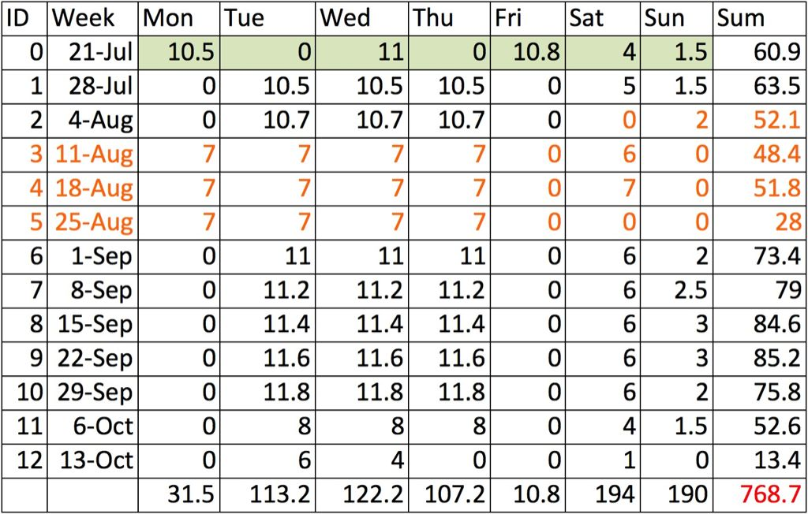

# 马拉松，突然变成一件严肃的事

七月十八日，当北马预报名正式开始，摆在我面前的就是两条路：半马或全马。半马要容易一些，想来报名者会巨多，但名额少得可怜，最后必然形成千军万马过独木桥的局面，像我这样毕生和彩票几乎无缘的人，必定是无法中签的。所以我最终选择了报名全马。

作为一个身体素质非常一般，常年坐在电脑前工作的大龄程序员，参加马拉松是要有一些勇气的，这勇气来源于同事的鼓励，家人的支持，个人的觉醒，以及之前跑步减肥小有成就带来的自信。但如果把参加比赛且活着完赛作为最低目标，那么，光有勇气是远远不够的，我还要严肃地对待它，学习前人的方法，并且，最关键的 —— 系统地训练。

活着完赛分为两层意思。首先肯定是活着。听闻刚刚过去的张家口（康宝）马拉松有人猝死，这是我听说过的好多例跑马猝死的最新例证，父母家人都表达了担忧。其实根据统计，马拉松比赛中选手猝死的概率为每10万人中0.8人，概率还是挺低的。要预防猝死，首先还是要让身体逐渐适应像马拉松这样长距离长时间的运动，否则突然加量，心脏负担太大；其次是了解和掌握各种知识，比如说比赛前如何训练，比赛时如何补水补能量等等。

完赛是另一个最低目标，按照北马的要求，就是六小时内跑完全程。我知道把这样一个「目标」挂在嘴上，很多人都会嘲笑，但就我看过的文字而言，马拉松完赛，尤其是首次参加马拉松的人完成比赛，是件挺不容易的事情。对于一个半年前还是那种连倒杯水也懒得起身，只是双脚在地上一蹬，让转椅滑到饮水机旁接水的懒蛋加胖子，能够完赛就是最大的恩赐。也许有很多人不用练习，或者稍稍跑一下，试探自己身体的极限就能轻松跑完马拉松，并且取得让人瞠目的成绩，但别人是别人，自己的身体，自己的斤两，我是最熟悉的。

在决定跑马之前，我已经比较连续地跑步有三四个月了。当初的目的比较简单，减肥！自己没贪没腐，却吃成了贪官相，脏器肥大到不减不行的地步。就这么一点点跑了下去，从一开始跑三五公里感觉肺都要炸了，到现在十公里能够平稳跑完，我的身体经历了巨大的变化：首先是浑圆的肚子渐渐下去，这是内脏脂肪正在消亡的证据；接下来是后背，胳膊渐渐能摸到骨头了，这是皮下脂肪燃烧的结果。就这样，我从最初8km跑半小时到后来11km跑一个小时，我觉得自己已经具备一定的能力了。报名前的一周，我曾经去北京南城的「跑步圣地」—— 南海子湿地公园尝试了一下，结果发现，尽管在跑步机上已经能够一小时跑11km，但在室外相对酷热的天气条件下，7km我便跑了近50分钟，而且一点体力都不剩，意志力也接近崩溃。报名后的周末，我不服气，又先后挑战了南海子和奥森，10km的距离，一个跑了60多分钟，一个跑了70多分钟，途中我还都体力不支停下来走了好久。

仅仅在室外跑了三次，刚刚在跑步机上建立起来的自信便被击得粉碎。于是我开始为自己制定一个更为严格的健身计划。

稍稍解释一下。

以前我在健身房跑步的频次是一周三次，每次一小时。最近加入了周末室外的锻炼，一三五的节奏不利于休息，就改成了二三四。在健身房里，练习的目标是一点点提高有氧下的最高速度，顺带把体重再减减 —— 我可不想拖着七十多公斤的身躯跑五六个小时，所以，如果体重降到七十以下，最好六十八左右，就完美了。六十八公斤，是个值得纪念的数字，那是跟LP第一次约会时我的体重。当时我穿着一件很拉风的风衣...然后，然后我就有了小肚子 —— 过上了有人给煮饭的幸福生活后我就再也无法把自己塞进那件风衣里了。

周末两天，背靠背跑南海子和奥森。周六的数字n，代表在南海子跑n圈（一圈约3.4km），周日的数字m，代表在奥森跑m圈，每圈10km。这两天的目标是耐力，不管速度，不管时间，总之跑完计划中的全程就好。这也是LSD（Long Slow Distance）的精髓。记得第一次跑奥森，我上来就以在跑步机上练就的配速，5"30开跑。但户外的炎热和空调房内的清凉是无法相提并论的，很快，在跑了约2km我就不得不放慢了速度，并且在5km的时候彻底萎靡不振，心脏跳得快到几乎难以为继。之后，我不得不走了很长一段距离，才能继续跑将下去。

后来我在「百度跑协」的一篇关于LSD的文章的指导下，开始放慢速度，追求距离。刚刚过去的周末，我背靠背跑了12km + 16km，就源于这种锻炼方式的效果。不问时间，不求速度，一心以有氧的方式跑完尽可能长的距离，让心脏得以逐渐适应这种持续性的强度，最终为马拉松做好准备 —— 这就是我周末两天训练的目的。

这计划并非一个完美的计划，并不见得适合别人；它甚至不见得适合我自己，因为生活工作中各种琐事，还有跑步过程中各种意外的伤病肯定会扰乱它。但是，有个计划的好处是每周的运动终于有了体系，也就有了更多的动力。哪怕最终这计划仅仅完成了80%，那也是一种胜利。

有了系统的训练后，对我而言，仅存的一个疑问是：「最终能否抽到比赛的资格？」我相信很多初次报名的人都有这样的疑虑。这个问题要这么看：自己究竟是为了跑马拉松而努力，还是为了跑北马而努力？

答案是不言而喻的。错过了北马，还有上马，厦马，广马，香港马，旧金山马等等，无论任何一个马拉松，它的要求都不会低 —— 42.195km，6小时是完赛的底线。所以，抽签结果无关紧要，锻炼还要继续。
