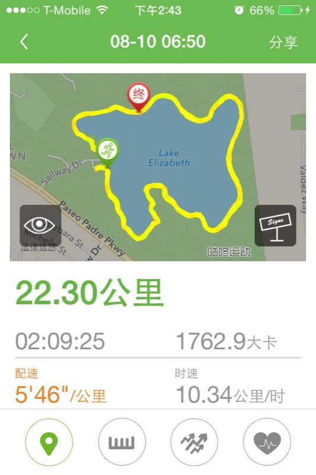
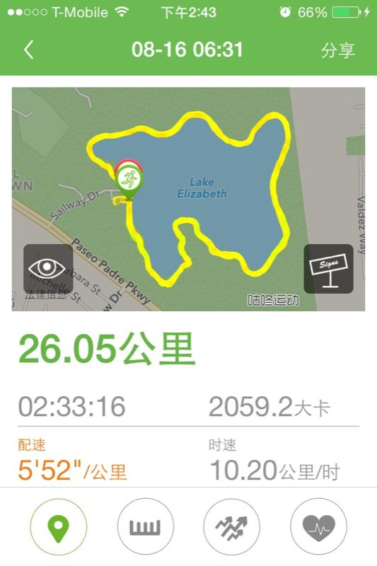
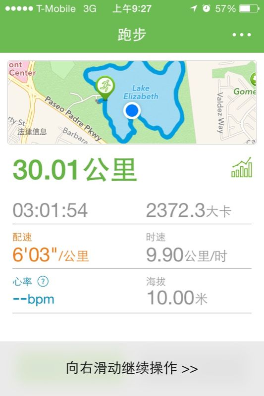
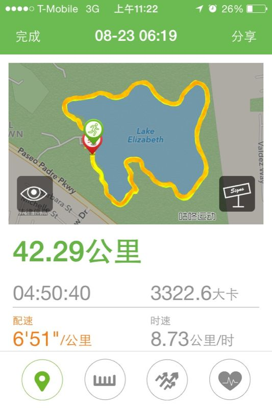

# 就酱紫跑了人生第一个马拉松

7月底的时候，我发表了一篇文章「马拉松，突然变成了一件严肃的事情」。当时无论如何是想不到，这「严肃」的事情，一个月以后便成了真。

当时做的计划，每周三次跑步机上10k+ run，周末两次户外15-20k run，一周大概60-70km的强度，执行的还可以（完成度>80%）。记得第一次在奥森10k，肺都要跑炸了，却跑出个八十分钟的成绩，自己都把自己好好鄙视了一通 —— 要知道那段时间在跑步机上我是轻松一小时11k+啊。后来学会了LSD，把对速度的追求转化为对跑步时间或者距离的追求，发现好了很多，之后，15km，18km纷纷被踩在脚下。

来湾区出差3周，既要拒绝美食的诱惑，跑步还不能停，真苦煞我也。抵达的日子是周六，周日我一大早就忙不迭地去上次出差跑过的Lake elizabeth晨跑。你也许会觉得不就跑个步嘛，随便找个地方跑起来不就完了，逼格干嘛那么高？其实程序君主要是喜欢那里有方便的饮水口，补水非常方便；而且湖一周2mi的距离，大概跑3圈10km，跑不到7圈半马，跑13圈多一点点全马，多好计算！身体感觉吃不消的时候还可以骗骗自己：再跑一点就又一整圈啦～所以，尽管从酒店开过去要近半小时，我还是义无反顾。

那个周日我计划跑20km，6圈多一点。就这么一圈圈跑下去，跑到第7圈，过了20k，突然想到，再跑多一点点就是半马了，于是就骗倒了可怜的身体，又多跑了2km。

跑完后回到酒店，早餐后在浴缸里泡了40分钟双腿才缓过来，那天下午，看见楼梯我就掉眼泪。

后来出差生活步入正轨，周一到周四基本都是早上五点半爬起来5k run。酒店新换了跑步机，让我愤怒的是试遍新跑步机上各种组合，最多就只能跑5k。5k就5k吧，每天26分钟左右跑完，cool down 5分钟，回屋里洗个澡，正好赶上新鲜出炉的早餐。美好。

第二周的周六，我提早了20分钟到湖边。理由是既然不到20分钟我就能跑一圈，那么我跑了26km，还能和上周末一样，赶得上酒店早餐的尾巴。

这回天气非常赞，不热不冷，阴着天，没太阳，风也很小。跑了8圈后，我觉得自己体力充沛，于是便想再接再励，跑个30km玩玩。早餐嘛，不吃也罢，反正跑回去也就是啥都不想吃，就是狂喝果汁的节奏。结果我一边想着这个计划一边去车里补水，然后把钥匙落在后备箱里。。。30km没冲击成，却引来了另一段有趣的故事：如何优雅地撬开车门。

今天早上，我再次将出门的时间提前，天还没亮我就到了湖边，希望能够弥补上次的遗憾。下周六就要离开了，所以，这也是我本次出差最后一次长距离跑步了。。。

说实话6点多天灰蒙蒙的，一个人在湖边跑步还是有点害怕，害怕跑着跑着被人打劫。忐忑跑完了两圈，各种纹身肌肉男出现了几次，但没有一个人拿出水果刀架在我脖子上或者左轮手枪顶在我太阳穴。^_^ 天亮了，晨跑的人也渐渐多了。

两个多小时后，26km被我甩在身后。我也渐渐吃力起来，无法继续保持6分钟以内的配速 —— 先是脚底板疼，然后是大腿发酸，心脏也开始有点不舒服了。其它地方难受都还能忍，心脏难受或者疼痛绝对不能忍，于是我把速度慢慢降下来，心脏的不适感渐渐缓解。

但身体已经开始苦苦哀求我：停下来吧。。。靠着跟曹阿瞒学来的望梅止渴，我不断地欺骗身体，最终勉强跑到30km，配速已经掉得很厉害。

30km处在第10圈当不当正不正的位置，反正去停车场取车还要跨越接下来的2.4km，何不干脆继续跑下去？又跑了200m，身体彻底罢工，双腿已经不听使唤，比灌了铅还沉重。我的配速基本上掉到了8分钟开外，既然如此，干脆换走吧。

快步走了1km，配速竟然是9分钟。我感觉这挺好，先快步走着，走一走歇一歇再跑。谁知这一走就再也跑不起来了。

10圈完毕，补了点运动饮料，感觉自己似乎又有了冲劲，可以再跑跑。那就再来一圈吧。大概7分钟的配速跑了600m，心脏又开始难受，赶紧降速，然后换成快走。就这样，9分钟左右的配速，又「跑」了3km。此时离我开始跑步已经近四小时了。第11圈结束。

当你跑了36km，尤其是知道自己跑了11圈，还有2圈就能完成全马了，你必定想咬咬牙再完成一圈，再完成一圈，让跑过的距离向42km不断逼近。就像Forrest Gump说的：

> And when I got there, I figured, since I'd gone this far, I might as well turn around, just keep on going.

So just keep going。38km的时候后背开始生疼，维持走姿都有点困难。但9分钟的红线我一直没有放松，因为这是我能够「跑」进5小时的先决条件。然后，第12圈也顺利完成了。

我再度回车里补充了一些运动饮料，并且google了一下马拉松的距离。我记得是42.195km，但怕记错，好容易跑到这份上，却因为记忆的问题少跑了几百米甚至几十米而没能完赛，那得多2啊～

回到跑道上后，突然间感觉哪也不疼了。我鼓足勇气撒腿又跑了起来，结果，身体马上用痛楚来迫使我放慢脚步 —— 原来这种哪也不疼的感觉就是身体极度疲劳以至于麻木后提供给大脑的一种幻象。我老老实实地快步走着，0.25mi，0.25mi地计算着（跑道上会有提示）自己离终点的距离。

最终，我「跑」了42.29km，用时4小时50分40秒。没有终点，没有撞线，更不可能有掌声，只有自己默默地祝贺自己。

我把自己扔到湖边的一张躺椅上，四仰八叉 —— 此时已顾不得形象，也没形象了。此时我浑身上下都是盐粒，像极了一个刚腌好的等待下锅的椒盐田鸡。躺了一会，调整了不雅的姿势，我又坐在躺椅上看了十分钟的鸭子，积攒精力。最后，感觉开车的力气攒回来了，就开车走人。

这次全马我总共喝掉了三瓶600ml的运动饮料（每瓶130kcal），吃掉了4块巧克力（每块70kcal），其实巧克力我带了不少，但不爱吃，吃完口干，所以勉强吃了4块。公园提供饮水口，就在跑道旁，补水很方便，所以饮料我并未带太多。我是跑了4圈后开始每圈补一次水，每两圈喝半瓶运动饮料，吃两块巧克力。总共消耗3322kcal，补了670kcal。

除了补水方便外，在这里跑还有一个比较好的条件：气温。加州的气温就像内蒙的呼伦贝尔，早晚凉得要死，可能就十七八度，太阳出来后气温渐渐升高，到中午估计有三十度。跑第一圈的时候我还穿着外套呢，后来体温高了才把它脱下。凉爽的气温非常有助于发挥，如果今天我去的是奥森，很可能连25km都跑不下来。

就酱。期待我第二个马拉松能多跑点，少走点。革命尚未成功，同志仍需努力！
