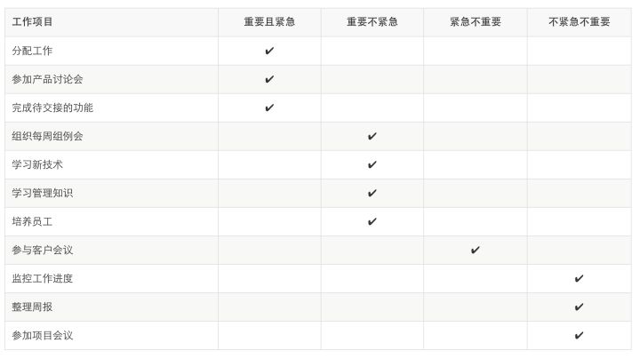
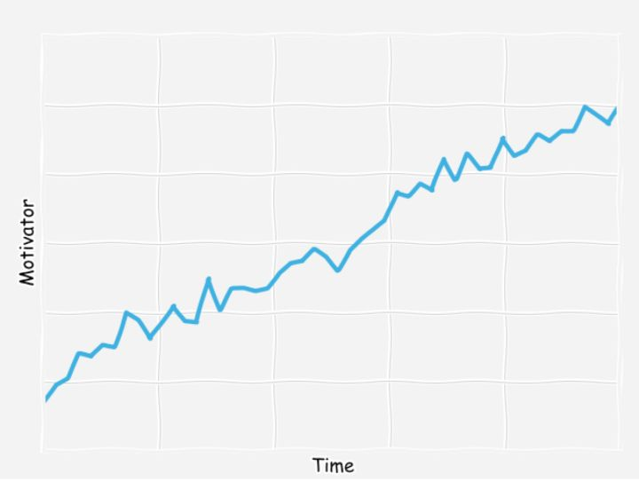

# 奇博士的管理课

## 毛小天的第一课

毛小天最近有点心绪不安。他的直接老板赵博士要离职了，赵博士的老板老冯正在考察合适的人选。干了五年的程序员，虽然毛小天依然觉得自己还是非常热爱工程师的工作，但他仿佛看见一个难得的机会在向他招手。

今年毛小天26岁，刚刚结婚几个月。婚前的风花雪月换成了婚后的柴米油盐，夫妻俩为鸡毛蒜皮的小事没少争执和拌嘴。毛小天的媳妇是做市场的，一天八小时恨不得有七个半小时都在和人打交道，练就了极快的逻辑思维和表达能力；毛小天正相反，每天都在跟二进制，内存泄漏，椭圆曲线方程这些来正常人类难以理解的东西打交道，只要进入工作状态，天王老子也不能烦扰他，一天下来，跟人都说不上十句话。所以要是你看见毛小天跟他媳妇争论起一件事，就好像大街上随便一个路人甲跟邹市明在拳击场上过招一样。

和高手过招输个灰头土脸是必然的，但久而久之，毛小天和公司的同事比起来，在表达上，优势渐显。他考虑问题条理之清晰，思维之敏捷，常常令大家赞叹，加之平时毛小天写起代码来确有两把刷子，来H公司几年了，拿到的评定都是A或者A+，所以这次老冯考察赵博士的继任者，也算了毛小天一份。

只是老冯没有料到毛小天会主动给他写邮件毛遂自荐。一般来说，工程师都是木讷的，闷骚的，若没有建立起完全信任的关系，很难跟你打开心扉。所以他们想要的时候总是羞羞答答，失去的时候却又暗自神伤。

「这小孩不太一样」老冯看了毛小天的求职信笑了笑。毛小天的优点是显而易见的：聪明，勤奋，人缘不错，技术能力出众，让他做个一线经理，技术上问题不大；但他的缺点也同样突出：年轻。在一个平均年龄接近三十的团队里，配置一个小大家好几岁的毛头小子，老冯觉得有些没谱。他决定和毛小天聊聊。

老冯在H公司是个高级经理 —— 如果换做任何一家公司，他的能力和资历都够得上技术总监 —— 他已经工作了近二十年，有七八年的管理经验。他的管理风格有点黄老的无为而治，大事上睁一只眼睛盯着，小事则完全由下面的人自行裁决。他会不定期地找下面的员工聊天，有时候是吃饭，有时候是喝咖啡，总之，从来不像别的老板那样，和员工坐在小黑屋子一对一谈话。所以，当读完毛小天的邮件后，他立刻打了个电话过去，约在离公司不远的Costa喝咖啡。

毛小天和老冯喝过几次咖啡，所以他知道和老冯喝咖啡，是轻松自在，无拘无束的，完全没有港片里廉政公署请喝茶那样的鸿门宴味道。只不过这次，他料想不会轻松，因为他知道老冯要跟他聊什么。

> 为什么想转做经理？

老冯倒是很开门见山。尽管邮件里毛小天已经写了推荐自己接任这个职位的一些理由，他还是想听毛小天亲口说说原因。

> 因为我希望能够带领这个团队取得更大的成就。作为一个个人贡献者，我自认为已经做得很好，我觉得是时候做点更大的事情，接受更大的挑战。

> 你觉得一个一线经理的职责都有哪些？

> 管人和管事。管人主要是招聘，培养和授权；管事主要是控制项目的风险和进度。具体来说…​

毛小天觉得这个问题很对他的口味，因为他曾经看过不少管理的书籍，尤其在这段时间里读得比较多。「机会属于那些有所准备的人」。这是毛小天的信条。

老冯耐心地听完毛小天的「科普」，不置可否，继续问下一个问题。

> 那你觉得就这个团队来说，怎样做才能称得上一个好的经理呢？

> 让每个人各尽其才，同时有发展的空间；和其它团队建立良好的关系；以身作则，为团队树立榜样。还有…​还有…​

> 具体点呢？该怎么做？

毛小天有些噎住了，他突然意识到自己虽然看了许多书，之乎者也确实能说上一些，可并未真正懂得管理，说出来的东西都是一知半解的教条 —— 就像冰火岛的张无忌，各门各派的绝技可以倒背如流，却仅仅是个活字典。

老冯也看出了毛小天的窘迫，打断道：

> 知道和会做还是有不小的距离的，知识变成经验需要历练。别急。你觉得你最大的优势是什么？

> 我愿意学习，而且我的学习能力还是挺强的。最关键的是，我是自己主动的，有有发自内心的意愿想做这个职位，所以我会付出极大的努力学习和积累，做好它。

这个答案让老冯稍感意外，他已经约谈了好几个人，从未有人把「主动想做」这样一个看来略奇葩的点作为一个优势。不过话又说回来，如果毛小天不主动，这次谈话也不会这么快到来。有能力的人很多，但作为一个管理者，主动是必不可少的。小到项目的问题，大到组织的缺陷，都需要主动的人去发现和修正。想到这里，老冯笑了笑，拍拍他的肩膀说：

> 对于你的自荐，我很欢迎。相信你能够做好这个职位的。不过我建议你务必和我老板奇博士聊聊，听听他的想法。我会帮你安排的。

和奇博士的会见并定在了三天后的一个上午。奇博士是H公司里的早期员工，摸爬滚打，一点点干到了现在的位置。在这样一家有约么一千工程师的公司里，管着其中三分之一强的精锐力量，奇博士的话语权不可谓不重。奇博士有一个不成文的规定：任何要被聘任为管理者的员工，都需要和他至少聊一次。

奇博士有个大招，就是所有其麾下的员工的名字，家庭情况和个人爱好，他都说得出来。开会前的寒暄，他总能自如地唠家常，比如：

> 小祥，你们家豆豆刚上幼儿园了吧，感觉怎么样？

毛小天觉得这是个了不起的本事。他自己就不行。team里加上他总共也就八个人，他只是依稀记得某某有孩子，但孩子的性别和年龄都拿捏不准，更别说叫啥了。他很纳闷，三百多号人，怎么记得过来？

和奇博士的见面照例唠了唠家常，还谈到了毛小天几个月前的蜜月旅游。奇博士说他女儿最喜欢麦兜，而麦兜心中的净土就是马尔代夫。想着老婆也是麦兜的粉丝，毛小天不禁乐了，紧张感也顿时烟消云散。

> 其实我不是很赞同你在这个时间点转做管理。

奇博士话锋一转。毛小天感觉自己身上所有汗毛都竖起来了。

> 你太年轻，缺乏生活的锤炼。刚刚结婚，还不算正式过上了婚后的生活；没有孩子，你不会知道带孩子的辛苦。很多人生经历，你都还不具备，而这些经历不是说看看书，或者刻意历练就能历练出来的。我对管理者的要求一般是要过三十岁的，三十而立，接触的人和物多了，心智也就渐渐趋于成熟。

毛小天有些不服气，觉得自己二十多岁，走过的路，见过的人，比好些三十多岁的人要多。不过他还没来得及争辩，奇博士就继续开讲：

> 管理者，尤其是一线管理者，不是管人的人，相反，是提供服务的人，为团队扫清障碍，让大家能舒舒服服工作的人。管团队和管孩子很像，是个操心的活。你要解决他们的问题，争端，对好的行为表扬鼓励，对不好的行为点拨指正。尽管偏爱不可避免，但要尽最大可能公正。最重要的是，你是真心爱着他们，真心要为他们好。

毛小天听着眼睛开始放光，他自然还没有孩子，不过他回忆起了小时候父母教育自己和哥哥姐姐的做法。的确，管理是个操心的活，要有爱。看毛小天如此专注地在听，奇博士感到很欣慰。

> 当我第一天踏上管理岗位的时候，我老板送我一句话，这句话我到现在还在咂摸，现在送给你：
>
> To lead yourself, use your head. To lead others, use your heart.
>
> — My manager

出了奇博士的办公室，毛小天还在琢磨着那句话。以前他觉得在公司里干，自己磨砺好技术，顶多再来个传帮带，就够了，走心这事，他还从来没认真想过。不过奇博士人确实好，答应了自己每周可以过来聊半个小时。想到这一点，他就按捺不住激动。自己太年轻，有过来人传授经验，必定受用无穷。

## 角色转换

赵博士在离开前的最后一次组会上把毛小天推向了前台。大家没有任何惊讶。在公司里，总有消息灵通者传播小道消息，而小道消息传播的速度，跟波的传播速度一样，速度惊人。所以在公司里，让大家不再私下里讨论或者猜测一件事最好的方式是尽早地公开它。透明远好于晦暗。小道消息传播哪家快？答曰：IT或HR。因为但凡变动都离不开人事变动，而人事变动，这两家最先得到通知。

会议室里一片死寂，毛小天才意识到自己走神了，大家还等着他说点什么呢。他站起身来，清了清喉咙，环顾四周，却猛然发现实现背好的稿子忘光了。程序员都有个毛病，写代码的时候妙笔生花，if else while break行云流水，聊QQ泡妹子也是诗词歌赋无所不能，但你让他在人前说两句话，还不能讲技术，那只能是喵了个咪的。毛小天矮子里拔将军，算好的，可他太在意这次出场秀了，特地准备了稿子，却给忘了，一紧张到嘴的词儿都像羞见公婆的小媳妇似的，扭扭捏捏地才肯拧将出来。同事们倒是挺捧场，立刻以「是不是该撮一顿了」或者「大家好久没一起出去玩了」这样的建议热烈回应。

当上经理的第一周，毛小天发现工作似乎没有太大的变化，只是多了额外的「管理」工作。当然接踵而来的活有点压得他喘不过气来。现在他除了要给大伙儿分配任务，参加各种讨论，开组会，监控每个人手头上的活的进度，整理大家的周报，完成自己手头还未交接出去的功能，还要像救火队员一样去应付各种各样的紧急的，非紧急的会议。这么下去，不是回事，得把手头上的工作的轻重缓急确定一下：

毛小天觉得作为一个一线经理，技术一定要服众。所以他不想因为角色转换，而丢了自己的看家本领。老冯能看上自己，除了还算不错的沟通协调能力外，不就是技术能力么？沟通协调能力算个啥，历练历练能做好！作为一个程序员，毛小天有很强的技术本位思想，技术外的技能，总是被他看低一线。他的偶像Linus曾经牛逼哄哄地说过这么一句，被他视为圭臬：

> Talk is cheap, show me your code.

在这种技术情节的影响下，监控大家的工作进度，整理团队的周报和参加项目会议这三项任务，毛小天觉得并不算重要。工程师都是自觉的主儿，自己应该充分信任他们，所以监控工作进度这事可以罢了；整理团队周报，是件可以自动化的活，有空写个软件自动处理即可；而项目会议，更多的是听个梗概，汇报一下自己负责部分的即可，不必从头到尾都参加。

自动化整理团队周报，是毛小天的得意之作。在H公司，每人在周五的时候都要邮件提交给各自的经理一个word版本的周报，然后每个经理再把团队成员的周报汇总提炼一下，做个团队周报，然后再向上提交。

这方式很原始，考虑到H公司已经有十多年的历史，可以原谅。毛小天觉得有改进的空间，于是花了大半天开发了个非常简陋但是能用的在线周报提交的系统，部署在自己从不关机的那台台式机上。大致测试了一下，他便让大家把周报往这里提交。这个系统会在所有组员都提交完周报后，自动汇总成一个团队的周报，然后发送给老冯。

毛小天感到得意极了，这个系统省却了他不少事情，以前是邮件里一个附件一个附件打开查看，然后手工汇总的事，现在无需自己干预，便完成了。节省下来的时间，他可以干好多旁的事，比如说写代码。

就这样一连过了好几天。有天毛小天正在项目会上任思维游走，突然一个电话打过来把他惊醒。电话里，老冯用没有商量的语气命令毛小天立刻到他办公室里。毛小天有点摸不着头脑 —— 最近好像没什么大事啊？难道他们的大客户，水果公司，又出紧急问题了？

水果公司是个NB的爷（甲方）。它每年买H公司不计其数的产品，是H公司大客户中的大客户，所以水果公司IT部门傲娇得很。一个问题，在别的公司发现，只要不是严重到妨碍公司的运作，优先级顶多P2，但水果公司发现的问题，优先级从没低过P2。只要一个问题三天没进展，他们IT部门的小总监电话就直接打到奇博士的手机，一周没进展，他们的CIO就直接联系H公司的CEO，准备骂娘了。

所以毛小天祈祷着千万不是这个爷的问题，一路小跑到老冯的办公室。

见毛小天来了，老冯立刻把屏幕转过来，指着一个优先级最高的 P1 问题，说：

> 水果报的这个P1问题，上周五来的，都已经在申同学手上三天了，有什么进展么？

毛小天吸了一口凉气，怕啥啥来，还真特么是水果。可是，这个问题怎么自己一点印象都没有？给大家派活的时候，他不可能会对P1视而不见的。尴尬了半天，他只好先道个歉：

> 对不起，这个问题我没太盯着，因为我觉得申同学能搞得定。我这就去跟他详细讨论，尽快给出个时间表。

看得出毛小天没做过功课，老冯叹了口气，摆摆手，道：

> 快去吧，问题解决前，每天下班时都要给我邮件汇报一下当日进展。

毛小天几乎是逃出老冯的办公室的，虽然老冯丝毫没有发怒，但他宁可让老冯臭骂一顿。找到申同学，他赶忙询问这个问题的来龙去脉。

原来，问题级别太高，一上来就直接被技术支持团队直接分配给了申同学。申同学在周报里提到了，可是自从做了周报自动化后，毛小天并没有认真阅读过大家的周报。他懊恼不已，大骂自己是个蠢蛋。

申同学现在就像热锅上的蚂蚁。这个问题单开出来之后他便立刻着手解决，花了不到一天的功夫就找到了原因所在，于是便出了个测试版。水果公司小范围部署了测试版后24小时一切安好。所有人都松了一口气，申同学更是已经开始憧憬客户支持部门的老大的表扬了。没料到这天系统突然崩溃，问题比之前更严重，用户赶紧把版本回退到原来的状态。拿着崩溃现场的日志，申同学看不出门道，一筹莫展。

毛小天倒是对系统崩溃的问题情有独钟。在四款常用的CPU中，ARM的ABI（应用程序接口）他最为熟悉，对着一帧一帧的寄存器，和dump出来的栈信息，看相关的汇编代码，难不倒毛小天。刷开膀子和申同学忙活了一下午，他们终于找到了原因：申同学的代码并无问题，问题在已有的代码中。但新添的代码就像在亚马逊河畔扇动翅膀的蝴蝶，它扰乱了原本相安无事的系统，结果导致德克萨斯州的一场风暴。

之后的一切便顺理成章。毛小天为自己在技术上的能力暗自开心。这时老冯晃晃悠悠过来，又叫他去喝咖啡。

说说周报的事情吧。你给我的团队周报很详细，很漂亮。可我怎么感觉你对自己团队所做的事情并不算了解呢？

两人刚坐定，老冯就开始发难。毛小天把自己自动化周报的事情说了一下，以及自己对手头上工作优先级的个人判断。不过，他越说心里越打鼓。

> 你能想到自动化解决一些日常工作，这很好。但这不意味着掌握团队成员的工作状态便不重要。相反，这非常重要，应该是你日常工作的首要任务。因为，通过了解每个人的工作，你才能更好地对他们做出评估，而准确评估是公正合理地分配奖金，加薪，升职等一系列管理工作的基石。而且，我要给你提个醒，管理不是一个定量的工作，员工工作的很多细节不是用数字能够表达的。你发过来的周报里面「创造性地」做了不少统计信息，很好。但一定要注意不要被数据牵着鼻子走，而是更多地通过平时对每个人的观察，形成自己的评判。

> 观察？

> 工业时代在管理上有句名言：如果你不能测量，便无法管理。对于智慧型组织，细致地观察比精确地测量更重要。从系统中你可以观察到每个人的工作量，从每个人每天的表现你可以了解在这样的工作量下各自的压力程度。观察可以在你跟某位同事的一次简单对话中完成，比如说：「这个bug怎么样了？」；也可以是在各种场合，比如会议中静静地聆听对方的发言。观察的目的是了解，不是监控。观察还有助于你发现谁在什么时候需要帮助：对于工程师来说，有时候他们即使需要帮助，也不愿说出来，而是继续死磕。这时候，如果你及时能够提供帮助，则非常有益。

毛小天若有所思地点了点头。

> 你怎么看一线经理在技术上和管理上的平衡？

老冯突然话锋一转。

> 刚才你说「学习新技术」是你重要但不紧急的任务之一。据我的观察，你似乎认为它重要且紧急。因为过去的日子里，你花在阅读RFC和写代码上的时间似乎比花在管理上的时间还多。

> 我…

还没等毛小天抢辩，老冯就打断了他：

> 这就当我布置给你的作业，你回去先自己想一想。周三你不是和奇博士约了 1:1 谈话么？你可以带着问题和自己的想法去咨询咨询他。

## 工资，奖金和股票期权

一个多月过去了，毛小天的管理生涯渐渐走上了正轨，除了和老冯，还有奇博士定期的谈话外，他还抽空就读读自己曾经读过的管理书籍。书真的是常翻常新，位置，心态，阅历不一样了，他的感悟也就不一样了。这段时间，他深入地参与到每个人的工作中，听对方讲解工作的内容，不断地问各种各样的「愚蠢」问题。毛小天精于CPU体系结构和linux内核，但对于各种各样的网络服务，就完全是个门外汉。不过，饶是他聪明加用心，很快，这些服务如何运作，解决什么问题他一个个都搞懂了。

毛小天在细致「观察」团队成员的表现时，除了使用老冯和奇博士告诉他地一些方法外，还勤勤恳恳地做笔记。他用evernote建了一个笔记本，叫『花名册』，然后为每个人创建一篇笔记。笔记的基本脉络大概是这样的：

❏ 基本信息

❏ 技术能力

❏ 闪光点/值得表彰的事情

❏ 参与的项目状况

❏ 擅长/不擅长

❏ 1:1谈话记录

❏ 需要提醒ta的地方

❏ 其它

平时只要他发现某个人有值得在这个笔记里记录的地方，就记录下来，标注上记录的日子。他觉得这个方法很好，好记性不如烂笔头，他又是大大咧咧的人，脑袋里装得东西一多，就乱。这份笔记对他而言，就好比邓布利多的冥想盆。

「观察」的过程少不了交流。毛小天发现这带来一个很重要的副产品：私交。原来他跟团队里一两个人很要好，其它都是点头之交，这一个多月下来，互相之间的了解加深了很多。毛小天记得自己在一本管理书中曾经看过这样一句话：

> 如果没有建立私人关系的话，对别人来说，你只不过是个有头衔的名字。

这话挺狠的。毛小天可不想自己就只是个名字。

忙碌的日子总是会过得很快，很快年中到了，又到了传统意义上发奖金的时刻。H公司的奖金一年发两次，奖金池由公司的财务表现，事业部的财务表现，部门的表现和团队的表现决定。研发部门是个不那么好拿数字说话的部门，不像销售，财务状况一目了然，所以，在H公司，研发部门的奖金池综合了公司和事业部的财务表现后，以员工总的工资池乘以一个系数来决定。也就是说，奖金池有点大锅饭的意味。当这奖金池分给了每个经理，他们需要权衡该如何分配，让团队每个人都心服口服。本来毛小天想和老冯碰个面，在老冯指导下来做这事，老冯却让他自己决定，回头找他一起敲定。

毛小天只好自己来。看着excel表里那些花花绿绿的数字，他第一次感受到了自己肩上的责任。这一年算是H公司的好光景，他拿到的奖金池挺丰厚的，除了一大笔现金，还有一些股票期权。但这丰厚是相对的，就好比我们总说自己地大物博，但被14亿人口一平均，啥都缺得可怜。毛小天一个人一个人地回顾，似乎发现每个人都有各种各样的理由应该拿到一笔丰厚的奖金。他艰难地把数字挪来挪去，似乎怎么分配都不能让自己和对方满意。

艰难地分配好奖金后，毛小天敲开了老冯的办公室，把打印好的表格递过去。老冯摘下眼镜，一个数字一个数字地读下来，神色凝重。看得出，他并不满意。

> hmm…​说说看，公司设立奖励系统的目的是什么？

> 奖励出色的行为，让员工感受到自己的业绩和收入是挂钩的？

> ok，那你怎么衡量是出色的行为呢？

> 靠我平时对大家的观察？

> 如果你还是个工程师，你拿到这样一个奖金，你什么感觉？

老冯指了指毛小天分配的最高的一份奖金。

> 我，还行吧。你是觉得我分配地太平均，没有起到奖金应有的作用？

毛小天无奈地笑了。他一下子明白老冯的意思了，其实他在分配地时候就已经感觉到各种无力。他多么希望这是一个永不枯竭的奖金池，这样他就能舒舒服服地分配，不会感到歉疚。可是，这只是白日梦。他不得不像现实低头，选择一种他自己心里最好受的分配方案 —— 同一个工资级别上的人的奖金接近平均，最高和最低差不了几千块钱。

老冯点点头，继续发问。

> 你知道工资，奖金和股票期权的区别么？为什么我们要提供这些激励方案？

> 不太清楚。愿闻指教。

毛小天端坐起来，他知道，这又是自己一次难得的学习机会。

> 工资是对你过去的能力和经历的一种认可，是公司提供的职位与员工即将提供的服务的一份契约。公司雇你干这份活，给你这份工资，你就要做出对得起这份工资的服务。奖金是奖励那些超额完成工作的表现。注意超额完成是和预期挂钩的。每个人都是不一样的，某个行为对A来说是优秀，对B而言可能就只是凑合。这取决于你对他的预期。对工程师来说，「超额完成工作」这事不如销售那么好界定。但一般而言，那些额外付出时间，把事情做到120%，下了苦工，干了苦差事的人应该是奖金奖励的对象。你希望激励这样的行为，不断导致正确的结果产生。
>
> 至于奖金的具体形式，有现金奖励和股票期权。对于经验丰富但没太大潜力的员工，我倾向于丰厚的现金奖励；对于有能力，潜力很好，又期望干一番事业的人，我倾向于大量的股票期权。可惜我们公司目前的股票期权和现金奖励差异化不大，所以激励效果基本一样。理想中，股票期权应该是能在未来几年给拿到的员工的生活带来巨大的变化，这才有意义。如果H公司的股票期权让我来分配，我可能每年只会分给对公司未来有很大价值的少量员工，比如一百个，而不是像现在这样，人人都有份。
>
> 无论怎么做，奖励的目标是导致正确的结果。最没有意义地奖金是人人有份，人人差不多，那跟吃大锅饭有什么不同！如果造成员工的这种预期，还不如干脆把奖金并入工资来得爽快呢！这样优秀的行为还能受到激励么？作为管理者，你要做的就是不断提升你对团队的期望 —— 你要扬起手中的马鞭，带领弟兄们不断向前冲，攻城略地之后，亲手把勋章带在那些冲在最前面的人身上；不仅如此，当一个人拿到勋章之后，下次再拿，难度会加大 —— 因为你已经提高了你的期望。你要不断把他们领到他们自己也许都没有意识到想要到的地方。
>
> 奖金分配，你自己拿回去改吧，改完直接在系统里提交。

按照老冯的建议，毛小天重新分配了奖金，直接提交到了系统里。他舒了一口气，脑海里开始准备在下一次和每个人的 1:1 谈话中的措辞。不料仅仅过了半天，方案却被老冯再次打了回来。毛小天一肚子委屈，他觉得自己已经足够公平，远非之前的平均主义，为什么老冯觉得他还是太「优柔寡断」，不够「公平」呢？

以前以为当经理最荣耀的时候莫过于此刻，但当这时刻到来之际，毛小天觉得一点也不舒服。他赌气关了邮件，不去想这个折磨人的事情。

## 情感强度

所谓福无双至，祸不单行。尽管公司的形势一片大好，季报出来后还超出华尔街预期一点点，可公司新上任的CEO不知着了什么魔，竟然玩起了末位淘汰制，还冠冕堂皇地称之为「为公司注入活力」。这周的经理会上，当奇博士宣布了公司将会有5%的裁人计划，大部分集中在研发部门，所以基本上每个团队都会摊上一到两个裁人名额时，毛小天有些坐不住了。所谓新官上任三把火，毛小天可不想自己的其中一把火烧伤了团队。回到座位上之后，思来想去，他决定去和奇博士谈谈，别让自己的团队摊上这倒霉事。

奇博士办公室的门是敞着的，这就意味着他此时有空，任何人都可以过来找他谈话。毛小天走到门口，轻轻敲了两下，问奇博士是否有空。奇博士摘下眼镜，一看是毛小天，嘴角顿时露出一抹令人难以察觉的笑容，向他招了招手，让他进来。毛小天顺手关上门，在奇博士对面坐下。

> 你是不是想请求不要把裁人名额分配到你的团队？这可不行，这个决定已经不容更改，你的团队必须要裁掉一个员工。

还没等毛小天提出要求，奇博士就反客为主，断然拒绝，那口气，听上去容不得一丝妥协。毛小天没想到一上来就碰上了个大钉子。

> 我的团队还不到十人！按照比例裁的话，我们顶多被摊上半个！老钱的团队人数几乎是我们的两倍，为什么他也只有一个名额！

奇博士看毛小天又气又恼的样子，给他到了杯水，示意他平静一下。

> 别着急，慢慢说。你以为我们没有权衡过就随便分配么？你以为就你会感到不公平么？老钱团队的活比你们可多了不止两倍！人家也一样别扭！裁人这事，没有哪个团队会舒服的。现在你要做的，不是试图改变我的想法，或者跟我吵，而是想清楚裁掉谁最符合团队的利益！

> 如果在刚上任的时候，我会二话不说，需要裁谁我就裁谁；可如今我好不容易跟每个人都混熟了，关系处得很好，私交也都不错，还有，团队里每个人工作都很努力，都在做着贡献，我怎么下得去手！

毛小天一脸懊丧，辩解道。

> 抛开人情，就事论事，只谈工作表现，如果现在就让你提供一个要被裁掉的人，你会选谁？

奇博士没理会毛小天的辩解，步步紧逼。毛小天沉默了半天，终于痛苦地憋出一个名字。

> 嗯。。。那只能是孙平了 —— 如果必须要我选一个的话。

孙平近四十岁了，在毛小天的团队里，年龄最大，同时也是职位最高的两个工程师之一。然而，他工作能力一般，虽然很勤奋，却掩盖不住在各个项目上的吃力。毛小天觉得，如果在招他进来的时候给他低一个级别的职位，他绝对是能够胜任的，可是职场就是这样，在一家公司里，你只能踩着钢丝往上走，没有回头路。

> 嗯，我也有同感。说说你的顾虑。

> 他虽然兢兢业业，干活很勤奋，但能力确实弱了一些，而且不愿意扩展自己的技术领域，有点高薪低能。但他们家经济来源都仰仗他，他太太是全职主妇。而且他女儿还有一年小升初。他跟我聊过这事，他说自己因为这事分心不少，周末还要陪着孩子一起读坑班，所以希望项目上的事情能多照顾点他。我同意了。他真是挺不容易的，我真不敢想象把他裁了是个什么光景。

> 还有其它备选么？

> 没有了。如果评判标准只有工作表现和成长的潜力的话。但如果真把他裁了，我过不了自己这关。给大家发奖金已经让我身心俱疲了，再要裁人的话，我觉得我的工作没法干下去了。

奇博士盯着毛小天看了半天，缓缓地说：

> 我给你说个故事吧。

> 十几年前，在我成为一线经理半年左右，公司实施了一次业务重组，几个 BU [^1] 被组织成一个LOB [^2]。重组的结果是，我的团队的人都被裁了 —— 命令是新VP直接下达的。可大老板们不知道看中了我的哪点狗屁才能，独独把我留下。我当时和你一样，努力工作，努力让每个人都喜欢，试图成为大家眼里的好经理。那次裁员前大概三个月，我从别的公司花大力气挖来了我的同学和好朋友大乔 —— 他姓乔，人高马大的，我们就这么叫他。他是个unix高手，读研的时候写代码没人写得过他。大乔被我忽悠来之后，还没有太多的表现机会，便被加入了裁人的黑名单。我使出浑身的力气，试图通过证明大乔是个能耐非凡的工程师，从而说服上面能对他网开一面，但无济于事。虽然找工作对大乔不算什么事，可他的太太刚产下第二个孩子，正是到处缺钱的时刻，我却把他们拖入这样一个泥潭。思前想后，我过不了自己这一关，心情无比复杂地跟我的老板 —— 我在管理上的引路人 —— 法比奥，提了辞呈。法比奥看都没看我的辞呈，双拳重重地在桌子上一砸，说：

> 我真是看走了眼。情感上的脆弱已经让你失去了采取必要行动，甚至做出正确判断的能力。你如果愿意就这么自怨自艾下去，我不拦着你，出了这个门，你就可以滚蛋了。

见我在迟疑，他降低了音调，缓缓地说：

> 你要做得了管理者，就要受得起这份良心上的谴责。这事谁也没预料，就像我们谁都无法预言未来一样。你唯一能做的，或者说，该做的，是收起你在眼里打转的泪花，接受它，然后尽最大可能弥补。我知道乔对你的重要性，我也知道他的能力。事已至此，我们只能往前看。我要是你，我会尽我所能，联系我能联系到的人，尽快帮助乔渡过这一关。

> 后来怎么样？

毛小天被深深地吸引住了，甚至都忘了自己此行的目的。

> 裁完人之后我带着歉意去看望乔和他的太太。他们并未指责我，反而很感激我能施以援手，帮着联系了好几家公司。大乔很顺利地通过了好几家的面试。我们一直是好朋友，直到现在。

奇博士结束了这个故事，意味深长地继续说到：

> 作为一个管理者，我们的工作并不总是愉快的，平合的。如果你情感上比较脆弱的话，就会产生一种避免冲突，延迟决策的心理。不能够让奖金发挥它该发挥的作用，不忍心裁撤实际应该裁撤的人员，就是这种心理。如果这种逃避的心理转化成实际的行动，可能会让你自己感到了慰籍，却伤害了团队里更多的人。管理者不能是老好人，必须要在情感上让自己强韧起来，工作中以结果为导向，需要果断的时候就要果断。

奇博士的话很受用，毛小天觉得自己得好好消化消化。可他还有一个大大的疑问：

> 最后一个问题，是不是这必然要以孤独作为代价？

> 这个问题留给你自己去体会。我只能说，和写代码不同，平时你处理的这些事情都不是二元的，非黑即白，一切取决于你怎么想，以及怎么做。

[^1]: Business Unit，商业单元，或者说，业务部门

[^2]: Line of Business

## 跟进

裁人风波告去一段落，在经历了几次波折后，毛小天变得愈发成熟干练。他对同事的了解越来越深，同时也敞开心扉让别人更多地了解自己。在跟老冯的半年度review中，他明确了团队接下来的工作目标，并和老冯一起确定了实现目标的先后顺序。每个项目他都深入地跟进，和一线的同事一起讨论项目实现的细节。

「跟进」是一次1:1谈话时，老冯着重强调的事情。他说这是一家公司执行文化的根基。一家公司，无论目标多么宏大，项目多么前景光明，总得落到实处，这个实处就是 执行。毛小天对此非常赞同。著名IT公司JCN有个广告让他印象非常深刻：一个西装革履的经理在那里大谈『我们有一个伟大的计划 —— x间工厂，y个国家，z个分销商遍及世界，全球化，无缝工作，流程再造，新的想法，大数据，商业智能，blablabla』，全是当下流行的概念，说得吐沫横飞，不亦乐乎。这时候，下面具体负责做事的人突然问到：『那究竟该怎么做？』，该经理一愣，哑口无言，呆若木鸡。众人失望散去。

没有执行， 其它的都是空谈。小平同志不是说：__『空谈误国，实干兴邦』__ 么？

老冯认为「执行」对应的最直接的动作就是「跟进」，尤其对毛小天们而言。很多时候制定项目计划，确定截止日期这事是一线经理们无法掌控的，然而一旦有了一个明确的目标和计划，一线经理要做的就是制定出具体的操作方案，安排好大家的工作分工，然后就是跟进。这是非常考量一线经理能力的地方。

老冯跟毛小天说的有段话让他记忆犹新：

> 下命令也许是管理工作中最容易做的事情，但之后的执行才见真章。拿开会来说：如果一次会议提出了要做什么，却没有持续的跟进，是没有意义的。你得制定一份清晰的行动纲领：会议达成了什么方案，谁来负责其中的哪个部分，截止日期是什么，中间的milestone/checkpoint都在什么时候，方案如何完成，需要什么资源，由谁来负责筹备这些资源等等。然后在每个milestone/checkpoint上，考察完成的情况。如果没有完成，为什么没完成？资源不够，能力有限还是团队间配合出了问题？有什么补救措施，谁来补救？最终会对结果造成什么影响？

老冯这么强调执行过程中的「跟进」并不是毛小天做得不好，只不过H公司在发展的过程中，经过历次领导层的变更，执行文化渐渐缺失，会议无休无止，却鲜有人真正负责，因此他不希望这股风气沾染到毛小天身上。

对于老板的期许，毛小天向来不会辜负，他做了个模板，将每个要跟进的事情都记录下来，这样不至于千头万绪，自己乱了阵脚。

毛小天一直有做工作日志的习惯，那是多年技术生涯过程中养成的。在完成一件工作的过程中，有很多零碎的知识，可能会重复使用到，如果将其记录下来，日后类似的工作，便可一蹴而就。而且，这样的知识和经验，对别人也是很有帮助的，自己趟过的水，不必每个人都趟一下。比如说，某个测试环境的搭建，某个功能在实现过程中的大家的各种讨论，某个bug在修复过程中历经的磨难。

技术上的工作日志，他用Markdown书写，放在github/gitlab里。这主要是因为其中有很多代码相关的内容，他希望有自动的语法高亮，无论是自己看，还是分享给别人，都很舒服；而管理上的工作日志，比如之前他做过的「花名册」，他会放在evernote里，随时可以记录，搜索起来也很方便。

对于手头的各种项目，他建立了「跟进」笔记本，把会议中，邮件中各种纪要性的内容都放在其中，分门别类，以便管理。每篇「纪要」都是倒序：最新的进展放在最前面。如果一件事情已经结束了，他会将其移到「结束」的笔记本中。他也尝试过删除，不过删除后放进废纸篓里的笔记无法被搜索到，这样回顾之前的项目经验就比较麻烦，所以他用一个专门的笔记本来放置已完成的事情。

每天早上，毛小天上班的第一件事就是把这些「纪要」过一下，确保重要事项都在掌握当中，然后开始一天的工作。

## 激励

随着H公司一个重要项目Apollo的第一版正式发布，毛小天终于可以长长地舒一口气了，这个项目让他收获很多，尤其是自己第一次作为一个管理者而非工程师参与进这样一个大型项目。他的团队全部工程师被投入其中，大家工作得十分辛苦，经常有周六，甚至连周日都要加班。现在项目结束，毛小天第一时间便为团队申请奖金，用来举办个活动，让大家轻松轻松。

「辛苦」，在毛小天看来，是个有意思的词，对于科技公司的员工来说，它并不一定意味着痛苦，相反，可能是快乐。Apollo项目有很多业界前沿的东西，能够参与其中，本身就是件愉悦的事情。软件开发有时候就像游戏中的打怪练级，如果总是打一些小妖小怪，久了就会无聊，自己的成长也会遇到瓶颈；如果能够在合适的时机找到大BOSS比拼一下，纵使千辛万苦，但换来经验飙升，非常值当。只不过游戏中，当你准备好了，便可顺着剧情和大BOSS过招，在现实生活中，一个优秀的工程师再有能力，如果没有合适的平台和BOSS级的项目，也只能泯然众人。毛小天记得在Apollo项目的动员会上，奇博士曾经慷慨激昂地跟大家说：

> 能进入Apollo项目组，是我们这些人的荣幸。大多数人一生中有多少机会去参与一些伟大的项目？一次，抑或两次？总之很少，可遇不可求。当这样的机会来临的时候，一定要把它牢牢地抓在手心，围绕着它付出最大的努力。相信我，当这个项目完成后，你们会深深地感受到那份收获的喜悦！要说Apollo对咱们公司的意义，就好比unix之于Bell labs，Multiplan之于Microsoft —— 甚至，假设最坏最坏的可能下，它最终在市场上失败了，对大家的而言，也相当于做了一个咱们自己的plan9。大家一起加油吧！

那场动员会后，毛小天们像被打了鸡血一样，热情高昂，而这份热情，在几个月时间里，化成了一叠叠文档，一行行代码，和一个即将进入万千企业的新系统。

打印机滴得一声把毛小天从回忆中拉了回来。申请表已打好，老冯虽然在系统里批了，但毛小天还得走最后一个过场 —— 让奇博士签字。

办公室门虚掩着，奇博士带着耳机，闭目养神。毛小天敲了敲门，得到首肯后进去把申请表递给了奇博士。奇博士努努嘴，示意毛小天关上门坐下。

> 你们团队这次表现挺不错的，几个难啃的骨头都叫你们解决了。说说看，有什么心得？

奇博士心情不错，签完字把申请表递回毛小天，就拉开了话匣子。

> 我觉得项目所用的技术和方案比较新颖，大家兴致很高，动力很足，愿意投入时间。

> 就只有这些客观原因吗？没有你的功劳？

这看似提问实则表扬的问题让毛小天乐坏了，他打趣道：

> 您不是常说说在一个团队里，出了问题是管理者的责任；有了成绩是大家的功劳么？

> 哈哈。这话是我说的没错，那是教你们不居功，格局要大。有句古话说得好：__财聚人才，财散人聚。__ 如果把功劳比作财富，你把功劳全领走了，下一次别人跟你干活就没意思了。管理者只有格局大了，才走得长远。扯远了。我想问的是你在在团队中的作用。你觉得这次你做得比较好的地方在哪里？

> 我觉得可能我拉拉队长的角色做得不错；另外也算得上以身作则，和大家一起奋斗吧。

> 嗯。管理者的作用主要不在约束，也就是「管」，而在于调节，也就是「理」。如果一个团队的人数是n的话，其整体能力往往要乘以一个因子，暂且叫它µ，这样团队的战斗力就是µn。管理者的行为决定了这个因子，调节好了，µ可能是一个比1大不少的值。µ的决定因素有很多，比如说团队的内部关系，团队和兄弟团队间的关系，团队成员的士气等等。一个好的管理者，要想办法让µ最大化。

奇博士顿了一下，呷了一口茶，继续讲了下去。

> 让µ这个因子尽可能大，其中一点必不可少，那就是激励。正好你今天在为团队申请奖金，也算是一种激励的手段，咱们就谈谈激励。说说看，都有哪些激励的手段？

> 分配有挑战的活，提高各种收入，晋升，不定期的奖金，公开场合去表扬…​

> 嗯。除了分配有挑战的活之外，你说的这些都是从结果入手去激励，那是狭义的激励。更广义的激励是一个持续的过程，而不单单是当某种行为发生时进行的事情。

奇博士一边说，一边在白板上话了这样一个图：

> 这幅图的横轴可以是团队成员在公司的整体时间，也可以是在一个项目上的时间。如果把Apollo项目代入，从项目开始的那一刻，我们就要开始激励了。这时候，期望和目标就是最好的激励手段。
>
> 每个人都有努力工作的内在驱动。一个表达良好的期望，或者目标，就像一把干柴，把努力工作这团烈火烧得更旺。比如说，你可以这么跟某个同事表达你的期望：「你有架构师的能力，但影响力不够。我期望你能够在这个项目里负责我们团队的设计任务。这个任务需要你跟基础服务部门，应用引擎部门的技术大拿们多合作，听取他们的意见，坚守自己认为是正确的技术底线，同时多发出自己的声音和理念，争取获取大家的认可和信任。这样这个项目下一期的开发，我就可以推荐你做架构师。」
>
> 表达你的期望和目标时不要笼统。明确你期望看到的变化，以及达成后会导致的结果。拿SMART原则来说，就是：具体的，可测量的，有困难但可以克服的，有明确截止日期的，并且是结果导向的。
>
> 在项目的执行过程中，不断地跟进和反馈其实也是一种重要的激励的手段。员工喜欢自己的老板重视自己的工作，而跟进就表达了这样一种态度。在给老板汇报工作的时候，如果他唯唯诺诺，看起来半懂不懂，一问三不知，也无法提供有建设性的意见，那么，这样的老板没有哪个员工会喜欢。
>
> 至于反馈，我们往往会忽略它对于激励的重要价值。如果一个员工在意自己的成长，那么他会非常在意老板对他的反馈。反馈不能是敷衍的，笼统的，而是清晰的，可操作的，其中既包括正向的肯定和表扬，也包括批评提醒和行为矫正，而后者，用得好，激励的价值会非常大。这就跟球队的教练一样，一场球输了，你不应该只是抱怨你的某个队员踢的太烂，而是要告诉他，你有无与伦比的速度，如果能在高速奔跑中多尝试变向内切，而不是一味下底，你的威胁会大很多，希望下一场比赛能看到改变。
>
> 当然，要能提供好的反馈，要能够从全局看待问题。管理者需要在技术上累计广度，在项目中累积经验，还要了解除自己团队成员外，其它部门的主力工程师的技术特点和能力。这样，你才有能力和资格通过反馈去点拨别人。
>
> 项目执行过程中的一些重要的里程碑需要适时施以那些从结果入手的激励手段，尤其是周期比较长的大项目。奖金，表扬，晋升，涨薪等等这些手段就像空中加油一样，在最需要的时候让一个人的动力维持在较高的水平。这些跟时机关系很大，用对了时机，是四两拨千斤；用错了时机，事倍功半。
>
> 此外，还有很多激励的方式，比如说，管理者自己以身作则，身先士卒。这点你做得不错。对了，还有表达能力，你在公开场合表达自我时略显信心不足，尤其是在我参加的那次组会上，你表扬起别人，自己却像个害羞的大姑娘…​

说到这里，奇博士的手机提醒响了，他5分钟后有个会。奇博士合上电脑，从桌子上拾起一个本子，对毛小天说：

> 今天先说到这里。其实很多激励的手段你已经在做了，可能你自己都不知道。我只是把你可能已经做了的，但没有意识到的东西说出来而已。你可以在这个坐标上自己寻找更多的答案。

奇博士敲了敲白板上的图，和毛小天一起走出了办公室。
