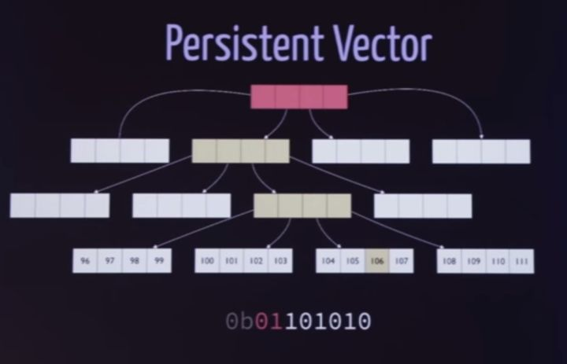
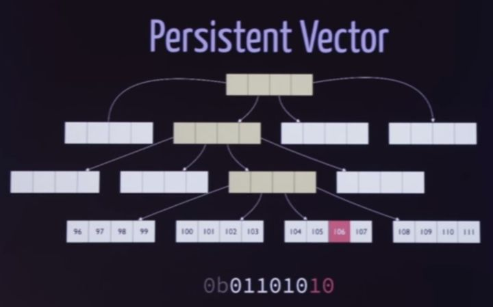

# 永恒不变的魅力

一个程序员，无论你人生的第一个hello world是从basic开始，c开始，抑或javascript开始，接下来了解的一个概念一定是「变量」（variable）。变量是可变的（mutable）。数学中永远不可能成立的 `x = x + 1` 在编程语言中有了新的内涵：赋值。一个变量的生命周期里，只要需要，其值随时改变。这改变可以是因迭代而发生，或者因状态变化而发生。在这个概念的基础上，程序员写下的代码，基本上就是根据外部或者内部的各种事件，对内部的状态不断进行改变。运行中的进程如此，磁盘的文件系统如此，数据库如此，javascript控制下的DOM页面也是如此。「变量」带来了可变的状态，而这种mutation在计算机的世界里无处不在。

一个东西可变，这是件让人很头疼的事情。除非小心翼翼地把状态迁移中遇到的所有动作都replay一遍，
你无法很容易将其恢复到前面的状态（undo），或者重做某个步骤（redo）。在多任务的环境下，读者写者（或曰生产者消费者）之间的竞争和同步是个灾难。就这样一个简单的场景，学术界和工业界还要将其分解成single producer single consumer，single producer multi consumer和multi producer multi consumer等多种场景，再加上lock-free和wait-free的各种组合，已经复杂到了一定范畴。

复杂是软件的大敌。当一件事情复杂的时候，就意味着围绕着它，会产生更多复杂的事情。我们想想测试：对单个函数或者类的单元测试一般都很简单，因为它涵盖的状态最少；涉及到多个类交互的功能测试复杂一些，因为状态开始交织缠绕。做网络设备的同学大抵都听过一种叫stress test的测试方法，就是把设备放在一个复杂的网络流量环境下，开启各种功能后，跑72小时。对此，工程师们都会祈祷千万别出任何问题：因为在这样一个无数状态组织成意大利面条的复杂场景下，出了问题，找到根源的机会很小。

既然，可变的状态如此难以捉摸，干脆，不允许 `x = x + 1`，让任何状态都不可变呢？

想想都吓人，这会引入多少问题！难道我每次在数组或者哈希表里修改一个元素，就把所有已有元素全部重新复制一遍？GC造的过来么？我还怎么写for循环，甚至，怎么愉快地写代码？

别急，这些问题先放一放，我们看真实世界里几个产品例子。

先说git（或者任何scm）。每当你往版本库里面提交一个commit后，你便失去了再次更改它的权利 footnote:[git commit --amend可以算一个小小的，无伤大雅的妥协]，任何之后的修改都不会改动之前的commit。系统通过计算两次commit间的diff，以增量的方式保存数据。有了这样一个基础，你就可以随意undo / redo，把自己的代码库切换到历史上任何一个commit。而且这个commit永远恒定。多人协作别人也无法破坏你的commit。

docker从git身上学到了很多思想，它把本不是什么新鲜事的lxc包装成了一个类似于git的部署管理软件。软件部署一直是件头疼的事情，由于文件系统是可写的，想要重构一个运行时的系统，唯有把其经历的所有步骤replay一遍：这是之前部署管理软件，如puppet，ansible所做的事情。replay是件费时的事情，是对初始状态不断修改，最终达到需要的状态，典型的处理mutation的思维。

而docker另辟蹊跷：如果运行环境也和git的一个commit一样，每次环境的改动提交后，都是immutable的呢？

这个大胆的想法成就了docker今日的辉煌。git两个版本间的diff多为文本，而docker则是文件系统的diff。使用已有的UnionFS（也许现在换了新的FS？），通过copy-on-write不断产生新的layer，新layer只保留和已有layer不同的地方，软件的运行环境成了一次次commit（一个个layer）。再辅以强大的cache能力，docker实现了 "git for deployment" —— 管理员可以在生产环境很方便地undo/redo/checkin/checkout出来各种版本的运行时。

react则是immutability在UI领域的一次伟大的尝试。当同期的javascript库还沉迷在MVC的初级阶段，争做其头牌，react已经把目光放得更远：有没有什么思想上的飞跃，能够做出来一个更加牛B的V(iew)？

react想到的是减少变化。它有两个主要的思想：信息单向流动以及隔离变化，而隔离变化主要体现在两方面：

1) 把不可变的props和可变的state分开

2) 在DOM和DOM操作者间安插了VDOM。与其直接操作dom，把状态维护得乱七八糟，我何不做个中间层，所有新的修改都是一层层累加上去，可以获取diff，就像git一样？基于此，react不必费心记录用户究竟具体做了那些binding（像ember/angular那样），而是每次改动，通过VDOM算出一个新的diff，对DOM做最必要的改动。

当然react不可免俗地还是使用了变化的state，这使得其计算diff的performance并未达到最好。而基于react的 [om](https://github.com/omcljs/om)，借助cloujurescript 的语言层面的immutability，把react的能力发挥到极致（state的变化本身就以diff记录，所以效率超高）。当UI能够用简单的数据结构 [EDN](https://github.com/edn-format/edn) 来表述的时候，一切都显得那么简单。想在UI上来个时间旅行（undo/redo）？这就跟git checkout一个commit那么简单！想对UI的任意一个状态做测试？太简单不过 —— 事先构造好一个中间状态的UI的EDN，然后进行特定的步骤，测试构造好的EDN是否于实际UI的EDN相等不就得了！

下面这个 [pixel editor](https://github.com/jackschaedler/goya/blob/master/src/cljs/goya/timemachine.cljs) 只用了66行代码，就提供了一个完整的undo/redo的功能：

这就是immutability，永恒不变的魅力！

说到这里，我们再来回答immutability带来的问题。怎么愉快地写代码的问题，已经由函数式编程语言解决，程序员只需付出时间和精力去适应这个陌生的世界即可。

剩下的问题是，怎么愉快地复制状态？

数学家们早就提供了解决方案，clojure将其引入到实际应用：persistent vector。下图的数组使用了persistent vector，4个bit 4个bit（实际使用是32bit）建成一个索引树，假设我们要改索引是106（0b01101010）的元素，首先取（01），也就是1，找到第二层第二个索引，以此类推：

最终到达叶子结点，找到要修改的元素后，创建新的节点，并将这条链上的走过的所有索引一并复制，就完成了数组内元素的一次「修改」。

有同学肯定想O(1)的问题愣是搞成了O(logN)，这不脱裤子放屁多此一举么？

别忘了这里不仅仅是「改变」内容那么简单，还记录了历史，保有了数据进行时间旅行的权利。而最美妙的是，牺牲一些运行速度和内存，你的代码是immutable的，是化繁为简的。

而immutable，是如今这个程序世界梦寐以求的。我知道现在大家讲到immutability的好处，就必然会讲并发，所以并发的好处就不讲了。
