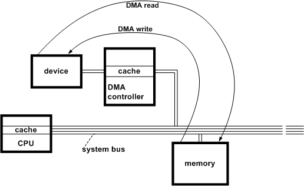
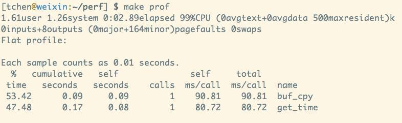

== 软件性能调优：看数据，还是看概念？

很多人谈到性能，言必及 zero copy。我们看wikipeidia上的定义：

"Zero-copy" describes computer operations in which the CPU does not perform the task of copying data from one memory area to another. This is frequently used to save CPU cycles and memory bandwidth when transmitting a file over a network.

很清楚，zero-copy是当数据需要从内存的A点拷到B的时候，CPU不参与这个过程，也就是不通过调用 ``memcpy()``，实现内存拷贝。这个过程一般是device driver来完成，通过DMA（direct memory access）绕过CPU在外设（一般是NIC，也就是网卡）和主存中做乾坤大挪移。放一张图：



至于DMA是怎么工作的，怎么发起，怎么通知CPU，cache coherence怎么处理，这就不是本文要讲的内容。

当然，这是狭义的zero copy，一般更广义的zero copy还包括在DMA结束后的整个数据的生存周期里，数据尽可能地少拷贝（绝对不是不拷贝哦）。

我们看Kernel如何收包（简化版）：

- 驱动初始化时，为NIC分配ring buffer。
- NIC收到报文后，找到下一个空闲的buffer，将其DMA到buffer指定的内存里，同时发送interrupt，告知Kernel。（第一次zero copy）
- Kernel处理这个interrupt，将这个buffer据为己有做后续处理，然后新分配一个buffer，还给driver。（第二次zero copy）。
- 接下来交给TCP stack处理（因为咱们讲的是服务器开发，一般是TCP服务器）。TCP是个stream based protocol，在这里，报文的排序，组包（把TCP头去掉，payload连接起来供application使用）等等，根据实现的不同，也许需要copy至少一次。另外，如果自己作为发送端，由于需要考虑潜在的retransmit，一般也会copy一份到retransmit queue里。（网络设备专门优化不在此讨论范围之内）
- 之后交给application处理，这涉及到kernel space到user space的切换。将application的buffer和kernel的buffer映射起来不是一件简单的事情，所以这里一般也会有一次copy。

当然，现在有跳过kernel的stack，从NIC直接DMA到user space的技术，但那一般是网络厂商干的勾当。我觉得咱们做一个服务器软件，还是不要抢人家TCP stack的生意，否则你会把自己玩死。

基本上，这些动作都发生在application无法控制的kernel里。好处是：当你 ``recv()`` 的时候，你拿到了一个只包含有 TCP payload 的 重组好的，可以线性阅读的buffer。你只需要关心application level的逻辑。你能控制的，也只有之后，尽可能少的copy这个buffer。我们兜了这么一大圈，终于回到之前的问题：不谈zero copy，谈什么服务器性能，谈什么优化系统调用！

无奈的是，我们只能控制application level的zero copy。

假设我们写了一个 HTTP server。大多数HTTP请求头都不会太大，除非是post一个文件，或者应用服务器设置了巨大的cookie。我们假设平均而言整个请求大小是4k（这个假设没有价值，只是为了比对），而我们的 server 稍稍2b一些，除了正常处理中的copy之外，还会把整个请求 ``memmcpy()`` 一遍。为公平起见，我们不和那些占用时间比较长的系统调用比较，就和 ``gettimeofday()`` 比一比。主体代码如下：

```c
#include <stdio.h>
#include <stdlib.h>
#include <string.h>
#include <sys/time.h>

#define ROUNDS 10000000
#define BUF_SIZE 4096

void get_time() {
  struct timeval tv;
  struct timezone tz;
  int i;
  for (i=0; i<ROUNDS; i++) {
    gettimeofday(&tv, &tz);
  }
}

void buf_cpy(void *src, size_t n) {
  void *data = malloc(n);
  int i;
  for (i=0; i<ROUNDS; i++) {
    memcpy(data, src, n);
  }
  free(data);
}
```

```makefile
CC=cc
PROF=gprof

SRCS=test.c
OBJS=$(SRCS:.c=.o)
TARGET=test

build:
  @$(CC) -g -c $(SRCS) -pg
  @$(CC) -o $(TARGET) $(OBJS) -pg
  @echo "DONE!"

prof:
  @time ./$(TARGET) && $(PROF) $(TARGET) -p
```

带着gprof编译运行，然后查看看结果：



（注意：这个结果你最好自己写代码测一下，不同的环境可能不一样，我用的是digital ocean最小的instance，ubuntu 14.04）

哟，貌似 ``memcpy()`` 没有想象的那么慢嘛，比 ``gettimeofday()`` 慢一点点而已。

那问题来了，你是费尽心思去优化散落在各处小小的，基本上不可避免的copy呢，还是1s调用一次 ``gettimeofday()``，而不是来一个包就调用一次，省却99.99%的调用呢？

你是会把发送response时分别两次发送header和body的两个 ``write()`` 合并成一个，来减少几十ms级的网络round trip的延迟，还是费尽心思去优化散落的copy呢？

你是会通过使用 ``strace``，``gprof``，以及 ``systemtap`` 等各种工具，追溯到真正性能所在的瓶颈，然后对症下药，还是不假思索地跳将出来：一切不谈zero-copy而论performance的服务器软件都是耍流氓！

当你看不起系统调用带来的损耗时，你是否又知道，当你苦苦追寻zero-copy的时候，kernel已经尽力在提供各种扩充的系统调用来尽可能让某些应用场景快起来？比如 ``sendfile()``？如果你的response是个静态文件，你可以通过这个系统调用轻松实现zero-copy？

写这么些，不是证明我有多对，我的知识也有可能是错的。只是当我们遇到问题的时候，是真正测量还是人云亦云，吐几个buzz word就自认为解决问题了呢？
