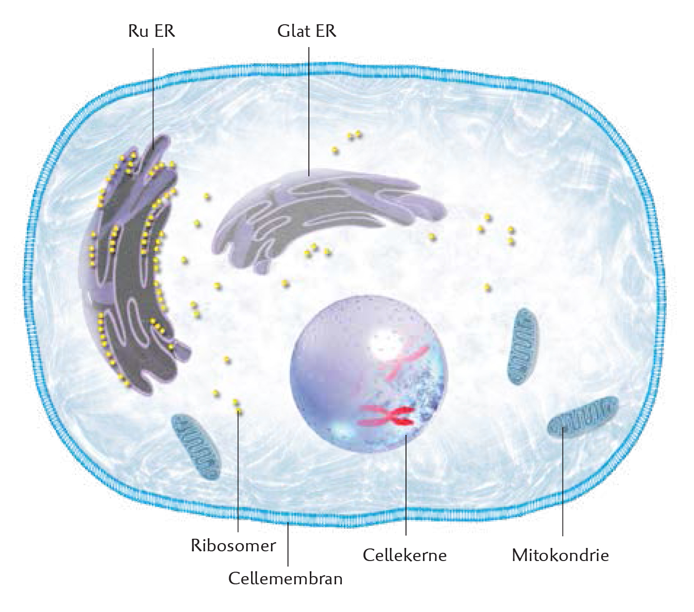
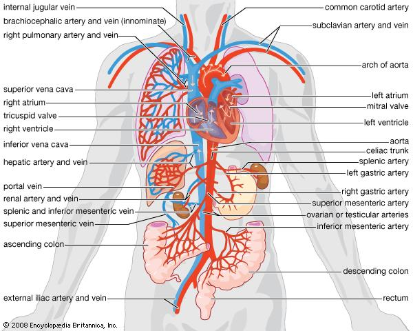
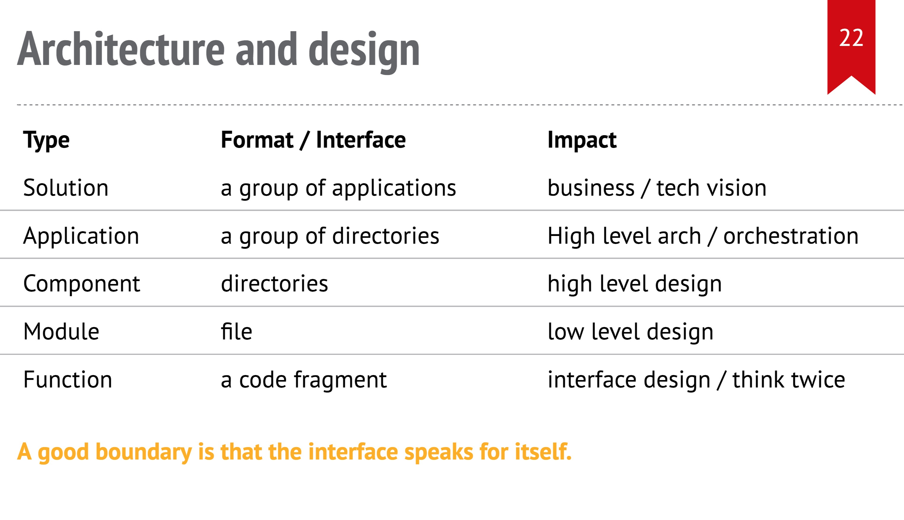
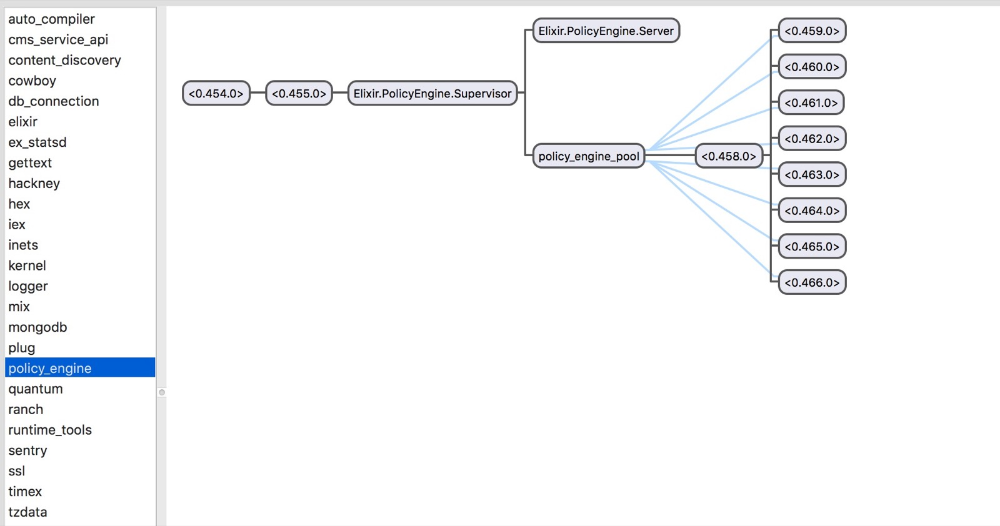

# 边界（Boundary）

我们做系统，做设计，很多时候其实就是在明确边界。函数和函数要明确边界，模块和模块要明确边界，服务和服务要明确边界，应用和应用要明确边界。明确边界能让我们的代码逻辑严谨，条理清晰。边界之内，对于外部世界，是个黑盒，一切物质的非物质的交换都只能在边界上通过已知的接口（interface）完成；同时来自外部世界的 impure data 在这里被校验（validate），过滤（filter），变换（transform）成为符合内部世界运行的 pure data。

在计算机软件的史前时代，软件的形态就像原核生物一样，简单至极，就是堆砌在打孔纸上的一行行机器码。随后，汇编时代有了 subroutine/procedure 的概念，进一步形成了函数。函数的边界是其 signature，一个函数的 signature 由其名字，输入参数及其类型，返回值及其类型共同构成。外部访问者无需了解函数的实现，通过调用函数来执行其代码。函数类似于生物体中的细胞。

随着软件日益复杂，若干函数被组织成类，或者模块，来完成某个__功能__，从此，作用域的概念开始深入人心。有些函数承担对外的接口，他们是 public 的，有些完成内部功能，他们是 private 的。类或者模块的边界由文件名，类名（模块名）和公有方法组成。类或者模块类似于生物体中的组织。

进一步地，若干类/模块聚合起来，提供某个__服务__，就形成了组件（component）。组件的表现形式往往是一个目录（或者子目录），它有自己的抽象接口（start / stop / process_message / ... ）。组件的边界由组件所在的目录，抽象接口和 public class / module 组成。组件类似于生物体的器官。

生物体和软件很相通的一点是它们也拒绝 single point of failure。上图是人类的肾脏器官，经典的 active-active cluster 设置。那些卖肾买 iPhone 4 或者 iPhone 6P 的同学至今还活蹦乱跳的一个原因是，即便一个肾没了，另一个也会负担起所有的流量，保证体液循环畅通无阻（当然，最大承载的流量打了折扣）。

就像乐高积木一样，进一步，我们可以把若干组件聚合起来，实现某个__目的__，这就构成了应用（application）或者子系统（sub-system）。应用的表现形式是一个由若干目录组成的项目。它的边界由它的名字，使用的资源（比如端口）以及应用的入口（比如 main 函数）组成。应用类似于生物体中的系统，比如下图的循环系统：

再往上，若干个应用组成了一个解决方案（solution），为某个__业务__目的保驾护航。解决方案就像一个完整的生物体，它的边界大到一份复杂的商业蓝图，小到 iOS 上的一个工具软件。类比于一个完整的生物体，当我们做一个解决方案时，我们要界定它的子系统，哪些应该是：

* dummy system - 就像我们的呼吸系统一样，风雨无阻，就连睡觉也会自动工作。我能想到的例子有，日至系统，监控系统，错误报告系统等。
* intelligent system - 就像我们的免疫系统一样，根据外部的变化而应对之。这样的 system 一般在 behavior based reaction system 中，如 firewall，dynamic user classification 中使用。
* C&C system - command and control，就像我们的大脑一样，发号施令，控制整个机体的行为。前几年 热络的 SDN 中的 S 就是这个东东。

我们来回顾一下刚刚谈过的边界以及它们对架构和设计的影响：

目前讲到的所有边界还仅仅是开发过程中我们设计的边界。运行时的边界略有不同：

我们可以看到，即便我们把若干代码组织成为组件或者服务，操作系统或者大部分软件的运行时（VM），并未给我们提供类似的组织方式，所以，即便是我们在项目里将各个组件分得很清楚，运行时，它们也是揉在一起的。对于此，大部分场合，我们只能靠着经验自己去组织。比如说，nginx 会用多 process 来界定 control plane / data plane，这是一种经典的处理方式。

erlang VM 有一个很好地设计，解决了运行时的 component 的独立性，使得它们运行起来也有明显的边界。这就是它的 application 的概念。

这个图中，一个 OS 意义上的进程，在运行时由若干个 application（component）构成，每个 application 有其独立的 supervision tree，独立的 heap，可以被 start / stop / restart，甚至单独升级其版本。
