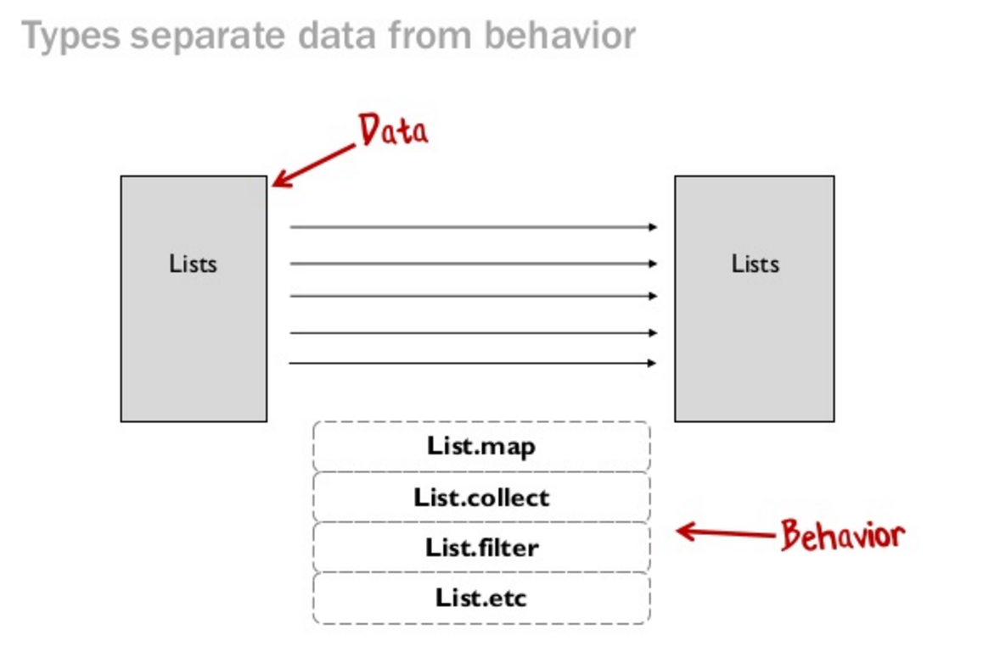

# 谈谈面向对象编程

最近写了些和函数式编程的文章，有读者和我讨论函数式编程和面向对象编程的优劣。二者都是很好的编程思想，都在着力解决代码重用的问题，也彼此吸收对方的优点，所以大可不必去分个高下。然而，相对于函数式编程来说，面向对象编程领域涉及的语言太多，受众广泛，因而门槛较低，产出的垃圾书（国内国外都有）也足够多，往往把读者带入错误的方向。

我面试过许多号称精通面向对象编程（比如：Python / Ruby / C++）的工程师，随便问几个问题，就可以看出这个人对面向对象的理解：

* 你觉得在面向对象编程中，最重要的思想是什么？
* 如果有人提及「继承」，我会让她写个她在工作中使用继承的例子。
* 如果有人提及「多态」，我会让她解释一下多态，并让她写个她在工作中使用多态的例子。
* 如果有人提及「代码重用」，我会让她谈谈她对代码重用的理解，并附上一个工作中重用的例子。

对第一个问题，很多人回答继承，有些人会添上接口，多态等概念，很少人会提及代码重用。

对第二个问题，几乎 80% 的人都会写出对象继承的代码，而这里面有一大半的人写出的「工作中」使用继承的例子竟然是某著名垃圾书中的经典误人子弟的例子：Duck 继承于 Bird，Bird 继承于 Animal。

对第三个问题，几乎所有人都是写出对象继承中的多态，然后一般的人给出的还是那本著名垃圾书里的著名例子：鸟能飞，也会叫，鸭子呱呱呱但不会飞。你可以把鸭子对象赋给鸟，让它发出呱呱呱的叫声。

对于第四个问题，嗯，如果有人回答到第四个问题，并能信手拈来 Iterable，Comparable，这个人如果没看『程序人生』的文章（嘿嘿），那就是基础知识和编程思想已经八九不离十，可以聊对象以外的东西了。

面向对象编程和函数式编程中最基本，也是最重要的要素是 __代码重用__，或者更严格地说 __代码被重用__。这里为什么要严格区分代码重用和代码被重用呢？代码重用根本不是个事儿，除非使用汇编语言，否则你写十行代码，九行都是在重用别人的代码 —— 连往 console 输出这样的简单语句，你是不是都用了语言本身的库函数？就算语言将其归入核心语法，这个语言的实现也必定在底层调用了 libC 的某个函数，来获取操作系统对此的支持。所以说，干编程这一行，重用别人的代码，我们最在行不过；而让自己的代码被别人重用，我们往往底气不足。

写过半年以上 Python 的，应该都知道所谓的 magic function，如果你的类定义实现了某个 magic function，那么类就会拥有一些神奇的能力，比如：

```Python
class A:
    def __init__(self, items):
        self.__data = [item for item in items]
    def __getitem__(self, key):
        return self.__data[key]
    def __add__(self, data):
        return self.__data + [item for item in data]
    def __iadd__(self, data):
        self.__data.extend([item for item in data])
        return self
    def __iter__(self):
        return iter(self.__data)
```

上述的类并没有继承任何已知的类（隐式继承 object 不算），然而它可以很容易被别的代码用一种公共的方式调用：

```Python
a = new A([1,2])
b = new A([3,4])
a[0] # 对象支持索引，返回 1
a + b # 对象支持加法操作，返回 [1, 2, 3, 4]
a += b # 对象支持自增，表达式完成之后，a.__data 是 [1, 2, 3, 4]
[item for item in a] # 对象支持 iterate，返回 [1, 2, 3, 4]
```

这便是代码的被重用的能力。这种编程的方式，与其说是面向对象编程，不如说是面向接口编程。对象在这里只是一个幌子，其存在的意义更多地是满足某种接口。在面向接口编程中，接口继承要远重要于类继承。

为什么面向接口编程如此重要？因为它是一种控制反转 —— 通过抽象出一系列接口，并在这些接口上进行操作，使得控制逻辑不依赖于具体的实现；同时，具体的实现可以并不关心控制逻辑如何使用自己，它们会在需要的时候被调用。由此，使用对象的逻辑和对象本身充分解耦，由接口这座桥梁将二者联系起来。这样，代码得到了最大程度的被重用。

谈到接口继承，不得不提 Liskov substitution principle（里氏变换原则），wikipedia 这样介绍它：

> It states that, in a computer program, if S is a subtype of T, then objects of type T may be replaced with objects of type S.

这也是面向对象编程中常说的 Substitutability（可替换性）。这段话翻译过来说就是，在类型系统中，如果类型 S 是类型 T 的子类型，那么类型 T 的任意对象可以被类型 S 的对象替换，且不影响程序的正确性。里氏变换是面向对象编程（其实适用于任何编程思想）非常重要的一个原则，也是程序得以多态的基石。如果我们做一个系统，要注意尽一切可能满足这一原则。

什么是多态？wikipedia 是这么解释：

> polymorphism (from Greek πολύς, polys, "many, much" and μορφή, morphē, "form, shape") is the provision of a single interface to entities of different types. A polymorphic type is one whose operations can also be applied to values of some other type, or types.

由此可见，多态指的是我们可以对一个操作（接口）使用多种数据类型。多态并不单单是是面向对象编程的一个概念，函数式编程里面，多态也到处可见。我们知道在 Python 里，一个数据结构可以被 map 的前提是其实现了 ``__iter__``，而在 clojure 里，同样的，一个数据类型实现了 ISeq，它就可以使用 ``map``，而在 elixir 里，``Enum.map`` 需要实现 Enumerable protocol。可见，多态并非是面向对象的专利。

上文中我们调侃的那个「鸟能飞，也会叫，鸭子呱呱呱但不会飞」的所谓面向对象的例子实质上破坏了里氏变换原则。它让你的代码无法享受多态的好处。比如说，你围绕着「鸟」这一基类打造了一个系统，系统的后期开发者用「鸭子」继承了「鸟」，当你的代码执行「飞」这一操作时，由于鸭子不会飞，系统有可能会崩溃（或者抛出异常）。这时你不得不回过头来修改围绕基类打造的系统：当「飞」这个操作运行时，处理一切异常（有时这并不可行）。这就违反了 Open close principle，你为了上层的一个蹩脚的实现，而不得不去修改底层的代码。系统中类似的情况越多，系统的 BUG 就越多。

为了符合里氏变换，我们需要子类严格继承和实现父类的接口，这就带来了一个问题：「类」这个概念在实际使用中，往往被当成一种分类法（taxonomy），也就是 is-a。is-a 是面向对象里面的一个坑，因为我们在判断一个东西是否是 is-a 时，常常使用我们生活中的逻辑概念去判断，这是非常不可靠的，会出现很多蹩脚设计 —— 比如作为父类型的「鸟」会飞，而子类型的「鸭子」不会飞这样不符合里氏变换但符合生活逻辑的设计。使用「鸟」和「鸭子」来讲述面向对象的继承关系，虽然很直观，很形象，却让初学者陷入一个泥潭而不能自拔。

Scott Wlaschin 在他那著名的 Funtional programming patterns 中提到，types are not classes。把「类」（class）等同于「类型」（type）也是初学者常常碰上的坑。在函数式编程里面，类型实际上是一种接口，它是数据和数据可以产生的行为间的一座桥梁：



而「类」是「类型」的一种实现方式。从这个意义上讲，「会飞」（``flyable``） 是一个类型，「鸟」实现了 ``flyable``，而「鸭子」无法实现 ``flyable``，所以「鸭子」并不是「鸟」的子类型。弄明白了这一点，我们就不会傻乎乎地去根据生活经验，把「鸭子」继承在「鸟」的名下。

而弄明白了这一点，我们也就可以参悟出 java 的设计者为何煞费苦心地为 class 的类继承使用 extends，而接口继承使用 implements，同时如若 override 方法，返回类型是 covarient 了。

