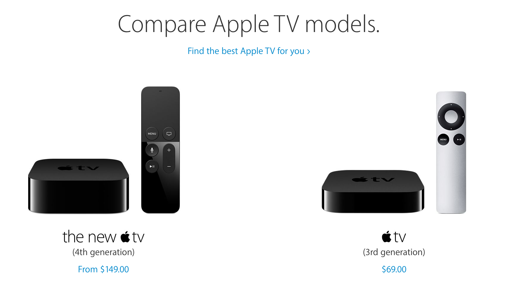
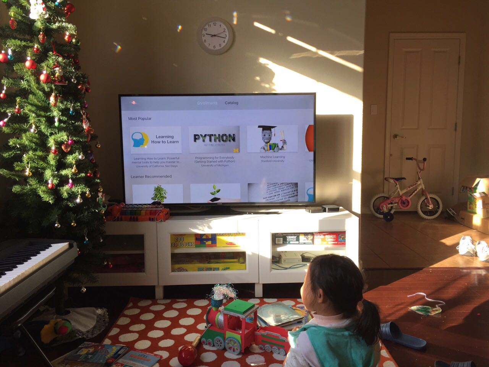
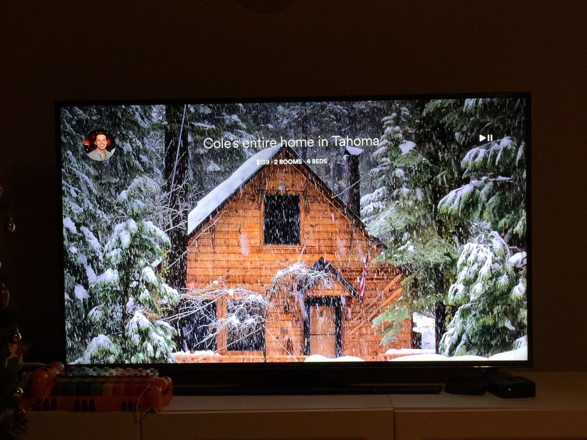
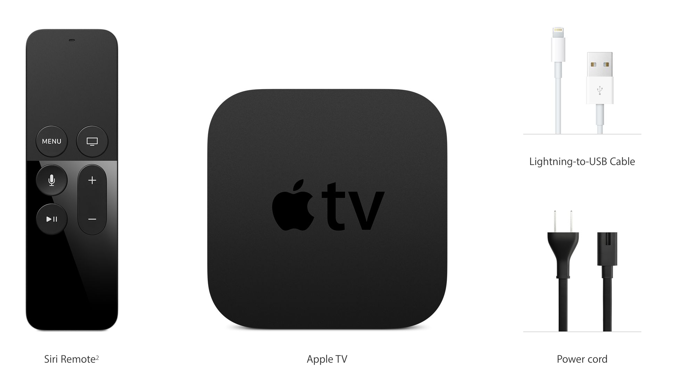
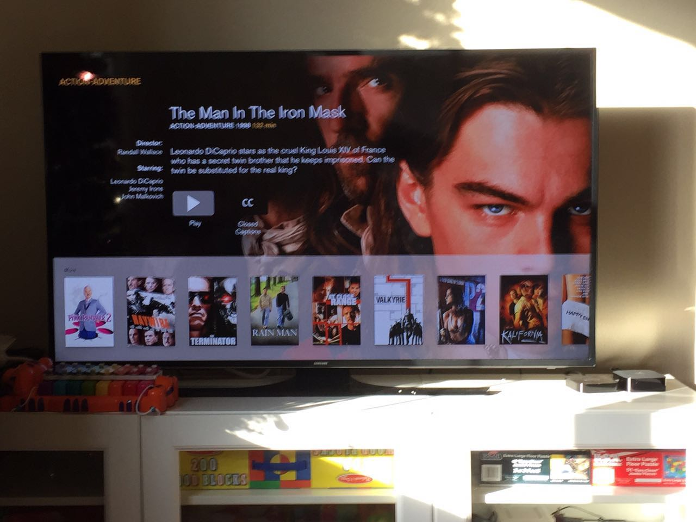

# Apple TV 4：三屏合一的终章？

手机，计算机和电视这三块占据着人们生活的重要屏幕，一直是科技巨头们垂涎已久，妄图一统的战略要地。这个三屏合一，并非整合出一个屏幕来解决所有的生活工作娱乐的需求，而是三块屏幕能够互相配合，在最合适的屏幕上展示最有价值的内容。记得早在『未来之路』出版的年代，三屏合一就是一个热门的词汇，如今十多年过去了，巨头们仍然在这条路上徘徊和挣扎着。

然而，Apple TV 4 可能有机会终结这种无助的探索和挣扎。

三个月前，Apple TV 4 就已面世，但我并未第一时间购买，而是等待一个合适的时机，说服家里的领导我们家除了小米盒子和两个 Apple TV 3（一个在北京）之外，还需要第四个，也许是革命性的一个盒子。不过加入了 Tubi TV 后，研究一切有我们产品的盒子和移动设备就成了必须，所以我顺理成章从公司拿回一个 Aplle TV 4研究研究（你看，公司的领导总是要比家里的领导好说服，是不？）

四代相比前代最大的几个变化：

* 使用了 iOS 9 的变种：tvOS
* 拥有了自己的 app store，可以下载安装任意提交在 app store 上的 app
* 遥控器可充电可触控，并支持 siri（你可以对着遥控器发号施令）
* CPU使用 A8（iPhone 6 的处理能力），处理能力大为改观

这里面，tvOS 和 app store 是最重要的变革。我们来比较一下。

## 四代相对和前代系统的优势

在四代之前，Apple TV 对用户来说是一个比较鸡肋的产品。所有的 app 直接 ship 在硬件里，用户没有任何额外的控制 - 不对，你可以控制一个 app 是否显示在主屏，仅此而已。尽管在软件自动更新的时候，新的 app 有可能被添加到系统里，但那毕竟不是用户的自主选择，也无法适应每个人的口味。所以，在应用被电视巨头们把控的 Apple TV 3 时代，对我而言有点吸引力的应用，也就是 YouTube 和 TED。但这些应用除了运行在一个更大的显示屏上之外，并未与电脑上的有太多体验上的区别，或者说，仅凭它们，我无法体验 Apple TV 与众不同的地方。所以渐渐地，我家的 Apple TV 沦为了 AirPlay 的附庸：即便是看 TED，我也是图个省事，在电脑上打开，然后 AirPlay 到电视上。

四代改变了这一切。应用不再是被电视巨头垄断着，而是通过 app store，朝着多元化的方向发展。由于流量不再被主屏上的应用垄断，用户的评价左右着应用的命运：好的上榜，不好的滚蛋，就这么残酷。我欣喜地发现，coursera，airbnb 等新生力量看到了 apple TV 的前途，花了力气做了点东西，虽不完美，但是美妙的一步。

（Coursera 的课程）

（airbnb 的房屋）

四代的遥控器手感和质感要好多了。新的触摸板带来无限的想象空间，而 Siri 的植入是非常关键的。Apple TV 属于利润很薄的硬件，所以遥控器在目前不可能做成一个类似于 iPod Touch 那样的控制器，尽管，我觉得让遥控器拥有一片触摸屏能解决很多交互上让人抓狂的地方。

所以在遥控器因为成本原因无法集成触摸屏的时候，触摸板 + Siri 是几乎 Apple 手上能打出的最好的牌：复杂的输入靠 Siri，简单的输入用触摸板搞定。

iPhone 在手机领域逐渐引领潮流，靠的是一个迅速成长的 app store 和一个不断进步的 SDK。当生产软件的权利从一个个大中型的软件公司被下放到无数的个人软件开发者或者工作室手中时，生产力和创造力得到了极大的释放，于是有了如今的繁荣。很难说是 iPhone 的硬件成就了 app store，还是 app store 成就了 iPhone，但二者形成的网络效应，互相促进互相繁荣，成为一个不可分割的软硬件生态圈。如今，时机成熟（我不相信 Apple 没有意识到这一点），Apple TV 也终于迈出了相同的一步。而这，也许会让历史重演。

有人也许会拿 mac app store 的滑铁卢来反驳 tvOS app store 的潜力，但是不要忘了，mac 是个开放的系统，已经有根深蒂固的销售软件的各种渠道，mac app store 并未提供更多的附加值，所以无法成为大部分软件首选的渠道；而 iOS 和 tvOS 的软件分发渠道完全由 Apple 控制，所以二者更有可比性。

## 四代相对 roku/xbox/wii 的优势

Apple TV 作为一个 OTT 设备，自然会被与北美拥有最大装机量的 OTT 设备 roku 对比。如果就看视频的体验而言，最新的 roku 秒杀 Apple TV，因为 Apple TV 4 并不支持 4K，整个语音搜索的体验也远差于 roku（也许我还不太会用 siri 来更好地搜索）。

但 Apple TV 是一个多目的的客厅娱乐平台。它并不只用来看视频。它可以用来玩游戏，可以学习一些新的东西，而这，像极了一开始的 iPhone。论打电话，它不如 Nokia，论玩游戏，它不如各种专门的掌机，论照相，它不如各种DC。但人们不需要那么多东西。所以现在掌机和DC几乎灭亡了。

Apple TV 的遥控器已经具备了一些 Wii remote 的功能，我可以安装跳舞的 app，拿着它对着屏幕 high。我猜测，重力感应，方向感应等功能都被集成在这个小小的遥控器里，所以，wii 擅长的那些休闲游戏，也就很快就会被 ISV 们搬到 Apple TV 上。

xbox 本来是很有潜力成为三屏合一的终结者的。微软也一直在这个方向努力。可惜，游戏手柄限制了人们的想象力，使其更多的时候还是一款游戏机。当人们对一件事情的感觉根深蒂固后，想让他们改变这一感觉很难。另外，xbox 没有一个 app store 体量的，通过互联网分发应用的商店。

## Apple TV 的潜力

就我目前的探索来看，Apple TV 上的应用会有很多潜力，尤其是和 iPhone / iPad 进行一些互动。比较大的机会可能集中在这几个方向。

### 视频软件

TV 是用来看各种视频的，这是一个 OTT 设备最原始的需求，而 Apple TV 里面，品类最多的就是这个方向。所以你看到从 netflix 到 hulu，再到传统的电视台，如 HBO，CNN，PBS等，都有自己的一个或者多个 app。这些 app 最恼人的地方就是每个都要订阅才能观看，如果不订阅，就是没用的系统垃圾。电视台其实不需要自己的 app，他们需要的是用户订阅，所以未来可能会诞生独立的 app，整合这些频道，这会是个漫长的过程，但这里会有很多机会。正如现在我们 Tubi TV 在整合电影业里面各个 studio 的那些质量不错，但已经沉没在货架上的影视资源一样。Apple TV 是我们一个难得的机遇。

现在很多视频系统都自带弹幕。如果弹幕内容的输入在 iPad（或者其他 pad）上完成，在 Apple TV 上显示，那将是一种有趣的体验，既不破坏看视频的流畅度，又能高逼格地与其他观众实时互动。这个方向上有很多可能性探索。

### 在线教育

我一直觉得 Coursera，edx，udemy 等 MOOC 在 OTT 设备上有很大的潜力。很多学习的过程需要有至少两个屏来同步完成。所以我一般 mbp + 显示器来进行学习。如果 mbp（或者其他笔记本）用于跟随练习，Apple TV 用于视频播放，两者可以根据对方的反馈互相控制，那将是一种多么美妙的事情！当我在笔记本上记笔记或者联系时，视频自动停止，当我使用某个快捷键时，视频继续。如果有做题的环节，用户在笔记本上做题，Apple TV 上提供各种上下文相关的帮助。甚至，当你跟着 Andrew Ng 学习 Machine Learning 时，你还可以随着视频的播放查阅别人学习过程中记录的笔记。这在现有的网站或者 app 中都可以完成，但是，有了 Apple TV，使用两个屏一起配合，可以拥有无比流畅和高效的学习体验。

另外一个巨大的在线教育市场 —— 儿童早教，在这里也有巨大的发挥空间。电脑屏太小，键盘太复杂，这些都是制约孩子们在电脑上学习的问题。iPad 是一个很好地学习工具，但屏幕还是小了些，容易损害眼睛；Apple TV 在这个领域可能会获得统治性的优势 —— 毕竟，把孩子们扔在电视机旁，让其随意看动画片，不如附上一点钱，让她/他跟着别人的步调，一点点学习。

### 应用扩展

上面说了这么多，其实每个应用开发商都应该想想，如今有了三屏合一的平台，我该怎么让同一个应用在不同的屏幕上能够提供最合理最无缝的体验。从这个角度上讲，watchOS 上绝大部分 app 都是失败的，因为它们除了提供一个提醒功能外，并没有把应用在两个屏幕上的优势都发挥出来，当然这根 Apple Watch 的屏幕大小和电池消耗都有关系，但在 Apple TV 上，这两个都不是问题。目前 tvOS 上的应用还在初级阶段，我还没看到让人眼前一亮的应用。

### 休闲游戏

这个方向曾经让 wii 红极一时，傲睨群雄。有理由相信，在 Apple TV 上，让用户握着遥控器进行游戏的各类休闲游戏会越来越多。不用光盘，可以随时安装下载删除，会让用户在有了 iPhone 后，加速逃离掌机一样，开始逃离客厅的游戏机。

想象一下，你的 calendar 里面设置了每天下午8点要练习瑜伽，到了8点，你的手机提醒你，于是你打开了电视，你指定的瑜伽 app 已经准备好这一天的课程了。未来的电视不该仅仅是可以自定义每个时间段播放什么内容，还可以定义使用什么 app 要完成什么任务。
