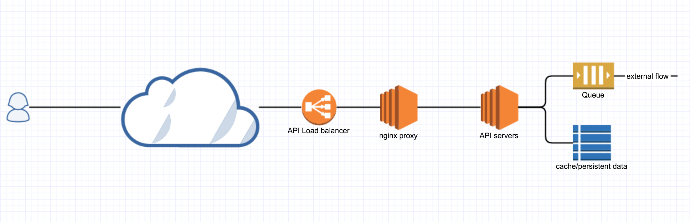
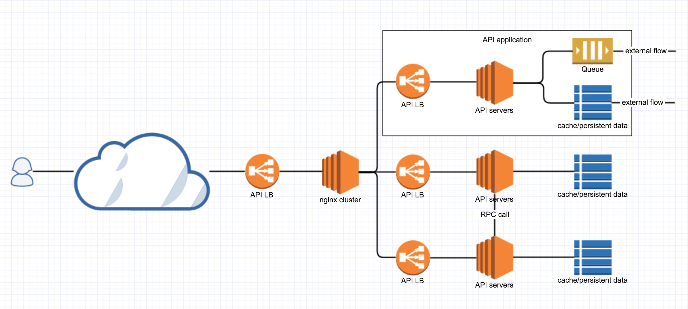
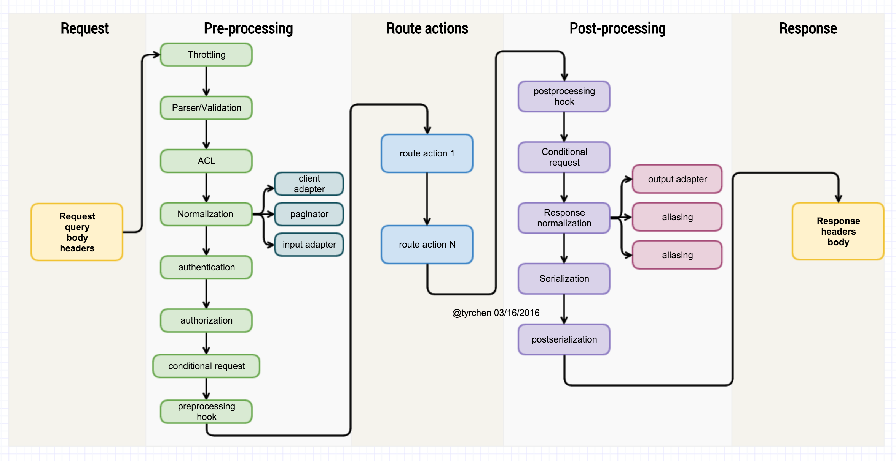
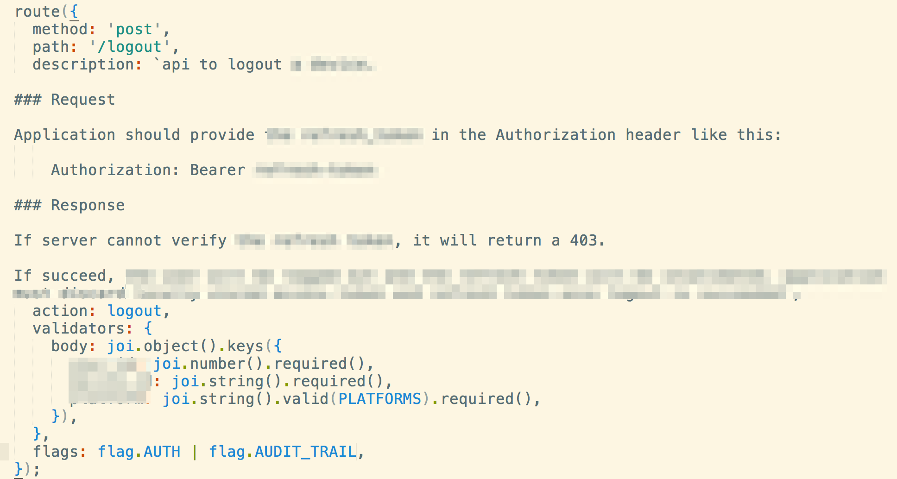
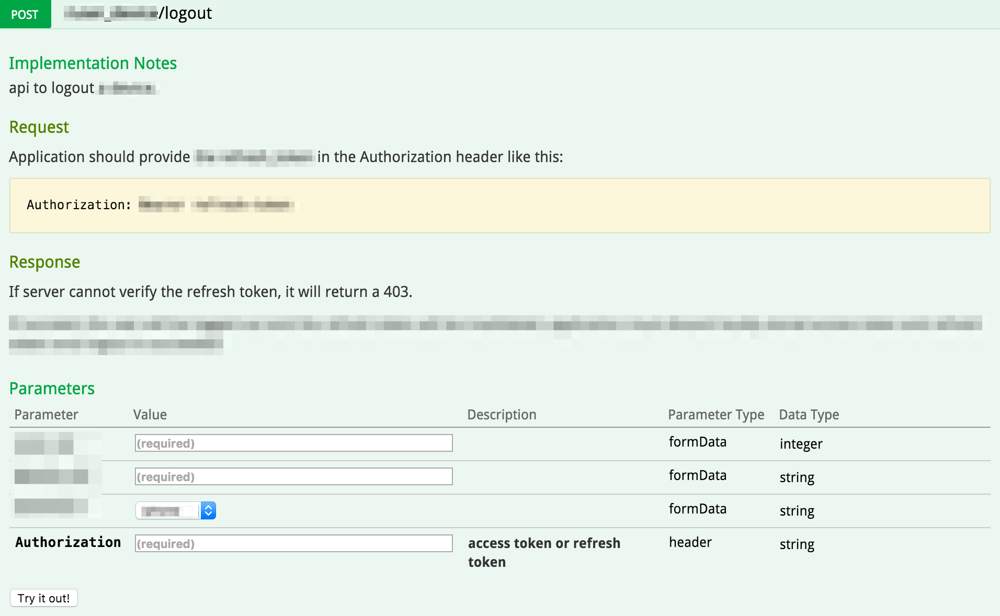
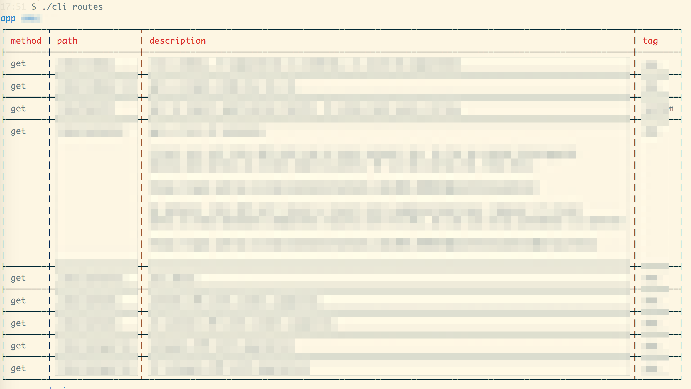
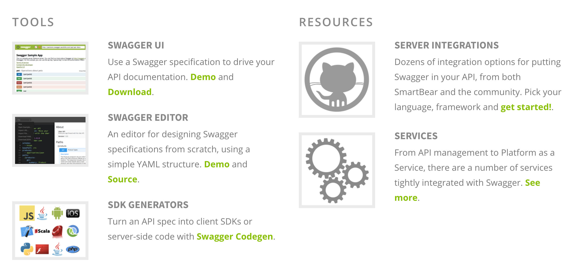
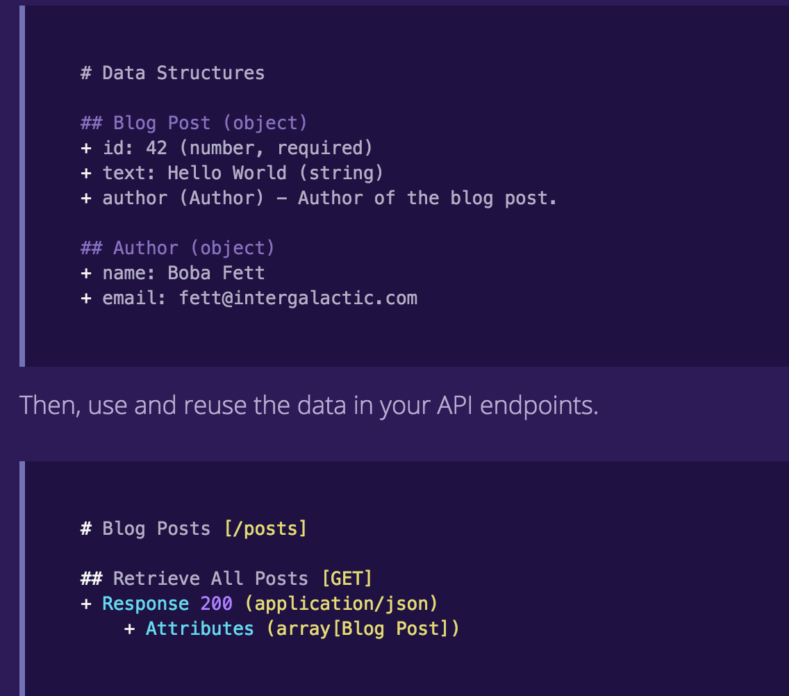
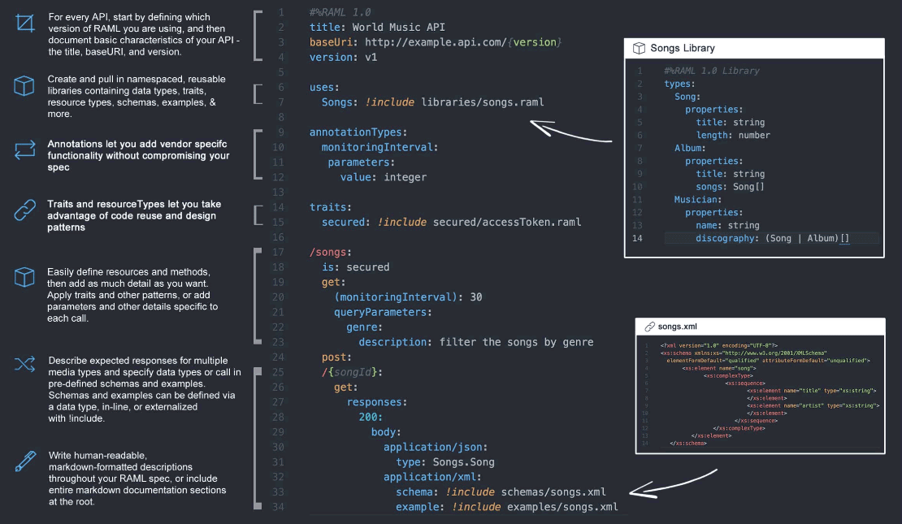

# 再谈 API 的撰写

## 背景

去年我写过一篇文章：撰写合格的 REST API。当时 Juniper 裁掉了我们在德州的一支团队，那支十多人的团队有一半的人手在之前的很长一段时间里，主要的工作就是做一套 REST API。我接手这个工作时发现那些API写的比较业余，没有考虑几个基础的HTTP/1.1 RFC（2616，7232，5988等等）的实现，于是我花了些时间重写，然后写下了那篇文章。

站在今天的角度看，那时我做的系统也有不少问题，很多 API 之外的问题没有考虑：

* API 的使用文档。当时我的做法是把文档写在公司使用的协作系统 confluence 里，但这样做的最大的问题是：代码和文档分离，不好维护。
* API 的监控。整个 API 系统没有一个成体系的监控机制，各种 metrics 的收集严重依赖 API 的实现者处理，拿时髦的话说就是没法 orchestrate。
* API 的测试。做过大量 API 工作的人都知道，为 API 写测试用例是非常痛苦的事情，你不但要对 API 使用的代码做 unit test，还需要对 API 本身做 smoke test（最基本的 functional test），保证所有 API 是可用的，符合预期的。由于需要撰写的测试用例的数量巨大，一般我们写写 unit test 就了事。

理想情况下，一个 API 撰写完成，应该能够自动生成文档和测试用例，而 API 系统也应该提供一整套统计的 API 用于生成 metrics。缺省情况下，API 系统本身就应该收集很多 metrics，比如每个 API 的 response time，status code 等等，使用 collectd / statd 收集信息，并可以进一步发送到 datadog / new relic 这样的 APM 系统。

在 adRise，我们有一套运行了数年的 API 系统，不符合 RFC，（几乎）没有文档，（几乎）没有测试，（几乎）没有监控，最要命的是，它的开发效率和运行效率都不高。因此，过去的一两个月，我主导开发了一个全新的 API 系统。

## 目标

在打造一个新的系统之前，我们需要确立一些目标。这是我在设计 API 时写下的一些目标：

* A well defined pipeline to process requests
* REST API done right (methods, status code and headers)
* Validation made easy
* Security beared in mind
* Policy based request throttling
* Easy to add new APIs
* Easy to document and test
* Introspection

其中，introspection 包含两层意思：

* API 系统自动收集 metrics，自我监控
* 无论是撰写者，还是调用者，都很很方便的获取想要获取的信息

## 选型

有了以上目标，接下来的就是进行技术选型。技术选型是无法脱离团队单独完成的，如果让我个人选择一个基础语言和框架，我大概会选择基于 Erlang/OTP，使用 Elixir 开发的 Phoenix，或者，干脆使用 Plug（Phoenix 的基石）。因为 Plug / Phoenix 通过组合来构建 pipeline 的方式很符合我的思维，Elixir 对 macro 的支持和 Erlang 语言核心的 pattern matching 让诸如路由这样的子系统高效简洁美观，而 Erlang / OTP 的高并发下的健壮性又是一个 API 系统苦苦追求的。

然而，我需要考虑团队的现实。在 adRise，我们使用 node.js 作为后端的主要技术栈（还有一些 PHP / Python / scala），因此 API 系统最好是基于 node.js 来完成。node.js 下有很多适合于写 API 的框架，比如说：express，restify，hapi，loopback，sails.js 等。在综合考察了这些框架之后，我选择了 restify，原因有三：

* 接口和结构非常类似 express（团队对此非常有经验），但比 express 更专注于 REST API
* 一系列 middleware 和 route actions 可以组成一个灵活高效的 pipeline
* 简单，可扩展性强，容易和其他库结合，很适合作为一个新的框架的起点
* 源代码很好理解，一天内就能读完（好吧这是个凑数的原因）

事实证明，这是个还算不错的选择。

定下了基础框架，接下来就是选择核心的组件。首先就是 validator。很多人做系统并不重视 validator，或者没有一个统一的视角去看待 validator，这样不好。任何一个系统的运行环境都是个肮脏的世界，到处是魑魅魍魉，污秽不堪；而我们希望系统本身是纯净的，是极乐净土，那怎么办？

~~简单，打造一堵叹息的墙壁，挡住五小强~~

简单，净化输入输出。对于一个 API，什么样的 header，body 和 querystring 是被允许的？什么样的 response body 是合格的？这个需要定义清楚。所以我们需要一个合适的 validator。如果说挑框架似四郎选秀女，环肥燕瘦让你眼花缭乱，选 validator 就像姜维点将，看来看去只有王平廖化堪堪可用。在 github 里逛了半天，最后能落入法眼的也只有 joi 和 json schema 可用。

json schema 其实很好用，很贴近各类 API 工具的 schema（swagger 直接就是用 json schema），可惜太 verbose，让程序员写这个有点太啰嗦：

```json
{
    "title": "Example Schema",
    "type": "object",
    "properties": {
        "firstName": {
            "type": "string"
        },
        "lastName": {
            "type": "string"
        },
        "age": {
            "description": "Age in years",
            "type": "integer",
            "minimum": 0
        }
    },
    "required": ["firstName", "lastName"]
}
```

而 joi 是 hapi 提供的 validator，接口很人性化，相同的 schema，描述起来代码量只有前者的 1/3：

```js
joi.object().keys({
    firstName: joi.string().required(),
    lastName: joi.string().required(),
    age: joi.number().min(0).description('Age in years'),
});
```

而且它还可以比较容易地逆向输出（当然，需要各种适配）成 json schema。输出成 json schema 有什么好处？可以用来生成 swagger doc！swagger 是一种 API 描述语言，可以定义客户端和服务器之间的协议。swagger doc 可以生成 API 的文档和测试UI，比如说：


在接下来的文章中，我会详细介绍 swagger。

我们再看 ORM。经常使用 express 的同学应该了解，express 本身并不对你如何存取数据有过多干涉，任何人都可以按照自己的需求使用其所需要的数据访问方式：可以是 raw db access，也可以使用 ORM。这种灵活性在团队协作的时候是种伤害，它让大家很容易写出来风格很不统一的代码，而且，在写入数据库和从数据库中读取数据的 normalization，离了 ORM 也会带来很多 ad-hoc 的代码。因此，尽管 ORM 背负着很多骂名，我还是希望在涉及数据访问的层面，使用 ORM。

我们的系统的数据库是异构的，因此，纯种的，只对一类数据库有效的 ORM，如 Mongoose / Sequelize 就不太合适，上上之选是接口支持多种不同数据库，在需要特殊查询或者操作的时候还能转 native 的 ORM。这样，让工程师的效率和系统的效率达到一个平衡。在 node.js 下，这样的 ORM 不多，可用的似乎只有 waterline。waterline 是 sails.js 开源的一个 ORM，支持多种 db 的混合使用，在各个数据库无法统一的操作接口上（比如 mongodb 的 upsert），你可以方便地将其生成的 model 转 native，直接使用数据库的接口。

此外，waterline 的 model 的 schema 使用 json 来描述，这使得它可以很方便地转化成 joi schema，在系统的进出口进行 validation。

```js
// waterline schema
const attributes = {
  user_id: { type: 'integer', required: true },
  content_id: { type: 'integer', required: true },
  content_type: { type: 'string', required: true },
}
```

接下来是日志系统。一套 API 系统可能包含多台服务器，所以日志需要集中收集，处理和可视化。一般而言，我们可以用 ELK，或者第三方的服务。如果在设计系统之初就考虑日志的集中管理，那么日志的收集应该考虑用结构化的结构，而非字符串。字符串尽管可以使用 grok 来处理，但毕竟效率低，还得为每种日志写 grok 的表达式。由于 node restify 缺省使用 bunyan 作日志，而 bunyan 可以生成 json 格式的日志，因此直接满足我们的需求。

最后我们再看 test framework。一个合格的系统离不开一套合适的 test framework。我的选择是 ava / rewire / supertest / nyc。ava 是一个 unit test framwork，和 mocha / tape 等常见的 test framework 类似，解决相同的问题，不过 ava 能够并发执行，效率很高，而且对 es6 支持很棒，test case 可以返回 Promise，ava 处理剩下的事情。有时候我们需要测试一个模块里没有 export 出来的函数，或者 Mock 一些测试时我们并不关心的函数，rewire 可以很方便地处理这样的问题。supertest 可以做 API 级别的测试，也就是 functional testing，而 nyc 可以用来做 test coverage。

## 部署

首先要考虑的架构是部署的架构。部署的方案往往会深刻影响着系统的结构。我们需要问自己一个问题：从宏观上看，这个系统我们希望如何进行部署？

很多 API 系统是这样部署的（方案一）：



（load balancer 和 nginx proxy (web server) 可能是同一个 cluster。这里逻辑上把他们划分开来。）

这是很典型的做法，所有的 API 在一套系统里部署，简单，高效，比较容易上手。然而，随着时间的推移，功能的复杂，这样的系统会越来越不堪重负。比如说我们做一个内容发布平台的 API 系统（类似于知乎日报），起初我们可能只需要内容相关的 API，渐渐地你要加入统计（tracking）相关的 API，然后我们又需要用户行为相关的 API，它们各自访问不同的数据源，行为方式也大不相同（内容相关的 API 可以做 cache，而统计和用户行为相关的 API 不能 cache）等等，当这些逻辑结构各异的 API 被揉进一个系统里时，这个系统会越来越难以维护。

所以，这样的部署方案会演进成下面的部署方案（方案二）：



我们把 API 按照功能做了拆分，load balancer / nginx proxy 之后是一个个 API application。它们有自己的 load balancer / nginx proxy，可以按照每个 API application 本身的规模进行 scale up / down。比如说内容相关的 API，访问量（折合成运算量）是用户相关的 API 的 5 倍，那么，部署的时候我们可以把资源按照 5:1 的比例部署；再比如在高峰期整个系统负载过大，可以把统计 API 关掉，在 proxy 侧直接返回 503，把节省的资源配置到其他地方。

这里谈到的部署方案刻意忽略了一些细节，比如说日志如何收集和管理，服务本身的监控和信息的收集（APM）等没有提及。它们是部署方案中的关键环节，但毕竟本文不是专门讲部署的，故而忽略。

显而易见地，方案一和方案二的软件架构也会有所不同。方案二中，两个 API application 间的访问会通过 RPC（也可以使用 HTTP，但效率略低）完成，而方案一种，可能直接就是一个 function call 或者直接访问对方的数据库。方案二是一种分治的思想，把大的问题变成一条公共路径上若干相似的小问题的解决。

## Pipeline

接下来的文章中，我们以方案二为蓝本，描述一个 API application 的架构。之前我们提到了这些目标：

* A well defined pipeline to process requests
* REST API done right (methods, status code and headers)
* Validation made easy
* Security beared in mind
* Policy based request throttling
* Easy to add new APIs
* Easy to document and test
* Introspection

除了后面三个，其他都和 API 处理的 pipeline 有关。我们知道，一个 API 的执行，从 request 到 response，整个 pipeline 能够划分成几个阶段：request -> pre-processing -> processing -> post-processing -> response。其中，"processing" 指的是 API 路由真正执行的代码。好的架构应该尽可能把 API 执行路径上的各种处理都抽象出来，放到公共路径（或者叫中间件，middleware）之中，为 API 的撰写者扫清各种障碍，同时能够促使 API 更加标准化。

下图是我构思的一个 pipeline，它并不是最好的，但最能反映我的思想：



我们详细说说这个 pipeline 下的每个组件：

* throttling：API 应该有最基本的访问速度的控制，比如，对同一个用户，发布 tweet 的速度不可能超过一个阈值，比如每秒钟 1 条（实际的平均速度应该远低于这个）。超过这个速度，就是滥用（abuse），需要制止并返回 429 Too many requests。throttling 可以使用 leaky bucket 实现（restify 直接提供）。
* parser / validation：接下来我们要解析 HTTP request 包含的 headers，body 和 URL 里的 querystring，并对解析出来的结果进行 validation。这个过程可以屏蔽很多服务的滥用，并提前终止服务的执行。比如你的 API 要求调用者必须提供 X-Client-Id，没有提供的，或者提供的格式不符合要求的，统统拒绝。这个步骤非常重要，如同我们的皮肤，将肮脏的世界和我们的器官隔离开来。
* ACL：除了基本的 throttling 和 validation 外，控制资源能否被访问的另一个途径是 ACL。管理员应该能够配置一些规则，这些规则能够进一步将不合法 / 不合规的访问过滤掉。比如说：路径为 "/topic/19805970" 的知乎话题，北京时间晚上10点到次日早上7点的时间端，允许在中国大陆显示。这样的规则可以是一个复杂的表达式，其触发条件（url）可以被放置在一个 bloom filter 里，满足 filter 的 url 再进一步在 hash map 里找到其对应的规则表达式，求解并返回是否允许显示。至于一个诸如 ``country = "CN" && time >= 00:00CST && time < 07:00CST``（这是一个管理员输入的表达式）这样的表达式如何处理，请移步 小 parser。
* normalization：顾名思义，这个组件的作用是把请求的内容预处理，使其统一。normalization 可以被进一步分为多个串行执行的 strategy，比如：
    * paginator：把 request 里和 page / sort 相关的信息组合起来，生成一个 paginator。
    * client adapter：把 API client 身份相关的信息（device id，platform，user id，src ip，...）组合成一个 adapter。
    * input adapter：输入数据的适配。这是为处女座准备的。很多时候，输入数据的格式和语言处理数据的格式不一样，这对处女座程序员是不可接受的。比如说 API 的输入一般是 snake case（show_me_the_money），而在某些语言里面（如: javascript），约定俗成的命名规则是 showMeTheMoney，所以把输入的名称转换有利于对代码有洁癖的程序员。
* authentication：用户身份验证。这个不多说，主要是处理 "Authorization" 头。对于不需要验证的 API，可以跳过这一步。做 API，身份验证一定不要使用 cookie/session based authentication，而应该使用 token。现有的 token base authentication 有 oauth, jwt 等。如果使用 jwt，要注意 jwt 是 stateless 的 token，一般不需要服务器再使用数据库对 token 里的内容校验，所以使用 jwt 一定要用 https 保护 token，并且要设置合适的超时时间让 token 自动过期。
* authorization：用户有了身份之后，我们进一步需要知道用户有什么样的权限访问什么样的资源。比如：uid 是 9527 的用户对 "POST /topic/"（创建一个新的话题），"PUT /topic/:id"（修改已有的话题）有访问权限，当他发起 "DELETE /topic/1234" 时，在 authorization 这一层直接被拒绝。authorization 是另一种 ACL（role based ACL），处理方式也类似。
* conditional request：在访问的入口处，如果访问是 PUT/PATCH 这样修改已有资源的操作，好的 API 实现会要求客户端通过 conditional request（if-match / if-modified）做 concurrent control，目的是保证客户端要更新数据时，它使用的是服务器的该数据的最新版本，而非某个历史版本，否则返回 412 precondition failed（更多详情，请参考我之前的文章）。
* preprocessing hook：稍后讲。
* processing：API 本身的处理。这个一般是 API 作者提供的处理函数。
* postprocessing：稍后讲。
* conditional request：在访问的出口处，如果访问的是 GET 这样的操作，好的 API 实现会支持客户端的 if-none-match/if-not-modified 请求。当条件匹配，返回 200 OK 和结果，否则，返回 304 Not Modified。304 Not Modified 对客户端来说如同瑰宝，除了节省网络带宽之外，客户端不必刷新数据。如果你的 app 里面某个类别下有五十篇文章，下拉刷新的结果是 304 Not Modified，客户端不必重绘这 50 篇文章。当然，有不少 API 的实现是通过返回的数据中的一个自定义的状态码来决定，这好比「脱裤子放屁」—— 显得累赘了。
* response normalization：和 request 阶段的 normalization 类似，在输出阶段，我们需要将结果转换成合适的格式返回给用户。response normalization 也有很多 strategy，比如：
    * output adapter：如果说 input adapter 是为有洁癖的程序员准备的，可有可无，那么 output adapter 则并非如此。它能保持输出格式的一致和统一。比如你的数据库里的字段是 camel case，你的程序也都是用 camel case，然而 API 的输出需要统一为 snake case，那么，在 output adapter 这个阶段统一处理会好过每个 API 自己处理。
    * aliasing：很多时候，你获得的数据的名称和定义好的 API 的接口的名称并不匹配，如果在每个 API 里面单独处理非常啰嗦。这种处理可以被抽取出来放在 normalization 的阶段完成。API 的撰写者只需要定义名称 A 需要被 alias 成 B 就好，剩下的由框架帮你完成。
    * partial response：partial response 是 google API 的一个非常有用的特性（见：https://developers.google.com/+/web/api/rest/#partial-response ），他能让你不改变 API 实现的情况下，由客户端来决定服务器返回什么样的结果（当前结果的一个子集），这非常有利于节省网络带宽。
* serialization：如果 API 支持 content negotiation，那么服务器在有可能的情况下，优先返回客户端建议的输出类型。同一个 API，android 可以让它返回 application/msgpack；web 可以让它返回 application/json，而 xbox 可以获得 application/xml 的返回，各取所需。
* postserialization：这也是个 hook，在数据最终被发送给客户端前，API 调用者可以最后一次 inject 自己想要的逻辑。一般而言，一些 API 系统内部的统计数据可以在此收集（所有的出错处理路径和正常路径都在这里交汇）。

多说两句 response normalization，如果在这一层做得好，很多 API 里面啰啰嗦嗦处理的事情都能被处理的很干净。你只需要一套严格测试过的代码，就可以让所有的 API 在输出时大为受益。比如：

```json
{
    errorName: 'world',
    errorMessage: 'hello world',
    details: {
        ...
    }
}
```

在经过 response normalization：

* output adapter 把 camel case 变成 snake case，所以 errorName -> error_name
* aliasing（如果定义了 error_name -> err_name）把 error_name 转换为 err_name
* 如果客户端访问时只想要 err_name / err_msg，那么 partial response 只返回这两个域

返回结果如下：

```json
{
    err_name: 'world',
    err_msg: 'hello world'
}
```

这样的一个 pipeline 从具体的 API 的行为中抽象化出了一个 API 处理的基本流程，并且很容易在几个 hook 处进行扩展。

以上的描述基本上和语言，框架无关。回到 node 和 restify 本身，我们会发现，有些事情并不好处理。比如说，在 restify 里，一个路由的 action 往往就会直接调用 ``res.send()`` 发送数据，那么，post-processing 的各种行为如何能够注入？如果是从头开始构建一个框架，那么，pipeline 里的每个组件返回一个 Promise 或者 Observable，将其串联起来就可以了，但在 restify 里，你无法这么干。对于这样一个具体的问题，我采用的方法是使用 python 中 ``wraps`` 类似的方式：

```js
function wrap(fn, skipEventFn, name) {
  return function newFn() {
    if (!this.server) {
      throw new Error('Cannot wrap to a function without this.server as context');
    }
    const params = Array.from(arguments);
    const getEventName = prefix => lodash.camelCase(`${prefix} ${name || fn.name}`);
    const skip = skipEventFn ? skipEventFn(params) : false;
    if (!skip) this.server.emit(getEventName('before'), params, this);
    fn.apply(this, params);
    if (!skip) this.server.emit(getEventName('after'), params, this);
  };
}

// usage：
// res.send = wrap(res.send.bind(res), skipFn, 'send');
```

然后通过监听 'beforeSend'，'afterSend' 两个事件来起到注入逻辑的效果。这样虽说是个 hack，但是是眼下可能最好的解。

在 node.js 这样的异步系统里还要注意，event emit 的监听函数如果是异步的，处理起来的顺序可能并非如你所愿，为此，我开发了一个 ``eventasync`` 库，对 node.js 的 event emitter 做 monkey patch，使其支持 async listerner。

## 接口

理顺了 pipeline，整个架构基本就清晰了，接下来要考虑提供一个什么样的接口让 API 的写作能够高效。restify 提供的接口：

```js
server.use(function(req, res, next) { ... });
server.get('/topic', function(req, res, next) { ... });
```

虽然很简单，但是很难满足我们对于 pipeline 的需求，比如说，validation。如何做 validation 只能是某个 API 的作者来做决策，框架来收集这些决策信息并在 pre-processing 阶段执行。所以，我们必须在路由初始化之前收集这一信息；此外，还有很多信息，如一条路由是否需要 authentication，如何做 alias，这些信息都需要 API 的撰写者提供给框架，而框架来收集。所以，作为一个框架，我们需要一个更好的 interface 提供给 API 的撰写者。这是我的 proposal：



这个接口包含几重信息：

* 路由接受 POST method
* 路由的 path 是 ``/logout``
* 路由有一个很详细的 markdown 撰写的文档（还记得我们的需求是：easy to document 么？）
* 其接受一个参数为 (req, res, next) 的 action function（也可以是多个）
* 其对 body 提供一个 joi validator（除 body 外，也可以对 header，param 和 query 做 validation）
* 使用这个 API 需要 authentication，调用完毕后要记录 audit trail

通过这样一个接口，我们把 API 系统区隔为「编译时」和「运行时」。这个接口写出来的 API，更像是一个等待编译的源文件。在 API 系统启动的时候，会经历一个「编译」的过程，把所有的 ``route`` 汇总起来，生成 restify 认识的路由形式，同时，收集里面的各种信息（比如 validator，authentication），供框架的各个 middleware 使用。

不要小看这样一个接口上的改变和「编译时」/「运行时」的区分，它除了可以让 API 的各个信息无缝地和 pipeline 对接，还能够实现我们期望的 introspection：



（通过 ``route`` 生成的 swagger 文档，供 API 使用者使用）



（通过 ``route`` 生成的 cli 文档，供 API 开发者 introspection）

相信通过这个接口，你能够更好地理解 David Wheeler 的那句：

> All problems in computer science can be solved by another level of indirection.

## 编译时和运时分离

在 wikipedia，compile / compiler 的解释如下：

> A compiler is a computer program (or a set of programs) that transforms source code written in a programming language (the source language) into another computer language (the target language), with the latter often having a binary form known as object code.[1] The most common reason for converting source code is to create an executable program.

所以 compile 实际上是一种 transformation（我们又见到这个词了）：它把某个数据（如果你认为源代码也是一种数据的话）从一种格式转换成另外一种格式。在编译型语言里，这种转换是为了生成机器码（如 c / go），或者 byte code（java / c#），方便机器执行（byte code 会进一步以 JIT 的方式 compile 成机器码）。

（题外话：其实解释型语言也是有一个 JIT 「编译」的过程；现在纯粹的，完全在运行时一句句解释执行的语言，只能生存在象牙塔里）

有了这样一层（indirection）编译的过程，源数据和目标数据就被分离开，可以做很多事情，比如 wikipeidia 上说的 compiler 的一大功效：

> Compilers enabled the development of programs that are machine-independent.

这里面，这个 machine-independent 可以根据你的需要被换成 framework-independent，甚至 language-independent。

那么，一份源代码除了可以生成目标代码（主产品）外，还能有什么副产品？我们以 java 为例：

* 如果你的注释遵循 javadoc，那么从代码里可以生产出来漂亮的文档（SDK）。
* facebook/infer 可以对你的代码做详细的 static analysis。
* jacoco 可以根据源码和 test case 生成 coverage report。
* ...

这些副产品带啦的好处是显而易见的：我们不用为了一些特定的目的而做一些额外的事情。

回到我们这几天说的 API 系统。我提到了这样的一个接口：


你可以将其看做是一段声明 API 的代码，但我更愿意将其看做是一段描述 API 的数据。这个数据有：

* method：API 使用何种 http 方法调用。
* path：API 使用什么样的 endpoint。
* description：API 的文档。
* validators：如果要验证 API 的输入数据，如何验证。
* action：API 具体做些什么事情。
* flags：API 有哪些属性（需不需要验证，支不支持某些特定的操作等）。

如果你以数据的眼光看待这段代码，那么，每一个 ``route()`` 的声明都可以被聚合起来，放到一个数组里。事实上，``route`` 的实现就是如此：

```js
function route(params) {
  const result = joi.validate(params, routeSchema);
  if (result.error) throw result.error;

  const value = result.value;

  value.tag = helper.app.getAppTag();
  ...
  value.description = mustache.render(value.description, helper.doc);
  registeredRoutes.push(value);
}
```

每当用户撰写一个 ``route`` 的时候，我们实际上在往一个 list 里 push 这个 ``route`` 的数据。这个 list 究竟怎么用，是生成 restify 的 route，还是生成 hapi 的 route，我们在编译时再具体决定。这便是 framework-independent。

那么，什么是编译时，什么又是运行时呢？

```js
const app = new Application();
app.compile(); // call app.setupRoutes(); etc.
app.run();  // call app.listen(); etc.
```

就这么简单。``app.compile()`` 把放在 route list 里面的数据转换成 restify 的 route，而 ``app.run()`` 开始进行网络监听。很多同学看到这里会想，有没有搞错，我还以为是什么高深的东西呢，这代码我也会写啊。的确，这里没有任何高深的东西。然而，关键的是你会不会想到把一段代码的运行分解成：``compile()`` 和 ``run()`` 两个阶段。只有你这么去想了，你才会反过来考虑你的 API 的代码能不能退一步，用一个数据结构封装，你才会想这个数据结构该如何设置，你才会把 ``route()`` 的实现写成类似的方式。

在「编译时」你可以做很多繁杂的事情，就像高手过招前先养气御剑一样；这样，在「运行时」，你才能打出行云流水的招式。

再举一个例子。就写 blog 而言，你可以用 wordpress，也可用 jekyll 这样的 static site generator。前者把编译和运行混在一起，在请求页面的时候生成博文；而后者则将二者完全分离，你得使用 jekyll 的工具把 markdown 撰写的博文编译成 html，才能被正常访问。这样分离之后，天地开阔了很多，你可以在「编译时」为所有文章生成全文搜索所用的索引，可以根据文章的类别 / tag 生成目录，相关文章，菜单等等，在为运行时提供了闪电般的速度外，还能提供 wordpress 才能提供的动态性和灵活性。

注意，这里所说的分离完全是逻辑上的分离，就像上一篇文章中的 pipeline，每个 component 是逻辑上单独存在，未必需要物理上完全分离。

把「编译时」和「运行时」分离，是一项很重要的抽象能力。

## 配置管理

我们先说配置管理。一个系统的灵活度，和它的配置管理是离不开的。系统中存在的大量的预置的属性（下文简称 property），需要有一个公共的地方来放置。这里我不说「常量」，而是说「预置的属性」，是因为这属性可能需要在运行时发生改变，而常量的范畴会让人有所误解。

最简单的配置管理就是把所有的 property 放在一个配置文件中，在系统启动的时候读入。配置文件的类型有很多选择：ini，json，yaml，toml 等。这些类型各有优劣，选择的时候注意配置文件最好能够支持注释，便于维护。从这个角度看，json 不是个太好的选择。toml 可能大家用得不多，它是 github 创始人 Tom 定义的一种格式，类似于 ini 但灵活不少，感兴趣的可以在 github 里搜索 toml。

我们知道，一个项目会有多种运行时：development，staging，production，test。不同的运行时加载的配置文件可能不同。所以配置管理需要考虑这一点，让配置文件可以重载（override）。最常见的重载策略是系统提供一个公共的配置文件：default，然后各种运行时相关的配置文件继承并局部重载这个配置。在系统启动的时候，二者合并。

有些时候，我们需要在系统运行的时候改写配置。由于配置一般在系统初始化的时候就被读入内存，所以单纯改写配置文件无法即时生效，这时，你需要像管理缓存一样去管理和配置相关的数据，将其封装在一个容器里：当配置被修改时，调用这个容器的 invalidate 方法 —— 这样，下次访问任意一个配置项时，会重新读入配置，并缓存起来。

对于分布式的项目，配置应该集中存储在诸如 redis 这样的系统，以方便统一处理（orchestrate）。

## CLI

写 CLI 并非难事，但一个 CLI 子系统的难点是：

* CLI 的发现和自注册。你的 framework 的用户只要遵循某种 convention 撰写 CLI，这些 CLI 就会被自动集成到系统里。
* CLI 的撰写者能够轻松地获取到系统的信息，也就是说，系统有自省（introspection）的能力。

前者的实现我们在前面的篇章里讲路由是如何注册的已经提到，这里就不赘述。后者非常重要，在展开讨论之前，我们先考虑一个问题：做一个系统的过程中，我们希望这个系统的 CLI 解决什么问题？

首先，CLI 显然不是给用户用的，是给程序员用的，所以，CLI 提供一些简化程序员工作的脚本。那么，作为一个 API 系统，程序员都需要哪些 CLI 呢？我们看一些例子：

* 创建某些 skeleton - rails / django 都有新建项目，新建 model / controller 等的 CLI
* 获取系统的信息。比如：不用看代码就能很快知道系统里都有哪些 route，哪些 model 等。
* 生成某些信息或者模拟某些行为。当你调试你的系统时，每次生成某种状态很烦人，比如说登录，可以通过 CLI 一键完成。
* ...

这些例子大部分都需要系统的自省的能力，比如说下面这个 CLI：

```javascript
command(
  'swagger-gen [app-name]',
  'generate API documentation for swagger info',
  (appName) => {
    const apps = cli.getAppNames(appName);
    const baseDir = SWAGGER_PATH;
    apps.forEach(name => {
      const app = cli.getApp(name);
      const generator = new helper.SwaggerGenerator({
        title: app.config.app.description,
        description: app.doc.concat(app.config.app.doc, middlewareDesc),
        api_version: app.config.app.version,
        host: app.config.server.name,
      });

      generator.addRoutes(app.routes);
      fs.writeFileSync(`${baseDir}/${name}.json`, JSON.stringify(generator.doc), { encoding: 'utf8' });
    });
  }
);
```

在这个 CLI 的执行函数里，我们使用了这些系统信息：

* 系统中所有 app 的名字。
* 某个 app 的 instance。
* app 的配置信息。
* app 启用的 middleware。
* app 的所有的路由。
* ...

如果我们无法在系统的非运行时获取这些信息，那么，CLI 的威力会大打折扣。这也印证了我之前的文章 里所述的将「编译时」和「运行时」分开的重要性。很多框架，如 express.js，由于无法很清晰地将二者区分开，以至于你想在非运行的时刻获取 route / middleware 的信息，非常困难。

## 测试框架

API 的测试是相当无趣的（几乎所有的测试例撰写起来都相当无趣），但是测试的重要性是不容置疑的，尤其对于一个不断重构的代码。如果说别的系统的测试只能在局部寻找规律而进行优化，API 的测试，尤其是 functional testing 是可以全局考虑的。

比如你有一个 API 是 ``PUT /feature/:id``，要测试这个 API 是否工作正常，你大概会考虑这些测试例：

* PUT 正确的数据到一个错误的 id，测试是否会出错；
* PUT 错误的 etag，测试 concurrent udpate 是否工作；
* PUT 空数据，测试 validator 是否正常工作；
* PUT 错误的数据，测试 validator 是否正常工作；
* PUT 正常的数据，测试基本功能是否工作。

这些测试例有这些共同之处：

* 需要运行一个 temporary server
* 需要发送请求到 temporary server 上
* 需要检测 status code，以及 response header / body 来确认是否出现期待的结果

如果每个测试都写一个测试例，虽然每个的代码量并不太大，但测试一个 API 就需要 5 个测试，API 的规模一上，代码量就大了，添加和维护都很麻烦。

我们可以定义一种针对于此的测试语言来描述测试的 fixture：

```yaml
- test: 'get content with all valid ids'
  endpoint: '/contents/iphone/ids=1234,1235'
  expected:
    code: 200
    type: 'Object'
    headers:
      'etag': '#computeEtag'
      'content-type': 'application/json'
    body:
      '#length': 2
  tag: 'smoke'

- test: 'get content with both valid and invalid ids'
  endpoint: '/contents/iphone/ids=1234,1111111111111111'
  expected:
    code: 200
    type: 'Object'
    body:
      '#length': 2
      '1111111111111111': null
  tag: 'smoke'
```

这个定义非常简单，相信大家都能看明白：

* 测试的描述（用于 test report）
* 测试所用的 url
* 期待的结果，包括 status code，headers 和 body

这里面，我们用了一种很简单的方式区分 field name 和函数。比如 body 下面的 ``#length``，它的结果不是 ``body['length']`` 而是 ``length(body)``，前者虽然对 array 有效（javascript），但对 object 无效。

要运行这样的 fixture，并不需要撰写太多的代码（假设我们是用 ava 作为测试工具）：

```javascript
function runFixture(p, test, serverFn) {
  const data = fs.readdirSync(p)
    .map(name => path.join(p, name))
    .filter(filename => fs.statSync(filename).isFile() && filename.endsWith('.yml'))
    .reduce((acc, filename) => acc.concat(yaml.load(fs.readFileSync(filename))), []);
  data.forEach(item => {
    test.cb(item.test, t => runAssertions(item, serverFn, t));
  });
}
```

这里面，``runAssertion`` 发送 request，并对比 fixture 里面的数据和 response，来确定一个 test case pass 或者 fail。

这样下来，我们成功地把繁琐的 test case 的撰写转化成一个 parser 和一系列 fixture 的撰写。parser 的撰写是一次性的，以后改动很少（但会添加新的功能，比如新的函数 - 如上的 #xxx），而 fixture 的撰写对比着之前的例子，几乎很难出错。这样的测试例，你三五分钟写出一个来是轻而易举的事情。

## 契约

契约在软件上最基本的体现就是函数。当一个函数被定义出来时：它告诉它的使用者，你我之间应该如何合作。

比如说，一个函数可以是这样定义的：如果你传递给我类型为 X 的数据，我会返回给你类型为 Y 的结果，而且如果你传递相同的值进来，我给你相同的结果。这是 pure function，也是程序员最喜欢的契约形式，因为黑纸白字，清清楚楚，童叟无欺。

更普遍的情况是不那么纯粹的函数：如果你传递给我类型为 X 的数据，我会返回给你类型为 Y 的结果，当然，如果结果不存在，我会给你个 null，爱谁谁；而且，如果我中间处理的过程出了差池，我会扔一颗或者若干颗叫「异常」的炸弹，咱俩要么哥俩好（你处理异常），要么同归于尽（不处理）。此外，我不能保证你传递相同的值进来，都返回给你相同的结果（比如说数据库操作）。有副作用的函数尽管有诸多含混不清的地方，任然不失为一种契约。

函数级别的契约的所有当事人都是程序员，契约更新的影响面有限，所以遇到问题，姐弟俩一商量，改！新的契约就出现了。然而，新的契约出现并不意味着旧的契约的终止，只有当所有使用旧契约的地方都改用新契约时，我们才能安全地废除旧契约。就一个函数来说，如果是两人之间的事，更换契约也就是个把小时的事情；然而，像 linux 这样复杂的系统，你改一个 ``list_add_tail()`` 的接口试试（假设你有权限），即使 Linus 不拍死你，我保证社区的口水也要淹死你。为啥？你触动了很多人的奶酪。

铺垫了这么多，就是想说明一件事：一旦你制定了一纸契约，你必须遵守它，且不要轻易改动它；使用契约的人越多，改动的代价越大。我们定义一个陈氏指数 CEI —— 契约使用指数（Contract Employ Index），每百万使用者记为 1。CEI 越高，表明使用者越多，同样的，改动的代价就越大。

REST API（以下凡提到 API，都指 REST API）是什么？REST API 是服务器和客户端之间的契约。这就意味着一个中小规模的 API，其 CEI 起码在 0.1 以上。API 一旦发布，你基本失去了对其任意修改的权利，因为你无法期待脱离了掌控的客户端能够像我们希望的那样，步调一致地升级系统。

所以，即便你习惯于随心所欲地创建一个函数，然后在需要的时候重构之，做 API 时，你会受到很多掣肘。老子说：「夫轻诺必寡信，多易必多难」，你一开始随意了，简单了，会给之后的维护和更新带来无穷无尽的痛苦。

所以我们需要好好进行设计 API 的接口。

## 定义和设计契约

我们知道，设计接口并不是一件轻松的活，我们要考虑：userability，simplicity，security，reliability 等等，设计好了还需要将其文档化。所以我们最好借助于工具的力量来设计 API，就像我们使用 visio 设计网络拓扑或者软件架构一样。目前比较流行的 API 接口设计工具有 swagger，API blueprint 和 RAML。

它们共同的特点是你可以很方便地描述 API 的输入输出，并生成交互式的 API 文档。所谓交互式 API 文档，是指用户在读 API 文档的时候，可以在线运行 API，获得结果。这样，API 的设计者就可以在还没有开始写代码的时候就反复推演 API 的结构，直到产生一个健壮的，清晰明了，可用性强的接口。

### Swagger

swagger 是最早也是最成熟的 API 接口设计工具。它可以使用 json/yaml 来描述 API 的接口，使用 swagger 来设计和描述 API 有很多好处：API 的文档化，API 的接口的可视化，各种语言的客户端类库的自动生成，甚至服务端代码也能够自动生成。包括代码生成工具在内的完整而成熟的工具链是 swagger 的杀手锏，也是众多 API 厂商优先选择 swagger 的一个重要因素。



我们看 swagger 的一个例子（instagram API）：

```yaml
paths:
  /users/self/feed:
    get:
      tags:
        - Users
      description: See the authenticated user's feed.
      parameters:
        - name: count
          in: query
          description: Count of media to return.
          type: integer
        - name: max_id
          in: query
          description: Return media earlier than this max_id.s
          type: integer
        - name: min_id
          in: query
          description: Return media later than this min_id.

          type: integer
      responses:
        200:
          description: OK
          schema:
            type: object
            properties:
              data:
                type: array
                items:
                  $ref: '#/definitions/Media'
```

这里定义了一个 API endpint ``/users/self/feed``，他接受三个 querystring 参数，并在请求成功时（200）返回一个这样的对象：

```json
{
    "data": [...]
}
```

swagger 的缺点是太繁杂，撰写起来很麻烦。不过，这不是什么大问题，所以我最终选择了 swagger。

### API Blueprint

API Blueprint 更偏向 API 的文档化，所以它选择的描述语言是 markdown。三者之间 API blueprint 的描述语言可读性最强，更像是真的在撰写文档。然而，markdown 的强项不在表述语法，validation 相关的内容用 markdown 描述不是很舒服，看别人写的文档很容易明白，自己写起来就会错漏百出。API blueprint 的工具链也是个薄弱环节，很多工具都没有或者不成熟。如果说工具的缺乏还可以通过时间来弥补，使用 markdown 这种对机器不太友好的定义语言来定义各种语法，则是 API blueprint 犯下的大错。因为，对比三者的语法，它们的学习曲线都很长，遗忘指数都很高（不是经常用），指望程序员来写还不如指望机器帮你生成。而机器生成强语法结构的 json / yaml 相对简单，生成弱语法结构的 markdown 则要填不少坑。

所以，权衡之下，三者之间，我最先淘汰的是 API blueprint。



### RAML

RAML 使用 yaml 来描述 API。它被设计地很灵活，很容易把描述分解到多个文件里然后相互引用。



就描述语言来说，RAML 像是一个蓬勃向上的少年，精明而干练；而 swagger 已经垂垂老矣，冗长而乏味。我一开始在 RAML 和 swagger 两者间左右摇摆，写了不少测试代码，如果不是 swagger 的工具链过于吸引人，而 RAML 1.0 版本还处在 beta 阶段，我可能会最终选择 RAML。

## 契约和实现合二为一

如果我们从 swagger 出发，设计好 API 的接口，然后再用某种语言实现这个接口，显得有些累赘，日后改接口时，得改代码；改代码后如果变动了接口，还得回头改 swagger 的声明，这样太累心，迟早会出不一致的问题。一旦不一致，之前所做的所有努力就泡汤了：你提供了契约，却没有按照契约去行事。

swagger 考虑到了这一点，它能帮你生成客户端的 SDK 和服务器端的 stub。客户端的 SDK 还好，客户端的其他代码都是单向调用 SDK，重新生成并不会影响太大；服务端的代码需要 API 实现者实现，即便生成了 stub，肯定是要修改和添加功能的，所以如果修改 swagger 文档后，你不能再重新生成服务器端的 stub 了，因为这样有可能覆盖掉你已经修改的代码。所以大家使用 swagger 的方式基本都是服务器这端完全自己写，不用 stub。这样的话，上述的问题依旧存在。

另一种解决方案是通过 API 代码反向生成 swagger 文档。乍一看这似乎违背了 API 描述语言的初衷：我们竟然在没开始设计之前，就开始写代码了。

不必过虑。我们可以把代码的结构调整地更贴近描述语言。你可以先撰写代码把 API 的输入输出定义清楚，然后通过这个定义来生成 swagger 文档，在 swagger-ui 里面调试和验证；当借口设计符合期望后，再完成具体的实现。比如说这样用代码描述 API：


抛开 action 是什么不提，这段代码几乎和你用 YAML 描述 API 的接口如出一辙（这里缺了描述 response 的内容）。我们可以使用它生成 swagger 文档来验证：


通过代码反向生成 swagger 文档的好处是代码和文档总是一致的，API 的实现和契约相互印证；缺点是程序员看见代码就像看见九天仙女一样，眼迷心荡，刚定义好接口，还未细思，就忙不迭地去实现了。

## 尾声

韩非子说：善张网者，引其纲。不一一摄万目而后得。做 API 是个提纲携领的活，你要从纷扰的「万目」中找到那根系网的大绳，牵动之，网就搭好了。这根绳，不消说，就是我在 architect 那篇文章中所述的 Pipeline。以此为纲，自顶向下，层层递进，你便豁然开朗。然而，API 写得再好，没有一个与之对应的契约，是万万不行的 —— 没有文档描述的 API 就如同没有说明书的产品。文档和代码，如同泉水干涸之后相呴以湿，相濡以沫的鱼儿，谁也离不开谁。能否防止它们随着时间的流逝功能的增加而相忘于江湖，是考量每个程序员能力和操守的一杆秤。
