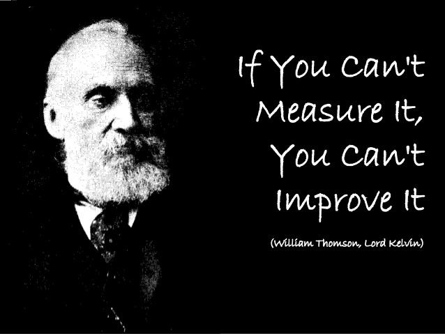

# 漫谈工程师的三观

工程师要有技术观，产品观和数据观。

（1）技术观

什么是正确的技术观？

我觉得首先是对各种技术不排斥，兼容并蓄。初入行的工程师往往会陷入对某种技术的深深的迷恋而不能自拔，以至于一旦有不同的声音出现，就会使出吃奶的智商为自己的真爱辩解。这种单纯和幼稚几乎是每个工程师成长的必经之路，就像情窦初开的少年看上了隔壁班的小芳，就以为世上西子只此一人一样；等到见识到了更大的世界，读了更多的书籍，即便还深爱着小芳，也能欣赏环肥燕瘦了。

兼容并蓄意味着博采众家之长，用不同的工具解决不同的问题。

其次是对所用技术和所学技术的感觉和对未来趋势的把握。短期的技术趋势，就像上帝手中的色子，谁也摸不透。就好比两年前 angular 刚出道，让人耳目一新，势道之强有如嵩山派，beat ember，beat backbone，大有在前端一统五岳剑派的趋势；不料半路杀出个如令狐冲般的 react，招式新奇，一下子把所有的注意又都吸引走了。如果你看前端最近两三年的发展，都是一个技术还没把王座捂热，新的技术就杀过来了，颇有五代十国的乱局。然而，有一个大的趋势是不可逆的：那就是从构建上来看，自动化的程度越来越高，越来越利于构建复杂的大型系统；从系统组织的角度看，模块化的程度越来越高，也是越来越利于构建复杂的大型系统；从开发效率的角度看，各种 debugger 技术，source map，live reloading，compile to javascript，也是越来越利于构建复杂的大型系统。所以前端的大的趋势是向后端的开发能力靠拢，以便能够构建更加复杂的系统。抓住了这个主线，你就能够理解这些发展趋势了：

* 更好的依赖管理工具（dependency tool）：bower -> browserify
* 更好的编译（compile）和打包（packaging）工具：uglify + make / jake -> google closure -> webpack
* 更好的任务管理工具：make / jake -> grunt/gulp
* 更好的开发工具：? -> webpack live reloading -> time travelling debugger (elm)
* 更成熟的语言：es3 -> es5 -> es6 -> es7 -> ??
* 更适合复杂的前端项目（static typing）或者更适合某种特定目标（如游戏开发）：es5/es6 -> dart, typescript, purescript (haskell), elm (haskell), cojurescript (clojure)
* 更好的性能分析（profile）工具： 手工 profile -> google chrome profiling tool -> ??
* 更好的事后分析（postmortem，比如内存泄露，系统崩溃）工具：没法分析 -> google chrome profiling tool / heapdump / mdb (solaris)-> ??

后端虽然没有前端那么乱（毕竟发展了几十年，前端缺的后端都已经比较成熟），变化那么迅速，但也有几条变化的主线：

* 摩尔定律终结：scale up -> scale out（high scalable）；C10K -> C10M（high concurrency）
* 计算的单元越来越小：Bare metal -> VM -> container -> ?
* 计算的容量越来越大：single machine -> cluster -> computing pool (mesos/yarn)
* 需要分析的数据越来越多：hadoop -> spark / flink
* 网络的速度越来越快，吞吐量越来越大：10M -> 100M -> 1G -> 10G -> 100G
* 人工智能/机器学习的门槛越来越低：Caffle -> TensorFlow；apache mahout -> PredictionIO

后端所有的变化一直遵循计算机发展的定律：那就是旧时王谢堂前燕，飞入寻常百姓家。MS 的梦想是每个卧室都能摆上一台计算机；Sun 的梦想是每个家庭的计算机都能联网；facebook 的梦想是连接每台计算机背后的人。这些梦想实现的过程中，复杂的软件不断被更简单，易操作的 UI 来组织；同样的复杂的技术也不断被更清晰，好用的 API 暴露出来。十年前，做一个企业级的 B/S 系统需要一个连的工程师，如今，五个手指以内的工程师就可以攻克；十年前，工程师是工程师，架构师是架构师，而如今，越来越多的软件项目与其说是个工程项目，不如说是个集成项目，工程师的工作更像是架构师：是挑选合适的供应商（第三方系统，开源或不开源），然后将其有机组合起来，发挥最大的威力。

（2）产品观

工程师有了技术观还远远不够，产品观是接下来需要着力培养的。

产品观最基本的是掌握产品常识（common sense）或者惯例（convention）。我们需要平时注意观察产品中存在的那些常识和惯例，用工程师特有的思维去思考为什么会出现这样的常识和惯例，他们有什么好处？有什么坏处？这样才能正确地处理产品需求，不至于在产品开发中产生让人贻笑大方的问题甚至出现致命缺陷。

比如说每个在线的系统都有密码重置的功能 —— 我们看看，密码重置的惯例是什么？

* 用户发送密码重置请求后，系统给请求的邮箱发一个重置邮件
* 重置邮件里有个会在指定时间内过期的一次性链接，用户点击后进入到密码重置页面
* 用户设置密码后，可以用新密码登录

这个惯例基本上是易用性和安全的结合体。这里面的几个步骤之间的联系是脆弱的，所有的步骤一起构成了一个 transaction，用户可能在这个 transaction 的任何一步终止行为：重置邮件可能没法送成功或者用户不收邮件，用户可能不点重置的链接，用户可能点了重置的链接却不设置密码等等。工程师处理 transaction 是有心得的：一个 transaction 要么全部做完，要么回滚到之前的状态，绝不能停留在中间状态；如果回滚是个困难的操作，那么，只有在整个 transaction 完成的那一刻，才一次性（atom）改变系统的状态。密码重置采用了第二个策略。此外，一次性链接，指定时间内过期，这些都是安全上的考量：用户可能在网吧登录邮箱，有可能在历史记录中留存了这个链接，所以需要最小化链接被泄露的影响。

然而，这样一个简单的功能，有人会把它做成这样：

* 用户发送密码重置请求后，系统给请求的邮箱对应的账号设置一个随机密码，并发一个邮件告知随机密码
* 用户使用这个随机密码登录

即便产品经理脑洞大开，通过标新立异来简化用户的操作，但工程师如果平日里累积了足够的产品常识也不该照盘全收，因为这里面安全性会出现很大的问题：邮件没有发出去怎么办？用户 A 不小心输入了用户 B 的邮箱怎么办？某个 hacker 批量重置别人的密码怎么办？只要用户不按照产品的意图去行事，产品就会处在一个错误的中间状态，这样的产品是脆弱的。

有产品观的工程师对于产品在技术上可能存在的问题会有敏锐的直觉，而且他们坚信：技术是为产品服务的，不是为产品经理服务的。

如果说掌握产品的常识和惯例是产品观的基石，那么进阶的产品观是：

* 能够从一切可以学习的案例中学习其产品和功能设定的门道；
* 对于新产品，能够把握产品的需求，从用户的角度和技术的维度思考和构建产品的原型，并通过技术和非技术的手段考量产品的 product market fit；
* 对于已有产品的升级，知晓功能的轻重缓急 —— 起码能够厘清功能的技术优先级。

限于篇幅，这个话题就不展开谈了。

（3）数据观

数据是真实世界在产品上的一个投影（projection）。好的工程师同样也应该是对数据敏感的工程师。Learn startup 教给我们：build - measure - learn 的循环，这与其说是做产品的方法，不如说是我们学习万事万物的方法。

当我们把脑海中的蓝图构建出来之后，接下来最重要的一步就是测量（measure）。开尔文说：

所以数据观的第一步是知道测量什么。想要知道测量什么，需要知道某个产品最重要的 KPI 是什么。以我肤浅的认知举个例子（自己公司的例子不好举）。比如 facebook ads，其最核心的 KPI 应该是 impression（广告的展示），因为其收益是基于 impression 的。那 impression 就是最基础的测量数据。一个广告的 impression 是否达成，不能 facebook 一个人说了算，需要同时往第三方机构发送用于追踪的 pixel。所以 pixel 也是一个关键的测量数据。从 impression 往回推，是 AO（ad opportunity，广告机会）。facebook 在每个 timeline 里面会计算出各种各样的 AO：假设 每个人的 timeline 里每隔 8-12 个 feed 就出现一个 AO，但当前 facebook 的广告库存里只有定向发送给30-40岁的受过高等教育的高收入男性的广告，所以一个刚毕业的学生的 timeline 里是不会有广告的，这时候这个 AO 就是 Empty AO（空置的广告机会），它不会产生收入。空置的广告机会也可以用来插入产品自己的广告（in-house ads），帮助宣传自己的产品，或者促进自己产品的增长，比如下面我截的几个图，第一个就是 in-house ads impression，后两个是有收入的 impression：

这样看，除了 impression，pixel 外，AO，Empty AO，In-house ads，也都是要测量的对象。那么，这些 AO 从何而来？再往上推就是 DAU/MAU。因为按照 facebook 的商业模式，更多的日活/月活会带来更多的 AO，更多的 AO 带来更多的 impression。

以上是从用户的维度看如何测量。

从广告商的维度看，需要测量广告的库存，库存消耗的速度，以及库存增加的速度。因为 AO 再多，如果没有库存也没有意义；另外，如果库存充沛，但库存消耗得很慢，也不太好。

测量只是第一步，接下来是分析和解读数据。分析和解读数据的能力是工程师的数据观的重要组成部分。同样的数据，在不同人眼中，着重点不同，得出的结论可能大相径庭。这个不展开讨论。

分析和解读之后学到的东西需要进一步 build 回产品中，由此，技术，产品，以及数据，形成了一个有机的整体。

嗯，就写这么多，碎觉去。
