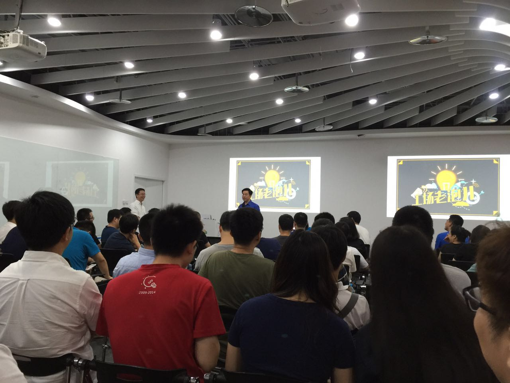
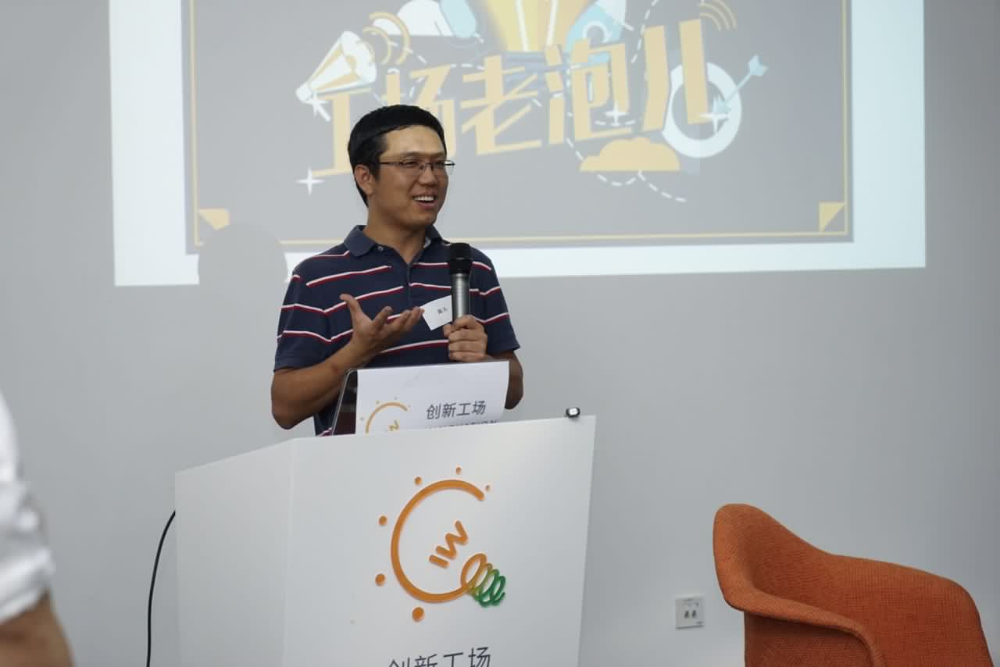
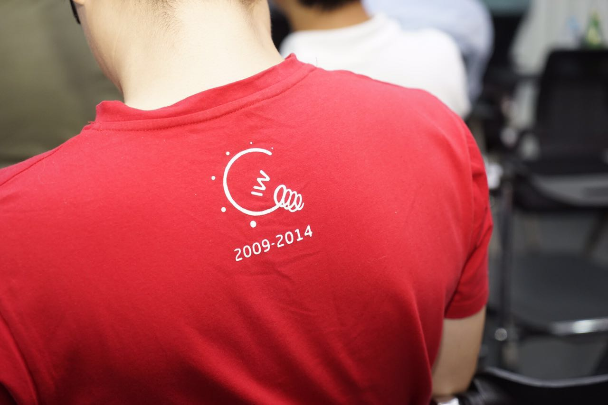
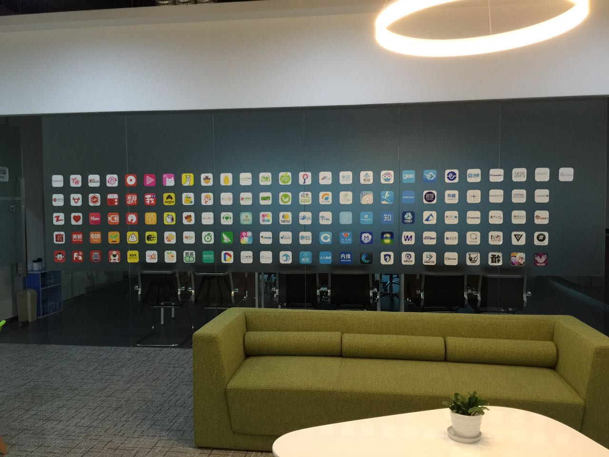
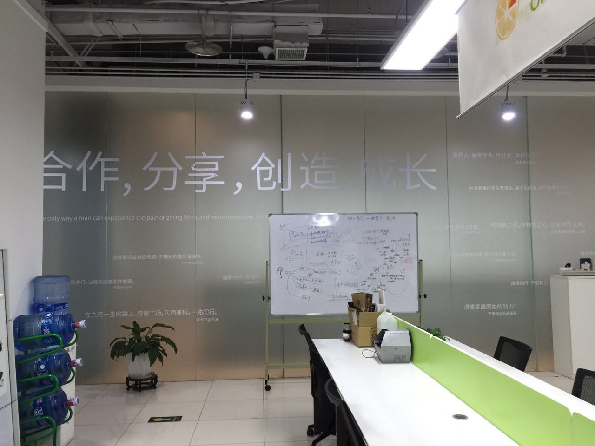

# 老兵不死

当我看到金鱼（前工场HR）发过来的 7/30 举办的创新工场老炮儿的活动时，已是北京时间周三。活动的时间是下午四点，正巧是我航班抵京后两小时，算算肯定能赶得上，我连忙填好了申请表，然后惴惴不安地等待申请结果。工场似乎很久没有举办类似把散落在各地的老炮儿们聚集在一起的活动，想必申请人数众多，虽然报名表上说优先清华科技园时代（2009-2010）和第三极时代（2011-2012）的创业者，但一百人左右的名额限制，很容易把我这样较晚加入的孩子划了去。

我对这个活动无比期待，除了能见一见那些至少两年未见的朋友们之外，还有一个小小的私心：我想当面向开复（还有他的秘书 Sherry）致谢，感谢他在 O1 签证上给予我的巨大支持。平日里以这样一个牵强的名义想找到他很不容易，一来他的日程非常紧张，二来我想他并不需要这种虚无的感激，花去的十分钟如若花在工场投资的团队上，价值高得多。

还好，我的申请在周四通过了。那时起，我的心已经飘到了北京。在飞机上，翻着微信联系人，看着一个个熟悉的名字，回想之前见面的场景，就这样陪我度过了旅途中无聊的一半时间（另一半和妻女语音图片文字聊天）。十二个小时，我几乎片刻未眠，想着往事，构思着我的发言。

飞机晚点了近半个小时，又赶上了过关的人潮。当我拖着行李于三点四十走出机场时，接机的两位朋友已等候多时，我很愧疚她们费事接我，却只能把我送去鼎好（创新工场所在地），而无法一起吃饭叙旧唠个十块钱的。但当时已经顾不了那么多，甫一见面，我们立刻奔向中关村。

北京的天闷热潮湿，跟湾区是两个世界。我常自嘲我每日奔波于盛夏（南湾）和初冬（旧金山）之间，因为在南湾短衣短裤已是标配，而同一天的旧金山的清晨，到处可见身着羽绒服的男女老幼。而这次回国，给我的感受是来到了赤道。南湾的热是新疆内蒙的那种热法：像开着锅炒拉条子，阳光覆盖之处，酷热难当，然而你只消远离阳光，比如躲在树荫下，便立刻舒爽。北京的热是广东海南的热法，像是盖着锅盖炖肉，到处是火辣辣的蒸汽，让你周身每个毛孔都饱含着的水分，蒸了起来，又给捂回去，所以你无处遁形。坐了十二个小时的飞机，再这样酸爽地和衣蒸个桑拿，我的脑袋已经被折腾得分不清东南西北。一路机场高速加北四环，看着窗外的景色，我竟然说不出北京的变化。出国这两年光阴，对北京这个我十多年来一直看着它成长的第二故乡来说，好像荷叶上泻过的水，留不下一点痕迹。

拽着行李抵达工场已是四点四十，我错过了开复和肇辉（前工场二厂长）的精彩讲话，以及好几位工友的分享。Tina（工场 COO）在群里喊我，因为没网我浑然不知。到了希望树会议室，炬强在做分享，时不时引来阵阵欢笑，台上的肇辉和开复看到了我，跟我点头致意，林律师（创新工场总法务官，运营合伙人）也发现了我，把我拽到她身旁的座。

跟林律师闲聊几句，我想集中精力听工友的分享，却发现大脑已经被炖成一锅浆糊，混混沌沌不知道听进来什么。突然肇辉点了我的名，我才懵懂起身，呀，到我发言了！

肇辉给我戴了顶高帽子，打趣说我为了这次的活动，不远万里，从硅谷赶回。上台后我却发现，我的讲稿，我的记忆，还在美美地以葛优躺的姿势浸在桑拿浴中，放空着。我拼命地从思绪中拽出线索，还没等打上结，便又松散了。情急之下，我清了清喉咙，开口第一句话就「犯浑」了：大家好，感谢工场组织的这次活动，真没想到我两年内第一次回国就给赶上了。

说完大家哄笑，肇辉更是带头起哄。我这是直接把肇辉戴的高帽扔下来，还给踩了两脚，太不给人面子。这我要是混媒体圈的话，一定没朋友。

笑过之后，我的浆糊脑袋突然清醒了些许。这时候空气里蠕动着我该说的情话，似乎都从八面涌来，扑凑向我嘴边。

确是情话，感恩的情话。为开复，为工场。

我能够回到创业圈子里，开复给予了我很大的帮助。我在 xxx 曾经提到开复给我的推荐信的事情，也在知乎的一个问题里，看到一些为了黑而黑的人的答案后，愤而做答：

> 不管开复成功与否，不管别人眼中他是什么样的人，对我而言，他是个良师益友。我和开复老师交集仅限于创新工场，作为途客圈的 founder，我们的交流多在公司层面，私底下的交流并不算多。在 2013年途客圈被收购后，我离开了创业的圈子，回到 Juniper 蛰伏，而后又到了美国。2015年我被一家旧金山的 startup adRise / Tubi TV 看中，要帮我办理 O1 签证， 以便我换工作。办理 O1 需要几封重量级的推荐信，当时我和开复老师两年多没有联系，忐忑发邮件询问他是否能够帮忙，他二话没说，签得很爽快。这份推荐信是我拿到 O1 的一个重要砝码，而O1对我的身份问题无比重要，因为我可以有很大机会走 EB1A（今年我成功办下了 EB1A），不用苦苦等待排期。
>
> 看一个人是否表里不一，沽名钓誉，要看他对身边的人的态度。同样是推荐信，我拿给我为之服务了四五年的Juniper 的某前VP，请他帮忙签署，他答应地爽快，却在拖了我近一个月之后生生拒绝了。你可以不喜欢开复的微博，不喜欢他的书，甚至抹黑他的一切经历，然而，他在你身边时，真的就是一个良师益友，没有架子，没有空话，真心为你排忧解难。

我不知道开复有多少这样的「举手之劳」帮助了多少年轻人，改变了多少人的命运，然而，途客圈的经历，L1 赴美，O1 进入创业公司，是我人生迄今为止，最重要的三个转折点。这三个转折点的两个，和开复直接相关。

如果说推荐信只是让我个人得到了帮助的话，那么创新工场，微软亚研，谷歌中国则改变了很多年轻人的人生轨迹。我一个朋友曾经跟我谈起他去 facebook 的轶事。他在谷歌中国实习的时候，有次开复跟大家介绍了当时还名不见经传的一家小公司，facebook，并预言它将会是一个巨大的成功。他原话大概是这样：

> Google有个传统，叫TGIF（Thank God It's Friday），周五的下午三四点钟，大伙聚在一起，喝酒聊天，总结一周来发生的事情。这传统到了中国行不太通，因为周五下午，为避免被一周内最恐怖的晚高峰堵在路上，大多数同事都会提前离开，开复在TGIF上只能面对寥寥数人，于是他干脆把TGIF变作TGIT（Thank God It's Thursday），周四下午开。有天在TGIT上，开复突然提到了Facebook，说Google若有一天完蛋，干掉她的不是IBM，不是Microsoft，而是Facebook。
>
> 那是孤陋寡闻的我第一次听到Facebook。当时Facebook还能在国内访问，看了以后虽觉得这是个很有意思的网站，但似乎并无开复所言那么神奇。当时的Facebook的网站，newsfeed还没有呢，就是个人页面的展示。
>
> 不过既然开复这么说了，我便上了心。而且，眼前的 Facebook，不正是我所希翼的时光倒流么（PS：他想时光倒流回到 google 创立的初期）？可惜，Facebook并不在中国招人，当时想去Facebook只有一条路，那就是赴美留学。

微软亚研也有不少例子，我就不一一举例。

如果微软亚研，谷歌中国我是道听途说，那么创新工场我是亲身经历，亲自体会的。远的不说，就说说当时途客圈助跑计划/加速计划遇到的人和事：

焕德，前腾讯员工，助跑计划创立邻伴（LBS聊天），后去豌豆荚，现在在深圳有家小基金，他的理想是打造一个「像创新工场一样的孵化器，帮助创业者成长」。

劲伯，助跑计划创立摩卡图（视觉/摄影专业人士的交易中心），后来和同为助跑项目的茄子茄子（群组相册）一起开办了面向海外市场的游戏公司，二十多个人的团队，同时运作三款游戏。

马力，前 IBM 员工，设计过点心操作系统，豌豆荚，后来创立最美应用，向用户推荐小而美的精品软件。

天放，前微软和 Palantir 工程师，回国后加入创新工场，先后做了计划FM和课程格子。他两年前的一篇知乎文章：「我眼中的创新工场」，是我迷茫其时不时翻看的文章。

徐磊，创立了同方微电子，在硬件领域耕耘了九年，加入工场做了 O2O 项目布丁，打造了一批「布丁系」的 app 和创业公司，微车是其中之一。目前布丁是工场内部几个「黄埔军校」之一（还有豌豆荚等），培养了一大批创业人才。

知乎，豌豆荚这样大家比较熟悉的就不提。

而途客圈，虽然失败了，可这份经历让苏东从曾经的华为销售经理转型为投资人（目前是华登国际投资总监，投智能硬件方向）；让 Kent 从曾经的 GTA 客户经理转型为连续创业者，途客圈之后创立了青橙科技（用互联网重新定义健身，目前发展的非常棒）；让鸿儒从一名医师转型为互联网的从业者；...；让我从一个外企的网络研发工程师成长为一家硅谷创业公司 tubitv.com 的 VP，并通过自己微薄的努力，影响更多的人。

也许所有这些人，包括我，如果不离开之前的岗位，数年下来，小日子也依旧滋润，但从对他人的影响力，对社会的一些小的贡献（起码解决一些就业）而言，现在的我们，无疑是更胜一筹的。

弹指一挥间，创新工场已经成立了 7 年。

这七年，工场也从一个早期孵化机构成为一支投资非常多元化，涵盖人民币基金，美元基金，并且其旗下的孵化器部分在新三板上市了。几年前门口一块不大的 logo 墙，已经被一面超大的墙壁所取代：

7年前如果有人放弃良好稳定的前程说要创业，或者加入一家创业公司，周围的人必定会掉了下巴，一副日了狗了的表情。就算之后创业环境不错的 2011 年，我离开 Juniper 要创业的时候，周遭的人也不少惊讶道：你太（xiang）勇（qing）敢（chu）了（ah）！

而如今，我们这一批人都老了，或者委婉地说，更成熟了。「老」对创业者而言是个半褒半贬，它可以指世事洞悉，人情练达，姜还是老的辣；也同时意味着思想僵化，激情不在，体力下降，还 TM 倚老卖老。对于我们这些「老人」而言，需要警惕后者，而发扬前者。让我欣慰的是，我们这群「老人」们把从工场里学到的，在创业中悟到的，传播给了更多的人，是所谓 pay it forward。台上陆陆续续发言的小伙伴们用他们的经历也佐证着这一点。

我曾在「当勤勉追上时间的脚步」一文中曾经这么写道：

> 我如此痴迷于克神，上届杯赛突然成为他的死粉，看上的就是这种勤勉，这种「老兵不死」的气魄。有时候想想，这和自己的年龄有很大关系。身前的70后已经渐渐功遂身退，身后的90后则开始咄咄逼人。就整个社会群体而言，上一代的差距就决定了这一代天赋上的差距 —— 如果生活品质，视野等也算决定天赋的一部分的话。50后在黄金岁月被文革糟蹋，赶上改革开放的时候已经牵绊颇多，而60后正好赶上恢复高考，改革开放时风华正茂，了无牵挂。所以他们的孩子，80后和90后起跑线的位置 —— 或者我们就拿天赋说事 —— 大大不同。在途客圈，我常常感慨于团队里几个90前90后的巨大能量 —— 他们仅仅大学毕业，却已经可以在各自的领域为一家创业公司独当一面。有时候我把他们拉到一旁，说：「等你们到了我这个年龄，一定会有远远超过我的成就」，既在为他们感到骄傲，也在为自己暗自鼓劲：「再不努力，就真被他们远远地甩开了」。
>
> 所以像克神这样的人突然就成了自己的一座丰碑，一个图腾。没有天赋，还有勤勉；没有机会，还有时间。只要愿意，30多岁的人还是可以像20多岁的人一样努力，默默守护着自己的尊严，默默等待着属于自己的机会。

麦克阿瑟在被解职后的告别演讲中说：soldiers never die, they just fade away。然而，在工场的老炮儿活动中，我看到的是：soliders never die, and they continue paying it forward。
