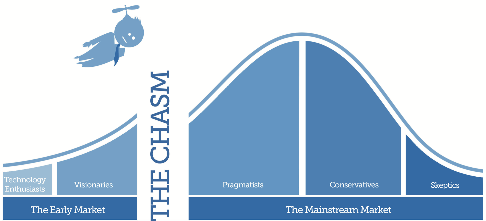

# 那堵叹息的墙壁

（1）

> pain is inevitable. Suffering is optional.
> － 无名氏

很久没有认认真真跑步了。从国内回来后，肚腩大了一圈。痛定思痛后，连续两周跑了半马。搁去年，不吃不喝跑 20+ 并非难事，它仅仅是绕着风景优美的 lake Elizabeth（湾区 fremont 的一个小湖）的 2 miles 长的环形跑道没心没肺地跑上 7 圈而已。但今年，年龄的增长，身体的发福，混乱的作息把我带入了一个 Professor Tal（Harvard Positive Psychology 的讲师）所谓的 downward spiral。身体素质一圈圈悄然下滑，终于在近期达到谷底：我成功地把我跑马的撞墙期从 30+ 提前到了 17km。。。

跑过马拉松的人，或者正在为马拉松训练的人都体验过那种「撞墙」的感觉：跑着跑着，突然体力不支，肌肉没力，腿脚发软，就像鬼压床一样，脑子拼命扑腾，可手脚却和大脑不在一个频道，根本不听使唤。你真真切切感觉到自己的配速断崖式下降，却不知如何是好。如果不是守着一个信念，提着一口气咬紧牙憋漏风，用意念控制自己的身体憋停步，大抵会拜倒在那堵叹息的石榴墙下面。

撞墙期的天人交战是件很痛苦，同时又很有意思的事情。村上春树将之形容成「觉得自己像块在绞肉机里艰难移动的牛肉」，可见其痛苦；偏偏他又为这痛苦调了一份鸡汤：pain is inevitable. Suffering is optional。身体遇上撞墙期，脑子里不免浮现两个声音：一份宛若志玲阿姨那温柔妩媚的腔调凑在你耳边猛灌迷魂汤：「前方5米到达目的地哦」；另一份则坚毅而激情万丈，声如洪钟，堪比朝鲜的CCTV：「士不可以不弘毅，任重而道远，请为了世界和平再坚持 17 km」。作为一个非党员非干部，在撞墙期身子里无比渴求「血糖」，而非「血性」的时期，能把温柔的「糖衣炮弹」扔在地上，踩三脚，淬两口吐沫，着实需要勇气。

之所以说它有意思，是它给你提供了一种人类其它任何活动都无法持续且温和地提供的体验：那种把自己逼到了某个极限的感觉。注意这里说无法「持续且温和」地体验，而非无法体验。其它把自己逼到极限的体验大多无法持续：你不能天天啃迷幻蘑菇，也不可能没事就去高空跳伞，更不要说不作准备攀登高海拔山峰。而跑步是可以每天为之的行为，只要你愿意，只需花上三五个小时，慢慢把身体里富余的能量一点点榨干，跑到撞墙，就可以感受到这个极限。这个极限既不会让你飘飘欲仙（啃迷幻蘑菇），也不会让你游离在三界五行外（高空跳伞），而是给你一种我来我见我征服的可能。跑到撞墙后，身体开始背叛心灵，你靠着强大的毅力，强压下这股背叛的力量，像个机器人一样麻木地迈着步子，剩多远跑多远。最终在背叛和反背叛的激烈角力下，那个奇特而神秘的「量变到质变」的哲学断言突然发生，整个人像红警中升了级的 tanya，老态龙钟的步子突然换做了凌波微步。

你看龙珠里的悟空，在去那美克星的路上一次次把自己折磨得濒死，度过那一关之后武力就升了一个档次。一样的道理。

（2）

> 人生有两出悲剧。一是万念俱灰；另一是踌躇满志。
> 萧伯纳

撞墙这事不止在长时间的跑步时会出现，任何时间稍微长久的社会实践中都会出现。情侣间在热恋期你侬我侬山盟海誓说明不了任何问题，恋上三个月，出去旅个游，你就会发现不喜欢她对人和事的挑剔，她也不待见你那程序员特有的接近绝对零度的冷幽默，你们的关系开始撞墙；就算熬到了结婚 —— 过来人都知道，结了婚之后还有七年之痒呢。痒只是撞墙的一种表现而已，能不能安然越过这墙，还得靠双方在共同目标之下的努力和包容。工作也常常有「撞墙期」。一份新鲜的工作就像一个热恋的对象，双方在相识的初期都把最好的学识和吃相展现给对方。然而呆久了，往往在将近一年的时候，公司的一切就显得那么的不顺眼，原先怎么看怎么都像回眸一笑百媚生的秋香，现在卸下浓妆，去了美颜，活脱脱一扣着鼻屎的如花：某某同事看上去像个白痴，某某老板就是腊鸡；公司的代码像一坨屎，自己每天的工作就如同跟粪坑里的苍蝇打交道。

这便是职业生涯中的墙。它并不像跑步中的墙那样明显，同样的，也不像跑步中那样你有明确的目标和充足的动力破墙而出。跑步时，无论是半码，全马，超级马，你的目标细化成一个数字，撞墙时，你可以清楚地计算出来你离目标有多远，这又是一个数字。你可以进一步把这个数字打碎成若干个小一些的数字，比如离终点还有 17km，那么只需要坚持 17 个 1km 即可。你用毅力和身体交战，每趟过 1km，你给予自己一个小小的鼓励，甚至和路边的 ``/(美女|帅哥)*/`` 志愿者击个掌，精神文明和物质文明就齐活了。这就是为何跑步中的男女汉子撞墙后还能战胜自己 —— 他们有个 SMART 的目标。

但职业生涯，或者说工作中的墙是不同的。你开始可能被一个高尚有吸引力的愿景所吸引，于是踌躇满志，恨不得自己就是扶摇直上九万里的大鹏；后来障碍丛生，热情消退，愿景不再有吸引力，此时此刻，你很难说出做这份工作你的除了金钱以外的目标是什么。你开始万念俱灰，黯然离开。工作不满一年主动离职者，基本都处在这个状态。

这是个非常有害的状态。在我过去一年的经历中，看到了很多过去三五年做过超过三五份工作的简历。这些简历让人扼腕。很明显，简历的主人们一次次撞墙，然后一次次退缩。Professor Randy Pausch 说：The brick walls are not there to keep us out; the brick walls are there to give us a chance to show how badly we want something.

问题是：这个 something 是个什么鬼？或者根据提些，在我当前无趣的工作中，我 "badly want" 的 something 究竟是什么？

唯有回答清楚了这个问题，才谈得上跨越工作上的，或者说职业生涯中的墙。这个 something 可以是某个 title，可以是某个项目的完结，可以是财富上的收益。我们需要像跑步过程中那样，把问题具体化，目标化，然后分而治之。如此这般，我们便可以欣赏到墙那边的风景 —— 这风景可能由少数人独占，因为大多数人被挡在了墙的那一侧，他们无法跨出这一步。

​最近公号里有不少想创业的年轻人，他们问我该不该在这个凛冬将至的时间节点创业。我说你先不要去创业，先跑一个月步，以半马为底线，全马为目标，找找撞墙的感觉，看自己能不能挺过去。如果不能，那么凭什么认为自己能在「冬天」成为「凌寒独自开」的傲梅呢？还是先老老实实在大公司里磨砺心智吧。
