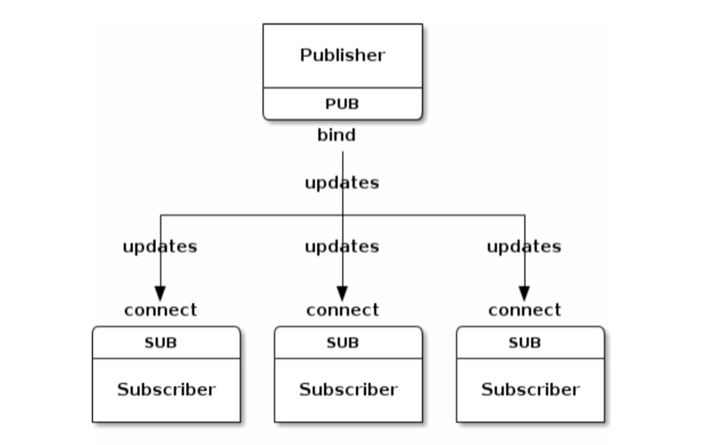
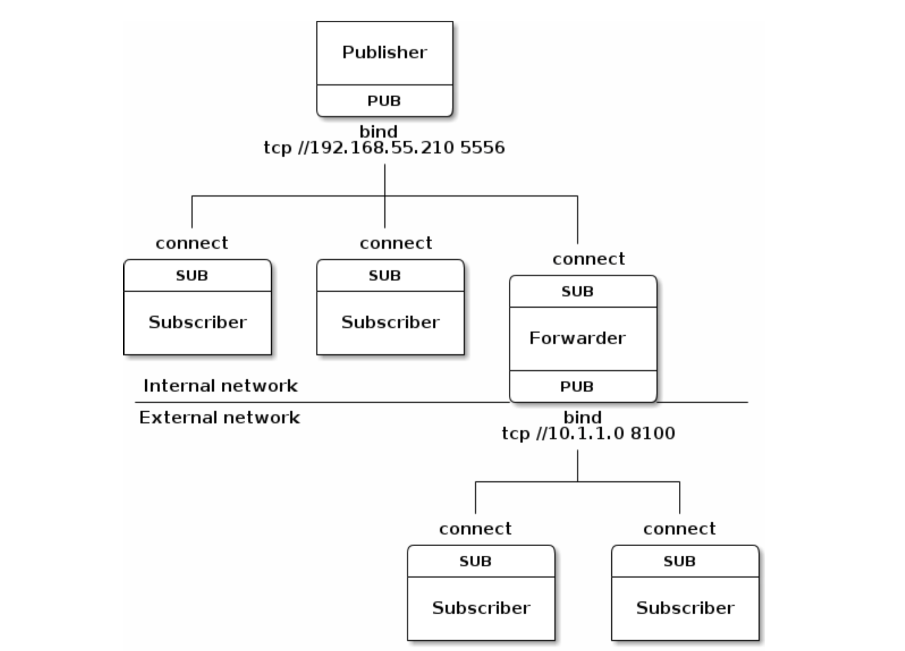
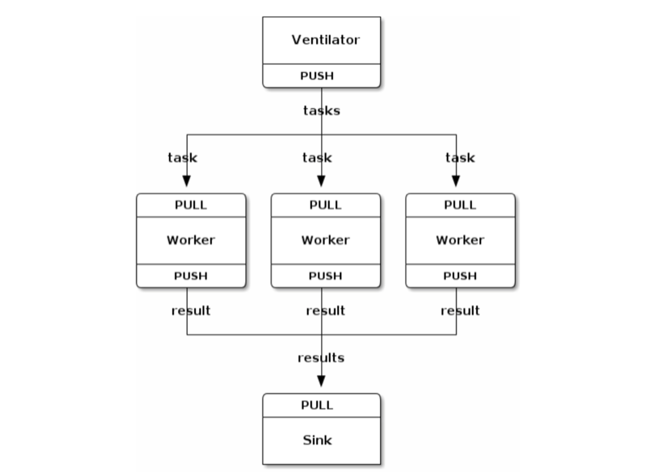
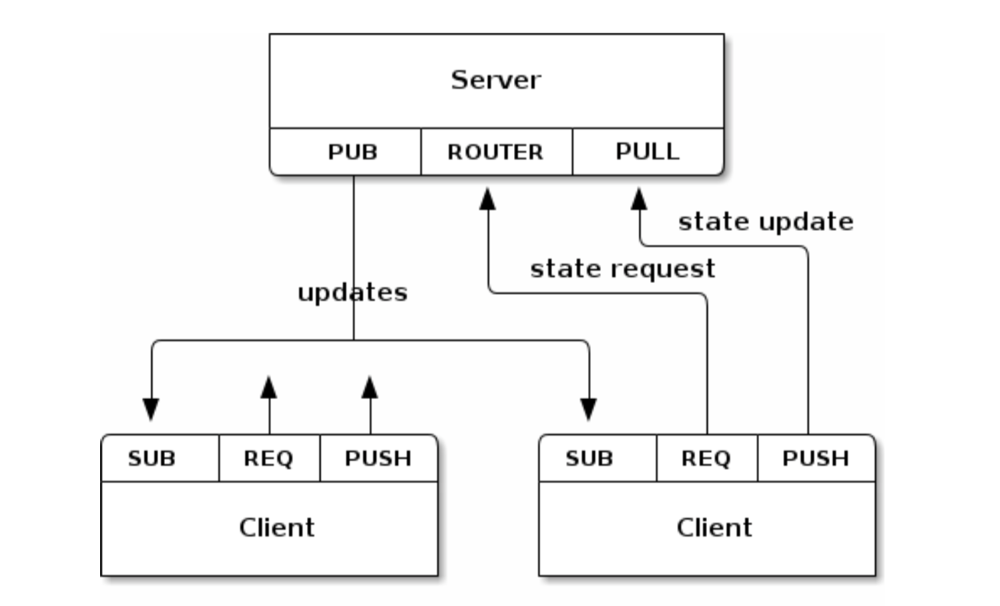

# 0MQ 的世界

刚刚这个国庆，对程序员来说，最糟心的事情莫过于 ZeroMQ 的作者 Pieter Hintjens 的安乐死。想必你的朋友圈也传过了那篇令人感怀的 A protocal for dying。如果你还没看，翻翻朋友圈，仔细读一读，然后收藏起来，一两年后再看上一看。可敬的 Pieter，临终前的 last words，也不放过自己搞 messaging 的本行，借用了 Alice 和 Bob（https://en.wikipedia.org/wiki/Alice_and_Bob ）调侃了一番。

我对 Pieter 其实并不了解太多，和他之间的唯一桥梁就是 ZeroMQ。平心而论，ZeroMQ 是个很出色的，broker-less（相对于 RabbitMQ，Kafka 这样的 broker）的 messaging lib（注意不是 message queue，ZeroMQ的名字有些误导），API 很友好（socket），效率很高（Pull/Push 100 Byte 的message，~2M/s，见 https://github.com/zeromq/jeromq/wiki/Performance ），可伸缩性很强（Pub/Sub 下可以有 10k 的 subscriber），然而它也有其显著的缺点：令人诟病的 zmq_ctx，以及其设计上有缺陷的Concurrency model（http://zeromq.org/whitepapers:architecture ）。当然，我写这篇文章并非为了褒扬或者贬低 ZeroMQ，也不是要普及 ZeroMQ，给大家做个入门（ZeroMQ 入门比较简单），而是想谈谈 ZeroMQ 里面那些宝贵的通讯系统设计的思想，或者说模式，这些模式曾经对我的影响还是不小的。

## 基础知识

在讲一些思想之前，我们需要先了解一些概念。

一个 messaging system 最重要的事情莫过于消息送达的模式：**at least once** 或者 **at most once**。at least once 是指同一个消息会被传输 1 到 n 次，而 at most once 是指同一个消息会被传输 0 到 1 次。这很好理解，如果 messaging system 内建了重传机制，并且将消息持久化到磁盘中以保证即便进程崩溃消息依旧能够送达，那么这就是 at least once。反之，如果没有构建任何上述的机制，消息送出后就并不理会，这是 at most once。很可惜，ZeroMQ 并非严格意义上的 at least once 或者 at most once，以其 Pub/Sub 模式来说，ZeroMQ 构建了消息确认和重传机制，却未对消息进行持久化，那么内存耗尽或者进程崩溃都会造成消息丢失，而重传则可能会造成消息被发送 1 到 n 次。这也是为何我认为 ZeroMQ 并非真正意义上的 Message Queue，当然，它可以用来构建一个真正的 MQ。注意，在一个网络环境中，消息的送达只能是上述两种情况，不可能 exactly once，如果有人这么说，那么一定是在误导。

讲到消息重传，细心的同学可能会疑虑：TCP 内建有重传机制，为何 ZeroMQ 在消息层面还要多此一举？这是因为 TCP 的重传只保证了网络层面报文的重传，而 ZeroMQ 通过消息层面的重传，保证了一个消息一旦送达，一定是**完整送达**。

at least once 的使用场景很容易理解，我们发送一条消息，自然是为了接受者能够**保证**接收到。至于保证接收的副作用 —— 重传的副本，只要消息的处理是幂等（Idempotent）的，就不会有问题。at most once 的使用场景让人比较困惑，什么时候我们发了一条消息，丢了也就丢了，并不可惜呢？比如说这些场景：

* 各种网络拓扑下的 heart beat（当然，大部分场合下 heart beat 可以直接用 IP/UDP，不必使用 messaging），偶尔丢几个消息无关痛痒
* 密集的 status report message 或者 tracking event。丢失的消息对全局并不构成威胁。

最后一个概念是 **back pressure**。但凡一个 messaging system 里，消息的两端，生产者和消费者间，都会产生处理速度不一致的问题。如果生产者发送消息的速度过快，消费者赶不及处理，就会造成消息的拥塞。如果生产者发送消息的速度过快，消费者赶不及处理，就会造成消息的拥塞，进而不断把压力回溯给上游，最终一层层回溯到消息的生产者，使其停止产生更多的内容。

## 消息通讯的模式

搞定了一些基础知识后，我们看 ZeroMQ 涉及到的一些消息通讯的模式。

### REQ/REP

REQ/REP 是最基本的模式。客户端发送数据请求服务器的响应。

### PUB/SUB

Pub/Sub 是消息传输非常常见也是非常有用的一种模式，它和 observer pattern 师出同门，将数据的发布者和订阅者解耦 —— 发布者者只管产生数据，而不必关心谁是订阅者，有多少订阅者。比如说你要建一个聊天室，每个人都是发布者，也都是订阅者。发布者不必关心订阅者的加入和离开，消息会以 1:N 的方式扩散到每个订阅者。

### PUB/SUB (forward proxy)

Pub/Sub 自身组合使用可以解决很多实际问题。比如你有很多数据要发布给内部应用和外部应用使用，而外部应用可以访问的数据是内部应用的一个子集。通过组合 Pub/Sub，让其中一个（或者多个）订阅者在收到数据后，过滤出想要对外发布的 topic（或者 channel），然后再重新发布出去，供外网的应用订阅。

### Push/Pull (map reduce)

Push/Pull 是消息传输的另一个重要的 pattern。Push/Pull 的特点是无论是 Push 端还是 Pull 端都可以做 server，bind 到某个地址等待对方访问。如果我们在 Push 端绑定地址，那么这是一个 Push server，对应的 Pull clients 可以 connect 到这个 Push server 往外拉数据；反之，如果我们建立一个 Pull server，对应的 Push clients 可以 connect 到这个 Pull server 往里压数据。由此，我们可以轻松实现一个 task 的 map reduce 的 framework。如上图所示，中间的 worker 可以随需增减。

如果我们更进一步，当所有的 task aggregate（reduce）完毕后，我们想终止所有的 worker，可以在这个系统里加上 Pub/Sub 的机制：sink 进行控制信息的发布，所有的 worker 订阅这个 channel，在收到 SIGTERM 后，结束自己的进程。

### Push/Pull (fair queue)

Push/Pull 模式的另外一个应用场景是 fair queue — Push clients 轮番往 Pull server 写入数据。

### Router/Dealer

Router/Dealer 模式是典型的 broker 模式。在多对多的网络中， 掮客起到在网络的两端双方互不认识的情况下，促成双方的交易。超市就是一个典型的掮客。顾客不必和所有的供应商一一打交道，每个供应商也不需要认识所有的顾客来促成交易 —— 整个交易在超市的促成下完成，双方几乎都不知道对方的存在。

多对多的网络中，Router/Dealer 模式很有用。假设我们有 N 个 Reply server，M 个 Request client，若要保证高可用性，正常而言，双方需要一个 M x N 的 full mesh 的网络才能保证任何一个 client 能够和任何一个 server 建立连接。通过在中间加一层 Router/Dealer，M x N 的连接被简化成 M + N。网络的复杂度大大降低。

### 综合

结合 Pub/Sub，Router/Dealer，Pull/Push等模式，我们可以很容易支撑非常复杂的网络应用，如上图所示。

先讲这么多，对此感兴趣的同学可以看 ZeroMQ 的官方 guide，Pieter 亲自操刀撰写的，非常赞，即使你不打算在你的应用中使用 ZeroMQ，但读读这个文档也是非常有益的。

