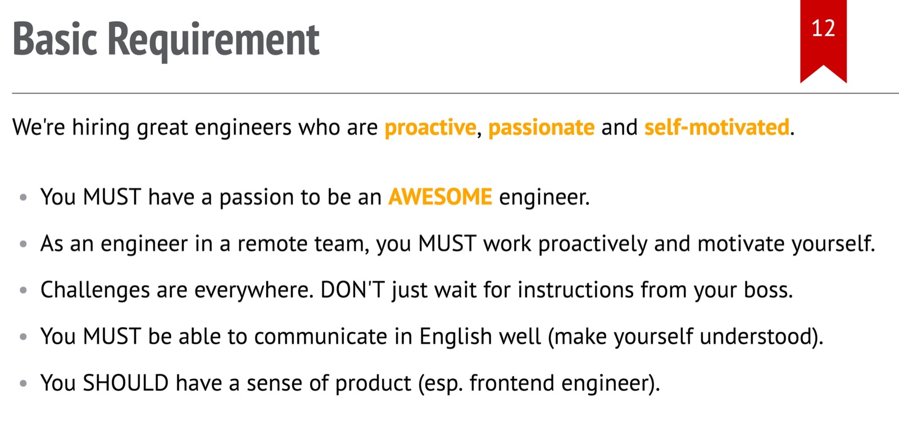
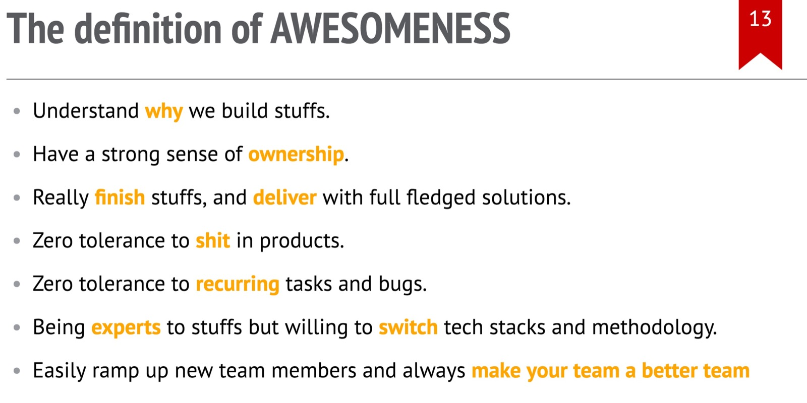

# 程序员字典：「牛逼」

我曾经发过的 TubiTV 中国团队的招聘贴，基本要求这一页我是这么写的：

作为一个已经命中注定和代码打大半辈子交道的程序员，我们职业生涯的「小」目标大多是 **成为一个牛逼（awesome）的工程师**。虽然不是每个人都能像 Linus Tolvalds，Bill Joy，Joe Armstrong 等先贤那样伟大，在人类历史的长河里留下不可磨灭的贡献，但下一个 Linus 必然从你我当中诞生。

那么，如何定义 awesome（牛逼）呢？或者说，如何成为一个人见人爱，花见花开，HR 见就想抱大腿的程序员呢？我们知道，「牛逼」可以通过结果来量化，但是一步步逼近牛逼的过程是无法量化的 —— 正如程序员的绩效不该用写了多少行代码，发了多少 PR 来衡量。这些 metrics 某种程度上可以定义勤劳程度，但无法定义优秀。

程序君陷入了深深的沉思，一边思着，一边想静静。

在经历了若干天有一搭没一搭的思考，和无数稿修订后，我确定了下面一些要点。正如一千个人眼里有一千个哈姆莱特一样，我的定义也许并不能服众，但它某种程度上表达了我的态度。

微信朋友张麻子给我发信息说：你给解释解释，什么 TMD 叫惊喜，阿不，awesomeness。

程序君又陷入了深深的沉思，思到一夜白头，比伍子胥还伍子胥。来，我们一条条撸。

## Understand why we build stuffs

程序员是天然的创造者，我们每天要么在创造新的东西，要么在创造新东西的路上。然而，不是所有人都知道我们为何要创造某个东西，或者说不知道自己创造的东西的价值和意义所在。 Simon Sneak 在他著名的演讲中说 great leaders start with why。在如今这样一个高度竞争的时代，用户不会单纯为了产品提供的功能而购买产品，而是会购买有同样功能但是被赋予了某种能与之产生共鸣的意义的产品。

同样的，程序员也需要寻找这样的意义。我们开启一个新的项目，写了一晚上代码而乐此不疲，意义也许是为了学习和熟练掌握某种数据结构或者方法论；花上一天解决一个折磨人的大 bug，意义也许是把一群因为这个 bug 而对产品无比愤怒的用户转化成对产品重拾信心的用户；用了一个月发布的功能，意义也许是让公司的业绩增加 10% 或者支出降低 5%。

当我们了解了我们所做事情的意义后，我们往往更加充满斗志，更加愿意投入 blood，toil，tears and sweat。事实上，如果你仔细回味，**人的一生，值得铭记的事情往往和 blood，toil，tears and sweat 相关。很多时候，我们一事无成，并非我们无能，而是没有找到一件有意义的，能让自己愿意毫无保留地挥洒热血的事情。**

有时候意义并非那样显而易见。就像你为微信贡献代码，让数亿人的生活变得更好，想想都会热血沸腾；但你为手头上可能都没有多少用户，或者都不知道用户在哪里的项目干活，价值何在？意义何在？

聪明的程序员会主动去寻找这种意义。他们会主动向老板，老板的老板，或者老板的老板的老板寻求，直到找到为止；如果老板恰巧是自己，则需要回归做这事情的初心。

程序君曰：great programmers start with why。

## Have a strong sense of ownership

主人翁意识（sense of ownership）是鸡汤学中的核心组成部分。这一点我无需过多解释。如果你为人父母，对此的体会尤为深刻。我们的代码（或者产品）就如同我们的孩子，需要精心呵护和培育。

很多读者也许还没有养育孩子的经历。我举个自己的例子。最近我开始带大女儿学溜冰，周六早上上课晚上练习。

女儿是个被 disney 荼毒的主儿，尤其被 frozen 成功洗脑，对冰雪的热爱程度远胜于常人。上午半个小时课程结束，别的小朋友都长舒一口气：娘啊，终于结束了；女儿却哭得撕心裂肺说没滑够，还想再滑。因为冰场白天是上课时间，所以我只能晚上八点练习时间带她去滑上一个小时。

带一个四岁的孩子滑冰是非常累的事情。你得把重心降到比较低的位置以便于和她更好地沟通，还得时时刻刻保护她不要被半吊子滑手给撞飞了 —— 冰场上那些老手不可怕，他们滑得随心所欲，收放自如，速度再快都不必担心；新手更不可怕，他们战战兢兢，速度起不来，动量很小，也不必担心；但半吊子们，刚学一点皮毛就敢撒丫子滑，速度飞起，直来直去，根本收不住，神挡撞神，佛当撞佛，最要命了。

女儿很聪明，又不怕摔跤，两次上冰之后就甩开我的手自己滑，偶尔能连续滑上大半圈，所以算是个入门级的半吊子。我们知道半吊子和半吊子碰上一起，那是火星撞地球。牛二定律告诉我们，狭路相逢动量大者胜。女儿的动量，和大人们相比，充其量是柯伊伯带的一颗小行星。

所以我得在旁小心翼翼跟着，尺度还要拿捏地恰到好处 —— 太近影响她发挥，太远无法保护她。她摔倒了，我蹲下双手围成一个扇形，大声鼓励她爬起来继续；她滑得好，像个教练一样为她鼓掌给她信心继续加速，同时浑身的汗毛都竖起，随时锁定若干个可能对她前进道路造成威胁的大半吊子们，一旦有潜在危险，根据情形，要么迅速将她抱离危险的位置，要么自己迎上去用身体挡住潜在的碰撞。一个小时下来，比2000年欧洲杯意大利面对荷兰的圣托尔多还要辛苦，高接低挡，身子骨都要散架了，才堪堪力保小丫头不受伤害。

有时周六忙活了一天，晚上实在太累不想再去冰场「受罪」，但只消女儿一句话，二话不说就带她去。不管之前多么没有精神，一旦踏上冰场，原力就开始觉醒，尽管身子板和冰场里其他高大壮们相比依旧弱不禁风，可护犊的气场不输于暴走的绿巨人。

这应该具体地诠释了主人翁意识。如果开发对所做的产品，运维对所管的服务器都是这种态度，那么，还有什么绕不过去的坎儿呢？

注意不要混淆主人翁意识和宗教意识。宗教意识是会无理由反感，驳斥甚至谩骂一切对自己所呵护的东西的批评。对于批评，拥有宗教意识的人会认为这是一种「亵渎」，即便这批评有理有据；而主人翁意识则往往爱之深责之切，有则改之无则加勉，就像真正合格的父母对待孩子那样。

## Really finish stuff

对所做事情的完成度是一个人优秀与否的必要条件之一。真的猛将，做事情以终为始，不达目的不罢休。

这里为什么要用 "really"（甚至 "genuinely"）呢？

很多时候，我们所定义的「完成」真的算是完成么？做一个 feature，code complete 算是完成么？bug-free 算是完成么？caller-friendly（比如说代码有完善的文档）算是完成么？deployed to production 算是完成么？

这系列的问题可以一路问下去。不同的场合，是否完成有不同的定义，把手按在论语上扪心自问一下。

作为一个对栗子有着极度偏好的人，我再给你举个栗子。

比如说我们做一个 experiment。写完代码算完成么？显然不算。既然是 experiment，我们需要从中学习到 experiment group 和 control group 行为上的区别，并尽可能客观地解释这种行为的差异，直到我们掌握了这种差异和预期的 gap，并且知道下一次我们怎么能做得更好，才算真正意义的完成。

嗯，现在很清晰了，一切不能反馈在 feedback loop 的「完成」，都不算 really finish。

我为啥那么执着于 build - measure - learn？编码结束，才仅仅是个开端，学到了些什么，才是循环的一次结束。

## deliver with full fledged solutions

说实话，程序员解决一个问题并不难。难的是 full fledged solution。现在但凡一个新框架出来，都会整个 todo app 的例子，相信在场的圆媛猿们多少都写过。

写个 todo app 太特么简单了。有些框架，不出百行，从后端到前端，全都搞定。

然而这不是产品化的东西，不是 full fledged solution。用户在浏览器里用你的 app，写了十个字，biu 的一下，chrome 挂了，咋办？丢了就丢了？你总得整个 local storage 定期存一下，让用户的损失最小化吧。

完了你得把数据存数据库里吧，那数据库得备份吧。

你要部署这个服务，得有部署脚本吧。部署脚本不能光考虑 deploy，还得考虑 provision，毕竟，你干的是一秒钟几十万上下的大生意，要不停加服务器的。

你得有个监控系统，随时掌握服务的状态吧，不然老板问，小圆啊，过去一小时用户整了多少条 todo？或者问：现在每秒并发多少？你总不能说，骚瑞，我不知道。

你得有个告警系统，当黑天鹅事件发生，或者严重的八阿哥搅局时，你可以第一时间知道，而不是吃着火锅唱着歌，突然老板一个电话打来：小圆啊，服务器挂了一个小时了，你特么在干吗？

full fledged solution. 如果还没想明白，看题图。

## zero tolerance to shit in products

牛逼的程序员眼里容不得沙子，不会得过且过。

我有个同事前几天调一个 bug 调到半夜十二点多，我跟他聊起来这事，他的态度是，搞不定觉都睡不踏实。

格鲁夫说只有偏执狂才能生存。在程序猿的世界，偏执狂的成长曲线更优美。日子是问题叠着问题过的，牛逼是汗水覆着汗水熬出来的。

## zero tolerance to recurring tasks and bugs

牛逼的程序员不会做重复性的工作 —— 不是不屑于，而是他们会找到方法去减少甚至消灭重复。

代码的重复靠重构来解决。最好在写代码的那一刻就避免重复。

代码的 boilerplate 靠 snippet 来解决。撰写代码的时候，同时也维护和更新 snippet。atom / vim / emacs 都有很好的 snippet 工具。

bug 的反复靠 test case 来捕捉。当没有捕捉到的 bug 出现时，这都是一个添加 test case 的绝佳机会。前两天文章讲 TDD，只谈了 feature，没有讲 bug。TDD 解 bug 之道是先用尽可能通用的 test case 复现 bug，然后撰写代码修复。这样保证同类型的 bug 不会重复出现。

task 的反复靠 makefile，script，cronjob 等工具完成。

以上种种，不单会减少工作中的各种手动的失误，还能为你节省大量的时间。二十一世纪最宝贵的是什么？人才！作为重点人才之一的圆媛猿，最宝贵的是什么？时间！

牛逼程序员节省出来的时间干嘛去了，看书学习写代码啊。不然怎么在牛逼的路上一路狂飙？^_^（开玩笑的）

## Being experts but open minded

牛逼的程序员的技术栈能够随需而变，他们对技术保持开放的心态，不会对自己掌握的技术有近乎宗教般的狂热，仿佛这个世界上只有自己用的是最好的，最牛逼的；相反，他们比较各种技术的优缺点和使用场景，在合适的地方使用合适的技术。

这个不解释，大家都懂。我曾经写过一篇文章：programmer's dilemma。谈了谈成为专家后固步自封的恶果。

## Always make your team a better team

最后一条，也是特别重要的一条：牛逼的程序员让周围的人更好。前面的都做到了，牛逼是是你一人的寂寞；只有做到了这一条，你才是大家公认的牛逼 —— 莫道前路无知己，天下谁人不识君！

你可以通过很多方式帮助团队：设计研讨，接口 review，代码走读，知识分享，撰写文章，亲自指导等等，让团队里的人得到成长。在这个过程中，你会发现，你看上去「无私」的辛劳并未白费，你在成就他人的同时，也在成就着自己；你在帮助他人进步的同时，自己也在不断提高。

我最近在给团队做 elixir 的培训，白天跟 SF 的团队英文培训，晚上跟北京的团队中文培训。虽然同样的内容重复两遍，但每次我都能发现自己有很多似懂非懂的地方（know what I don't know）。如今讲了三次，投入了近十个小时的时间，团队固然学到了很多新鲜的知识技能，我自个也收获满满。

如果说前面我所列的还是我追求的目标，这一条我已然接近毕业。
