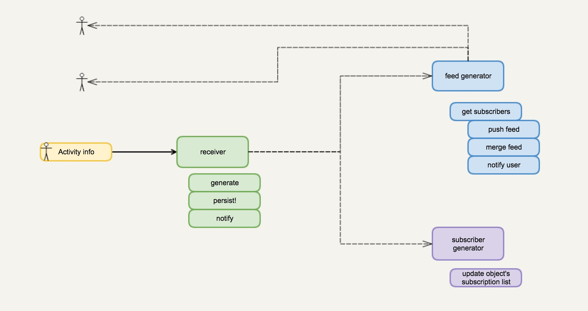

# 如何用正确的姿势打开 TDD？

TDD（Test Driven Development）一直是程序界追求的一种开发境界。要想真正做到对项目有帮助的 TDD，并不是一件容易的事情。我见过不少团队做 TDD 流于形式，为了写测试例而写测试例，反而拖累了项目的进程，得不偿失，动摇了整个团队继续使用 TDD 的信心。如果你恰巧属于被 TDD 折磨到吐血，或者听到了大量 TDD 毫无意义影响项目进度的例子而举棋不定，不知道是否该使用 TDD，那么可以继续看下去。

Wikipedia 给 TDD 这么定义：

> Test-driven development (TDD) is a software development process that relies on the repetition of a very short development cycle: requirements are turned into very specific test cases, then the software is improved to pass the new tests, only. This is opposed to software development that allows software to be added that is not proven to meet requirements.

注意这里对需求（requirement）的强调。

TDD 最早是 Kent Beck 在 Extreme Programming（极限编程）中提到的。他给了如下步骤：

* write a test for the next bit of functionality you want to add
* write the functional code until test passes
* refactor both new and old code to make it well structured

关于 TDD，2014年几位大佬，Kent Beck，Martin Fowler 等人还发起了一个吸睛的讨论：Is TDD dead? 见仁见智，正反观点都有，大家可以 google 一下读读。

TDD 的定义和步骤看起来很简单：需求被转化成一系列明确的测试例，然后我们撰写代码使测试依此通过，最后重构使得增量代码和存量代码和平共处，满足设计规范和原则（比如说 DRY，OCP，...）。然后周而复始，不断迭代，直至整个项目完成。

## TDD 的误区

上述步骤是如此清晰简单，以至于很多团队一引入 TDD，就昏招迭出，自乱阵脚。我们先看常见的几个误区。

### Test 归 QA，Development 归 RD

这种思路往往是传统 IT 公司的专利。其研发和测试团队泾渭分明，甚至可以各自向上一路汇报给不同的 VP，实践 TDD时自然采用上帝的归上帝，凯撒的归凯撒的套路，从一开始就走向错误的道路。

TDD 是开发过程不可分割的一环，这里的 T 的目的是做需求分析和设计，和 QA 没有太大关系。

### Test 越多越好

在 TDD 过程中，最忌讳的就是写下过多的 test，尤其是和需求毫不相关的 test。写 test 是有成本的，在 TDD 过程中引入太多的 test 意味着三种可能：1) 你没有想清楚需求；2) 你在过度设计；3) 你不知道自己在干嘛。

大多数做 TDD 写太多 test 的团队都处在第三种可能：他们从传统的开发流程转换过来，请了些咨询师培训了一下，热血沸腾，开始刷 test —— 然而旧有的开发流程在他们的脑海里过于根深蒂固，刷 test 的思路和原来写 test 一样，只不过把最后补齐的 test 转为预先写好而已。如果我们把开发流程看做一个单向链表，这种 TDD 的思路就像把一个原有的单向链表的尾节点取下来，在链表头部插入一样。

不知道自己在干嘛是最要命的，TDD 意味着 Paradigm shift。

### TDD 不需要软件设计

这种想法跟敏捷开发不需要设计一样可笑。憋笑，没有任何一个做 agile 的，或者做 TDD 的会说我们不需要设计。大家都是嘴上说设计很重要，执行起来却变了味：花时间做设计还叫什么小步快跑，不断迭代？咱直接撸袖子干！

我的经验是，越是走 TDD 的路子，前期的需求分析和设计就越重要。

## 如何做 TDD？

TDD 中的 T 是用来映射现实生活中的需求，所以开启 TDD 之旅的第一步，是明确需求。我们以一个通用的 news feed 为例来撸 TDD。

在 social network 中，news feed 是其他用户的行为对你产生的动态的一个集合。如果 Bob follow 了 Alice，Alice 的一颦一笑都会被 Bob 的时间线捕捉到。这就是基本的需求。

那么怎么解构这个过程呢？比如说 Alice 喜欢了一张小猫咪的照片。我们可以这样描述：

> Alice liked photo http://abc.xyz/little-cutie

有时候我们进一步需要知道这个照片的来源，可以这么描述：

> Alice liked photo http://abc.xyz/little-cutie on Cynthia's album.

我们把这个描述泛化：

> Alice (actor) liked (verb) photo ... (object) on Cynthia's album (target).

从中抽取出四个要素：actor，verb，object，target(optional)，通过这四个要素，我们可以描述一个用户的行为。

actor 一般可以是用户，但有时也可以是系统（或者机器人）。我们可以用一个全局的 id 来区别 actor，甚至为 actor 加上类型。

verb 是描述用户究竟可以有哪些动作，这些动作产生什么样的影响？常见的 verb 有 like / unlike，follow / unfollow，create，delete，add，remove 等等。follow / unfollow 是一种特殊的 verb，通过这样的动作我们可以构建用户的 subscription 表。

object 描述被 verb 处理的对象。它们可以是任何东西。比如说：

> Alice created **comment "bla bla bla"**

这里 object 就是一条评论。object 需要有 id 和类型来唯一标志可以从何处访问到这个 object。

target 可有可无。它往往是 object 的集合。比如 Alice added a song "abc" to album "best songs"。target 就是这个 album。当这个行为出现在 Bob 的时间线上，Bob 可能对这个 target 也会感兴趣。

当用户的行为可以用这样一个数据结构描述后，我们接下来需要考虑当收到这样的数据结构后，系统怎么处理。自然，第一步我们想到的是：actor 的 followers 会接受到 actor 的行为。紧接着，我们会问，followers 怎么产生？oh，如果 verb 是 follow，则把 actor 添加 object 的 followers 中，反之移除。我们把这个流程图表化：



这样这个系统清晰多了，我们可以看到系统分成几个部分：

* activity receive and persistence - 当一个行为产生后，外部系统会调用 news feed 来创建 activity
* feed generator - 当 activity 创建成功后，它会扩散到所有 subscribers 那里生成 feed
* subscription generator - 当 activity 是某种特定 verb 的 activity， 我们维护 object 的 subscription 表（添加/删除）。

以上过程可能是我们查阅资料得出来的需求设计，也可能是大家一起讨论出来的。到现在为止我们还没有做任何和 TDD 相关的事情，但这个过程对于做 TDD 是绝对不能少了。

有了大的需求分析和设计后，我们可以开始细化每个部分的设计。TDD 在这个阶段才应该现身。现身过早，很容易导致返工，现身过晚。。。都开始写代码了，那还是 TDD 么？

## 定义接口

根据我们之前的设计，现在我们开始做第一个任务：activity receive and persistence。很多人拿到一个任务后就着急开工，但做 TDD，第一步是定义这个任务涉及的子系统和外界的交互，或者说接口。根据我们之前的设计，我们可以设计这样一个接口了：

```elixir
test "other system should be able to create an activity" do
  actor = {1139, "Alice", :person}
  verb = :like
  object = {1483, "http://abc.xyz/little-cutie", :photo}
  {:ok, activity} = Activity.create(actor, verb, object)
  %{...} = activity
  assert ...
end
```

没错，我写了一个测试例。这个测试例告诉我我希望以何种方式使用新创建的接口。虽然我们是在写测试例，但我们在思考几件事情：

* 创建一个 activity 的接口是什么？
* 它允许什么样的输入（接收什么样的参数）？
* 它返回给调用者什么样的结果？

是的，写下这个测试例的过程就是接口设计的过程。这是我认为 TDD 帮助最大的地方 —— 在写代码之前先考虑清楚接口。

## 接口 review（可选）

这个过程视接口的重要程度和工程师的水平可以省却。在我之前的文章中，我曾经旗帜鲜明地反对 **过分** 的 code review，而强调 interface review 的重要性。大多数 code review 流于形式，去做那些本该由 static analysis 完成的事情。如果资源和时间极度紧张，我的要求是宁可不做 code review，也要做好 interface review。因为 interface 糟了，局部再美的代码在一坨屎的全局下也是插在粪堆里的鲜花，凋零是迟早的事；如果 interface 对了，局部再遭的代码也只是一片花海中的 shit 而已，捡出来扔了即可，无伤大雅。

扯远了。如果我们打定主意要做 interface review，那么 TDD 简直是你的不二之选。我经历过的一些 interface review，往往是在 word 文档，或者是 wiki 中 review 的，这种 review 的最大问题是即便 review 通过，代码实现也可能走样 —— 文档和代码不一致的事情还少见么？日后接口改变，谁还记得要改之前那个已经不知道在哪的文档了呢？

为了保证 interface 是 review 的结果，最好的办法就是把 interface 使用的方法通过测试例的方式来表述，这不正是 TDD 干的事情么？

用 TDD 做 interface review 只需要稍稍抑制住写代码的热情 —— 定义好测试例后，先别着急写代码，给相关的人发个 PR（有时候甚至开个小会讨论一下），看看别人有何评价，然后再进行下一步。

## 开发

终于可以进入到 Test driven **DEVELOPMENT** 的环节了。这是软件工程师的最爱，因为终于可以撸起袖子干活了！

不过别急，在 TDD 中，开发的环节是若干个小的 TDD 组合起来的。其实任何软件开发的过程都是一个需求设计开发测试自我迭代的过程，和分形几何有异曲同工之妙，都是无极中圆环套圆环的思想。大的设计/接口之下包含若干小的设计/接口，然后在小设计/接口下再包含更小的设计/接口。


只不过，TDD 更强调这一过程。因此，在开发的各个阶段中，可能需要不断地为你的更加细分的接口设计添加新的测试例。一般而言，TDD 应该涵盖这些层次的接口的测试：

* 「用户」级。对于很多项目来说，用户级的接口是 API。这里可能是 rest API，GraphQL，RPC，私有协议等等。
* 「app」级。注意，这里说的 app 并非指一个单独的应用程序，而是逻辑上的概念。一个系统可以逻辑上分解成若干个内部的 app，它们互相作用，最后构成了这个系统。app 间如何互相调用，非常重要。
* 模块级。我们只需要关心模块的公共接口。私有接口无所谓。

这个列表无需当做金科玉律来死死守护，根据项目和系统的需要随意调整即可，否则可能会写出过多的 test case 以至于成为累赘。我的经验是，**对系统中不确定的，或者变化大的部分，不要引入过多的 case，而对于系统中确定的，或者接口已经发展稳定地部分，不妨把 TDD 延伸到模块级。**

这里引申出另一个问题，我们在开发中究竟采取自顶向下，还是自底向上的方式？

我对此更倾向于自顶向下。因为它往往和我思考的过程一致：我喜欢在一个大的设计完成，大方向确定后就开始自上而下开发，细节在开发的过程中逐步确定；当然有人也喜欢全部确定下来了再开始构建一个个 building block，再将他们组装起来。两种方式皆可（Kent Beck 是 ground up 的拥趸）。

回到我们之前的 activity create 的接口的实现：

```elixir
def create(actor, verb, object, target) do
  {actor, verb, object, target}
    |> generate
    |> persist!
    |> notify
end
```

我把这个过程分成了一个 pipeline 上的三个小步骤：生成数据，持久化，通知（observer pattern）。这里为了示例方便我没有放错误处理的代码。这样，这个接口的实现就有了。我们可以进一步思考这几个小步骤的接口：

* generate 接收用户的参数，验证后生成一个 activity 的数据结构
* persist 接收 activity，将其存入 storage（可能是 database，也可能是内存），返回这个 activity
* notify 接收 activity，通知所有对此 activity 感兴趣的 app（可能是 feed generator，或者 subscriber generator），返回这个 activity

然后为这几个小接口写 test case（可选），并继续以 pipeline 的方式细化每个步骤。

扯几句设计的题外话。我在 pipe 之美 中提到过对于一个系统，我们可以将它看做是输入到输出的一系列 transformation。这样，很容易把问题分解成一个个小的问题，写出清晰可读的代码。

有没有觉得，TDD 和 pipeline 是天合之作？

## 一些思考

### TDD 是否适用所有场景？

不是。前端的项目做 TDD 有些吃力 —— 这也许是因为我不是一个合格的前端。我觉得用一个（或者若干个）test case 来表达前端的页面似乎不可行，尤其是 Single Page Application。所以我们需要把表现层和逻辑层分开，对 MVC 中的 M 和 C 做 TDD，而放任 V。当然，欢迎大家指正。

此外，数据分析类的项目，更广泛意义上说，那些目标和需求并不清晰，或者虽然清晰但无法找到合适的方式表达的项目，如 machine learning，AI 也很难使用 TDD —— 你咋写 test case 哩？

除此之外，绝大多数后端项目都可以用 TDD 的思维来分而治之。

### TDD 中的 T 是 unit test 么？

按照 Kent Beck 的定义，是。但是我觉得这不准确。显然，对于用户层的接口的 test case 很多时候已经超越了 unit test 的界限，更像 integration test / functional test。但是我觉得纠结是否是 unit test 并不重要，重要的是你的 T 是否在反映你的设计，你的接口。纠结于 UT 与否，只会陷入八股文的泥潭。

### 关于 mockup 代码

我们在做开发时，经常会遇到所做系统的调用方在接口确定后需要尽早开工，以便于项目尽快完成。比如后端提供 API，前端实现 UI，这时我们需要为前端提供 mockup API。在正常的开发流程中，mockup API 会被正常的 API 逐渐取代，直至完成历史使命，被扫进 git history 的故纸堆里，成为沉没成本。在 TDD 中，我们可以让 mockup 代码和 test 代码采用相同的 fixture：

```elixir
# lib/activity
def create(actor, verb, object, target) do
  get_activity_mockup(actor, verb, object)
end

# test/support
def get_activity_mockup(actor, verb, object, target) do
  "fixture.json"
    |> File.read!
    |> Poison.parse!
    |> retrieve(actor, verb, object)
end

# test/test1
test "other system should be able to create an activity" do
  actor = {1139, "Alice", :person}
  verb = :like
  object = {1483, "http://abc.xyz/little-cutie", :photo}
  {:ok, activity} = Activity.create(actor, verb, object)
  assert get_activity_mockup(actor, verb, object) == activity
end
```

这样，即便日后 create 被真正的代码取代，这个测试依旧是一笔有益的投资，不是沉没成本。

### 关于测试代码的层级和组织

TDD 的不同的阶段写下的 test case 的级别是不一样的，不可一概而论。通常我们应该把顶层的，用户级别的接口放在一个目录下，app 级别的按 app 名放在不同的子目录，模块级的按模块名放在不同的子目录，不要混在一起。用户级别的接口应该是最稳定的，添加新接口无妨，但是如果已有的接口要改变，我们需要从中分析原因并吸取经验：

* 是需求分析出了岔子，没有明确完整的需求？
* 是接口设计阶段考虑的不够周全？
* 是设计水平不够，导致接口不够对变化开放？

然后想想下次怎么能做得更好。app 级和模块级的接口变化可以不必那么慎重。如果你发现你的模块级接口的 test case 总变，那么你可能需要考虑在初期省却这部分的 test case —— 它标志着你要么设计出了问题，要么有些过度 test 了。先解决别的问题，再考虑 test 的事情。

### 关于文档

测试代码好好组织还很有利于文档化。在介绍你的代码如何使用时，可以通过将文档链接到相关的测试例上，让调用者对代码的使用有个更清晰地认知。

更好的方式是 doctest —— 在代码的文档部分，嵌入如何调用该代码的示例代码，这部分代码进而变成测试的一部分。doctest 早先见于 python，现在几乎所有语言都有工具支持。TDD 的用户层接口可以考虑使用 doctest 完成 test case 的撰写。
