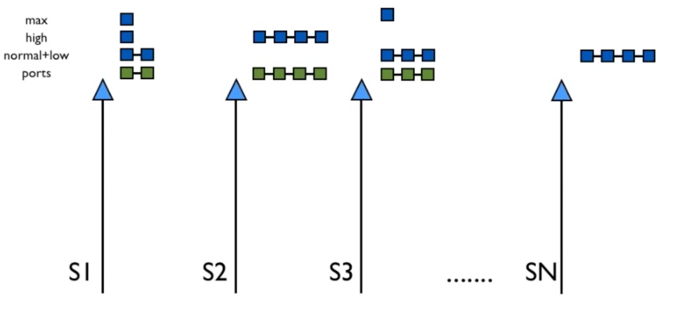
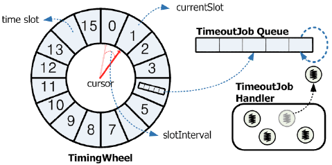

# 上帝说：要有一门面向未来的语言，于是有了 erlang

今个谈谈 erlang。我之前谈过不少语言：elixir，javascript，golang。那些文章流于表面，更多是简单的介绍。这篇文章不同，因为 erlang 并不是一门新语言，简单介绍它的人不算少，我希望这篇文章能在深度上有所区别。写文章，雅俗共赏是件困难的事情：讲深了，初学者或者外行读着扫兴；说浅了，专家们会觉着浪费时间。所以，我会尽量做到深入浅出。

言归正传。erlang 是约三十年前上帝馈赠给人间的一份礼物。它是如此独特，在构建的过程中揉进了如此多的奇思妙想，在三十年前就试图解决三十年后我们才大规模遇见的问题，在编程语言史上可算是一个自成体系的标杆。要在一篇文章中讲明白 erlang 是件困难的事情 —— 它从一个完整的，独一无二的世界观开始，提供了一个如操作系统般繁杂的 VM，随后又将业界的最佳实践抽象出一套框架（OTP），解决了很多分布式并发系统下复杂的基础问题。没有一门语言，或者一个系统像 erlang 这样不单单关心软件如何撰写，还关心软件如何运行；不仅仅关心软件今天如何运行，还关心软件明日如何升级。所以，本文概括性地谈谈 —— 如同「独孤九剑」的总诀 —— 关于 erlang 的方方面面都提及一些，讲些有意思的内容，但都不会深入到太细节的东西。

我们先从 Joe 老爷子的 worldview，也就是世界观谈起。

## 世界观

程序语言有其独特的思想。Python 有 Zen of Python，Golang 说 Do not communicate by sharing memory; instead, share memory by communicating。然而，它们并未提升到 worldview 的高度。Joe 老爷子，在其博士论文中，却明确提到了他心目中的一门新语言的 worldview：

* everything is a process.
* process are strongly isolated.
* process creation and destruction is a lightweight operation.
* message passing is the only way for processes to interact.
* processes have unique names.
* if you know the name of a process you can send it a message.
* processes share no resources.
* error handling is non-local.
* processes do what they are supposed to do or fail.

这些朴实无华的，看上去似乎没什么大不了的句子，构成了 erlang 世界的基石。

我来将其分成四个部分解读。

__process（进程）__

在 erlang 的世界里，万事万物都是 process。process 就像原子一样，组成分子，细胞，组织，器官，最终构成一副机体（见我的文章：boundary）。那么，process 究竟是什么？

其实它和 OS 的 process 概念几乎一样，就是 PCB（Process Control Block），以及围绕 PCB 的 heap，stack，mailbox 等内存空间。只不过，erlang 的 process 的 memory footprint 很小很小，一个刚初始化的 process，也就占用几百个 words（32bit CPU 下，1 word = 4 bytes，64bit CPU，1 word = 8 bytes）。所以，erlang VM 能创建的 process 理论上取决于内存的大小，我们可以轻易创建百万级，甚至千万级的 process（32bit CPU 的 pid 用 28 bit，64 bit CPU 的 pid 用 60 bit，大家可以自行算算 process 的上限）。erlang 的 process 源自 actor model 的思想，它是几种常见的 concurrency model 的一种（其它的 model 请参考我的文章：）。process 和 process 通过发送和接收消息来处理各种事务。

（出自：[erlang garbage collector and why it matters](https://hamidreza-s.github.io/erlang%20garbage%20collection%20memory%20layout%20soft%20realtime/2015/08/24/erlang-garbage-collection-details-and-why-it-matters.html))

process 其实很像是 OOP 中的 object：process 之间是隔离的 —— 一个 process 无法访问另一个 process 的内部状态，这是封装的概念，而通过使用 parent/child process 也可完美实现继承和多态。实际上，erlang 算得上是 OOP 始祖 smalltalk 的正统的传承者（另一个渐渐淡出大家视野的传人是 ObjC）。

__routing（路由）__

当系统中有了无数的独立的 process 后，一个很迫切的问题是如何找到我们需要与之互操作的 process：这是个路由的过程。对于 erlang 来说，我们可以通过唯一的 pid 来定位到目标 process，就像打电话时直播电话号码；我们也可以通过和 pid 一一对应的名字来定位到目标 process，就像你背不下来程序君的手机号但可以从手机地址簿里调出呼叫一样；我们还可以通过呼叫转接的服务，在手机上没有记录我电话号码的情况下，通过第三方呼叫到我 —— 在 erlang 里，这个第三方，叫 name registry。

说两句题外话。

路由在系统设计里是一个很厚重的主题，处处闪现它的影子。我们知道，一切系统工作的基础都是事件触发，而事件触发的本源是路由。你看这篇文章时指尖上下滑动，触发了 tap/swipe 这样的事件，这事件需要被准确无误地路由给其 handler，才能完成正确的操作。DynamoDB 的本质是什么？就是你给我一个 key，我把它路由到 cluster 下面某个 node 下面的某个 value，要读要写，要杀要剐你说了算。至于其使用到的 gossip，consistent hashing，都是为路由服务的手段和算法而已。C++ 里你调用一个纯虚函数，底层通过一张 vtable 将你的调用路由到合适的子类的函数的实现上。Virtual memory 是虚地址到实地址转化的一张「路由表」，VMA 等概念不过是这道路由大餐的提拉米苏。所以我们学习一个系统，先从其路由开始；我们设计一个系统，路由也是核心的一环。子曾经曰过：__参透路由表，走遍天下都不怕。__。

__error handling（错误处理）__

erlang 的错误处理机制非常独特 —— error 的 bubble up 是靠 process 之间的 link 完成的。link 是一个作用域双方互相监视的机制，有点像自战国商鞅变法以降，古代中国常有的保甲连坐制度：一人犯法，连坐者也要受刑。两个 link 起来的 process —— 我们暂且赋予他们名称为小明和小红 —— 如果小明挂了，小红会收到 ``EXIT`` signal，如若不作处理，正常情况下也会挂掉，而小红之死，会进一步触发和小红  link 起来的其他 processes，从而引发和小明有关的整条利益链上的震荡。这便是著名的 let it crash 思想。这种独特的机制让 error handling 实现了真正意义上的 non-local：一切与其相关的 process，都会受其影响，就像是对待癌细胞一样，除非有对症的法子，否则相关的细胞统统杀死，绝不姑息。反观其他语言的 error handling，与其说是 handling，不如说是 hide —— 就像边关报急，烽火连天，兵部却将其压下，回报圣上天下太平，然后马照跑，舞照跳。

link 是双向的连坐机制，有时候对于一些影响不大的问题，我们并不需要如此强有力的手段，于是有了 monitor。monitor 像是战场上的斥候，监视一个 process 的异动，一旦有变，立即回禀一个消息。收到消息的 process 可以选择按兵不动，或者随机应变。

erlang/OTP 的 supervision tree 就是基于 link/monitor 这样非常简单的机制构建起来的。而之所以 erlang 可以任性的 let it crash，其中一个很大的原因是 process 非常轻量，构建和销毁的代价无非就是创建和回收若干个 C structs。

golang 的 error handling 没有类似的 link/monitor 的机制，我觉着是其一个不大不小的败笔（当然也可能是为了性能考量之后的妥协，毕竟没有理想的语言，只有为了特定目的而妥协出来的语言）。至于如果 golang 要采用类似的机制 —— 那么，goroutine 和 channel，goroutine 和 goroutine，channel 和 channel 间，是否需要 link/monitor，如何 link/monitor，不在本文讨论的范围之内。

__concurrency（并发）__

前面讲到，erlang 的并发模型使用了 actor model。actor model 是说每个 actor 和其他 actor 通讯的方式能且仅能通过 message passing 而完成。因而，每个 actor 有其独立的 mailbox，用于接收消息。在 erlang 下，process 就是 actor。为了调度数量庞大的 processes，erlang VM 有自己的 scheduler —— 在 SMP（可以简单理解为多核）环境下，每个 CPU core 有一个 scheduler。和 OS 的 scheduler 类似，它有 run queue 和 wait queue，scheduler 从 run queue 上取出下一个 process，执行其代码。如果 process 没有通过诸如 receive message 这样的动作显式地将自己阻塞并被调度出去，scheduler 会在一个固定的 cycle 后（在 erlang 里叫 reduction）把 process 调度出去。所以从 erlang 程序员的角度来看，erlang 是 preemptive scheduling，并且，这种每个 process 获得的 CPU 时间几乎固定，事件在可预知的时间内得到调度，被称为 soft realtime。鲜有带 GC 的语言能够达到 soft realtime，Java 不行，golang 不行，因为它们的全局 GC 都会有臭名昭著的 STW（stop the world）问题（GC 一工作，世界就清净了，GC 会工作多久，天知道）。

既然提到了 soft realtime，那么，什么事 hard realtime 呢？CPU 的时钟中断是一种 hard realtime。它会在固定的间隔被触发，丝毫不差，风雨无阻。

OK，有了这些最基础的认知，我们可以进入到下一个环节 —— message passing，scheduling，以及 OTP。

## Message passing

erlang 的 message passing 在很多文章里被当做是理所当然的，无需深究的事情，就像水啊，电啊这样的东西，谁关心它们是怎么来的？程序君在研习 erlang 时，对此却有好多疑问：

* message 怎么从一个 process 传递到另一个 process？这中间有数据拷贝么？有锁么？锁是什么粒度？
* message 会否在传递的过程中丢失？如果丢了，咋办？
* 那些巨型的，从 TCP/IP stack 上收来的 message，从小明传递给小红，是否也要拷贝？拷贝的话，效率该多低？
* exit，link，monitor 这些 signal 究竟和 message 是什么样的关系？
* ...

这些问题我自个也未完全明白（尤其是 link —— 到目前为止，我连它的 source code 在哪都不知道），不过，带着问题学习总是好的。

先说 message 的传递。我们且将 distributed erlang 放在一边，只考虑 single node。在 erlang VM 里，小明发个 message 给小红，其实就是把 message body 从小明的 heap 里拷贝到小红的 heap 里（或者 heap fragment 里，这个区别暂时不需要关心），然后往小红的 mailbox 尾部添加一个指向拷贝后的 message body 的 message control block。如果小红是网红，同一时刻小刚也可能给小红发 message，那么小明就要和小刚竞争，这个时候就需要锁。这把锁是 per process 的，所以很轻。

了解了这个过程，我们就回答了前两个问题。message 不会在传递的过程中丢失，而且这是 exactly once 的 message passing 的场景（我之前的文章 zeroMQ 中讲到了分布式系统 exactly once 是不可能的，想想看，这里为什么可以？）。如果小红对小明不理不睬，小明对小红不离不弃，矢志不渝地发消息，会发生什么事？小红的 mailbox 会一直增长下去，直到海枯石烂 —— 或者说内存耗尽。这时 VM crash，所有 process 一起玩完。

小明可能觉得没完没了给小红发「爱老虎油」挺无聊，所以偶尔会学着徐志摩对林徽因那样，写写情书。一封冗长的情书写完后，小明要再誊一份送到小红的 heap 里，浪费时间，很不合算；万一，小明这情书改日要原封不动发给小花呢？小明比较聪明，发一个情书的链接，想看，点链接去看。

这便是 erlang message passing 处理 binary 的方式。大的 binary（通过 binary allocator 分配出来的）放在 share pool 里，发消息时只发一个 reference。对方收到以后，通过 reference 可以直接找到数据，避免无谓的拷贝。我们知道，reference 是有代价的 —— 这个 binary 要记录 refcnt，对「收看」和「看过」的行为要增增减减，保证 binary 不会在 consumer 还未使用前就被释放，同时也要保证 binary 不会在全部使用者使用完了之后还未释放。

## 调度（scheduling）

调度是 erlang VM 的一个重头戏。那么多 process 如何合理调度以保证 soft realtime？我们知道，谈到调度，就不得不谈 cooperative multitasking 和 preemptive multitasking 这两种操作系统使用的主要的调度方式。

cooperative multitasking 把调度的控制权交给各个 process，相信「人性本善」，每个 process 都是善良的，它们使用一些 CPU 后就会主动做 context switch，这种方式用于一些史前的操作系统：MacOS，Windows 3.X，还有各个公司的 proprietary OS，如 NetScreen 的 ScreenOS。cooperative multitasking 调度的时机是可预知的（因为是 process 自己的代码去 yield），实现起来简单，但很难保证每个 process 对时机把握得得尽善尽美，一旦有不合理实现的 process，通过无休止的大循环占用了过多的 CPU，就会把其他 process 饿死。

preemptive multitasking 是前者的改进，调度的控制权被牢牢把控在 OS 手上，系统为每个 process 的 CPU 使用时间设定一个上限，通过 CPU 时钟中断触发 scheduling，如果当前 process 到达这个上限后会被调度出去。这种方式调度的时机不可预知，可能发生在 process 代码的任何位置，所以实现起来，尤其是 context switch 会复杂一些。但它对应用程序的作者是福音：他不需要操心自己该什么时候该 yield 好让应用程序被调度出去。

从 erlang application 的角度来看，erlang VM 的调度是 preemptive 的，因为每个 erlang process（你的 erlang 或者 elixir 代码）不知道也不用关心自己会在什么时候被调度；从 BEAM scheduler 实现的角度看，它又是 cooperative 的：每个 process（C 代码）的 main 函数里（``process_main``，见 beam\_emu.c），会显式调用 ``erts_schedule``（见：erts\_process.c），看看自己的 reduction count 是否用尽，如果是，做一个 context switch。

reduction 是 erlang 用于检验 process throughput 的工具，类似 linux 的 nice value。一次 reduction 可以简单认为是一次函数的调用。因而，一个 process，在做了 ``CONTEXT_REDS`` 次（见 erl\_vm.h，19.x 是 4000）的函数调用后，会「主动」把自己调度出去。

我不知道 erlang 选择让自己成为一门函数式编程语言单纯是作者的喜好，还是意外的选择。但这个选择，对其 soft realtime 有着极大的影响。假设 erlang 像 golang 那样把自己看作 C 的继承人，那么，reduction 的计量便要令人挠头。命令式语言里的不确定性很多 —— 循环首当其冲。如果还是以函数调用作为 reduction 的单位，那么，一个 内部有上千次循环的函数和一个没有任何循环的函数的差异是相当大的，是不对等的，有的 process 可能执行了 50us 让出 CPU，有的 process 却执行了 10ms 才让出 CPU，这无法称之为 realtime。事实上，很早以前在 Juniper 解 ScreenOS 的 bug 时，我便对 cooperative multitasking 下面的 task 究竟该何时 yield 很是挠头。因为在 C 语言下，选择合适的点让出 CPU 是相当困难，前后一旦有人添了代码，尤其是包含循环的代码，这个位置就可能变得不好。因而我们在遇到某个 task 占用 CPU 过长而被 crash 出来的问题时，只能在相应的循环里面加 yield 调用来规避而已，相当无力。

而函数式编程语言，没有循环，只有尾递归。这就简单了，每次递归发生，就是一次函数调用，记一次 reduction。

此外，函数式编程语言会让你写出尽可能简洁的函数。大部分函数式语言写出的代码，超过 50 行的函数很少见，而在 beam 的源码里，或者随便一个开源项目，C 函数 500 行以上的比比皆是。在函数语言的基础上，erlang 还毫无惧色地把 prolog 的「别扭」的语法几乎照搬过来 —— 语句和语句间用逗号分隔，函数用句号结束。这种别扭无时无刻地在提示着你：嘿，咱们写函数，不是杨鹏的 GMAT 长难句练习；要学咪蒙，写短小有力的句子！

从 scheduler 的角度想来，elixir 的某些语法也许略微有些欠考虑 —— 类 ruby 的语法，很容易让人像 ruby 那样，写下长长的函数 —— 比如，plug 的代码中，50 行以上的函数并不少见。而 OTP 的代码， 除了那些处理消息的 ``receive`` 的函数，50 行算是大数目。elixir 又提供类似 lisp 的 macro 能力，因而可以轻易衍生出更多的 elixir 代码 —— 所有这些，当编译成 erlang 代码后，可能就是一个较大的函数，不那么利于 soft realtime。

扯得有些远，拉回来。

erlang VM 的 scheduler，是标准的 scheduler —— 每个 core 上一个逻辑意义上的 scheduler，有多级队列，按照 process 的优先级区隔。max 是 erlang 系统内部保留的优先级，往下是 high / normal / low，按这个顺序依次调度。normal 和 low 尽管在一个队列里，low prio process 要 N 次访问之才还会被调度。scheduler 还会处理其他活儿，比如 ports。ports 是 erlang 和外部世界（file，socket，driver 等）的接口，我们暂且按下不表。

为了更好的 load balance，scheduler 在无事可做时可以去别的 scheduler「偷」 run queue 里的 process 过来运行；同样的，在 run queue 过长时 scheduler 也会主动地试图将自己的 process 迁移（migrate）到别的 scheduler 上。这些细节我们都先按下不表。

你可能会问，那么 timer / timeout 这样的 event 如何处理呢？答案是标准的，人见人爱，花见花开的 timer wheel。

VM 维持了 per scheduler 的 timer wheel，处理一个 scheduler 下的 timer event。erlang 下的 ``send_after``，OTP 下的 ``call`` 都会在 timer wheel 里挂上事件，然后在 ``scheduler_wait`` 里 ``erts_bump_timers`` 时，处理当前 tick 下超时的 timer。

关于 timer wheel，臭屁一下，我曾经发过一个 US patent：ager ring optimization（关于如何发 patent，见我之前的文章：如何申请专利）。

讲些题外话。就我之前的经验，elixr（其实就是 erlang）的正则表达式的性能比 javascript 差不少。最近翻 otp/erts 的代码，无意中看到 erlang VM 也用 PCRE 做正则的处理。都是同样的 C 代码，照理来说，大家的效率应该一般高啊。对此，stackoverflow 上有人的解答是：在 erlang 下，PCRE 代码的 regular expression 实现，因为顾及到 reduction，在处理过程中有可能让出 CPU，待下次被调度时再继续。这是为了顾及 soft realtime scheduling 的某种妥协。

erlang 的设计体现着作者对 latency 的重视。golang 在 communication 时才有可能发生 context switch，GHC 据说在内存分配时才发生。这些scheduling 的粒度不小且很不均匀，很难保证稳定地 latency。唯有 erlang，在 VM 层面像工匠般仔细地计量某个 process 的 throughput（reductions），让每个 process 雨露均沾。当然，这些处理是在牺牲局部效率的情况下完成的。老子说：将欲取之，必固与之。妥协是程序语言为达到目的所付出的代价。

## OTP

OTP 的全称是 Open Telecom Platform，这个名称其实已经不重要了。基本上，谈到 erlang，我们都会谈到 OTP，它已经成为 erlang 的一部分。

如果把 erlang VM 看做是 OS 的 kernel，那么 OTP 就是这个 kernel 的其他组成部分：stdlib，initd，syslog，OAM，etc. 此外，OTP 还为 erlang 提供了不少影响深远的设计模式：``gen_server``，``gen_event``，``gen_statem``，``supervisor``，``application``，以及 ``release`` 等。

这些基础的设计模式已经深入到任意一个 erlang application 的骨髓，以至于除了用于教学的代码，你很难看到不用 OTP 的模式而纯手写的 erlang app。

我们拿 gen_server 试讲一二。process 之间通过消息传递来处理任务的过程可以被抽象成经典的 Client/Server 模型（或者说 RPC）。client 请求 server 的某个服务，server 处理之，然后返回结果（或者不返回）。这个看似简单的过程，其实蕴含了很多问题：

* client 发送请求前，server 已经挂了（或者还没启动）怎么办？
* client 发送请求前，server 所在的 node（考虑分布式场景）无法连接怎么办？
* client 发送请求，server 太忙（mailbox 太多未处理的 message），没空处理怎么办？
* client 发送请求，server 在处理过程中，crash 了怎么办？
* client 发送请求，server 回复了 reply，client 怎么知道这个 reply 是之前那个请求的 reply？

这些问题是每个做分布式消息系统的人都会遇到，并且，很难处理得当的问题。在 OTP 里，gen_server 替你处理了所有的细节，让你只用关心什么时候 ``call``，以及对应的 ``handle_call` 怎么处理收到的消息。除此之外，它还做了这些事：

* 支持 process 级别的 ISSU（In-Service Software Upgrade），或者说 hot code upgrade，并提供接口让你在 hot upgrade 时可以做数据迁移。
* 支持 tracing，让你可以很方便地在线调试运行过程出现的问题。

这两点，没有任何语言及其框架替你着想的那么周全。``gen_server`` 的细节就不在这里详说，也许我会写篇专门介绍 OTP 的文章，详细讲讲这个模式。

``gen_event`` 是个 ``gen_server`` 的实现，处理 observer 模式。

``gen_statem`` 也是 ``gen_server`` 的实现，用于处理有限状态机。

``supervisor`` 我在上文中，以及曾经有篇并不太严谨的 let it crash 一文中略有涉及。

``application`` 我在 boundary 一文中提及。在 erlang 里，application 是个很独立的，即插即用的东西，类似于组件。

这些模式我们暂且略过，有机会详细介绍。

我想花一些篇幅探讨的是往往被人们忽略的 release。erlang/OTP 是少有的即关心你如何写代码，还关心你的代码如何运行的语言。读其他语言的代码，你像是在和一具具尸体对话，你很难通过这些尸体推敲出他们活着谈笑风生的样子。erlang 不太一样。代码被明确划分成不同的 application，application 有 start/stop，还有各自的和运行时保持一致的 supervision tree：你清晰地知道你的代码运行起来的样子，哪个 process/server 被哪个 process/supervisor 掌控。

除此之外，erlang/OTP 还替你解决了你的系统如何 release 这样的后顾之忧。一个 release 包含若干个 application，每个 application 的版本，他们之间的依赖关系，启动顺序，需要加载的模块，都在 release 文件中说明。甚至，如果要做升级，还可以生成 appup 文件，描述哪些 application，哪些 module 发生了改变。当升级发生时，相应的 process 会被暂时 ``suspend``，加载新的 module，在完成 ``code_changed`` 回调，把数据从旧版本迁移到新版本后，会被 ``resume``。

其他语言也有类似的打包机制，比如 Python，你可以用 setuptools 来生成一个软件的 package。然而，这些工具只关心你的服务如何在前台（foreground）运行，却并不关心诸如：

* 如何以 daemon 方式运行（启动，停止，重启）；
* 如果以 daemon 方式运行，如何attach 进去，以便于调试；
* 如何在不同的机器上把你的软件连成一个 cluster；
* 如何在 release 之间 upgrade / downgrade。

如果说前两者在其他语言下我们还能用第三方工具替代，后两者几乎是 erlang 打造的系统的专利。

## erlang 的缺点

最后我们谈谈 erlang 的缺点。

erlang 让人不爽的几个地方是：

* 学习曲线很陡。
* 和 javascript，python 等一样，是运行时的类型检查而非编译时的类型检查
* immutable 引入的无处不在的内存拷贝，拖累了整个系统的效率。做同样的顺序执行的事情，erlang 的 performance 甚至不及 javascript。

对于学习曲线的问题，没办法，谁让你不得不同时在学四件事情呢：erlang 语法，函数式语言的编程思想；一个几乎等同于操作系统的 VM；以及一套实用的设计模式。然而，这些付出的代价是值得的，它将你的系统级设计能力和分布式软件系统开发的能力提升了一个档次。即便你不用 erlang，这个代价也很值得，你可以把它的很多思想带入你所熟悉的语言中去解决问题。

erlang 虽然是强类型语言，但运行时才做类型检查这也让很多人诟病。这并非 erlang 作者不想这么做，而是不得已。hot code reload 带来的动态性和不确定性让编译期的类型检查无从做起。然而作为 compile to erlang 的语言，elixir 未像 typescript 之于 javascript 那样引入类型系统，是件遗憾的事情。

至于性能，erlang 为了 soft realtime concurrency，hot code reload 牺牲了很多很多。我们不该奢望 erlang 做计算密集型的任务还能像 C 一样「指如疾风势如闪电」。
