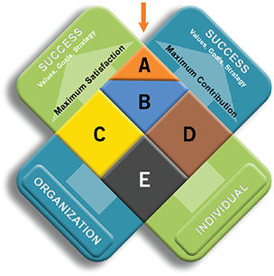

# 如何选择合适的工作

其实这个问题在『黑客与画家』里 Paul 已经给出了答案：选择那些具备 **可测量性** 和 **可放大性** 的工作。

我们来详细说说。注意以下的话跟「敏捷宣言」的措辞类似 —— 当你有选择的权利和能力时，优先选择前者而不是后者。但，这并不意味着后者不好。

首先是行业的选择。**蓬勃发展的行业** 要优于处于稳定的行业。比如说同样是软件行业，互联网就是比传统软件行业发展速度快得多的行业。

在一个蓬勃发展的行业中，机会要多很多，市场不断被拓展，饼越做越大。这很好地符合可放大性。而在一个稳定或者缓慢增长的行业里，市场版图已经划分地差不多，总体而言，好的位置和职业机会（但并非绝对）已经被之前进入这个行业的人占据得差不多，所以可放大性差了些。

选好了行业，再看公司。同样的，**处在上升期的公司** 优于成熟稳定的公司。当公司以火箭般的速度发展时，个人只要充分表现，很大机会能进入职业生涯的快行道。这还是个可放大性的问题。但让人难受的是，怎么鉴别谁是处在上升期的公司？这个一半是靠趋势的研究和把握，一半靠运气（如果你长期做股票，你就能理解）。我们都是事后诸葛亮，如果将时针拨回事件发生之前，很少有人会认为乔帮主回归后的苹果能重返一流公司的行列，也几乎不会有人在微博最红火的2012年初预见到微博的衰败（最近两年又东山再起）。选公司有时候跟选股票一样，只要你做足了功课，从各种资料中得出自己的分析，那么，剩下的交给运气吧。

选定了公司，再看团队。**重视个人能力的小团队** 优于过分强调集体智慧的大团队。如果可能，尽量避免进去就做一颗「螺丝钉」的团队。当然，如果不可避免地做了螺丝钉，也要努力让自己的价值高过一颗螺丝钉。公司和个人对某个普通职位（非高管）的定位是不同的：公司希望每个普通职位都有备份，具备可替代性；个人希望自己在团队中是独一无二，无可替代的。小团队的优势在于你的工作的可测量性要强不少。当一个软件需要五千人一起做出来时，你的作用就如大海中的一丝浪花；但当一个产品只需要五人就能做出来，那么，即使平均下来，你也是其中的五分之一。

选团队的同时也要考察老板。**敢打敢拼敢担当的老板** 优于过于温情柔顺的老板。没有担当的老板不要选（你可能会成为替罪羊），没有想法只想维持自己地位的老板不要选。在工作中，不要认为老板是管你的，你也要学会管理老板。尤其是他的时间、精力的分配。

选团队时还要看队友。优先选择那些拥有 **更多优秀队友的团队**。优秀的人往往能成为你的标杆，激励你前进。这跟球员要尽可能去欧洲踢球而不是留在国内一样的道理。鹤立鸡群的感觉尽管很好，但久而久之，可能会成为井底之蛙。

## 公司和个人的关系

工作累的时候，我会走到窗前，欣赏视野内两条汇聚在一起的道路：南北向的中关村东路，起始于清华，向南发展到帝都的腹地（北三环）；东西向的成府路，发端于北大，向东延伸到宇宙的中心（五道口）。两条路的汇集点就在我公司楼下，浮华，繁荣，完美地诠释着：「天下熙熙，皆为利来；天下壤壤，皆为利往」。南来北往的人在这个路口汇集，然后又离去，彼此只留下一个背影（现在还真是有些怀念五道口的喧嚣）。

我曾经接受过公司提供的一个management的培训，讲X model。公司和个人的关系和这个道口很类似。公司的前途（成府路）和你的职业生涯（中关村东路）的交集就是十字路口中间的部分，也是你和公司在各自的生涯中的一个瞬间（snapshot）。只要你们相互需要，这个路口可以足够宽：公司能促进你的职业发展，你能为公司带来实实在在的利益。但双方毕竟还是有各自的诉求：公司不会永远需要你，你也不该永远留恋这一个路口，而错过更绚丽的人生。

我们看X model的这张图。你和公司有各自的values，goals和strategy（核心利益和重大关切）。交叉口是你们相互雇佣的瞬间，在这个瞬间，你们之间的关系有A，B，C，D，E五种情况。

A代表你和公司处在蜜月期，相互需要，如胶似漆。

B代表你们相互需要，关系稳定，但那种水乳交融的激情已然不在。

C代表你已成为公司的仓鼠（hamster），在挥霍着自己的青春和公司的温柔乡。

D代表公司成了你的硕鼠，对你索求无度，而你已经心力交瘁。

E代表你们渐渐相互都不需要，退一步海阔天空，分手是最好的选择。

公司和员工应该都尽量将相互的关系处在区域A。然而，很多人不知道自己身处何地，很多公司也没有第一时间把处在B，C，D的员工往A拽。

有时候，如同国与国之间的关系，你们的「核心利益和重大关切」是可以相互协调的。

但有时候，可能无法协调。在无法协调的情况下，当你们处在在C或D的关系中，你要考虑果断离开；否则，公司醒悟过来的时候，会拿C区域的员工开刀。

无奈的是，很多人没有自己的「核心利益和重大关切」，也从来没把自己放在和公司对等的地位上。所以想清楚你的「核心利益和重大关切」是什么，然后好好地做个抉择！
