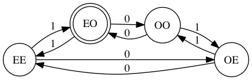
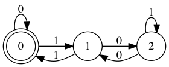
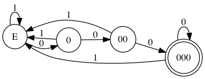
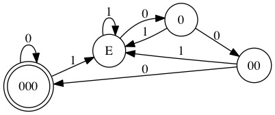
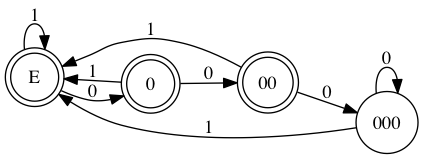
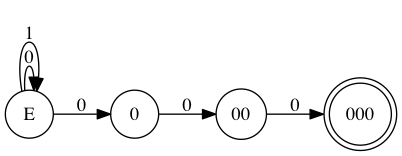
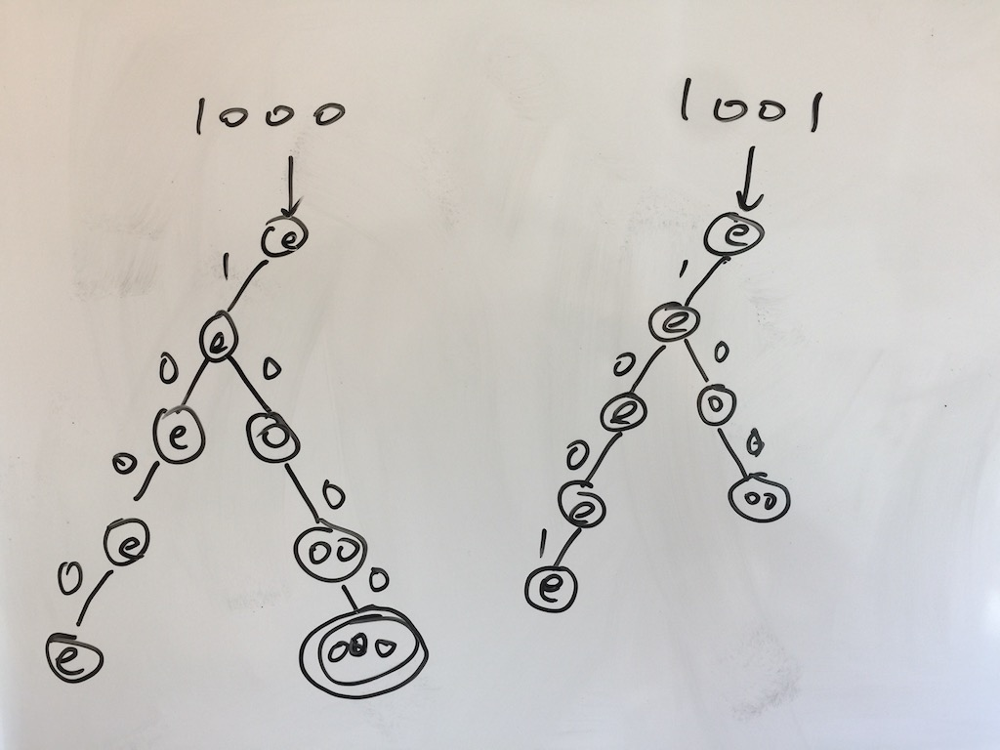

# 谈谈状态机

在谈论一般意义的状态机时，我们先看看有限状态机，Finite State Machine，简称 FSM。

在计算理论（Theory of computation）中，FSM 是一切的基础，也是能力最为有限的机器。在其能力之上是 CFL（Context Free Language），然后是 Turing Machine。

FSM 解决一个输入序列，经过 FSM，最终停留在什么状态这样一个问题。对于一个字符串是否以 \0 结尾（C 语言的字符串结构），FSM 可以给出答案。

CFL 是一切编程语言的基础。你写的一段 python 代码是否语法正确，CFL 能够给出答案。

Turing Machine 就是我们日常用各种算法写代码解决各种问题的基础。不较真地说，JVM 就是一个 Turing Machine。

再往上，就是未知的世界 —— Turing Machine 也解决不了的问题。

如果你工作多年，已经把 FSM 的知识还给了老师，不打紧，程序君帮你简单复习一下。

一个 FSM 首先有一系列的状态（state）。根据输入的不同，FSM 从一个状态切换到另一个状态。在这些状态中，有一些状态是特殊的状态 —— 接受状态（accept state）。如果输入处理完毕，FSM 停留在接受状态，那么 FSM 处理成功，否则失败。

就这么简单。简单得不像个实力派。

我们看个例子。请听题：写一个状态机，验证一串二进制bit，包含偶数个 0 和奇数个 1。

合法的输入有：1，100，10101

不合法的输入有：10，00，1100

我们知道，写一段程序，搞定数据结构，就搞定了 80%。开发一个 FSM 也是一样，选取合适的状态是最最关键的。确定了状态之后，剩下的只是辛苦活。

对于这个简单的问题，大家一眼都能看出，可能存在四种状态。二进制串包含：

1. 偶数个 0 和偶数个 1（记作 EE）
2. 偶数个 0 和奇数个 1（记作 EO）
3. 奇数个 0 和偶数个 1（记作 OE）
2. 奇数个 0 和奇数个 1（记作 OO）

FSM 初始化的状态是 EE，一个 bit 都没处理，0 和 1 都是偶数个。FSM 的接受状态是 EO。如果最终到达这个状态，那么处理成功。

我们很容易能画出这样的状态机：



手起刀落，马到功成。简单地有点侮辱你的智商。

来个难的 —— 难到那种可能你抓破头皮喊破喉咙也找不到优雅的解法的问题。

请听题：判断一个 binary string 是否能被 3 整除。

这个问题合法的输入有：11，110，1001，1100，1111，...

不合法的输入一大堆，光看输入似乎看不出什么规律。所以你不可能用两个状态（可以整除/不可以整除）来描述。

这里要注意，FSM 很傻，对于输入，只能一个单元一个单元处理（在这里一个单元是一个 bit），你既不能吃着碗里的去看锅里的（偷看后面输入），也不能吃着碗里的，把胃里的吐出来重新咀嚼（回溯处理过的输入）。你能依赖的，只有当前所处的状态，以及当前的输入。

光说不练假把式，我们来搞点输入试一试。

如果第一个输入是 1，那么它不能被 3 整除。商 0 余 1。一个数能不能被整除，关键看余数是否为 0。除了 0 之外，这里余数可能的取值还有 1 和 2。我们试试把状态应该设置为 0，1，2，看看是否有解。这里 0 是接受状态，也是初始状态。OK，从初始状态 0 起，输入是 1，那么状态迁移到 1。

如果第二个输入是 0，也就是说现在看到的串是 10，10 和 1 的关系是什么？__进位__！二进制逢二进一，所以相当于 被除数 乘了 2。被除数乘 2，相当于余数乘 2 再模除数（这个我就不证明了）。

所以第二个输入是 0 时，余数 (1 * 2) % 3 = 2，状态从 1 迁移到 2。

如果第二个输入是 1，那么就乘 2 加 1 再取模，余数是 (1 * 2 + 1) % 3 = 0，状态从 1 迁移到 0。

顺着这样的思路走下去，可以绘制出如下的 FSM：



有没有想过，你苦苦思考的答案，竟然工整得如此清秀美丽，让你窒息？就像程序君第一次看到「红楼梦」对「苍井空」这样的旷世绝对一样，惊掉了半盆口水。

在构建 FSM 的过程中，不管你做了多少运算，为这个过程付出了多少脑力，最终，你得到的是一个：在 x 状态下，输入 a，得到 y 状态这样一个字典。这是 FSM 很多时候是最高效算法的原因：__你已经把最艰难的部分编译进了 FSM，剩下的就是查表的操作。__

好了，看你做题做得那么认真，咱们再来一道：判断一个 binary string 是否能被 8 整除。

这有何难！被 8 除有 8 种余数，整 8 个状态。然后依葫芦画瓢 bla bla bla，就大功告成了。

对不？对。复杂不？挺复杂。要是判断能不能被 16 整除，这么做下来，一页 A4 纸恐怕都不够画状态变迁的。

还有没有其他方法？肯定有。

这个问题合法的输入有：1000，10000，11000，111000，101000，...

规律很明显，以 000 结尾。这也的确是 8 的倍数的定义。这个 FSM 很好写：



也比按照上一种算法得出的 FSM 简单明了多了。

注：这里有个小问题，0 在上面的状态机并不被接受，但可以被 8 整除。更严谨正确的写法是这样（我们下文先不纠结这样的小细节）：



可见，__同样一个问题，可以有不同的 FSM 处理。__ 有些复杂，有些简单。我们要努力追寻那些状态最少的 FSM。

以上描述的 FSM 都是 DFA（Deterministic Finite Automation），确定有限自动机。就是 __给定一个状态，和一个输入，你总能确定地转换到下一个状态。__

DFA 有一些有意思的特性，比如补运算，只需要把接受状态和非接受状态互换，新的 DFA 就是原来 DFA 的补。比如：判断一个 binary string 不能被 8 整除。这样就可以：



而且，就像算术里面我们总能找到最小公约数一样，通过一些算法，我们总能将一个 DFA 转化成最小 DFA。这个就不详说了。

我们再回到整除 8 的例子。我们能不能这么表述这个 FSM 呢？



我不管一开始接受多少个字符，但最后三个必须是 0，0，0。这样的表述很直观。不过，一般而言，对人直观的东西对机器不直观。这是一个 NFA（Nondeterministic Finite Automation），非确定有限自动机。给定一个状态和一个输入，我们无法确定地转换到下一个状态。比如，当状态为 E 时，输入 0，究竟该往状态 0 上迁移，还是保持目前的状态，who knows?

子曰：To transit or not to transit, this is a question.

对付 NFA，我们只能用 decision tree —— 凡是一个输入可能产生多个状态的地方，有几个输出状态就分裂出几条路径，这样当所有路径都结束（要么输入走完了，要么卡在某个状态无法处理了），只要有一条路径到达接受状态，那么这个输入就满足 NFA。比如 1000 和 1001 这两个输入：



前者成功，后者失败。

当然，这样的处理效率上并非最优，decision tree 上的路径会随着带有不确定性的状态的数量指数增长。所以，大部分时候，我们要把 NFA 转化成 DFA，然后再把 DFA 转化成最小 DFA。

NFA 有什么用呢？它的一个重要使用场景是 regular expression（regex）。regex 是一种简单的描述模式匹配的语言（或者表达式），大部分同学的日常工作都离不开它。上述的问题用 regex 表达是 ``.*000``。早期的 regex 会被转化成 NFA，然后再被转化成 DFA，最终能够高效地处理输入。使用 FSM 处理 regex 的代表产品如 awk，sed，re2。

不过现在的 regex 已经不纯粹了（non-regular），尤其是对 backreference 的支持，使其不仅无法用 NFA 表述，甚至都不是 context-free，比如这个这个用来匹配回文的正则表达式：``(.+)\1``（它可以匹配 "tyrtyr"）。有阵子我是 regex 的迷弟 —— 就是那种拿着锤子，看什么问题都是钉子的迷弟 —— 经常写一些要么莫名其妙，要么无比复杂的 regex。复杂的就不说了，莫名其妙，但很好玩的有这个：

```regex
(.+)(.+)(.+)(.+)(.+).*?\5\4\3\2\1
```

大家猜猜是干嘛的。

这样的 regex，处理起来是非常麻烦的，要能够停止，回溯，还要有额外的空间记录已经捕获的组。处理这样的已经超出了 regex 范畴的产品是著名的字符串搜索艺术家：pcre。现在很多语言的 regex 库直接使用 pcre（比如 elixir，但早期的 python 不是，golang 用官方自己的 re2）。。

吐槽一句，pcre 非常复杂，复杂到还有自己的 JIT。对不同方式实现 regex 的工具性能的比较，可以看看这个对照：http://sljit.sourceforge.net/regex_perf.html。

FSM 理论就讲这么多。

FSM 的应用主要是在 event based processing。一般如果系统在某个状态下，接收某些信息，处理后产生一个新的状态，都可以用 FSM 的思路来实现。最典型的使用场景是 network protocol，比如 OSPF（rfc2328 的主要篇幅就是在描述各种场景下状态的变化），再比如 TCP 3 way handshake，FTP 的建连和各种 command 的处理。

还有些场景涉及到具体的业务，比如用户的养成体系（用户从 注册用户 -> 已验证用户 -> 资料完整用户 -> 核心用户 的迁移），支付系统，预订系统也有 FSM 的影子。
