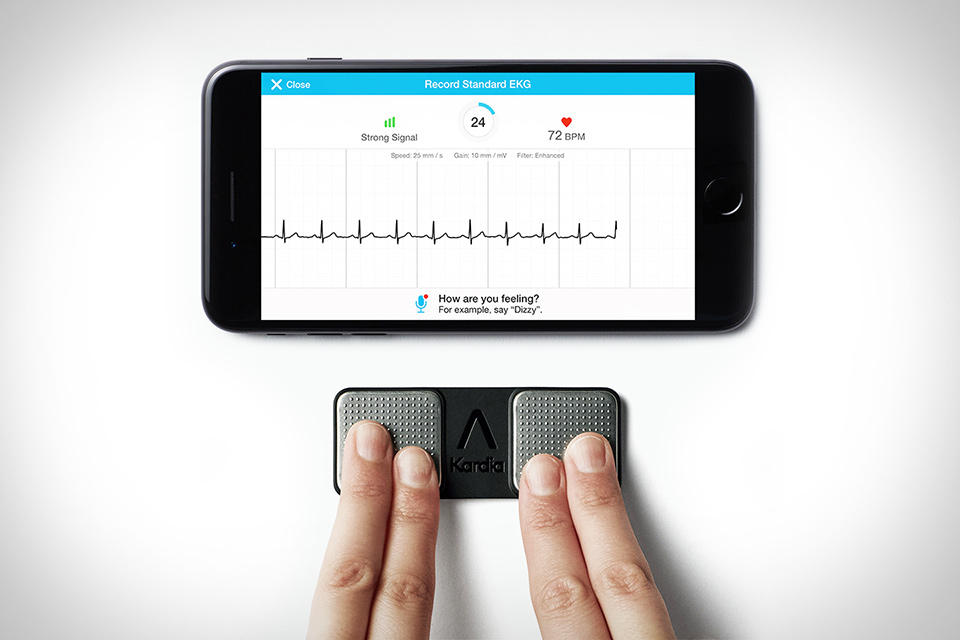

# The sound of silence：网络传输的小众黑科技

上周面试了一个来自俄罗斯的 android 工程师。很 geek，对 office 的 binary format（不是后来的 xml format）做过深入的逆向工程。他在 yandex 做过产品，而不是工程师 —— 拿他的原话说，就是 Yandex 对工程师要求太高，他试了三次都没成功，只能退而求其次做产品。当然，本文想讲的不是这个哥们，而是这哥们现在所在公司 AliveCor 做的一款产品。

这是一款通过监控心率而预测潜在疾病风险（比如中风）的医疗产品（Electrocardiography，EKG）。它由一个小巧的硬件（探测器）和手机上的 app 组成。大致原理是：打开手机 app，将双手各两个手指摁在探测器上大约 30s，探测器会将你的实时心率发送到手机端，手机 app 会根据服务器预先生成好的机器学习的 model（就几兆到几十兆）来预测潜在的心脏疾病。我尝试了一下，不出意外地，我的心脏状态十分正常（此处应有掌声）。

从软件的角度看，这款产品原理上并不复杂，复杂的是样本分析和筛选，机器学习算法的选择和调优，模型的构建；而 app 本身，实现上也不算困难，困难的是如何从探测器传输信息给手机。从图中我们可以看到，探测器很薄很小，厚度将将盖过一片轻薄扁平的纽扣电池，而整体大小也就比四个手指摁在桌上的范围大一丢丢。

我第一反应是它使用了类似 electric imp 的芯片。我在很久的一篇介绍 lockitron 文章中介绍它，官网是 electricimp.com，感兴趣的自己去看看它的 tech spec。它在一块 SD 卡大小的 PCB 上，实现了整个 WiFi 协议栈。很可惜，面试者回答「不是」。我又试探了蓝牙和 ZigBee，也不是。他说使用的是他们的私有协议，直接运行在传输层上，无需建连，探测器单向向周围广播接侦听到的心率信息，因而电池待机能达到 12 个月之久。但具体的细节他不能透露。

面试结束后，我意犹未尽，进一步探索了 AliveCor 的官网，却并没有得到太多有用的信息。翻看我之前撰写的关于 electric imp 的文章，突然想到，它会不会使用类似 blinkUp 的技术？

我们知道，在 IoT 设备间不依赖已有的复杂技术短距离交换信息（比如说，配置信息）是一个难题。拿 electric imp 为例，这块芯片为 IoT 设备提供了简洁可靠的 WiFi 接入能力，使得设备可以接入互联网，接受和处理来自云端的指令，非常强大。然而，在它能够正常工作以前，如何将要连接的 SSID 和 password 传递给芯片使其能够连接要连接的 WiFi 是个大问题。IoT 设备一般都没有键盘鼠标这样的输入输出系统，目前语音控制还处于早期且价格不菲，为了提供一个一次性的配置加入语音控制芯片，得不偿失。所以 electric imp 开发了 blinkUp 技术，使用可见光来交换信息。其实用可见光传递信息的做法历史十分悠久了 —— 古时的烽火台，如今的旗语，红绿灯，都使用了可见光。blinkUp 技术是将数字化的信息（比如 WiFi SSID / password）encode 成手机屏幕的闪烁，electric imp 芯片接收到这个闪烁信号，decode，就得到了原始的数据。虽然看上去挺笨拙的，使用效果还不错。

然而，在使用 AliveCor 探测器的过程中，我并没有看见任何类似的信号传输机制。

如果不是光，那还有什么途径可以将设备上的信息广播出去，而手机又能够正常接收？我能想到的答案是声音。手机上有 microphone，可以接收外界的声音，探测器要发出声音也并不难，有一个支持音频编码的芯片即可。问题是，我在使用的过程中，也没有听到声音，难道是某种超声波？

顺着这个思路，我 google 了 "encode info in sound"，很快地我发现了这个产品 chirp，继而我又发现了类似的竞品：LISNR 和 google tone。

Chirp 在其 "how chirp works" 页面中说：

> There are lots of different ways to embed and extract meaning from a piece of sound. Chirp uses audio data encoding — or modulation/demodulation. Data is encoded into a series of pitches and tones on the sending device, and decoded on the receiving device.

在它进一步的介绍中也提到了 inaudible ultrasound（超声波）。超声波的好处是人耳听不到，不会产生噪音，便于设备间说「悄悄话」。

回想起来，这个技术也不算新，在宽带上网时代之前，是调制解调器时代。9.6k/14.4k/28.8k/56k 的「猫」，把数字信息「调制」成模拟信号，通过电话线传输到网络的另一端，同时把传入的模拟信号，通过「猫」再「解调」成数字信息。而在电话线上传递的模拟信号，就是音波信号 —— 早期的互联网用户大概还记得拨号上网时那乱七八糟，令人不快的拨号音。只不过，调制解调器工作于互联网，出于通用性考虑，只处理物理层和链路层的事情，网络层和传输层还是由 IP 和 TCP/UDP 来完成。而在 aliveCor 的使用场景中，类似于 chirp 的技术从物理层一直工作到传输层。

由于 Chirp 等产品也并未进一步透露其实现原理，我来大概猜测一下：

物理层：芯片将要发送的信号转换成音波，向周围广播。在这一层需要处理信号要被转换成 audible sound 还是 ultrasound。

链路层：一个 data frame 的起止需要有一定的说明，还有容错。我们类比 ethernet：

一个 ethernet frame 有 preamble，SFD（start frame delimiter），preamble 提示接收方新的 frame 要开始了，SFD 则表示 frame 的数据正式开始。之后就是 ethernet 的 header / payload，最后是 FCS（frame check sequence），用于做 CRC 校验。

对于 aliveCor 的应用场景，ethernet frame 里开头的 preamble + SFD 和结尾的 FCS 都很有必要，而 header 的 src mac / dst mac / type 则视需要决定。src mac 可以是探测器自身的 serial number 或者 device id，dst mac 甚至都不需要，因为声音只支持单向的广播。type 可有可无，为扩展计，可保留一两个字节。

网络层：应用场景不需要路由转发的支持。

传输层：没有太多一对设备间多个信道传输的需求，所以可以直接传输 payload。

至于数据的加密，则完全是应用层的事情，应用层有完整的控制权。

以此类推，aliveCor 的完整解决方案可能是这样的：

1. 探测器端集成上文所述声音处理芯片，当手指按压时，探测器从待机状态恢复，开始工作 —— 将收集到的心跳信息 encode 成 ultrasound，广播出去（信息可能简单加密，也可能没加密，因为这个场景还是相对私密和安全的，声音的覆盖范围可能也就在几米间）
2. 手机端的 app 必须保持打开，以便于一直侦听并 decode microphone 传来的信号。当检测到一个 frame 的 preamble / SFD 后，之后 decode 出来的数据就是心跳数据，如果校验通过，则记录这个数据；否则跳过。aliveCor 要求手指按压 30s，其实并不需要这么长时间的采样，但考虑到探测器和手机 app 并不一定同步，一开始可能丢失一些数据，中间传输过程中又可能遇到坏包（比如各种其他的超声干扰，这个几率应该很小很小），所以 app 需要收集多于实际需要的数据。
3. 当手指停止按压后，广播停止。探测器进入到待机状态，节约用电。

使用声音做短距离的信息传输在 IoT 领域有很多应用场景，比如：设备间初始连接，支付，身份验证（比如验票）等。支付，身份验证有其他成熟的技术，但设备间初始连接的应用场景还是很广阔的。比如 AirPlay，每次连接时输入 code 很麻烦，如果使用声音直接将密码从 apple TV 传输给 iPhone，那用户体验就大大增强了。家里来个客人，需要 guest WiFi 的密码，两个手机间 beep 一下，密码就传过去了，省得手输。微信传输名片，或者公众号登录，与其扫描二维码，不如直接通过声音传递信息，让机器间自动完成处理，省去了手工「扫描」的动作。而大规模的 IoT 设备间的初始配置，也可以通过声音进行配置的分发，类似于 "gossip"，一台设备将配置「读」给邻近的设备，然后一路传递下去，直到大家都初始化成功。
