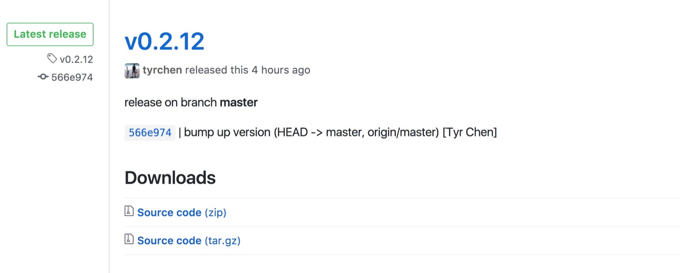
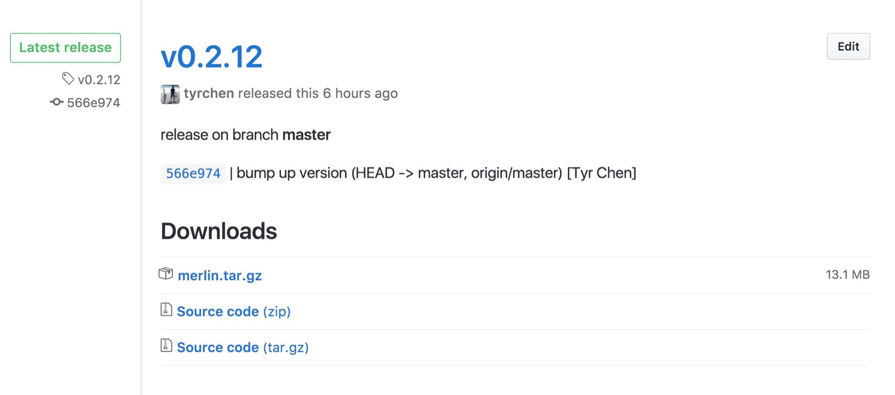

# 停下来，歇口气，造轮子

上周四至今，我大概有 50-70% 的时间在造一个轮子，一个叫 merlin 的工具。

事情的起源是这样的 —— 我们内部的一个重要服务，要升级到 elixir 1.5。之前这个服务的 ansible 部署代码大概是这样的：在目标机器上 clone 代码，编译，生成一个符合 systemd 的 release，更新 systemd 配置，重启服务。那位说了：如果一个 cluster 里有几十台机器，每台都这么 build，费时费力，中途出问题的几率也大了很多啊 —— 为什么不直接在 CI 工具，比如 travis 里完成 build，生成一个 tarball，目标机器直接获取这个 tarball 部署呢？

这有些历史原因。我们的服务在编译期做很多事情，需要访问 db 等资源，由于我们使用第三方 CI 工具，不方便把 db 哪怕是 readonly 的 credentials 暴露给它，无奈采用了这么个不合 erlang / elixir 时宜的部署方案。

我们生产环境的 erlang / elixir 跑在 19.x / 1.4 上。如果贸然升级，对线上服务影响很大；provision 新的 cluster，部署后切换流量然后再把老的 cluster 干掉虽然可行，但是每次版本升级都要这么走一遭，不太好。再加上目前的在目标机器上编译的部署方式越来越沉重，一次部署动辄几分钟，效率太低，所以我动了做一个简单的构建系统的心思。

思路很简单：我们是 github 的重度用户，那么将整个场景和 github release 连接起来：提供一个处理 new release event 的 webhook，当 github 上某个 repo 生成了一个新的 release，webhook 会收到这个 event（里面有 repo 名字，tag 等信息），我们将其稍作处理后便塞到 AWS SQS 里，然后有一个定期的任务从 SQS 里拉出消息，按照消息中的 repo 和 tag 把代码 checkout，build 之，然后将生成的 tarball 作为 asset 上传到这个 release 里。一切完成后，将这条消息从 SQS 里删除。这是整个 build 的流程。要部署的时候，只要跟部署脚本指明要部署的 release，我们可以从 release assets 中拿到这个 tarball，解压部署即可。

这样的好处是：构建系统在我们自己的 VPC 中，可以从 vault 中获取数据库的 credentials；同时，我们只需要在构建系统里搭载合适的 erlang / elixir 版本，然后通过 include ERTS 的方式构建，可以让目标机上完全不用关心 erlang VM 的版本。

那位说了，为何不在 webhook 里把消息插入 erlang 内部的一个 queue，而是要引入外部的 SQS 呢？这是因为 build 耗时很长，和系统/工具链的很多环节打交道，中间有各种可能，如果处理消息的 process 挂了，消息跟着也随风而逝。这会使得我们失去处理完这个 build 的机会，这样不好；然而要处理好这些边边角角的情况，做持久化，需要额外写不少代码。而 SQS 保证消息不会丢失，dequeue 后消息只是隐藏起来，在 visibility timeout 内对其他人不可见，所以处理失败也不怕，visibility timeout 一过，又可以重新处理；只有所有处理结束，我们显式删除消息，消息才会真正从 queue 中拿走。另外，SQS 对这样消息体量的应用，几乎是免费，何乐而不为？

这个任务做了近一周，写了 650 行代码，出了十几个 release，已经在线上为内部的三个 elixir repo 提供服务，目前一切运行良好。

下图是整个系统的设计稿：

下图是一个 release 发布后，还未编译的 github 截图：

已经编译成功后的 github 截图：

这个系统如此简单，我们只需用 plug 写几个 API，然后有一个定期运行的 GenServer 处理消息，spawn process 进行 build 即可。不用太多介绍，相信你也能很快写出。

这篇文章我着重要说的是：你要时不时的，停下来，歇口气，从头开始造轮子。你会有意想不到的惊喜和收获。

我们程序员大部分的工作时间，说好听一点是在创作（make stories），说难听一些是做些琐碎的零工（do chores）。我们需要做这些零工来获得收入养家糊口，但这些日复一日的零工却配不上我们的成长。如果总在「打零工」，即便是以 996 的节奏工作，也是蒙眼狂奔，或者说「老鼠赛跑」。

过去的几个月，在北京和旧金山，我面试过不少程序员。每每我抛出一个试题，要应聘者选自己最熟悉的语言写个解决方案时，几乎所有人在我话音将落未落之际，就迫不及待地打开编辑器，或生成 skeleton 代码，或开始 google 某个函数的使用方法，或写下第一行代码 —— 却鲜有人在白板上，草稿纸上理一理思路，清一清头绪，画一画自己的解决方案。这就是平日里被动养成的打零工的心态 —— 每个任务就像流水线上的计件工作一样，谁也不需要太多的思考，甚至连问题都不太用问，顺着已有的行为模式和思维习惯做下去就可以了。

在公司里做事，一份代码维护地越久，在生产环境存活地越长，大家行事的风格就越谨慎。这有很多原因交织在一起：后来者没太读懂前任的逻辑，不敢轻易修改；已经运作数年的框架，功能不断堆叠，已经像托勒密的地心说模型，不堪重负，却无人有胆识推倒重建或者另起炉灶，因为行走江湖靠的是一个「稳」字；技能栈被锁死，想有所突破，却无从下手；更有甚者，被公司太过优越的开发环境和工具链所驯化，久而久之，就像养尊处优惯了的八旗子弟，突然被扔到荒郊野岭，已然骑不了马，跑不动道。

想想看，你上一次从零到一把一个全新的项目从一个蓝图起，一行行代码垒起来，最终部署到生产环境或者用户手边，是什么时候？如果超过了半年，那么，你可能需要停下来好好歇口气，认认真真从头造个轮子。

你会发现，之前在一个大项目里填补功能，写起代码来左右逢源，势如破竹；如今一个空白的项目下，数据结构的选择和定义都让人抓破头皮。

等基本功能准备停当，可以部署了，你又发现，原来从零开始写一个 ansible 的部署脚本，和平日里的 copy paste 有云泥之差。哪些东西该抽象到 role 里，需要设置什么样的 hooks，别看平日里读别人的脚本游刃有余，真要自己老老实实去写，才发现，别人家的代码毕竟是别人家的代码。

CI/CD 的设置扒半层皮，服务的监控又是另外半层。很多平日里不用操心的事情，一下变得重要起来。「已有的系统」就像是一座监狱，把你和野蛮的自由世界隔离开来。

在从零到一的过程中，你战战兢兢，汗出如浆。之前被同僚们奉上的「宇宙中心编程小王子」原来只是穿了层皇帝的新衣，禁不起一捅。

殚精竭虑之下，轮子终于被建造完毕，痛定思痛，你重新捧起原先已快要烂熟于胸的代码。写过之后再读，原来那些冷冰冰的代码，变得丰满红润起来，你脑海里充满的无数个问号，此刻开始一一对号入座。是的，你的工作欺骗了你：每日的零工让你莫名满足，你真的只是不知道自己不知道而已。

所以，时不时的，停下来，歇口气，把自己逼到墙角里，造点轮子。

破，然后立。
