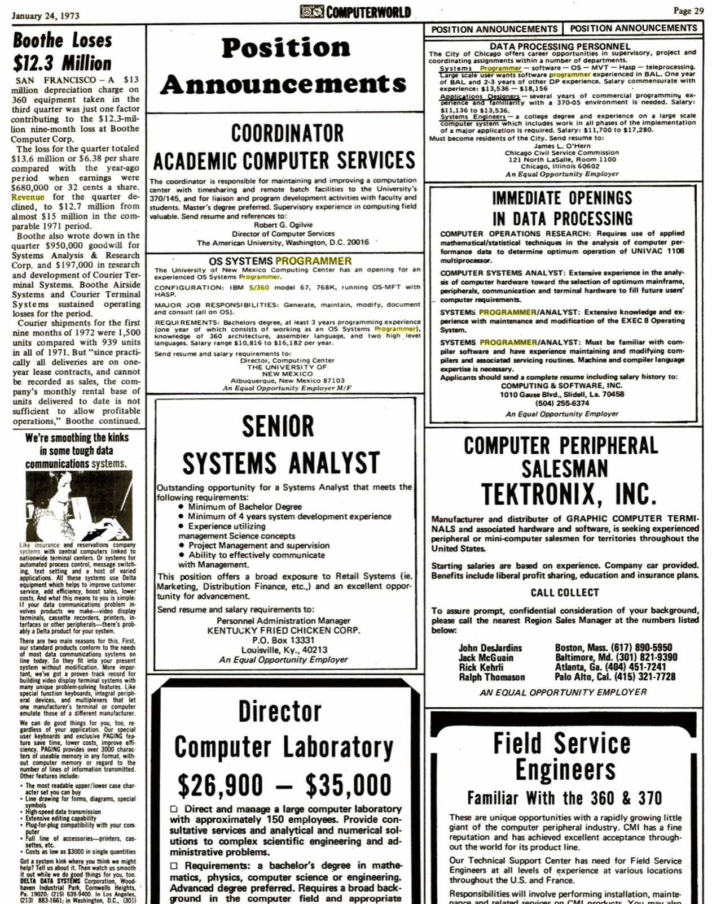
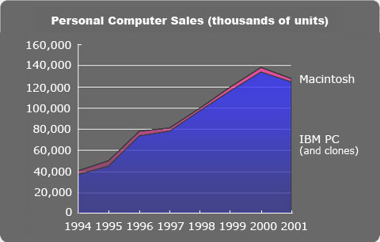
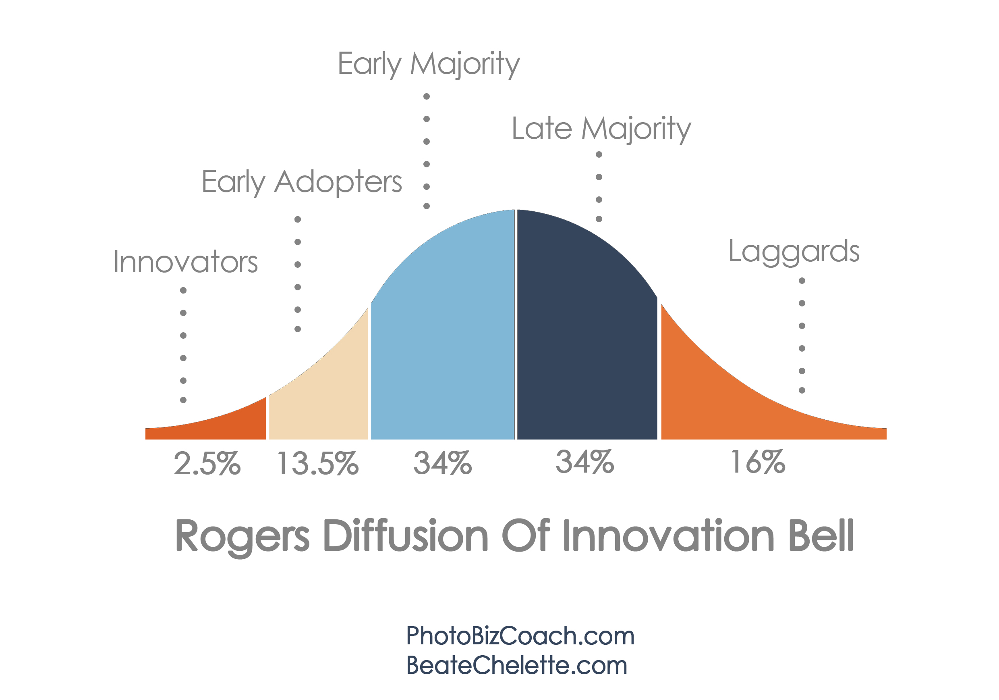

# 程序员的好日子什么时候才到头？

> 要不要转行（报考）软件开发？程序员的高薪让我流口水，但好日子总有个到头的时候吧？不会我一入行就见顶了吧？

这样的问题让我不胜其烦。为子女未来前途操碎了心的长辈们，长辈们的朋友们，还有微信知乎上的朋友，像候鸟一样，在一年里的两个时间：春节期间和高考报志愿前夕，准时开问。我大概六月份回答过一位长辈的咨询，他说小陈，你说的好像很有道理的样子啊，应该发篇文章我好能转给我的朋友们。我说叔叔好啊，就写就写。结果开了个头，就因为懒的原因（主要是红包没到位），一直搁在今天。最近翻看 git repo 里面一票未完成的文章，这篇蹦了出来，伸长脖子一个劲儿地向我示意：poke me，poke me，所以，就有了大家看到的这篇文章。

文章有点长，可以直接跳到底部看结论 —— 但我知道，你们其实都有结论，就是心里不踏实，要找些定心丸 —— 那就还是看下去吧。

唐太宗说：以史为镜，可以知兴替。我们把视角拉到七十年前，看看历史上程序员这个群体是如何一步步壮大的。

## 社会和经济的变迁

虽然程序员的祖师娘是诗人拜伦的女儿 Ada，但第一个真正的程序员，是 Alan Turing。Alan Turing 不仅提出了图灵机，他还在最早的计算机上写过代码。如果说 1946 年 ENIAC 的诞生可算做通用计算机的元年，那么，当时程序员的数量可能只有不超过 10 个。

程序员这时还算不上一个职业 —— ENIAC 走出实验室后催生出来了一批计算机，这些计算机需要有人去使用，于是有了第一代「程序员」，他们大多是半路出家的数学家和科学家。

我们耳熟能详的骨灰级程序语言：

* 科学计算语言的鼻祖，Fortran，由数学家 John Backus 老爷子在 1957 年发明；
* 函数式语言的鼻祖，LISP，由数学家 John McCathy 老爷子在 1958 年发明；
* 命令式语言的鼻祖，Algol，由数学家 Friedrich L. Bauer 老爷子(不是你们熟悉的 Jack Bauer)在 1958 年发明；

所以我们现在学的计算机专业叫 Computer Science，一点儿也没有夸大其词，老爷子们同时对得起 Scientist 和 Engineer 的称号。

如果算上顺带研究计算机的教授，以及他们的学生，第一代程序员数量撑死了成百上千。这个时代的计算机还和普通人没关系，除非你在一流大学学习，或者在 IBM 公司任职，否则别说见过计算机了，你连用于写程序的「答题卡」都没见过。。。

1964 年 IBM 推出了划时代的 System/360 大型机，起价 130k USD。由于相对物美价廉，商业公司纷纷购买和租用，在接下来的数年里，S/360 席卷美国，卖了数万台，是历史上最成功的大型机。S/360 催生了大量的第二代程序员。如果说一台计算机配五个程序员的话，这个年代，程序员的需求猛涨到十万这个量级。

需求强劲，供给侧不给力，怎么办？如何填补这出人意料的大窟窿？

马爸爸说，员工离职，只有两个真实原因：钱没给到位；心受委屈了。反过来，想请君入瓮，先把钱给到位了。

这是我 google 的 S/360 程序员的薪水。你看，在 1973 年，市场能给一个两三年经验的程序员 10k - 18k 不等的薪水。要知道，同期美国人平均工资是 6.5k。在巨大的利益驱动之下，有能耐的人开始转型：先是高素质的数学才子，继而其他领域的优秀工程师工程师，甚至会计师，都纷纷跳进软件开发这片生气勃勃的蓝海。

1970 年 DEC 发布的 售价仅在 10k 美金左右的 PDP-11 进一步释放了计算机的魔力，价廉物美的小型机迅速占领了更广阔的市场 —— DEC 那年卖了 17 万台 PDP-11 —— 连贵族中学（Bill Gates 的湖滨中学）都开始将这东西用于教学，计算机渐渐不是西装革履，三四十岁的「中老年」的玩物。

随后，产生了一些划时代的东西：

* Pascal 由 Niklaus Wirth 在 1970 年发明；
* Unix 由 Ken Thompson, Dennis Ritchie 在 1971 年发布（第一版就工作在 PDP-11上）；
* C 由 Dennis Richie 在 1972 年发明（PDP-11 的硬件设计也影响了 C 的设计）；
* 面向对象程序语言的鼻祖，Smalltalk 由 Alan Key 等人在 1972 年发明；

尤其是 Unix 和 C，它们的影响辐射了几乎每一个程序员，而且一直辐射至今。发明 Pascal 的 Wirth 还是象牙塔里的教授，而 Ken 和 Dennis，则是正儿八经的程序员，或者说软件工程师。

PDP-11 和 Unix / C 催生出第三代程序员。那时候没有前后端程序员之分，也没有系统层和应用层程序员之分，一个程序员既能和硬件中断打交道，又能提供优质的 UI（命令行界面）。市场对程序员的需求继续疯狂扩展。

也就是几年的光景，PC 就开始挑战小型机的地位。76 年 Apple I 发布，81 年 IBM PC 发布，PC 一下子把计算机的价格拉到了一千多美元，计算机的发展开始以无法想象的速度大爆炸，我们敬爱的盖老师看到了这一历史性的时刻，萌发了让千家万户的卧室里都有一台电脑的宏大志向。

八十年代单是 Apple II 就销售了上百万台，更别说千万量级的 IBM PC 及其兼容机。

这么大的增量市场，需要海量的程序员来填补软件上的空白。到 1990年，还没有发布 Windows 95，行业地位并未垄断的微软已经有 5600 名雇员（其中主要是程序员），收入 11 亿（见：https://www.thocp.net/companies/microsoft/microsoft_company.htm）。80年代的程序员的数量，估计已经膨胀到了百万的量级。

八十年代产生的重量级语言是 C 的两个继承人：

* Objective-C 由 Tom Love 和 Brad Cox 在 1984 年发明，其脱胎于 Smalltalk，根正苗红，却并未被市场认可；
* C++ 由 Bjarne Stroustrup 在 1983 年发明，迅速被市场认可；

90 年代多媒体电脑来临，奔腾的心配上 win95，个人电脑真正进入千家万户。大街小巷传唱的 "You don't even have to try, it comes easy for you ... good times, bad times gimme some of that" 简直就是程序员的内心独白。

win95 第一年的销售是四千万个拷贝。而个人电脑在 98 年，跨过了上亿的年销量。

99 年到千禧年的世纪之交，一年时间，Microsoft 的雇员从 31k 涨到了 39k。而上文中提到的十年前的数字是，5.6k。猜猜 90 年代的程序员的需求？起码在八十年代的基础上翻两番。

之后的历史大家应该都比较熟悉了，我就不详述了。互联网崛起，社交网络崛起，移动互联网崛起。从 07 年到 17 年，mobile developer（iOS/android）
，从零增长到 1200 万（见：http://www.businessofapps.com/12-million-mobile-developers-worldwide-nearly-half-develop-android-first/）。

这是一个多么可怕的数字！早期入局的程序员将享受到无与伦比的红利。

而现在，全世界的程序员已经在数千万这个量级（github 用户数已突破 2100 万）。AI，Big Data，Crypto Currency，IoT 不出意料将会是新的需求大户。2017 年，美国劳工部公布的（https://www.bls.gov/news.release/jolts.t01.htm#jolts_table1.f.3）在 IT 行业这个 sector 下，每月平均有 100k job opening，我们按半数是新增来计，全年 600k new opening，如果其中 1/2 是程序员，全美一年 IT 行业的程序员新增需求是 300k。考虑到其他行业虽然不属于 IT，如 Finance，Education & Health service 等，但也有大量程序员的需求，各行各业全部加起来也按 300k 算，那么一年 600k 新增需求，而 2016 年的 CS new grad 不到 50k。缺口依旧巨大。

历史告诉我们，对程序员的需求不仅仅总体强劲，围绕着热点的，局部的差异更加可观。PDP-11 热销的时候，C / unix 程序员相对于 Fortran 的新增需求，可能有十倍的差距；windows 时代，windows 平台上的程序员的新增需求，相对 unix，可能又是数十倍甚至百倍的差距。

另外一个有意思的特点是，由于供需的不平衡，在不同的地域间（比如中美），程序员这一职业产生了巨大的套利空间。聪明的公司会利用这个空间来降低自己的支出，从而引发低价格的区域的程序员溢价（鲶鱼效应），从而推高程序员的总体平均价格。2006 年我在 Juniper 时，一个美国程序员的薪水，相当于中国程序员的 3-4 倍，如今，仅仅在 2 倍上下（当然这也得益于中国互联网一日千里的发展）。印度的大量软件外包（劳务）公司，如 InfoSys，则是把程序员套利交易做成了一个利润空前的生意。

回顾这段历史，还有一个很值得玩味的地方：__市场一直对程序员的需求强劲，可靠的供给却严重不足__。70 年来，几乎平均每五年，对程序员的需求就增长一倍。这意味着市场上大量充斥着 < 5 年工作经验的，新入行的程序员。这意味着什么？在这样一个疯狂的市场下，程序员这个职业本身已经获得比其他职业高得多的溢价，而靠谱的，有经验的程序员，则很容易在这个溢价的基础上，再翻上一两番。没办法，这是供需决定的。

供需的极度不平衡，局部变态级的不平衡，是程序员高薪的第一个秘密，也是最主要的一个秘密。

第二个秘密往往被人忽略，那就是，软件公司，尤其是互联网公司，有着无法企及的 unfair advantage：__它的融资成本太低了，太流氓了，流氓到美联储都自叹弗如。__

就像美女爱英雄，贪婪的资本偏爱天生就具备颠覆能力的软件行业。开个服装店，你不大可能从银行拿到贷款，更别说找风投了；然而你注册个 deeperlearning.ai，放个漂亮的 landing page，VC 的肾上腺素就开始飙升 —— 如果你不是在忽悠，真有个五道杠的能力，且确实在做事情，那么你很大机会拿到一大笔让别人艳羡的资金。这是 startup 的现状。拿了钱干嘛，~~投资比特币~~ 当然是从市场上抢更多的程序员啦，然后拉新留存促增长，再融资，再招更多的程序员，循环下去，然后要么成为独角兽，要么卖身，要么玩完。

那位说了，这是 startup，不算数，要比就比上市公司。那我们看看宇宙最奇葩公司 amazon，就是那个上市十几年不盈利，靠讲故事和描绘未来蓝图让投资人屁颠屁颠为其市梦率添砖加瓦十几年的 amazon。从资产负债表来看，同样是零售行业，过去十年，walmart 收入增加了 1370 亿，市值仅增加了 360 亿，而 amazon 在几乎不盈利的情况下收入仅增加了 1210 亿，市值却增加了 4620 亿，相当于增加了两个 walmart（来源：https://www.youtube.com/watch?v=GWBjUsmO-Lw，12分钟附近）。所谓男怕入错行女怕嫁错郎，walmart 这样的凤凰男使出浑身解数赚出一个个 penny 来讨好那个叫华尔街的小姐姐，人家转身施着粉黛，轻解罗裳上了 amazon 这纨绔子弟的靠融资借来的兰舟。

其他巨头虽然没有 amazon 这么离谱，但也是市盈率高的像个创业公司。本身的高利润，再加上低融资成本，使得他们在人力资源的竞争上，几乎是在降维攻击：拿着超高的市盈率，左手甩着大把钞票，右手挥舞着价值还预期会不断上涨的股票，他们想要什么人，就要什么人。

第三个秘密是，大公司出于对未来的恐惧，为维持其统治地位，从战略层面进行无休止的人才争夺。甚至，有时候延揽人才的目的是「走自己的路，让别人无路可走」—— 有谁还记得两千年前后，华为包下几乎所有一本院校的 CS 学生？让中兴（和其他企业）欲哭无泪？

我们知道，软件行业的高额利润（或者高额预期利润）几乎都来自于其垄断或者寡头地位。居上位者要保其位，居下位者时刻都觊觎着上位。和绝大多数行业不同的是，软件行业的农民起义来的太容易了些（这也是为何 VC 偏爱这个行业）：几颗有想法能行动的脑袋就可以向巨头发起挑战。这让巨头永远保持着一种「离破产只有 18 个月」的恐惧。

这些获得了食物链顶端地位的掠食者，新巨头，比如 google，曾经也是起义军。和老巨头（e.g. microsoft）血战之后上位，身上的伤口还没结痂，不一会身后就有新的掠食者（e.g. facebook）喘着粗气伺机抢夺地盘。新巨头为了维持自己的地位，将行业的人才尽数延揽，给潜在的陈胜吴广们或许以王侯将相，或缚以良田美酒，既可以为自己攻城略地，又有效减少他们直接造反，或者加入新掠食者（e.g. facebook）的机会；而后者，在某个利基市场上活得滋润后，必不甘心久居人下，用更好的诱惑挖角巨头。就像战国时期养士成风，你千金买马，我就千金买马骨。受益的自然是我们这些「士人」。

在硅谷，一个公开的秘密是 counter offer。程序员拿了 F 家的 offer，再去 G 家整一个，即便对 G 家无感，如果 G 家的 offer 更大一些，回过头来再跟 F 家 recruiter 说，99% 的概率能拿到 counter offer。

某个程序员真的这么不可或缺么？似乎不是。像 google 这样的公司，如果每个 team 各裁去 1/3 的程序员，业务估计不会受损，说不定还有提振哩！但是，谁都不敢说那个被我放弃的程序员会不会就是第一张多米诺骨牌，更何况，老子这么拽，口中餐却被截胡，这气怎能咽得下去！

总结一下，强劲的需求，人神共愤的超低融资成本，巨头对未来的恐惧，三个因素，大大催高了软件人才的价格。

上文说了，如今，我们又迎来了新一波浪潮，最抢眼的几个潮头是：AI，Big Data，Cryptocurrency 和 IoT。看上去，软件行业对程序员的强劲需求，还在继续延续。什么时候这一波又一波的浪潮才会停滞下来？我不知道。如果让我大胆地估计一下，也许就跟第一二次工业革命吞噬农业人口一样：当几乎所有的劳动力都在为信息产业打工（这不意味着他们都是程序员），当几乎所有的行业被软件重新定义完成后，才是程序员这个职业饱和的时刻。

而当下的软件行业，虽然程序员的体量已经足够庞大，但整体还在 early majority 的范围，而局部，甚至仅仅处于 innovators / early adopters 的位置：

所以程序员的好日子还远没到头呢。而且，如果你是女性朋友，对软件开发感兴趣的话，更要好好考虑一下这个职业：这个职业女性的比例小于 8%，严重失衡。女性在这个方向上大有作为，更容易脱颖而出。

## 个人如何提升自己的价值（leverage）

好了，定心丸有了。下一个问题是：我该怎么办？毕竟程序员和程序员在个体上还有很大的差别 —— 我可不想入门便成为庞大分母的一员。

first thing first，我们先要对自己有一个明确的定位。我的职业生涯究竟想干嘛？该干嘛？

我经常看到程序员称自己为：java 程序员，iOS 工程师，windows 程序员，spark 工程师 ... 这么定位是极其不妥的，没想清楚就随波逐流。记住：__你绝对不要把自己的职业生涯和某个语言，某个产品，某种系统挂钩，绝对不要！__ 你见过有医生称自己是四环素医师，或者西门子螺旋 CT 医生的么？

某个编程语言会随着时间淡出人们的视野，某个软件产品有其不可避免的生命周期，总有一天它们会 EOL（end of life）—— S/360，Solaris，DOS，Fortran，Cobol，Delphi 等等，曾经那么辉煌，如今都烟消云散了 —— 但它们内在的思想，构建的技术是相通的。所以我们应该 __围绕某个技术方向来定位职业生涯__。如果你心仪安全技术，那么就围绕着安全技术打造自己的核心能力；如果你痴迷分布式系统，那么就在这个领域发力。如果你仔细看上文中提到的 1973 年的招聘广告，large scale 这样的词就已经出现。你要想，几十年来，哪些技术和方向一直在演进，而非直接消失了？

想明白了自己的定位，你才能从容从一个浪头跨入另一个浪头。

有了定位，接下来很重要的一件事就是打造自己的 unfair advantage。

unfair advantage 这个词儿有些猥琐，有点我的幸福要建立在你的平庸上一样。但这就是商业社会的本质。google 的强大的吸金能力就是建立在其无与伦比的 "Organize the world’s information and make it universally accessible and useful" 这样的信息处理能力上的 unfair advantage。除了它，没人做的了，所以他能据此产生比印发钞票还要高效的利润。

程序员的 unfair advantage 该是什么？我觉得，大概有这么几个方向：

1. 我是组织中的关键因子 —— 有了我可以提升团队，产品或者服务的档次
2. 我能够做平均水平 10x 的贡献却只拿 2x 的 package
3. 我是难得的复合型人才：在代码写的好的人里我架构能力最强；在架构能力强的人里我表达能力强；在表达能力强的人里我公共关系最好，等等

要成为组织中的关键因子，你得先成为某个 niche 的专家，比如能够突破现有系统的瓶颈，使其支持 10x 的 traffic；再比如能够把用户的 churn rate 降低 5%。注意我这里的描述都是场景化的，是冲着某类问题去的，而非冲着某种技术。懂某种技术的人很多，但能够用技术解决好商业上实实在在的问题才是关键因子。

程序员群体是个创作群体，创作群体的特点是突出的个体，其价值要远高于于平均水平。画家平均的画作售价不会超过 $500，但毕加索一幅画可以拍出数千万美金。优秀的程序员做出超过行业平均水平 10 倍的绩效，并不困难。注意这里 10 倍的绩效，并非说你写 100 行代码的时间里，我能写 1000 行，而是说在相同工作时间里带给公司的额外价值。

怎么带来额外的价值？最基本的要求是 __要带着脑子工作，多琢磨事情怎么能做得更好__。不少程序员活得像被动接受指令的机器人 —— 老板指哪打哪，其他不关我事。这样的人，无法指望其可以做出额外的贡献。反之，平日里多想现存的问题，可以优化的地方，多找市场上优秀的实现方案，多方求证 ROI，在内部向利益相关人兜售自己的主意来获取认可，并调动自己和周边的资源将其落地。这样的人，走到哪里都能脱颖而出。

成为复合型人才就不多解释了。

有了 unfair advantage，你已经立于不败之地。如果还想最大化自己的价值，那么需要瞅准时机，变换赛道。程序员最忌讳的是把自己囿于一方小小的格子间，两耳不闻天下事。七十年的光景，软件行业迎来（同时送走）一个又一个潮头。一次浪潮，从启动，到崛起，到爆发，再到消亡，前后也就是二十年光景。对此，我们要有清新的认知。与其等待赛道到达其尽头，不变道就万劫不复，而不得不变道，不若先人一步，在合适的时间主动变道。这样，在新的赛道，你就是领跑者，就是需求爆炸期那个人人得而宠之的弄潮儿。

注意这里变换赛道并不意味着切换大的技能方向。频繁切换技能方向，会让你无法沉淀下来，打造自己的护城河。如果你把自己定位成安全领域的专家，那么，在个人电脑时代，你的关注点可能在操作系统和应用程序层面，在互联网时代，是网络层面。你的技能从 memory management，interrupt/exception handling，scheduling，Sandboxing 一路演进到 Anti spoofing，Anti injection，Anomaly Detection 等技术，但这并没有背离你的定位，已有的累积和新的知识互为印证，你的能力层层叠进，螺旋上升。

## 不可忽视的风险

程序员第一大职业风险就是被科技浪潮无情淘汰。

很多行业，从业者的职业生涯从入场到退场，像是在乘机场的自动传送带。人少的时候，你可以往前挪挪，或者伺机走一下快速道，越过那些挡在你前面的浑浑噩噩的家伙，但你能做的也就这些，快不了太多；人多的时候，你只能耐心排着，什么岁数到什么位置，前面的人不离场，你不能抢下他的位置。这一路你走的慢慢悠悠，四平八稳，但好歹，不那么辛苦，除非遇着剧变，你被踢出传送带的几率不大。

程序员不一样。从入场到退场，活脱脱一出 tomb run 的游戏：身后怪物穷追不舍，你只能不停地往前跑。虽然沿途可以收获很多金币（package），但你一旦放慢脚步，或者没能及时变道，就会被清场出局。出局可以是体面的 —— 当 manager，当法人，转 VC，转 sales，去教书，做庄德扑等等， 总之换个角色浪，从此和之前的角色相忘于江湖；也可能是不体面的 —— 钱还没赚够，就被服务了多年的东家无情抛弃。为了养家糊口，只得 restart，重归赛道。可赛道哪是那么好挤回来的 —— 略微谢顶，银发中间或夹杂着些许黑发，肚腩厚实得，从上往下看，都看不见脚趾的奔四大叔，被二十岁出头的毛头小子面试：大叔，说说看，你能给我们带来什么价值？

程序员的第二大职业风险是马太效应过于明显，有时候稍低的起点就意味着经年累月数倍于别人的奋斗。

2017年的计算机应届生，我听说到的白菜价是二十五万。我信，但这可能是 top 10% 在北上广深的水平。剩下的，平均收入至少要拦腰。五年后，这些 top 10% 平均水平能上五六十万，加上股票就没边了；而剩下的，平均水平可能还达不到他们同龄人五年前所谓的「白菜价」。

这个游戏是这么玩的：

* 你学习好，卯足劲上了 985，然后大学的四到六年又认认真真地学习和开发，毕业后工作找你，拿了 BAT 等一线的 offer，兢兢业业工作，工资水涨船高，公司股票翻番，周围还都是优秀的人，有闲得无聊读个 MBA的，有出国接受更大挑战的，有自己创业当老板的，人比人气死人，你也就被逼不断学习维持优秀的状态，好让自己不至于垫底。市场上满满都是向你抛来的橄榄枝，挪个窝轻松二三成的涨幅，你却不待见；
* 你学习不好，仅仅够上了个一本，大学有点荒废，代码没写几行，毕业后你找工作，鞋底磨穿，勉勉强强有个外包公司收留，没日没夜地工作，但公司就这么个水平，薪水很难涨，周围的同事浑浑噩噩地混日子，你稍微努力点，就显得鹤立鸡群。想跳吧，履历不好，跳不出好结果 —— 给心仪的几个大公司发了简历，却好像荷叶上泻过的水，连个痕迹都没有。

这个行业就是这么操蛋：起点低一些，人生的轨迹就差了很多。你要认清这一点，如果你不幸是那个起点低，现状差的人，那就加倍努力，想办法证明自己不比别人差。和咨询这种出生决定命运的行业，这一行还有很多证明你的水平的机会 —— 起码，talk is cheap. Show me your code 是行业的共识。

程序员的第三大职业风险是诱惑太多，容易毁了自己的职业生涯。

这里的诱惑主要是市场机会的诱惑。前面说了，局部供需严重不平衡，因而不乏挥舞着巨额钞票的工作机会。如果你没有一个良好的职业规划，也没有清楚地计算机会成本，那么就很容易被这样那样的高薪诱惑，从而在不合理的时间，不合适的机会上跳槽。当新的工作没有想象的那么好，或者新的公司遭遇崩盘，你不得不止损出局。这时候，找下一份工作就相当棘手。市场不认可你的价值，而你却经历了由俭入奢的过程，不愿回头，于是下一份工作依旧是一个不够深思熟虑的选择。当连续几次错误选择之后，你的职业生涯就岌岌可危了。

我见过五年换过八份工作的人，也见过对自己没有稳定定位，在几个方向上来回飘的人。我还见过履历倒着来的人 —— 在硅谷，见得多的是 Google - FB - Airbnb 的职业切换，我却见过 FB - Google - MS 的切换（没有贬低 MS 的意思）。这种没有想清楚，仅仅因为 package 一时之高低就随意跳槽，是程序员们的《伤仲永》。
