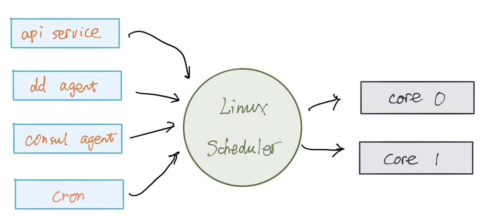
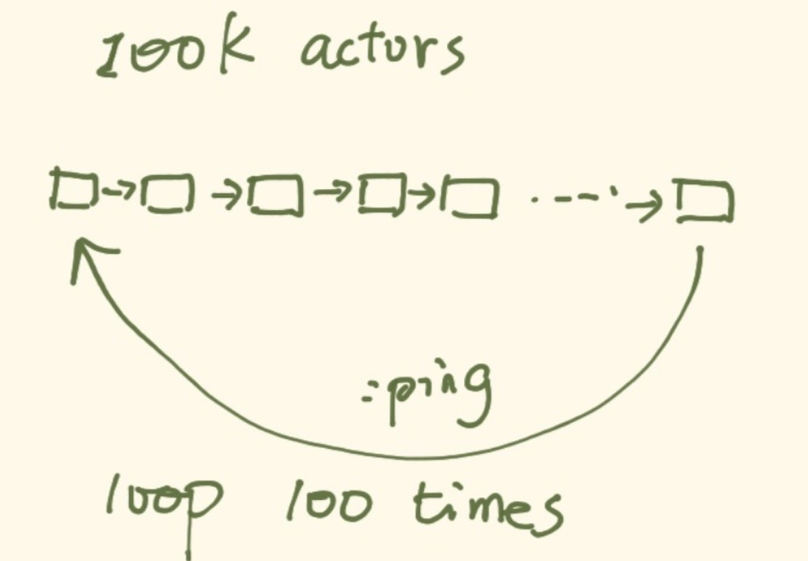
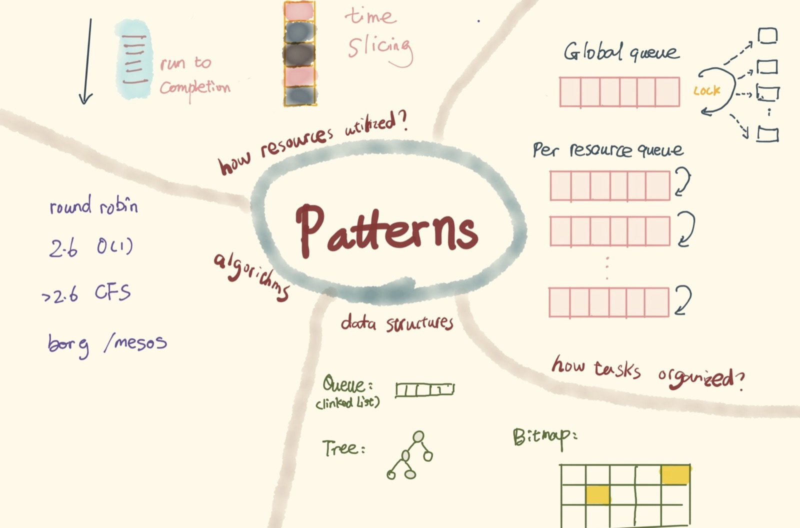

# 当我谈 scheduling 时我在谈什么？

scheduling 有很多很多可以谈论的地方，随便一个点就可以做一次讲座。这次我只是讲一个概述。

## 什么是 scheduling？

wikipedia 上是这么说的：

> In computing, scheduling is the method by which __work__ specified by some means is assigned to __resources__ that complete the work.

这话有点晦涩，我们要拿出初中英语期末考试阅读理解中寻找主谓宾的技巧和专注去面对。这里我给大家用程序员最喜欢的语言翻译翻译：__scheduling 是一个函数，它把一组任务的集合映射到一组资源。__

我们举个例子 —— 拿大家最耳熟能详的 linux CPU scheduler（以下简称 linux scheduler）说事 —— 就是把一系列 process (workload) 映射到一个个 CPU core：



这里面，主要的 task 有：常驻系统的服务，各种各样的 agent，一次性的脚本，周期性的任务。对于 linux scheduler 来说，其 scheduling 函数，承受着巨大的功能性的压力：公平，优先级，抢占（交互任务要能得到立刻执行），高效，可扩展（从 single core -> multi core -> NUMA），等等。

除去 linux scheduler，我们的生活中还有很多很多你都没有意识到的 scheduler，我们随便举几例：

* erlang scheduler，erlang processes 到 threads 间的映射。
* nginx，http/https 请求到 processes / application 间的映射。
* Memory manager，virtual memory 到 physical memory 间的映射。
* hypervisor，VM 到物理机器间的映射。
* AWS EC2 service，VM 到 hypervisor 间的映射。
* Spark，map/reduce job 到计算节点间的映射。

通过这些映射，我们得到很多好处：

* 资源得到更高效的利用
* 由于增加一层 [indirection](indirection.html)，任务和任务所需要的资源间得到解耦
* 更好的服务质量（QoS）

仔细观察上面的例子，我们不难发现，待处理任务的数量往往远大于资源的数量，甚至，二者相差好几个数量级。这种用少量的资源打肿脸充胖子完成大量的任务的无耻行为，在计算机领域有一个漂亮的名字，叫 over subscription。你仔细琢磨，其实很多商业领域尤其是互联网，其秘密就在于 over subscription 这个小小的词语中。比如运营商给你的 50M 包月网络；早期 gmail 提供的不断增长的 1G 邮箱容量；aws 拍着胸脯对每个客户宣传：老表，来我们这场子，S3 管够，EC2 想要多少就有多少。

反过来，我们要想支持 over subscription，那么，通过添加一个 scheduler 把资源的两端解耦，就可以解决。

到目前为止，大家对 scheduling 已有一个粗浅的认知 —— 这时我们的脑海里便会浮现出很多很多的疑问。这其中，最重要的问题是：这世上没有无缘无故的便宜给你占。享受到 scheduler 的马杀鸡，代价是什么？

## scheduling 究竟有多快（多慢）？

还是拿 linux scheduler 说事。scheduler 本身的运行会消耗资源，这边是其最主要的代价。自然，我们希望这代价越小越好。于是，下一个问题是：当 linux 做一次 reschedule 的动作时，究竟耗费多少资源（CPU 时间）？


要想回答这个问题，我们先得回答另一个问题：怎么测量？

要测量上图中桔色的部分，有两个直观的方法。一种方法是在入口和出口记录时间，然后计算 diff，最后求平均值 —— 然而 scheduling 的动作并不受你我掌控，用户态下很难找到其入口和出口。另一种方法是我们让青色的区域无限接近零，让整个时间片都被桔色的区域占满，这样，任务运行的时长便是 scheudling 花费的总时长。按照这个思路，用户态的代码需要被简化到只做一件事情：一旦被执行就立刻阻塞自己，让 scheduler 毫不犹疑地把 CPU 让给小伙伴们。

这个思路 linux 下面的 perf 工具已经给你实现好，直接调用即可：

```bash
staging$ perf bench sched pipe
# Running 'sched/pipe' benchmark:
# Executed 1000000 pipe operations between two processes

     Total time: 20.026 [sec]

      20.026324 usecs/op
          49934 ops/sec
```

其原理是两个 process 相互 pipe，礼尚往来，scheduler 夹在其间来回奔波。这里有个问题，由于 process 可能分布在不同的 core 上，测出的性能失真，所以我们应该用 taskset 将其 affinity 到某一个 CPU core 下：

```bash
staging$ taskset -c 0 perf bench sched pipe
# Running 'sched/pipe' benchmark:
# Executed 1000000 pipe operations between two processes

     Total time: 3.104 [sec]

       3.104995 usecs/op
         322061 ops/sec
```

有同学问，kernel 的 scheduler 有工具可以让你偷懒不写代码，那么，用户态的 scheduler，比如 erlang VM process scheduler 的性能，你怎么测量？

我是这么做的：首先启动 100k 个 processes，每个 process 的入口函数传入上一个 process 的 pid（第一个启动的就放 ``self()``），启动完成后，self 给最后一个 process 发一个最简单的 message，比如 ``:hello``，每个 process 接到 ``:hello`` 后，就给它知道的 pid 发 ``:hello``，直到消息回到 self。这样完成一个循环，循环 100 次之后，也就是 10M 次 scheduling，我们计算所花费的时间：



最终的结果是：

```bash
~/pingpong/elixir master [!]
staging$ ./pingpong
Start 100000 actors
All actors are started
Time elapsed 10000000 runs for message passing: 5.913704s
Single op spent: 0.5913704us
```
有趣的是，当我们使用 CPU affinity 后，其性能几乎不变：

```bash
~/pingpong/elixir master [!]
staging$ taskset -c 0 ./pingpong
Start 100000 actors
All actors are started
Time elapsed 10000000 runs for message passing: 6.199335s
Single op spent: 0.6199335us
```

同样的，我们在两个 goroutine 间 ping/pong：

```bash
~/pingpong/go master [!]
staging$ ./pingpong
2.895870s elapsed
0.144793 us per switch
```

CPU affinity 后，性能也几乎不变：

```bash
~/pingpong/go master [!]
staging$ taskset -c 0 ./pingpong
2.880224s elapsed
0.144011 us per switch
```

代码见：tyrchen/pingpong。我就不贴出来详细说。

经过这几组 benchmark，我们学到些什么？

首先，这些测试都不算严谨。我们并未消除系统里其它 process 的影响，因而测量的结果并不精确。但是，我们大概可以了解其处理速度的量级。知道这个量级，非常重要，因为，scheduler 把 CPU 时间切出来的 time slice 应该要高于这个量级，否则，便没有意义。

其次，与其说它是 scheduling 的性能，不若说是 context switch 的性能，不过这两者在非专门对 scheduler 算法 profiling 的我们来说，是可以划上等号的，因为我们关心的是，scheduling 前前后后所处理的各种琐事（从上一个 task 结束执行，到下一个 task 开始执行），挤占多少 CPU 时间。

再次，对比三者，我们可以有些推断 —— linux scheduler 做了大量的工作，这其中耗费的绝大多数时间是在 context switch 上：SAVE-n-LOAD，切换页表等等，所以它的性能最差。erlang scheduler 的性能差不多是 linux scheduler 的 5 倍，这是因为在用户态下切换自身定义的 "process"，无需打扰 kernel，也不涉及到页表的切换，SAVE-n-LOAD 也是处理 VM 上的状态，比较简单，scheduling 本身又没有那么复杂的需求，所以胜出是理所当然 —— 如果不能胜出，反倒是有问题。golang 的 scheduler 性能最好，是 linux scheduler 的 20 倍，erlang scheduler 的 4 倍。和 erlang 一样，golang 用户态下的 scheduler 没有诸多纷繁复杂，性能自然是很好。至于比 erlang 还要好上这么多倍，应该是两个原因导致的：

1. golang scheduler 最简单，没有优先级，也没有抢占，高度优化（甚至不惜牺牲系统总体效率在没事可干时 spinning thread）
2. 没有运行时解释执行 bytecode 的累赘 —— golang 直接编译成 binary，而 erlang 编译成 beam 解释执行

所以，golang scheduler 的胜出无可厚非。

## Patterns / Trade-offs

我们只是简单地讨论了三个不同的 scheduler，便发现它们的实现根据其业务需求有不同的 pattern 或 trade-off。在考虑一个 scheduler 时，我们要考虑这些问题：

* 任务如何组织？是所有的资源共享一个任务的 runqueue，调度器调度时通过加锁来保证互斥，还是针对每个资源，我们都为其设置一个 runqueue，以减少锁带来的损耗？那么问题又来了，如果某个资源上的任务列表空了，资源是就此闲置，还是可以去别的资源的 runqueue 上「偷」任务给自己执行？
* 资源如何利用？是 run to completion，还是 time slicing？run to completion 对于计算密集，且在意 latency 的场景非常有价值，因而在网络设备中，除 traffic shaping 的需求外，报文的处理大多采用 run to completion。time slicing 则适用于 I/O 密集，或者在意系统总体的利用率的场景。
* 用什么数据结构组织 runqueue？是 FIFO queue (linked list)，还是 rb tree，还是 bitmap + FIFO queue，各种结构的优劣如何？
* 使用什么算法？是用一个 while loop 去 O(N) 地遍历来寻找最合适的任务，还是对于任意任务 round robin（weighted round robin）？Linux 2.6 O(1) scheduler 使用的是什么样的算法？CFS (Completely Fair Scheduler) 为何又将其取而代之？对于目前大集群下的 cluster scheduling，scheduler 如何处理，borg / mesos /omega 这些先后名噪江湖的算法是怎么回事，该怎么选用？


