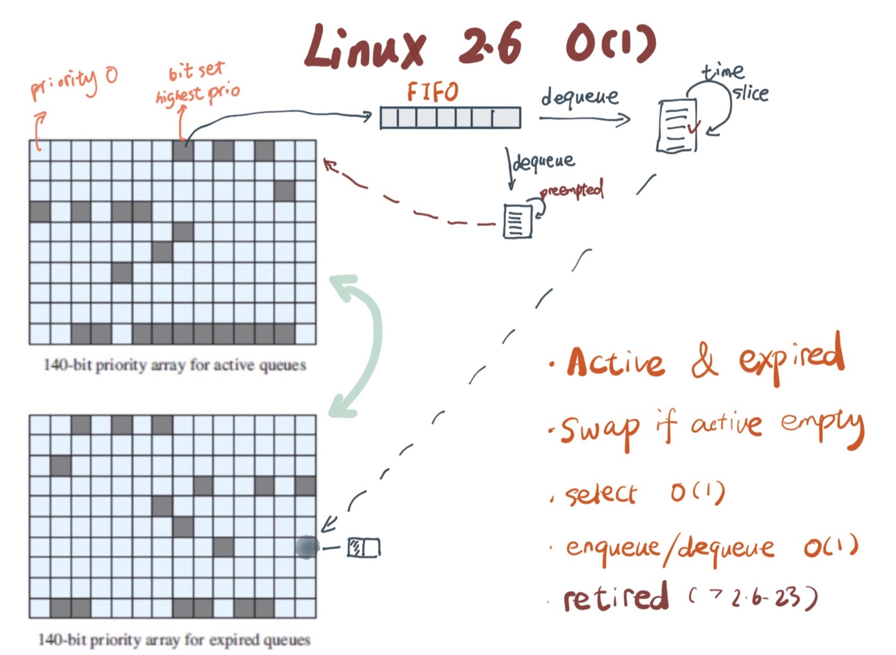

# 调度算法 - Linux O(1)

约莫十五年前，当我刚刚开始参加工作时，赶上 Linux 发布划时代的 2.6 内核。在这个大家都翘首期盼的内核版本中，最令人兴奋的便是 O(1) scheduler。本文来谈谈这个算法是如何实现的。不过，在详细讲解 O(1) scheduler 之前，我们先简单回顾一下让人诟病许久的 2.4 scheduler，了解其传承，同时以史为镜。

## 2.4 scheduler 的问题

Linux 2.4 scheduler 支持 SMP（Symmetric Multi-Processing），然而，由于只用一个 global runqueue，各个 core 需要竞争同一个 runqueue 里面的任务，所以可伸缩性（scalability）不好。我在上一篇文章中提过：

> 任务如何组织？是所有的资源共享一个任务的 runqueue，调度器调度时通过加锁来保证互斥，还是针对每个资源，我们都为其设置一个 runqueue，以减少锁带来的损耗？那么问题又来了，如果某个资源上的任务列表空了，资源是就此闲置，还是可以去别的资源的 runqueue 上「偷」任务给自己执行？

这个问题 2.6 O(1) scheduler 用 per core runqueue 解决这个问题，我们放下不表。

global runqueue 带来的性能问题其实还可以忍受，毕竟只是在 dequeue 的过程需要加锁；接下来这个问题，就很要命 —— 2.4 scheduler 的时间复杂度是 O(N)。我们知道，现代操作系统都能运行成千上万个进程，O(N) 的算法意味着每次调度时，对于当前执行完的 process，需要把所有在 expired queue 中的 process 过一遍，找到合适的位置插入。这不仅仅会带来性能上的巨大损失，还使得系统的调度时间非常不确定 —— 根据系统的负载，可能有数倍甚至数百倍的差异。我们知道，不确定性是软件系统的大敌，尤其是实时系统。

对于那些对2.4 scheduler 不太了解的同学咱们多说两句：2.4 scheduler 维护两个 queue：runqueue 和 expired queue。两个 queue 都永远保持有序，一个 process 用完时间片，就会被插入 expired queue；当 runqueue 为空时，只需要把 runqueue 和 expired queue 交换一下即可。

注意，所有调度系统的难点不在于寻找下一个可执行的 process，这个操作一般都是 O(1)，因为我们只要妥善对 runqueue 排序，使其第一个 process 永远是下次需要调度的 process 即可。难点在于执行完的 process —— 怎样插入到合适的位置使得 runqueue 是有序的？

## 什么样的数据结构有可能满足 O(1) scheduler？

根据我们在数据结构课程里学到的知识可以知道，大多数算法的时间复杂度，O(log N) 基本上就是最好的结果，那么，2.6 的 O(1) scheduler 是怎么做到的？

在回答这个问题之前，我们先回顾一下数据结构的四种基本操作以及其时间复杂度：

* access：随机访问。array 是唯一能够达到，且平均情况和最坏情况均能达到 O(1) 随机访问的数据结构。其它的结构，linked list 是 O(N)，tree 一般是 O(log N)。
* search：搜索。谈到搜索，大家第一反应是 hash table 是 O(1) 时间复杂度的。然而，它在最坏情况下是 O(N) 的。除此之外，没有任何算法能在最坏情况下 search 也是 O(1)。大部分 tree（b-tree / red-black tree）平均和最坏情况都是 O(log N)，次之。
* insert/deletion：插入和删除。插入删除是对等的操作，这里放在一起讲。linked list，stack，queue 在平均和最坏情况下都是 O(1)，而大家脑海里的 hash table，同样的，虽然平均是 O(1)，但最坏情况是 O(N)。大部分 tree（b-tree / red-black tree）平均和最坏情况都是 O(log N)，也还不错。

所以我们看到，如果想要达成 O(1) scheduler 的目标，操作只能包含纯粹的 access，insert 和 deletion。一定不能有 search。2.4 scheduler 在将执行完的 process insert 回 expired queue 时使用 search，大大拉低整个算法的时间复杂度。这是其一。

此外，对于 scheduler，我们选择算法，尽量要选择平均情况和最坏情况表现一致的算法。如果平均情况是 O(1)，最坏情况是 O(n)，那么这个 scheduler 会给系统带来很大的不确定性，这很伤脑筋 —— 毕竟谁也不愿意面对一个大部分时候表现乖巧，极端情况抽风到不可理喻的系统。这是其二。

在这两个先决条件下，我们可选择的范围就很窄 —— 随机访问只能用 array，insert / deletion 只能用 linked list / queue / stack。

接下来，我们把调度的场景简化一下：假设系统中有六个 process，三种优先级：high，medium，low。没有 preemption，严格按照优先级的顺序执行 process。那么，我们怎么组合上述的数据结构，让 scheduling 是 O(1) 的？

思考一下。

再思考一下。

## 2.6 O(1) scheduler

OK，我们直接看看大神给出的是什么样的答案。先看图：

看到这里，估计有部分读者已经领会到其中的奥义。2.6 kernel 里有 140 种优先级，所以我们就用长度为 140 的 array 去记录优先级。每个优先级下面用一个 FIFO queue 管理这个优先级下的 process。新来的插到队尾，先进先出。在这种情况下，insert / deletion 都是 O(1)。

那么，我们怎么找到当前最高优先级下面的可执行的 process 呢？如果从 0 开始一直遍历下去，算法虽然不是 O(N)，但是是跟优先级多寡相关的 O(M)，也不能算作 O(1)。在 2.6 scheduler 里，聪明的先贤们采用 bitarray。它为每种优先级分配一个 bit，如果这个优先级队列下面有 process，那么就对相应的 bit 染色，置为 1，否则置为 0。这样，问题就简化成寻找一个 bitarray 里面最高位是 1 的 bit（left-most bit），这基本上是一条 CPU 指令的事（fls）。

好，大致的思路齐备，我们来捋一捋完整的步骤：

1. 在 active bitarray 里，寻找 left-most bit 的位置 x。
2. 在 active priority array（APA）中，找到对应队列 APA[x]。
3. 从 APA[x] 中 dequeue 一个 process。
4. 对于当前执行完的 process，重新计算其 priority，然后 enqueue 到 expired priority array（EPA）相应的队里 EPA[priority]。
5. 如果 priority 在 expired bitarray 里对应的 bit 为 0，将其置 1。
6. 如果 active bitarray 全为零，将 active bitarray 和 expired bitarray 交换一下。

当然，这里面还有一些细节，比如如果是 process 被抢占，其时间片没用完，那么第 4 步，enqueue 回 active priority queue 中。不过这和算法本身没太大关系，我们略过不表。

## 历史地位

2.6 O(1) scheduler 目前已经被性能略输一筹，同时更加强调公平性的 CFS（Completely Fair Scheduler）取代，但其以独特的设计，简单的算法，影响很多系统。在其刚问世时，很多 linux 发行版就迫不及待将其移植回 2.4 kernel。而程序君整个职业生涯中接触过的一些调度器中，都能见到 bitarray + priority queue 的身影。它让我感慨算法之美，同时也告诉我：你手中即便拿着一副并不那么出众的牌，历经辗转腾挪，也能打出精彩。
