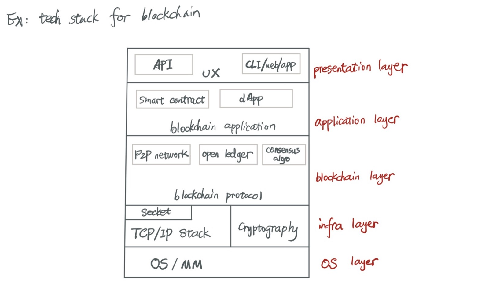
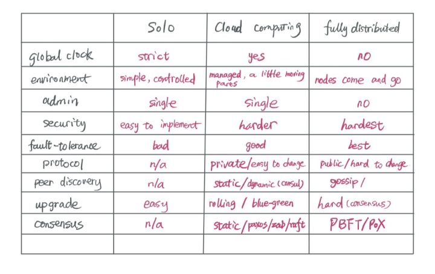
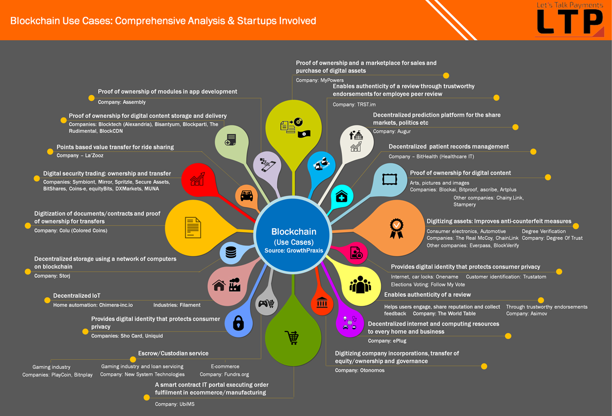
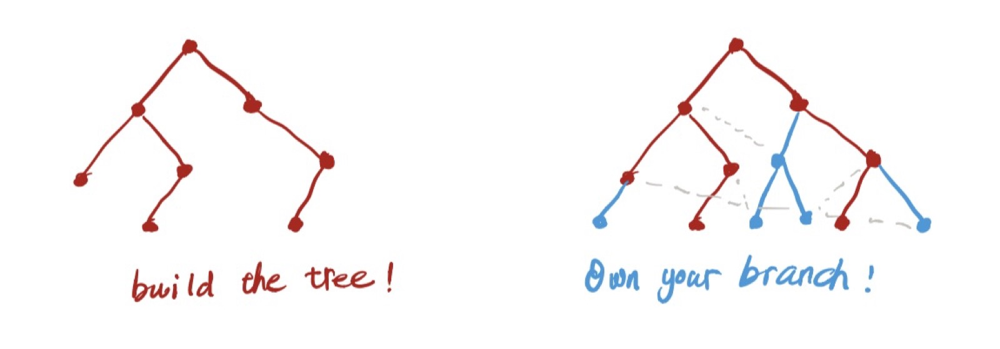

# 研究的方法

今天谈谈我自己做研究的方法 —— 它跟随我多年，且一直在演进和完善中。我虽然没有读过 PhD（希望有生之年能够尝试一下），但我自认为这法子并不算差 —— 至少，它让我能够更加高效地进入一个新的领域，并且扎根于其中。如果你一直在读我的文章，好奇为何程序君涉猎范围这么广（就是这么爱给自己贴金），又扎得比较深（被自己帅哭了），那么，你可以仔细读读本文 —— 还是那就话，希望它对你有用，能给你哪怕一点点启发。

## 从问自己「为什么」开始

Simon Sneak 说 Great leaders start with why。要进入一个新的领域，你要问清楚自己为什么要进来 —— 它可以是热爱，也可以是恐惧，两种情感都能把你推得很远。热爱是正向的情感，它表达了你的兴趣；恐惧是负向的情感，它意味着你担心失去某些东西。我们当然希望正向的情感促使我们前进，然而如果你做一件事情出于恐惧，也不必太过在意甚至自责，因为情感会随着境遇而转化。有多少人真的热爱加班？对失去一份前途无量的工作的担心，对自己在技术领域会落后于周围的人的忧虑让我们加班，我们投入了时间，做出了成就，这超出预期的反馈让我们开心，从而更愿意投入额外的时间在技术上。我大女儿刚开始学琴的时候很抗拒练习，哭着喊着不配合 —— 是对妈妈威胁弹不好就要在作业上画八叉，然后老师对作业上有八叉的小朋友会批评，且不给 sticker 的这种恐惧让她不得不完成练习。久而久之，练习得到了回报，弹出的乐曲优美动人，她渐渐对弹琴从恐惧到热爱，时不时会主动去练习，甚至研究同一首曲子的不同变调，把若干曲子 remix 起来，试图发明新的曲子。所以我们看到，恐惧支配下的努力，在得到回报后，很有机会转化成热爱。

所以好的研究领域，要么是足够前沿（激发热情），要么是能够弥补你目前所缺失部分（化解恐惧）。

当你选好一个方向后，下一步，就是 __了解这个方向的 big picture 和 status-quo__。

## 提纲挈领，掌握全貌

这一步很重要。上来就扎到细节里并不是一件好事 —— 这就跟画画一样，你先从左上到右下进行构图，把大的形状勾勒出来，然后对此不断递归，直到想要的细节被雕琢出来。

我们以 blockchain 为例。从技术角度来说，最大的 picture 可能是这样的：

这个 picture 下，有些是你比较熟识的，比如 TCP/IP stack，可以先放在一边；有些是新的技术，如 open ledger，可以对此递归，进一步细化。在这个过程中，要问自己很多问题：

* 为什么需要这个技术？它解决什么已知的问题？
* 它涉及到哪些内容？（下一步再递归）
* 整个技术发展的历史是什么样子？
* 如果有多个 solutions，每个 solution 的优缺点是什么？
* 给我一页白纸，我能否画出这个技术所涵盖的 big picture？
* 这个技术将何去何从？最新的方向是什么？

这些问题都很直观，我就不一一细说，他们都是很重要的问题，你需要在研究的时候对此进行回答，但更重要的是，找到你认为更重要的问题。

这里我讲三个要点：问问题，找历史，对比/类比。

忘记是谁说的了，__问对问题比找对答案更重要__。问问题的能力反应一个人的科学素养，经常能问到点子上的人科学素养会更高一些。问对问题依赖两个方面：1) 先验知识 2) 问问题的方法。前者需要慢慢累积，后者有方法，比如《麦肯锡方法》里面谈到问问题的方法，以及前人的经验可寻，比如我上文中的这个列表。

如果你也在看 bitcoin，你也许会有这些问题：

和数字相关：

1. 为什么 block 设计为 1M？
2. 为什么总体供给是 2100w，不是 2048w，不是 4096w，是 2100w 这样一个奇怪的数字？
3. 为什么 10 分钟出一个区块？为什么 6 个区块之后就可以认为之前生成的区块被确认了？
4. 为什么用 base58（WTF）？为什么不用我们熟知的 base64？
5. 为什么交易速度如此之慢，只有若干 tx / s？

如果你不对数字问为什么，你只能是数字的奴隶，是记忆者而难说理解者。

和思想相关：

1. 为什么要搞 open ledger？优点？缺点？
2. 为什么搞 chain？
2. 为什么 PoW？现有的方法为什么不可用？（呃，现有有什么方法？）
3. 为什么给矿工生成看似无意义的空区块的空间？
4. 为什么钱包的地址要 hash 一遍，而不是直接用 public key 的 base58?
5. 为什么设计 UTXO？
6. 为什么需要 merkle tree？
7. 为什么用 ECDSA 而不是 RSA？
8. 为什么 double hash？
9. 为什么用 little endian，而不是 big endian（network order）？

这个列表可以很长很长。

找历史是一个寻根溯源的动作，它能够让你的知识建立地更加体系化。这个世界上产生的每一样新的知识和理论都有前人的影子，就像牛顿说自己是站在巨人的肩膀上，他这不是谦虚，是事实。我们如果针对一个点去学习，学到的东西是孤立的，很难触发进一步思考的，然而，如果我们将历史代入，把一个个散落的点连成线和面，那么，我们可以更好地比较，综合，抽象。从而获取到属于自己的知识。比如说你看到 bitcoin 的 consensus，了解了 PoW 后，可以看看整个 consensus 的发展历程，知道 bitcoin PoW 来自于 hashcash，而 consensus 的基础问题是 Byzantine generals problem。那么还有什么处在这个 category 之下的 consensus 算法呢？PoS（Proof of Stake），PoI（Proof of Importance），DPoS（Delegated Proof of Stake），PoD（Proof of Devotion），PBFT（Practical Byzantine Fault Tolerance）...。等等，这些都是 blockchain 世界里的 consensus，也就是一个不信任的环境下的 consensus；那么，如果一个可信环境下的 consensus，是怎么解决的？于是，你了解了Paxos，Raft，还有 Zookeeper 所用的 ZAB（Zookeeper Atomic Broadcast Protocol）等等。这样，关于 consensus 的树状知识就有了。

在寻根溯源的过程中注意一点，不要过早耽于细节而迷失了方向。先找到 big picture，然后再细化，永远都是适用的。

追溯历史之后，我们得到一大堆的新名词，新知识，接下来要对他们进行对比和类比，从而归纳总结。对比/类比可以在很多维度上进行，让知识真正成为你的知识 —— 因为，在这个过程中，更多的问题在更多的角度被发现出来。

下面是我在看 blockchain 这种 fully unmanaged distributed system 时，想到的和 solo system，以及 managed distributed system (cloud computing) 的对比：

这虽然只有寥寥数行的比较，但其中凝结了很多思考 —— 纵轴究竟该选取什么维度？我相信你和我会得出不同的列表 —— 这是一个非常开放的思考，没有标准答案，只要有思考，只要去比较，就会有收获。

虽然我把对比和类比放在一起，这两者差别还是蛮大的。对比强调分类，归纳，总结，而类比更多强调引申，演绎。现在大家谈起 blockchain 都将其和九十年代的互联网类比，那么，九十年代的互联网出现了哪些成功的方向，现在 blockchain 又出现了哪些成功的方向？我们是否可以把早期的雅虎（网站的索引）和如今的币安（cryptocurrency 的索引）类比？那么新浪可以和什么类比？google 可以和什么类比？geocities 又可以和什么类比？

很多好的想法都是从类比中获得的，我前几天的文章里提到的 ArcBlock，其将 blockchain 的百家争鸣类比数据库技术的百花齐放，那么 ArcBlock 要做的就是 ODBC/JDBC 做的事情。ArcBlock 提供的服务是 aws for blockchain，清晰，明了。

## 了解现状

其实如果 big picture 按照上文的思路撸过，那么，status quo 就不攻自破了。还是以 blockchain 为例，其 status-quo 是什么？下面这张 slide 说的很清楚，我们在整理某个技术的 status quo 时也可以采用类似的方式：

（图片来源：https://gomedici.com/an-overview-of-blockchain-technology/）

## 以教促学

我在其他场合也提到过，我自己是「以练促学，以教促学」的的忠实拥趸和受益者。分享（知识）是一种快乐，也能让自己收获更多 —— 这便是所谓的「天下皆知取之为取，而莫知与之为取」。当我对所要研究的内容有个 big picture 后，深入细节时我会从如何把我所学到的知识教给别人这个角度研究学习。这个方法主要对我有这些帮助：

* 促使我更好地记笔记，将学过的内容汇总起来
* 强迫我用自己的话将知识复述一遍，巩固之余，还能防止「我以为我懂了实际没懂」的尴尬场景出现。
* 在将其传授给别人时，要么自己会意识到某些地方是 "I don't know that I don't know"，要么是听众问的你自己不会问的「小白」问题，促使自己意识到 "I don't know that I don't know"，从而得以对知识查漏补缺。
* (副作用) 提高自己的 public speaking 能力

## 偷师

前面说到，这个世界上产生的每一样新的知识和理论都有前人的影子。要想有所突破，仅仅在想突破的那个点发力是远远不够的，我们得先偷师前人，构建一棵完整的知识树。这里的偷师，不仅仅是学习，还包括复制，或者说刻意模仿。我丫头学琴，按着老师教的指法，学着视频里的动作，照着一篇篇乐谱，一遍遍练 —— 这便是模仿，非常非常刻意的模仿。人类（或者说所有生物）非常不善于模仿，花再多的功夫，也仅仅是无限接近原作 —— 比如你无法复刻我的笔迹，甚至我自己，抄十遍咏鹅，三十只鹅，每只都形态各异，总能发现些许的差别。然而，我们要感谢造物主为我们提供的这种 incapable / imperfect，他让我们能够活成我们自己。刚刚拿到奥斯卡的科比，在成为巨星的路上偷师过很多人，包括在投篮上偷师过乔丹和司机，在脚步上偷师过大梦等：

可是科比发现自己的身高，体型，臂展，肌肉力量等等所有这些特性都和他所仰慕的前辈不同，因而他无法精确复制（即便上图已经接近像素级），他需要调整很多来让他复制的技巧适应他的身体。即便每个经过改进的动作都有他所复制的巨星的影子，但这一切加起来，谁也不像，它只属于科比这个名字。这印证了那句老话：__如果从一个作者身上拷贝，那是剽窃；但从很多人那里拷贝，那是创新。__ 当然，拷贝并非复制粘贴那么简单，就像科比，迎着凌晨四点钟的太阳，一遍又一遍苦练，并且不断思索：为什么这个动作要如此展开？姿势要如此角度？如何让这个动作更加适合我？

于是他拷贝的不仅仅是 style，还是背后的思考过程 —— 这是内化（internalize）的一部分。

模仿，拷贝，思考（问问题），内化，博观约取，厚积薄发。之后你就拥有了你的 branch：

这是我们自出生那一刻（或者说成为受精卵那一刻），花一辈子要做的事情：在继承了父母九成多的基因后，点亮一个新的分支：你自己。

这个话题我再多啰嗦两句。最近突然流行起了「古典互联网」和「古典区块链」之说。有个朋友小窗问我怎么看 xxx 白皮书，我说我还在吭哧吭哧看 bitcoin。朋友来了一句：现在都 3.0 了，你怎么还在研究 1.0 的「古典区块链」？

WTF！Are u OK？Are u zhengde OK?

你可以用「古典互联网」和「古典区块链」自嘲，但不可以自我否定（如果你身处其中），也不该粗暴地蔑视那些并不在风口浪尖的东西。我们要对前人的智慧保持敬畏，而对满嘴 buzzword，堆叠概念却不求甚解的行为远离 —— 大大不是总告诫我们：见善如不及,见不善如探汤么？没有树根，树干，树枝支撑的树冠是个空中楼阁，无法长存的。

## 尾声

其实还有很多内容可以讲，但是我想就此打住。最后一点：给自己一点点耐心，再来一点点耐心。莎翁说：人生如舞台，有时候你在前台，有时候在后台。做研究，大部分的时间都是吭哧吭哧慢火细熬的功夫，是后台，是里子，是鲲化成鹏之前的沉潜浮动。水击三千里，抟扶摇而上九万里固然轰轰烈烈，气吞山河，但在那之前，要耐得住寂寞，留得住青山。

然而事情并不一定按照你预期的方向去走，你上台时，盛宴也许已经结束。这你得认。君不见 bitcoin 矿工空算几亿亿次 hash，最后竹篮打水一场空么？那矿工们还是照样抖抖衣襟上的泥土，心疼电表一秒钟，继续算下一个 block，直到属于自己的时机到来。王家卫用「一代宗师」告诉我们：人活一世，有的人活成了面子，有的人活成了里子，都是时势使然。Neil Gaiman 说 Make good arts。这是做研究要有的态度。
