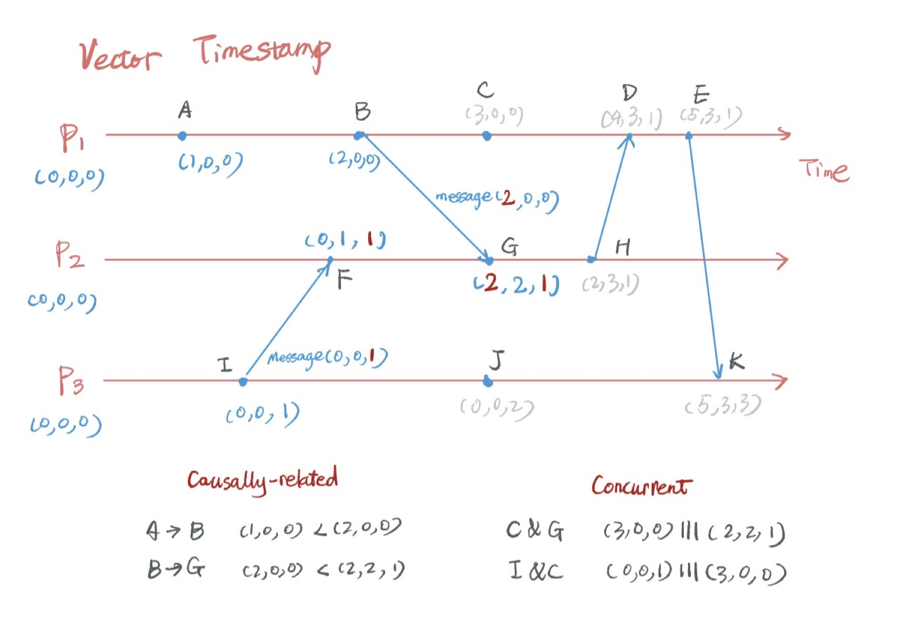
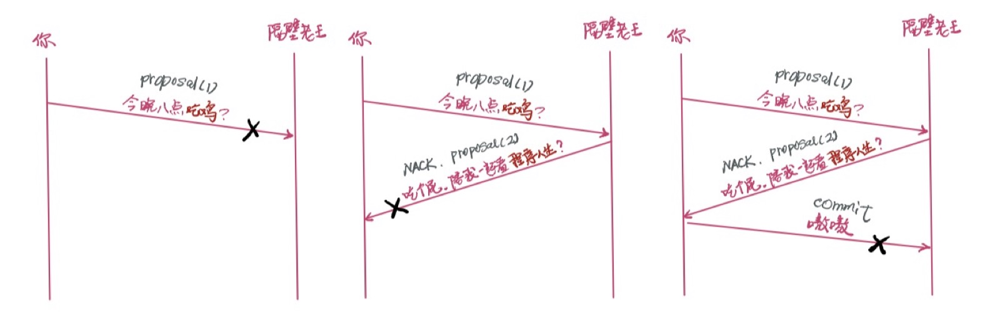
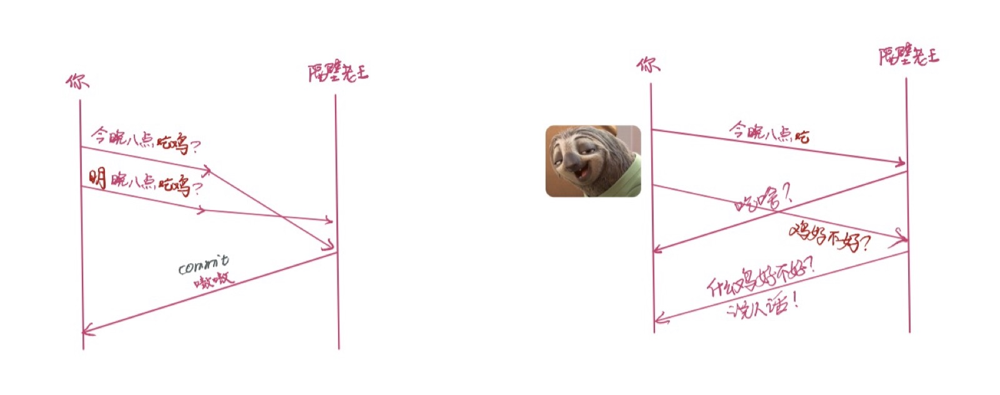
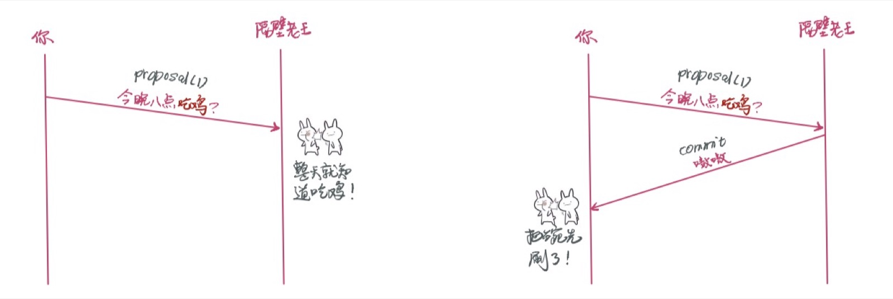
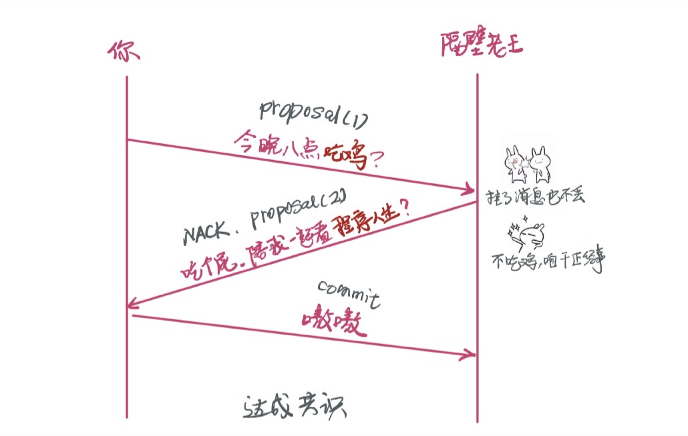

# 谈谈分布式系统

最近一个多月，谈论 blockchain 的人如此之多，以至于连菜头叔都写了篇文章「韭菜席地而坐」。我在朋友圈里转了这篇文章，评论说：

> 区块链是对此钻研的技术人，场内人士，以及为所有参与者提供服务的人的盛宴，因为他们对此深思熟虑，并且有金钱以外的付出。那些听风就是雨的参与者，仅仅花费时间在 telegram 里打听小道消息，盯盘讨论涨跌的人，都是韭菜，大小而已。

有朋友问，那做技术的，怎么入行？

我虽不算入行，但知道技术是一脉相承的 —— blockchain 不是像孙猴子凭空从石头里蹦出来的，它有它的根。如果把一门门技术看做一棵棵拔地而起，随时间渐渐丰腴而枝繁叶茂的榕树，那么 blockchain 是若干棵已然成年的榕树交织而成的新枝（branch） —— 它快速成长，活力无限，树冠已然盖住了其它 branch 的锋芒。如果你直接爬到它的树冠上，想要抓其脉络，在纷繁复杂面前，会迷失方向；但若你从根部细细往上捋，线索就如钱老笔下的「真理」，赤裸裸而一览无遗。

今天我们先寻其最重要的一个根：分布式系统。这个题目对互联网从业者来说，看着可笑，谁敢说自己不了解分布式系统啊？然而，如果你只是躲在 load balancer 后面做些 stateless 的 service，而没有真正去面对分布式系统那种让人愉悦并忧伤着的不确定性，那么，你可能并不真正了解分布式系统，因而本文还是值得一读。

依旧例，我们还是先看 wikipedia，把概念先熟络起来：

> A distributed system is a model in which components located on networked computers __communicate and coordinate__ their actions by __passing messages__.[1] The components interact with each other in order to achieve a common goal. Three significant characteristics of distributed systems are: __concurrency of components__, __lack of a global clock__, and __independent failure of components__.
> - Wikipedia

其中的的关键词我已经勾勒出来：communication / coordinate，message passing，concurrency，lack of global clock，independent failure。我们看看这些东西，是如何引发不确定性的。

## global clock

我们先说说全局时钟 —— global clock。它是分布式系统诸多难题的根源之一。

在单机系统里，无论是 SMP 还是 NUMA，有且只有唯一的全局时钟，这个很容易办到。

时间是什么？抛开相对论，在狭义的局部时空中，时间是因果的表象 —— 一个 cause 引发了一个 effect，这种因果产生了时间的概念：用时间（过去，现在，未来）可以更好地描绘因果。我们在 t0 执行一条指令，t1 得到结果，这结果不可能出现在指令执行之前，这便是时间带给我们的确定性。所以，一个系统有一致的，大家都认可和遵循的时间，非常重要。

在分布式系统里，每个系统都有自己的时钟，即便用 NTP（Network Time Protocol）同步，大家也无法严格步调一致；就算时钟的差异小到可以忽略不计，但取决于带宽，当时的拥塞程度，CPU 的繁忙程度，多个系统互相之间发送消息的延迟还是非常地不确定。就跟一个团队去会议室开会一样，如果都根据自己的手表来决定进入会议室的时间，那么肯定会不一致；即便手表时间一致，大家的走路的速度不同，最终进入会议室的时间，也是不一致。这种不一致会带来很多问题，比如说 out of sync —— 大家都散会了，Alice 才抵达会场，所以她缺失了很多状态的更新，于是她不知道手上的下一件事该做还是不该做。所以在分布式系统里很多时候我们需要一致性，来确保某些东西是有序的，大家在同一个 page，否则这个系统会走入歧途。

要解决因为时钟不同，步调不一致而导致的 out of sync 的问题，我们需要设法形成一个逻辑上的「时钟」，让大家都认可这个「时钟」而不是自己的时钟。这个逻辑时钟的第一个实现是 Lamport timestamps（请记住 Lamport 这位图灵奖获得者，分布式系统的先驱，下文他还会上镜）。Lamport timestamps 学术价值大于实际价值，并没有系统实际使用，然而在它之上演进出的 vector clock 广泛被 AWS S3，DynamoDB，Riak 等系统采用，用于确保同一个 object 的因果关系。我们看看 vector clock 的实现：

这个算法的思想很简单：所有 node 都有一个包含所有 timestamp 的 vector，这是个逻辑「时钟」。每个独立的 node 自行处置属于自己的 timestamp，使其有序；但当需要 coordinate 的时候（A 发消息给 B），node A 要发送自己对「时钟」的掌握情况，node B 收到后，更新 vector 里所有比自己已知更大的 timestamp。算法如下（请自行 wiki 以获得更准确的信息）：

1. 每个 node 都有一个 timestamp vector，初始化为全 0。
2. 如果某个 node k发生了某个事件，将其对应的 vector[k] + 1。
3. 如果 node k 给 node j 发消息，那么先将 node k 自己的 vector[k] + 1，然后将整个 vector 连同 message 一起发给 node j，node j 将自己原有的 vector[j] + 1，再把 node k 发来的 vector 和自己合并（找最大值）。

通过 vector clock，虽然没有绝对的 global clock，但是我们在分布式系统里能够保证因果，从而消灭了在这个维度上的不确定性（还有其他不确定性！）。

我们可以看到，vector clock 的算法严重依赖于节点间的信任，所以它只适用于一个可信赖的分布式环境。而作为运行在节点间互相并不信任的 P2P 网络上的 bitcoin，无法确保这一点。那么，类似 bitcoin 这样的分布式系统，是怎么决定时间（因果）的呢？中本聪在 bitcoin 的设计中，巧妙地应用了 PoW 的产物，block 来作为系统的逻辑时间：

> The solution we propose begins with a timestamp server. A timestamp server works by taking a
hash of a block of items to be timestamped and widely publishing the hash, such as in a
newspaper or Usenet post [2-5]. The timestamp proves that the data must have existed at the
time, obviously, in order to get into the hash. Each timestamp includes the previous timestamp in
its hash, forming a chain, with each additional timestamp reinforcing the ones before it.

所以，blockchain 不但承载了 ledger 的功能，chain 上的一个个 block 还是一个个 timestamp，代表着这个系统的过去，现在，以及未来，从而协调整个分布式系统步调一致地前进（且让我再奶一下聪哥）。

看到这里，我相信很多人有个疑问 —— 程序君，为什么我做的分布式系统既不用关心 vector clock，也不用 PoW，整个系统也木有 global clock，怎么还一样运行得好好的？没错。你没有感知，并不代表它不存在或者不重要 —— 你的系统里的 postgres，consul，kafka，或者说，分布式系统里一切看似中心化的部分，都使用了类似的机制，只不过它们帮你把这些细节屏蔽掉而已。

## coordination / communication

好，了解了 lack of global clock 带来的不确定性，以及如何应对这种不确定性，我们再看分布式系统里下一个会引发不确定性的基础组成部分：沟通协作。

单机系统，协作和沟通也是件轻而易举的事情 —— 同一个线程，在 stack / register 上同步（取决于 ABI）；不同线程，semaphore；不同 CPU，spin lock，memory barrier，反正大家生活在一个屋檐（时钟）下，咋都有办法。

分布式系统下就尴尬了。隔壁老王之所以被称作隔壁老王，是因为你们两家之间至少有一堵墙（住大 house 的有两堵墙），所以在无法四目相对的情况下，你们沟通基本靠吼。吼是个文言文，在现代计算机文明中，我们管它叫：发消息（message passing）。

发消息前先要确保有合适的信道，你得先确保这个信道建立成功并且可以信赖：

所谓可信赖，就是消息在网络上不会丢失，我只要发了，对方的 application 就一定能收到（避免下图所示的不确定性）：

而且既不会像下面这样乱序，也不会把 partial message 交付给 application（保证消息的完整性）：

有了可信赖的信道，我们可以通过 message 来达成共识。我们先看两个人达成共识会遇到什么障碍：

发送的节点或者接收的节点可能会 crash —— 即便网络层保证了 application 一定会收到消息，但我们无法避免 application 在处理消息的时候挂掉。因而，message delivery 有两种策略：**at least once** 或者 **at most once**。at least once 是指同一个消息会被传输 1 到 n 次，而 at most once 是指同一个消息会被传输 0 到 1 次。这很好理解，如果 messaging system 内建了重传机制，并且将消息持久化到磁盘中以保证即便进程崩溃消息依旧能够送达，那么这就是 at least once。反之，如果没有构建任何上述的机制，消息送出后就并不理会，这是 at most once。在一个网络环境中，消息的送达只能是上述两种情况，不可能 exactly once，如果有人这么说，那么一定是在误导。

at least once / at most once 并没有解决不确定性的问题，所以我们还得再努努力 —— kafka / AWS kenisis / AWS SQS 实现了 essentially once 的 message delivery 机制。essentially once 是 at least once 的变种，它需要消息层和应用层同心协力 —— 应用层处理完消息，主动告知消息层，令其删除对应的消息。如果你用过 SQS，应该能感受到这一点：SQS 保证当一个 application 在处理某个消息时，消息对分布式系统里的其他人是不可见的，如果 application crash，消息会在 visibility timeout 后重新可见，如果 application 处理完毕，需要显式地删除这条消息。

最终，我们可以通过消息传递的机制，来达成一致：

到目前为止，我们所谈论的还主要是仅有你和老王参与的 message delivery 的问题。在一个分布式系统里，任意两两节点间都可能有消息往来，而由于缺乏全局的时钟，我们无法保证消息是全局有序的（TCP 只能保证相同发起人发送的消息时有序的），通过 vector clock 或者类似的机制，我们可以进一步保证消息在因果关系上是有序的。这在大多数情况下，已经足够好。

然而，在众多参与者的情况下，即便我们保证了消息局部以及在因果关系上有序，我们还是无法保证所有参与者达成共识。如果大家就该不该做一件事情（比如来了一条数据，怎么写，写到哪，谁来写等）无法达成共识，那么，这样的系统依旧是不确定的。

于是有了 2PC（2 phase commit），3PC，Paxos，Raft 等在可信环境下的共识机制；同样的，对于 blockchain 所面临的不可信环境下（Byzantine General probelm），诞生了 BFT / PBFT，以及 PoW，PoS，DPoS，PoI，PoD，PoDDOS 等一堆 P 字辈靠谱或者不靠谱的共识算法（很快，P 都不够用了）。限于篇幅，关于共识算法，我将另行撰文讨论。

如果你更多了解消息系统及消息传递的 pattern，可以看看我之前的文章：0MQ 的世界（再沉痛悼念一下 Pieter Hintjens）。

## 分布式系统中的坑

上文中我们已经把分布式系统中最基本的要素过了一下。接下来我们踩踩坑。

坑一：network is reliable。我们在消息传递中，费尽心思做了很多事情，就是在跟并不 reliable 的 network 斗争。其实 packet loss / out of order 是属于还好解决的问题；不那么好解决的问题是：split brain（脑裂）。split brain 是基于 asymmetric consensus 的分布式系统（亦即常见的 master-slave cluster）的梦魇，一旦 master 过忙，导致 slave 认定它应该卸任，slave 接管后，因为冷启动，也变得太忙，于是又切换回去 —— 于是 master / slave 都在一定时间内异常繁忙，replication 失败，数据出现不一致，接下来双方都认为对方 down 掉，自己成为 master。这就是 split brain。这种级别的问题，修复起来都麻烦（尤其是对于使用了 autoincrement，然后又被 foreign key 引用的数据）。

坑二：消息传递的 latency 可以忽略不计。我们知道网络的 latency 是大致等于两点间距离除以光速。北京到旧金山，极其理想的情况下，一个 round trip 也要 63ms（9516 x 2 / 300, 000）。这是一个不小的时间了，如果使用停等的方式互相确认详细，1s 仅仅能打十几个来回。下图是一个完整的计算机系统里各个部分的 latency 的量级的介绍，大家都应该好好读读，心里有个谱：

坑三：网络带宽不是问题。在 cloud 里，带宽不是问题。但由众多家庭用户参与的 P2P network，带宽，尤其是上行带宽是明显受限的。我家的百兆网络，上行经常也就是 12Mbps。我在上一篇文章 比特币浅析 里谈到为何比特币使用 1M block，是因为如果这个网络的初衷是所有人都可以参与进来，那么，要考虑到普通用户的带宽承受能力。假设你的电脑费劲巴拉算出一个区块，你要立刻将其广播到 7 个邻居，如果 30s 内完成广播，那么你需要 1.86 Mbps（1MB x 8bit x 7 peers / 30 sec）的带宽；如果 block 是 8M，那么你需要 15 Mbps 的上行带宽。所以，如果设计运行在 cloud 里（> 1Gbps）的分布式系统，可以不必太过在意带宽，但是要做一个人人都用的起的 blockchain，起码不要拍脑门设定 block 大小。

坑四：参与的节点是同构的。像 bitcoin 这样的分布式系统，参与的节点小到手机（钱包软件），大到专门开发的带有 ASIC 或者 GPU 阵列的矿机，不一而足。它们所使用的网络，从 wired，wireless 一路到 cellular，satellite。所以我们要考虑到区别如此之大，范围如此之广的参与者。矿机自然要获取全部数据，但你让手机用户还下载 160G 的 chain，那就是强人所难。bitcoin 对此专门考虑到 blocker headers + merckle tree path + SPV 的方案，允许小型设备只需下载少量数据（几百兆），就可以充当钱包，验证和自己相关的交易。这是我们需要学习的。

## CAP 理论

分布式系统中，绕不过去的一个话题是 CAP 理论：即对于 Consistency，Availability 和 Partition tolerance，你只能保证其中两个，而牺牲第三个。

我来简单解释一下：

* Consistency：所有客户端看到的同样的数据。这里所说的 consistency，是指 atomic consistency (linearizability)。
* Availability：每个客户端任何时候都可以读写。
* Partition tolerance：当网络出现 partition（split brain）时，系统仍旧可以工作。换句话说，为了能够支持 Partition tolerance，系统需要能够容忍任意多的消息的丢失。

谈论一个系统是 CA，CP，还是 AP，其实是把复杂的问题过分简化。但分类有分类的好处：它便于比较和记忆。

MongoDB 在上图中被我归到了 CP，这是因为写入是缺省 safe=true，也就是牺牲了 Availability，只能写入 master。然而，这种情况下，MongoDB 仍然难说是 Consistency 的，只有当 readConcern 设为 linearizability，才算得上 Consistency。所以，MongoDB 的 CP 属性很勉强，不同的设置下很难将其归属到某一个分类中。

现在的分布式系统，其实对 CAP 三者都有考虑，只不过是优先级的问题 —— 我更看重哪两个，而愿意牺牲第三个？MySQL 在 master/slave 的配置下，牺牲了 partition tolerance，但我们也可以将其配置成 cluster，牺牲 Availability，才成全 Partition Tolerance。
