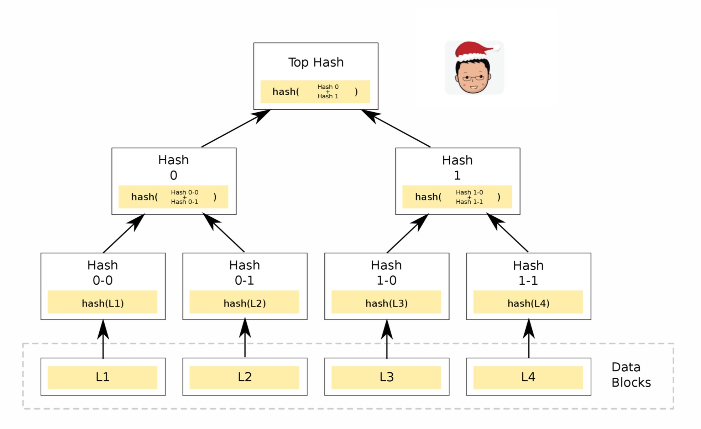

# 诚者，天之道也

> 居下位而不获于上，民不可得而治也。获于上有道：不信于友，弗获于上矣。信于友有道：事亲弗悦，弗信于友矣。悦亲有道：反身不诚，不悦于亲矣。诚身有道：不明乎善，不诚其身矣。是故诚者，天之道也；思诚者，人之道也。至诚而不动者，未之有也；不诚，未有能动者也。 - 孟子

这次 Code Beam，我演讲的题目是：Build a decentralized, public-verifiable DB。过去两年，区块链热热冷冷，催熟了好多流星般的 buzzword，也造就了不少值得深入探讨的概念，比如说：公开可验证 (public verifiable)。公开可验证探讨的是信任 —— 我们如何在不信任对方身份的情况下信任数据本身。互联网时代，信任是基于身份的，或者说基于权威的 —— 我们信任微信上的好友数据，google 上的搜索结果，无他，是因为数据的来源是微信 Google 这样的巨头们。我们「信任」这些巨头们，不是因为我们真的相信它们 __不作恶__，而是我们 __别无选择__，只能从经济学的角度一厢情愿它们作恶的代价大于不作恶的代价。

拿 Code Beam 的门票来说。我们愿意信任 Eventbrite 并从其购票，是因为 1) 它是这个领域的权威 2) Code Beam 在这个平台上面售票。对于购票者来说，我们把信任寄托于：1) Eventbrite 会诚实地存储我购票的记录以供 Code Beam 验证；2) Eventbtite 的数据库足够安全，数据不会损坏，丢失，或者被恶意篡改。3) 即便数据损坏或者丢失，Eventbrite 也有足够的备份把数据恢复到一个合理的状态。

作为一个工程师，我们都知道这种信任是多么的脆弱。对于一个数据库系统，我们虽然设置了层层访问权限，费尽心机地考虑灾备，但可悲的是，我们一切操作的基础都建立在数据本身是可信的。所以所有的安全手段，都是在确保数据的访问者只能处理给予他权限的数据，比如说我们只允许用户 Tyr 往 asset 表里添加数据，不能修改，不能删除 —— 那么，只要 Tyr 登录了数据库，即便往 asset 表里随意涂鸦（只要符合定义好的数据类型），数据库也照单全收。

是的，我们使用的一切数据库系统，无论是 postgres 还是 riak，不管是 aurora 还是 dynamodb，只要撰写数据的用户拥有写的权限，他可以写任意真实的或者虚假的数据。

换言之，数据的可信并不是建立在数据可信本身，而是建立在数据所赖以生存的环境是安全的。因为我们信任数据所处的环境，所以我们信任数据本身 —— 多么完美的逻辑！这让我想起了某集 Mission Impossible 里，阿汤叔跳入一个藏匿在大坝底下的数据中心，替换了数据卡而成功篡改 Benji 的身份的场景。

有没有办法，在数据输入的时刻，我们就可以保证数据的完整性和不可篡改性？

答案很简单 —— __数字签名__。

为了行文方便，我们假设有一个人人都可以访问的数据库 Cyberbase —— 任何人都可以往里面写入和自己相关的数据，而无需批准。数据库只接受那些签名正确的数据，并且按照一定的规则更新数据库。

比如我要把我的微信年龄修改成 18 岁。在目前的系统里，我告诉微信：「拜托请把我的年龄改成 18 岁」，然后微信告诉数据库：`update user set age = 18 where id = 'a008374856...';` 而在 Cyberbase 里，我用我的私钥签名一个事实（fact）：`Tyr 今年 18 岁`。对于这个 fact，我们更新数据库的规则是：如果发起人 (sender) 的签名正确无误，那么我们执行 `sender.age = 18`。这样，关于 Tyr 的 fact，只能由 Tyr 来陈述，如果一个第三方 —— Alice 想改 Tyr 的年龄，因为她没有 Tyr 的私钥，无法正确签名，所以无法伪造有关 Tyr 的 fact。

讲到这里，我们看到传统的数据库和想象中的 Cyberbase 的第一个重要区别：传统数据库不在意数据的正确性和完整性（这个需要应用程序来保证），只要发起更新的 client 是被授权的用户，就直接 __盲目__ 更新状态，而 Cyberbase 从输入源上，就对输入的事件验真，只有签名有效的 fact 才会被有条件更新。

有了 fact 这个基础，并不能保证在 Cyberbase 里的数据是没有被篡改的。即便依照之前 Tyr 提供的 fact —— Tyr 的年龄被更新成 18 岁，我们也无法保证它不会被篡改为 81 岁。因而我们需要某种机制来确保任何对 Tyr 年龄的非法更新都会被发现。注意这里我们并不去确保非法更新不会发生 —— 因为没有绝对安全的系统和环境，一件事情可能发生，它就将会发生。我们需要控制的是发生之后的影响。

要做到这一点也并不困难。我们可以使用 Merkle tree，对零散的原始数据进行不断地归并和 hash，构建一棵最终聚合到一个 root hash 的树。在这颗树中，任何对数据的更改，都会导致其 hash 变化，而 hash 的变化又会影响归并之后 hash 的变化，这样一路上去，root hash 必然变化。这对篡改数据提出了挑战：在现有的数学模型下，任何算法都无法篡改数据本身而不一层层反映到 root hash 之中。因而，只要每次更新我们 __妥善存储__ root hash，数据的篡改就一定会被发现。就像 Tyr 的各种数据汇总到 Tyr 的脸上，你一看这张脸，就能把 81 岁的谎言拆穿。

嗯，妥善存储 root hash。黑客爸爸如果把 Tyr 年龄都改成 81 了，自然能够层层修改 hash，自然也是可以修改我们妥善存储的 root hash。如果 root hash 也被更改了，那么伪造的数据也被 Cyberbase 信任了，这是不能接受的。所以在存储数据的地方同时妥善存储 root hash 是个伪命题。

那位说了，把 Tyr 的脸存银行的保险柜里就好了，这样，想要知道 Tyr 的年龄是否被篡改，我们只要去银行打开保险柜一看不就行了。这有两个问题：1) 这样的操作代价不菲，无法 hold 住一个系统数据更新的频次 2) 如何保证这个通讯所使用的信道的安全，如何验证信道那边返回的的确是真实的数据，而非赝品？

有点方。

我们换个角度，既然存自己这里不安全，存别人那里不可信，那我干脆昭告天下，让每次数据的更改所生成的 root hash 全网周知？这样，只要黑客没有把所有掌握了这个知识的多数人都洗脑（超过 1/3），他就无法成功篡改数据。

这样就解决了存储 root hash 而不必担心数据被篡改而无法发现的问题了。

我们稍微总结一下 Cyberbase：通过对所发生的事件签名，每个人都独立生成了一条条和他有关的可验证可信任的 fact，这些 fact 根据某种规则写入 Cyberbase，成为数据库中的状态 (state)。数据库中的状态用 merkle tree 组织起来，得到一整条信任树，树根是 root hash，通过把 root hash 在网络中广播出去，我们大大提高了黑客作恶的门槛，让数据被篡改变得代价大到不可行。

到目前为止，我们没有依赖任何环境上的安全 —— 无论是物理安全，网络安全还是操作系统安全。我们依赖的是植根于数学的加密算法，和预先设置好的规则，端到端保证数据是可信的。

这里还缺一个重要的环节：谁来保证规则的执行是无误的？Cyberbase 可能运行在有问题的磁盘上，导致即便正确执行规则，最终写入磁盘的数据和读出来的数据并不一致；也有可能黑客修改了描述规则的代码，导致可信的 fact 被不可信的代码提交到可信的 state 上，最终得出不可信的 state。

所以我们需要让任何人都可以运行 Cyberbase。网络中任何一个运行 Cyberbase 的节点，都可以不断接受 fact，按照预定的规则 __独立__ 执行之。只要大家的初值相同 (genesis data)，收到的 fact 以及其顺序相同，在相同的规则下，会得到最终相同的 state，也就是相同的 root hash。这样，单点的故障或者其规则被篡改，并不会影响大局 —— 黑客想成功篡改数据，必须篡改足够多的节点 —— 这个网络越大，节点越分散，攻击的代价就越大。

这便是去中心化 (decentralization) 和公开可验证 (public-verifiable)。如果我们构建一个这样的 Cyberbase，我们不需要信任任何人，只需要信任宇宙万事万物运行的基石 —— 数学。基于此，它构建了一种美妙的平等：数据面前人人平等 —— 我们对巨头提供的服务和个人提供的服务，在信任这个维度，是一视同仁的。如果说印刷术和文艺复兴让知识打破了只有上层社会（贵族，僧侣）才能拥有的垄断，让知识面前人人平等；信息革命和互联网打破了信息只有少数人 (电视台，出版社，杂志报纸等媒体) 才能创建和分发的垄断，让信息面前人人平等；那么，Cyberbase 背后的区块链技术有机会打破可信的数据只有少数人 (Google，微信，Facebook 等互联网巨头) 才能拥有，让数据面前人人平等 —— 换言之，每个个体的竞争优势在于对数据的分析处理，对用户体验的把握，而非对数据的垄断。
