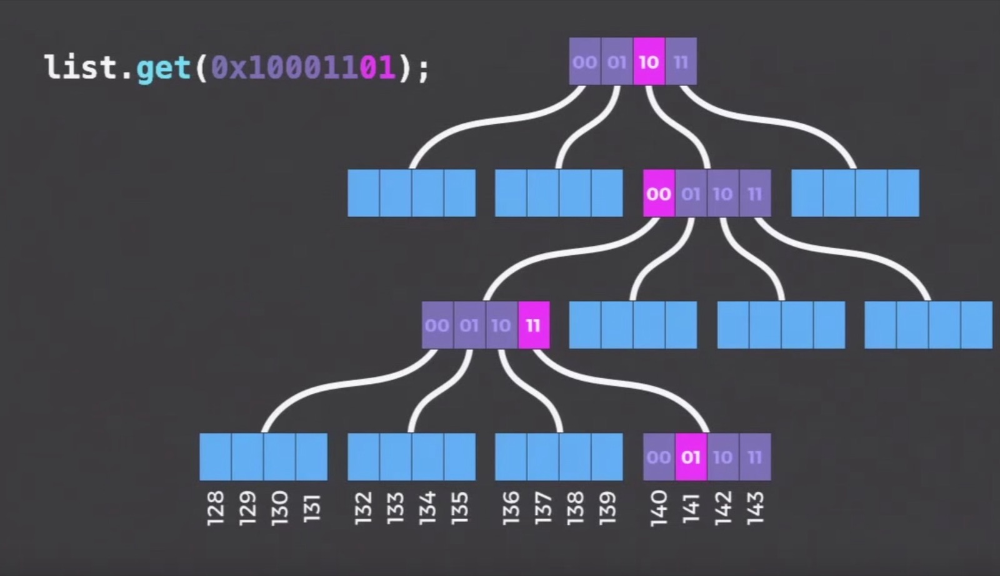
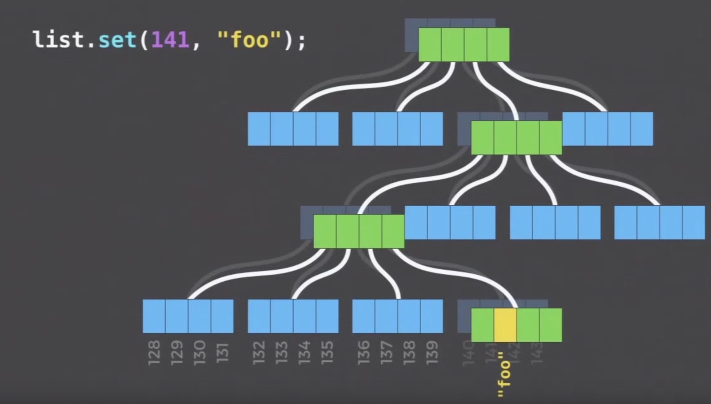
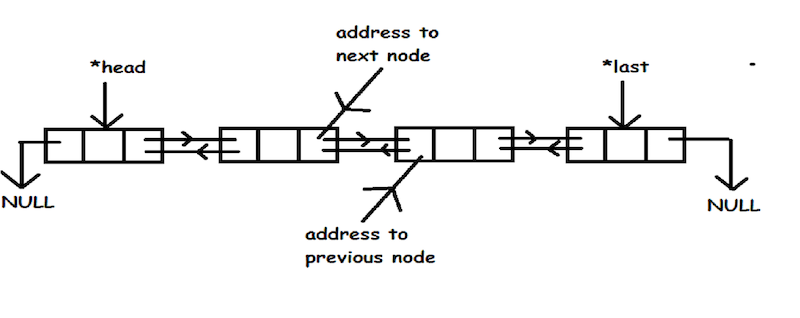
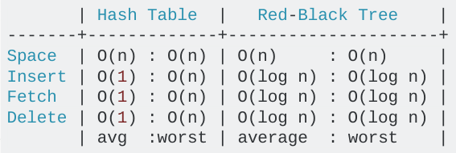

# 谈谈数据结构

沃斯大神说过，程序 = 算法 + 数据结构。

程序君认为，等式的右边，数据结构的权重要大于算法。数据结构定义好，基本上，你所用的算法也就确定了，算法的时间复杂度也八九不离十。上周，我在 team 内部分享了一个关于数据结构的主题，在这里，也和诸位分享。

现代的编程语言，内置的数据结构越来越多，从 primitive 的类型：integer, float, boolean， string，一路到 complex 结构，如：array，list，map，set 等。这些结构即插即用，非常顺手，可是有时我们也需要了解其内部的实现（内部的数据结构），从而更好地打造高性能的应用。有些「聪明」的语言，如 clojure，会根据使用场景动态地切换内部的结构，比如说 map，当 key 的数量超过某个阈值，便会自动换成更高效的结构来应对需求。

今天，我们就来扒一扒，编程语言中的常见数据类型，其内在究竟是怎么一回事。

## array / tuple

array 或者 tuple，是大家最熟知的容器型的数据类型，其内部可以承载其他数据结构。他们的特点是容器里的元素被分配在连续的内存中，可以按照 index 随机访问，时间复杂度是 O(1)。array 一般要求内部是同构的数据结构，而 tuple 则允许异构。

对函数式编程语言，或者提供 immutable data structure 的语言，高效地处理 array 是个挑战。如果代码中修改了 array 中的某个元素，拷贝并重新生成整个 array 的代价太大。我们需要一种合适的数据，能够在结构上共享大部分不受影响的数据。这种数据结构，便是大部分函数式编程语言使用的 persistent data structure。persistent data structure 用 DAG（一般是一个 Trie）来描述数据，当 DAG 某部分发生改变，只需要重新生成和改变相关的路径上的节点即可，非常高效。对于 array，我们可以使用 Bit Array Mapped Trie / Index Vector Trie：

通过把 index 的二进制切分并进行 trie 的遍历，对应的叶子节点就是要找的节点。如果我们要修改这个节点的内容，在原有结构保持不变的情况下，我们只需要生成一个新的 node，并生成这条路径上一直到根节点的相关中间节点即可。需要额外拷贝的内容仅仅和 trie 的深度有关。

## List

大多数编程语言，提及 list，其内部一般是个带尾指针的双向链表。因而，在头部或者尾部添加新的节点非常高效，是 O(1) 的操作，然而查找，插入，删除则需要遍历链表，是 O(n) 的操作。由于是链表，获取链表的长度一般而言也需要遍历，是个 O(n) 的操作，有些编程语言会为其优化，在链表的头部维护链表的长度，这样获取长度的效率则为 O(1)。请注意弄清楚你用的语言，这个操作的效率如何。对于 erlang，``length`` 函数是 O(n) 的复杂度，因而对大列表的 ``length`` 操作不要滥用。

## Map

map，在很多语言里，被称为 associate array (php)，dict（python）等。他是一个 key/value pair 的容器。理论上可以容纳任意数量的 key/value pair。在 map 中，key 是唯一的，key 和 value 一般都可以是任意数据结构。当 key 只能是 string 时，有些语言会使用标准的 trie，或者 patricia trie 来处理。

早期的 map 用 hash array + collision avoidance 实现，典型的 collision avoidance 有 chaining 和 probing。一个 key 经过某个哈希函数后，对应 hash array 中的一个位置，如果这个位置已经有数据，要么，把数据 用 linklist chain 起来，这是 chaining；要么，在 array 中随后的某个固定位置找到（probe）一个空闲的 slot，写入，这是 probling。

chaining 的问题是如果 key 的数量大大超过 hash array 的长度，冲突会很严重，从而大大拉低性能。最坏情况下，时间复杂度是 O(n/k)；probing 的问题是 hash table 必须和 key 空间一样大，如果 hash 函数选得不好，容易造成大面积的冲突。对于支持动态增减 key 的 map 来说，常常需要扩大 hash table，然后 rehash，内存和计算的代价都不小。python 的 dict 便是使用 hash array + collision avoidance 实现的。

C++ 及很多其他语言使用红黑树来支持 map。hash array 和红黑树的比较：

如今大部分 FP 语言，其 map 都使用了类似上文提到的 persistent data structure：HAMT (Hash Array Mapped Trie，作者：Phil Bagwell)：

它将 key 通过哈希函数处理后，成为一个数字，然后从这个 hash value 的低位起，一路向下搜索，直到找到叶子节点，如果叶子节点上的数据和 key 匹配，则查找到；否则，没找到。HAMT 使用 32bit / 64bit 的 hash value（上述仅仅是示意），所以 hash collision 的几率很小，如果冲突发生，叶子节点会转换为 index node，然后用不同的 hash 方法计算原有的叶子节点和新的节点，并将其挂载到 index node 下。

## Tree

Tree 的种类很多，这里讲讲常用的 AVL, Trie 和近期比较热门的 Merkle tree。

AVL 是一种比较简单的 tree，左右两棵子树层级不超过 1。如果新加入的节点打破了这个平衡，则需要翻转（可能多次）使其达到新的平衡。

Trie 是一种前缀树，可以用来做路由查询。erlang 的 pattern matching 机制，就是将使用 pattern matching 的代码转化成类似 Trie 的代码结构。

Merkle tree 脱胎于加密算法，可以验证 tree 的任何部分的正确性，被广泛用于文件系统（ZFS），文件分块下载（BT），block chain 等。

在 Merkle tree 里，每个数据单元生成一个 hash，相邻的 hash 凑在一起再生成 hash，这样两两结合，一直到根（如果数据单元的总数是奇数，那么最后一个的 hash 和自己结合）。

举个文件同步校验的例子。假设本地磁盘和网盘有 128 个文件（2^7），各自生成一个 Merkle tree，我们只需要从根节点一路比较下来，O(logN) 的效率，就可以找到有差异的文件。
