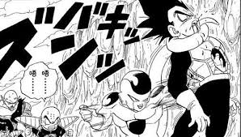
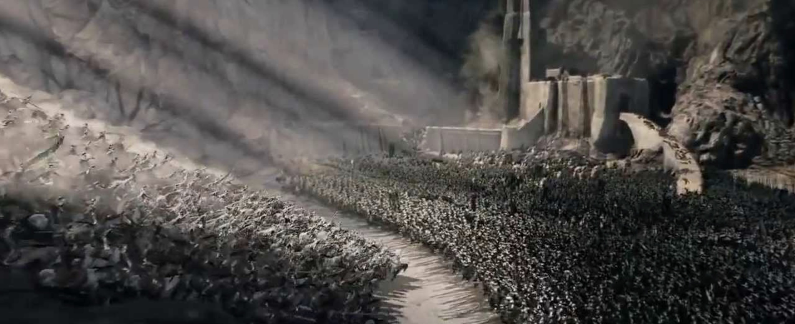
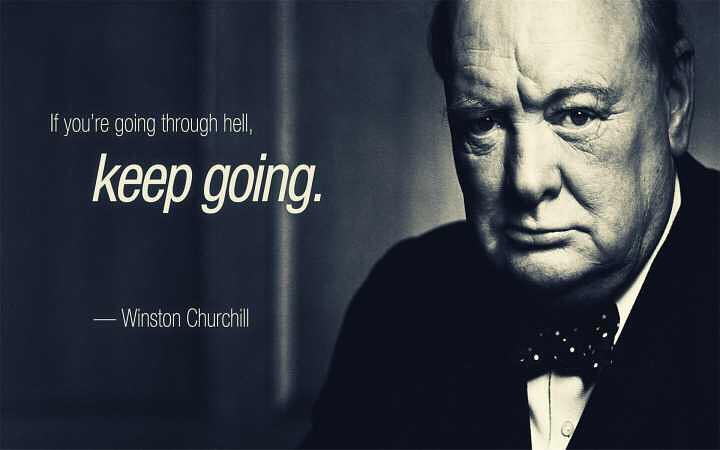

# 至暗时刻

（一）

那美克星上，悟空在经历了游走生死边缘的地狱般严苛的训练后，终于以二十倍界王拳的力量直面弗利萨。然而，实力差距过分悬殊，悟空唯有兵行险着 —— 集全部力量于一体，发出了超级龟波气功。这几乎是他最后的希望。可惜，全力一搏并没有什么效果，反而狠狠激怒了弗利萨。力量耗尽，悟空几乎动弹不得，像一只待宰的羔羊：那是他的至暗时刻，甚至是整部《龙珠》的至暗时刻。

同样的情形，贝吉塔在不久前才遭遇过：高傲的赛亚人王子携死而复生后倍增的战斗力，和弗利萨缠斗一番后，绝望地发现自己的力量相对于弗利萨的力量而言，就像江河之于大海。他觉得什么都完了，希望就像一只五彩缤纷的肥皂泡，突然在眼前破灭 —— 被恐惧占据的脑子里，只剩下一个悲衰的叹号。所以贝吉塔放弃了抵抗，呆若木鸡，任凭对方将自己肆意蹂躏践踏。

好在悟空不是贝吉塔。面对恐惧，贝吉塔（以及大部分人）的勇气是一瞬间的闪念，而悟空是一辈子的执念。不管面对多么强大的敌人，他的心境还是第一次面对他那意欲消灭地球的哥哥拉提兹时一样：有点害怕，却又莫名兴奋。对悟空来说，**一个人可以被毁灭，但不能被打败**。放弃从来不在他的字典中 —— 他用残存的一点点力量，勉力忍受着弗利萨一波又一波的打击，只求集中精神收集够那美克星和附近的星星上的元气，做最后的努力。最终，在界王看来足以毁灭这颗行星的元气弹制作完成，并成功击中弗利萨。尽管结局依旧惨烈 —— 几乎是全宇宙最后一丝希望的元气弹也未能击败弗利萨，但没有这份坚韧，他便无法熬到让人热血沸腾的，可能是《龙珠》里最高光的时刻：变身成为超级赛亚人。

（二）

《指环王》三部曲里，有很多动人的时刻 —— 弗罗多和山姆登上摩多的坚毅果敢，阿拉贡对骷髅军团的谨守诺言，甘道夫大战炎魔后的起死回生。但最令我难忘的是圣盔谷内外一整夜的血腥鏖战。人族和精灵族一道浴血奋战，殚精竭虑，依然扛不住数万半兽人大军的前赴后继。外城破了，随后瓮城失守，接着内城也毫无悬念地被肆虐。城里幸存的老弱病残，拿得动武器的男子被分配了各式各样的，大多甚至不能称之为兵器的武器，瑟瑟发抖中准备最后的抵抗；而妇孺们在绝望地抽泣。宫殿内的诸位主角们，整饬好了盔甲，舒缓一下战斗了一整夜的筋骨，跨上战马，犹如《亮剑》里的骑兵连孙连长，悲壮地准备最后的，飞蛾扑火般的冲刺 —— 那是中土世界正义一方的至暗时刻。

在那一刻，谁也不知道，希望是个什么东西。

直到 —— 承诺过「五天后第一缕阳光初现时回来」的甘道夫如期而至，身后是三千曾经被放逐的洛汗精骑。终于，光明刺穿黑暗；终于，白衣骑士们如潮水般冲垮半兽人大军。

（三）

> 文王拘而演《周易》；仲尼厄而作《春秋》；屈原放逐，乃赋《离骚》；左丘失明，厥有《国语》；孙子膑脚，《兵法》修列；不韦迁蜀，世传《吕览》；韩非囚秦，《说难》《孤愤》。 —— 司马迁《报任安书》

为李陵辩护而惨遭宫刑，自己的老朋友因为巫蛊之祸被判腰斩，向他求援他却无能为力。这是司马迁的至暗时刻。为了回复任安老友的请求，阐述他见死不救的苦衷，司马迁写下了这封情怀慷慨，跌宕奇伟，冠绝古今的书信。其中，他罗列了一堆先贤们的典故来阐述自己的心志：人固有一死，命运如此作贱，自己还隐忍苟活，是为了「将以有为也」。

老余说「从绝望中寻找希望」，大抵如此。而《至暗时刻》的主人公丘吉尔便深谙此道。

《至暗时刻》这部电影让我印象最深刻的是丘吉尔在地铁里和伦敦的居民们聊天的那段话 —— 虽然，大概率这是影视作品的虚构。丘吉尔对着嘴上满满 "confidence" 心头却七上八下的群众们说：**Lost causes... Lost causes are the only ones worth fighting for.** 翻译过来就是：（面对纳粹的铁骑）有人说我们会注定失败。但 **注定失败才值得放手一搏**。相比于那著名的 we shall never surrender 的下院演讲，这个片段更令人动容：这是镁光灯外，一个老人的掏心窝子的肺腑之言。

最近还有一个另一个老人以及他一手打造的伟大公司也在经历至暗时刻。人生七十古来稀，他却在此等高龄之际因为政治的原因先是爱女被拘，随后公司被「莫须有」地放进了黑名单，可谓是祸不单行。面对激动的网民，唯恐天下不乱的媒体，他冷静客观，心胸宽广，却又意志坚定，让人动容。他的这份平和的自信，让我相信，他和他的家人，他的公司一定会在这次危机中破茧成蝶，扶摇直上九万里的。

谨以此文献给那些经历过，正在经历，或者未来将要经历至暗时刻的朋友们。pain is inevitable, suffering is optional。没有过不去的坎儿。
