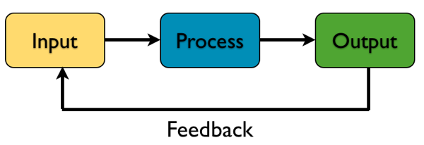
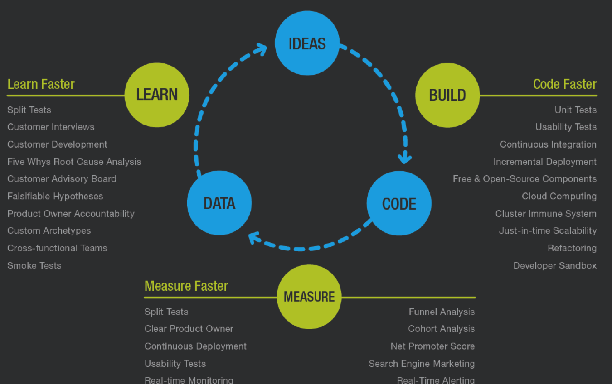

# 如何提高代码质量？

好的程序员从来不靠格子衫或者颜值吃饭，就像你家 C 罗明明可以靠脸，却非要用不断精进的身体和技术迷倒你。对伟大前锋来说，进球，以及一个能够迸发出进球能力的身体非常重要。

对靠谱程序员来说，代码质量，以及一颗能够洞悉高质量软件编写之道的大脑弥足珍贵。

本文从 __产品__，__接口__，__指标__，__日志__，__代码清晰度__，__代码复杂度__ 等方面，谈谈如何提高代码质量。

## 产品和接口

好的产品经理未必是个好的程序员，但好的程序员一定是个好的产品经理。

产品经理的工作是什么？是把复杂的逻辑用清晰的，易用的方式（接口）展现给用户。

程序员的产品是代码，代码的用户是其它程序员 —— 所以高质量的代码是让别的程序员容易理解，容易使用的代码。注意，这个层次的容易理解，是指结构，原理和接口上容易理解，而并非代码的细节容易理解。

细节在产品这个层次，一定要隐藏起来。用户在打开浏览器，访问 arcblock.io 的时候，并不需要关心 DNS 是怎么工作的，PKI 体系是怎么运作的，HTTP / TLS / TCP / IP 协议是什么，报文是怎么从 user space 交付到 kernel space，再怎么 DMA 到网口发送出去 —— 这还没完，接下来出场的，还有负责 l2 protocol 的 switch，保护你安全的 firewall，邮递员 router，以及明明概念上是网络技术，却整个青春都错付给了安全的 NAT。。。

如果产品经理做的产品展示给用户是这样巴拉巴拉的细节，那么丫一定会被扯烂暂住证，大耳光从天黑抽到天亮，然后早班绿皮车送到清河去挖沙；如果程序员的 ``main()`` 如此啰嗦，不管人家受得了受不了，那么他这辈子笃定找不到同性朋友，更别说异性了。

所以程序员在写代码之前，先要想想如果这是一篇演讲稿，我该如何说起？我能在三五分钟讲清楚这代码要干什么？有没有生活中或者同行会心一笑立刻 get 到的例子可以类比？

90% 以上的情况，程序员是在写 parser。换句话说，我们写的绝大部分代码就是把一系列的输入，经过若干转换（transformation），变成一系列输出。



举些具体的例子。

前端工程师是把用户的 url 请求，parse 成浏览器 DOM 上的一系列 component，把用户的行为，parse 成某种内部的事件 ``{event_type, event_data}``，并且进一步由 ``event_type`` parse 成某个 ``event_handler`` —— 然后这个 handler 继续 parse ``event_data``，直到其转化成新的 DOM，或者对后端的某个 API 的某个请求。

对于 API 来说，它 parse request，生成 response。request 可能被 parse 成一个 sql，交付给 database；也可能被 parse 成满足另一个服务接口的 request（比如 grpc），交给另一个服务。这样周而复始，直到 API 收集完 ~~七颗龙珠召唤神龙~~ 各个服务的所有数据，再 parse 成一个合规的 response，交还给 client。

所以程序员看待自己的代码产品，要像庖丁看待肥牛一样 ——「未见全牛」，「神遇而不以目视」，「以无厚入有间」—— 满眼望去，就是一个个 parser，大的 parser 挂小的 parser，再挂更小的 parser。每层，甚至每个 parser，都是个 pipeline —— 它们一般由 validator，serializer，transformer 等接口组织起来，辅以各种 builder，decorator，factory，commander，再加上为之而生的 tools，utility，helper 等搭建而成。

这样一层层组织下来，该粗的地方粗，该细的地方细，遇人说人话，遇猿说猿语，代码可伶可俐，可萝可御。

接下来，是很重要但最让人挠头的事情，给你的大大小小的模块 __取名__。名字倾注着感情，就像寒夜里小女孩划下的火柴，酣战一宿的圣盔谷外甘道夫挥起的魔杖，给人以光明，温暖，希望，以及读到时触电般的「我懂你」。

肖申克的救赎里有段，午餐时 Andy 问大伙那个前夜里被打死的可怜的胖子叫什么？大伙一脸懵逼，说我 TM 为什么要关心一个死胖子的名字。这一幕看着很痛，就像华安在成为华安之前，只有一个如蝼蚁般微渺的代号。如果你想让你的代码不是一个让人漠视的死胖子，而是人们愿意谈论，那么，取个容易让人理解，甚至让人刻骨铭心的名字吧。

​不好的名字除了让人不解，漠视，甚至宛如与人世间幽隔的恶鬼，望上一眼，大家便想逃离；好的名字，嗯，随便说一个，聂小倩，同样是与人世间幽隔的孤鬼，你我却念念不忘。

在 Juniper，我最忘不了的两台服务器是 gretel 和 hansel，取自格林童话；在途客圈，让我心心念之的项目是 atlantis 和以及其上 viking (code name) —— 这不难理解，要追寻 atlantis，你需要远征 (viking）；在 tubi，cms service 是个糟糕的取名，merlin 算是回归了正途，虽然作为一个 build service，它的魔力并不太强，还时不时失灵；而在 arcblock，我在上篇文章里谈到的 AADL，被正式取名 AODL —— 这不重要，估计你也记不住，不过，她有了一个对外的名字：goldorin —— 托尔金为中土大陆精灵族发明的精灵语。

在《僧敲月下门》里，我提到晦涩的 IKE 代码里 pitcher / catcher 让协议的 negotiation 读来犹如欣赏棒球比赛。好的名字，和好的接口几乎成对出现，它让程序员的产品 —— 代码，变得鲜活，读来如沐春风，如饮醇酒，如赏佳人。

## 指标和日志

好的产品是在改进中不断提升的，就像凤凰，经历烈火不断煎熬，得以涅槃。而要想改进，离不来测量 (measure)，它是构建 (build) 和学习改进 (learn) 中间最重要的一环。



热力学第二定律是最让人讨厌也最让人无奈的定律。它直接导致了「不运动肚子上的赘肉必然增加」，「不收拾房子房子会越来越乱」，「不持续改进代码，代码的质量会越来越低」这些让人烦心的事情。

而这个破定律的祖师爷 Lord Kelvin 说：


嗯，测量很重要，非常重要。如果构建和改进是两根枝杈，测量就像蜘蛛在两者间挂下的网，这网越密，两根树枝间的路就越多，就越容易从一端走到另一端，循环往复。

对于测量的途径主要是指标 - metrics 和日志 - logs。metrics 像是心电图或者 CT，让身体的状况一览无余。所以 metrics 用来了解现状，指明方向；logs 则是细密的日记，什么都有，唯独没用重点，所以常常在现状和问题的方向确定后，用来归因。比如说 CT 报告说，这周和上周相比，肝不那么好了，需要小心肝。那么肝为什么不好？把一周的日志调出来一看，哎呀，夜夜酒吧里纵情于世界杯，难怪。于是得出改进方案：世界杯结束后，别又喝酒又熬夜这病就好了，没事。

metrics 和 logs 大部分时候是给自己和别的程序员看的，所以从上文的角度看，它也是个产品，符合产品和接口定义的一切准则。

先说 metrics。

定义 metrics 的时候，你要先搞明白你要改进些什么，这是所谓的 begin with the end in mind。代码的运行效率？那么，究竟那里效率不高？怎么定义效率，怎么计算效率（latency? throughput? 还是什么）。代码的容错性？那么，什么样的 error 要收集，如何分门别类？哪里是潜在的错误大本营？

知道要改进什么后，接下来脑袋里要有幅图 —— 不是富春山居图 —— 是自己或者别人使用这些 metrics 的场景预现图，就像至尊宝给山贼展示他和白晶晶的旷古奇恋的画面一样。

比如说要提高效率，并且确定是降低 latency，所以打算收集服务的 response time，那么，response time 是看 line chart 还是 bar chart，知道了 latency 突然升高这件事之后，下一步呢？怎么知道再看什么？要和其它 metrics / event 关联么？关联哪些，怎么关联？想想意外事件发生之后，作为唯一可以背锅的程序员，身后一堆产品运营盯着你的屏幕，丧着个个脸，表情比出殡还悲壮，仿佛你一秒钟给公司损失几十万上下似的。在紧张的汗水打湿了你的格子衫时，你能看些什么，你该看些什么？

这样从解决什么问题，收集什么 metrics，怎么关联使用 metrics，一层层定义下来之后，我们可以确保两件事情：1. 当坏事发生的时候，我第一个知道。比如：对外的 API 的 95 percentile 的 response time 过去 5 分钟突然增加了 30%。2. 我能锁定问题的大致范围。比如：从其它 metrics 上看，是因为 diagon alley 服务的 latency 突然升高，进一步地，diagon alley 的 disk write IOPS 显著提高。那么这个问题，我就看为什么 diagon alley 的 disk write 不正常。

接下来是 logs。

logs 是不出问题不必太在意，但一旦出问题一定要能够方便定位具体的位置的 ~~奇葩~~ 重要 数据。所以 logs 求充足具体，要像辞海一样广而全 —— 比如当 metrics 告诉我们，问题出在我们并不清楚茴香豆的「茴」字时有几种写法，logs 能够帮助我们快速翻出来有用的那段，然后找出「茴」的四种写法。

logs 兼具给人看，和给机器分析两种效用，因而，最好要固定格式，以方便机器分析；但又不要用类似 JSON 的供机器阅读的方式，如果不配合一个好用的 parser，当人阅读的时候像是韩式整容过的足球宝贝，或者被抽干了形容词的句子，每个都长得一个模样，需要摘了眼镜用放大镜仔细找不同。

通过合理的 metrics 和 logs，测量变得唾手可得。这便释放出来我们不断迭代不断改进的能力。同样起点的代码，同样水准的程序员，一个一周迭代一次，一个一天迭代一次，其累进的质量在若干周期之后，会有质的变化。

## 代码清晰度和代码复杂度

如果上面几个方面都做好了，代码的质量再差也是有下限的。这个下限可以通过严格使用 linter 和不断提升对所用语言的掌握来提高。就好比一个会独立思考并勤于思考的人，他的文章值得一读，也许从遣词造句，从修辞手法，从原起承提来说，他还稚嫩，但那是下限，并且是很容易提升的下限。

在 elixir 的 linter 里，我把 ABC complexity size 设置为 70，Cyclomatic complexity 设置为 15。所谓 ABC complexity，是代码里的 assignments(A)，branches(B)，conditionals(C) 的平方之和开方根的结果，它代表了一段代码有多冗长。Cyclomatic complexity，或者说循环复杂度，是指由程序的源代码中量测线性独立路径的个数，它代表了一段代码有多难懂（我们的小脑仁最不擅长同时记几件事情，比如情人节和结婚纪念日）。还有一些其他的设置，比如 nesting（嵌套层数）不超过 3， arity（函数的秩，或者说参数个数）不超过 6 个等等。这些 lint 的约束，会强迫你在函数的实现细节层面，考虑地更好。大部分情况下，同一个功能的代码可以有不同的表述方式，linter 的目的就是建立约束，强迫你用更合理的方式去表达一个功能点。

比如我常常不经意写出的代码：

```elixir
data
|> cleanup()
|> prepare(opts)
|> Enum.map(fn {type, value} ->
  case type do
    "type 1" -> # blabla
    "type 2" -> # blabla
    _ -> # default bla
  end
end)
```

可以被优化成：

```elixir
data
|> cleanup()
|> prepare(opts)
|> transform()

def transform(data) when is_list(data), do:
  Enum.map(data,fn {t, v} -> transform(t, v) end)

def transform("type 1", data), do: blaba
def transform("type 2", data), do: blaba
def transform(_default, data), do: blaba
```

这样降低了代码的 complexity，提高了代码的 clarity，同时，还使得代码的 extensibility 大大提升 —— 以后要加一个 "type 3" 的处理，仅仅是加一个简单的函数而已，非常符合 open/close 原则。

这样的小技巧有赖于对语言的理解，和对  linter 规则的恪守。虽然例外偶有发生 —— 比如一个复杂的 sql query 用 Ecto 表述很容易超过 ABC，但绝大多数情况，守着规则，会让你受益 —— 每次 commit，过 linter 就像灵魂在桑拿房里给蒸气熏碾，痛苦难耐，勉力熬过去后，推门出去一下子无比清爽，有种拨云见日，level up 的感觉。
