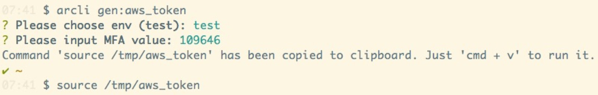

# 工具思维 - Thinking in tools

Paul Graham 在《黑客与画家》里谈到：程序员的职业是个完美的职业，因为它兼具 1) 可测量性 和 2) 可放大性。我们常常说一个「优秀」的程序员可以抵得上三五个，甚至数十个「平庸」的程序员。这话也对也不对。「优秀」和「平庸」都是相对的，所谓「汝之蜜糖，彼之砒霜」，Forrest Gump 放对了位置也不可谓不优秀。

确切地说，一个优秀的程序员应该能 carry 一支「平庸」的 team，使其达到原来三五倍，甚至数十倍的效率；或者，一个优秀的程序员应该能合理地寻求解决方案，carry 自己，让自己做某件事情的效率抵得过曾经三五个，甚至数十个自己。

在这里，工具思维起决定性作用。以下是我在十多年的工作过程中，渐渐总结出来的一些工具思维的原则，供你参考。

### R1：不在核心路径上的代码，只要性价比合理，能够使用第三方（付费）工具，就绝不自己构建

这个原则并不是否定造轮子的意义。作为工程师，我自己也很喜欢造轮子。在我们的世界里，不断更迭的轮子才是推动软件行业前行的基石。如果没有 php，我们还在使用 CGI；如果不是 rails，复杂的 web app 的开发，只能是一支大团队的禁脔（java/.net）；而如果没有 chrome 和 firefox，IE 将是整个人类的梦魇。

其实我们做的每个工作都在造轮子 —— 造一个在你的核心竞争力路径上的更好的轮子。因此在 Tubi，我们的轮子是 transcoding engine，是 ad server，而在 arcblock，我们的轮子是 open chain access protocol，是 blocklet，是 arcblock utility chain。不在核心路径上的轮子，不到必要，不应该轻易去造 —— 这一点对小团队尤其重要，道理很简单 ——「和你们这些少爷不同，我们光是活着就竭尽全力了」。

要能做到这一条原则，首先要厘清什么是核心路径，什么是非核心路径，进而再找到核心路径里面的非核心路径，一路细化下去。这个分析的过程有时是显而易见的，有时是颇伤脑筋的。而且，核心路径是动态变化的，当下不那么重要的东西，可以 trade off 的东西，未来也许就横亘在核心路径上。

比如对 arcblock 来说，开发一门编程语言显然不在核心路径上，开发一个监控系统也必然不在核心路径上。那么，构建一个 scalable / robust / secure infrastructure 呢？打造一个 ETL pipeline 呢？index 现有主链的数据呢？写一个 API gateway 呢？这些都要好好想，哪些可为，那些不可为。

找出来那些不在核心路径上，但又非常重要的服务之后，就是选择使用什么工具。那么，是使用开源方案，还是商业工具，着眼点都落在了一个词：性价比。注意是性价比，而不是价格。很多人会被商业工具的价格吓跑，而丧失了对性价比的判断。尤其当决策者是程序员时，一看价格就忍不住：麻蛋，这玩意我花点时间就能做出来了，竟然要这么贵！脑子进水了吧！

> 所以做生意不要做程序员的生意，即便不得已做程序员的生意，也要尽量让购买的决策权放在程序员上面的那个不会写代码的老板或者老板娘身上

决定性价比的公式，我是这么考量的：

> CPR = （开发成本 + 部署成本 + 维护成本 + 培训成本 + 使用成本）/ 收益

这里面，某个特定工具（如监控系统）的收益几乎可以当成一个常量，所以要降低的是各种 cost。如果你要搭建一个和 datadog 差不多的系统，需要自己搭 grafana / influxdb（算上 terraform / ansible 的部署脚本和搭建的学习时间，至少一个工程师一周的工作量），server 放在 aws 上有每月的 cost，数据存储和备份也有 cost，然后还有 devOps 的维护成本（假设每月 6 个小时花在上面），如果和其它工具集成，可能还有额外的使用成本（比如构建各种 dashboard），等等。

如果以一个年薪 $150k 的 devOps 来算（公司为之付出的所有支出再乘个 1.2 的系数，就是 $180k 了），初始开发成本 15 k / 4 = 3.8 k，平摊到第一年每月 $300，每月 aws bill 初期大概 $600（c5.2xlarge * 2 + disk），每月 devOps 维护成本 15k / 160 * 6 = $560，算下来第一年的 TCO 接近每月 $1500。$1500 是什么概念？datadog 监控每台服务器 $15/host/month，可以应付 100 台服务器的监控。当你有 100 台服务器的大量 metrics 需要监控时，你的 on-premise 部署的 grafana / influxdb 可能又不够用，需要更多地计算和存储资源和更多 devOps 时间来处理，这又应对着更多地 cost。

所以，粗略算一下，如果你管理的服务器小于 150 台时，甚至，小于 200 台时，自建监控平台的 CPR 可能都并不合算。

### R2：如果花得起时间打地基，就一定要先打地基

互联网软件的开发是环环相扣的。暴露给用户的部分，只是冰山在水面的一角。你要把这冰山这一角露出来，可以往海中扔一个冰块，也可以从底向上一点点构建冰山。虽然用户看见的东西大体一样，但冰块会慢慢融化，冰山则异常坚挺。很多时候，我们很快地搭出一个服务，享受鲜花和掌声之后，要问问自己：这是否是个空中楼阁？我（和团队）能够在这上面继续构建更多功能，还是很快就要推倒重来？

老子在谈「善为道者」有个精彩的反问：孰能浊以静之徐清？孰能安以静之徐生？我们的工作大部分时间里都像一杯混着泥沙的浊水，需要我们内心「平」「静」，耐心地从纷繁复杂，浑浊不堪中理清头绪，「致虚极、守静笃」。

打地基的工作看上去拖累整个工作进程，实际上它是一个厚积薄发的 enabler。你可以花十分钟在 aws console 上点出一组资源（VPC，ec2，security groups，ebs，ALB，...），来提供某个服务，然而，同样的事情你可能需要一而再，再而三地重复。可是，如果花时间为此做一个自动化工具，可能需要一个非常熟练和精通 terraform 的工程师一周的时间。做还是不做，这是个问题。

我的答案是只要不是火烧眉毛，就一定要做这些基础的自动化的工作，效率渐渐提升还是其次，重要的是这样大大降低了团队犯错的机会。人类是宇宙间最不擅长做机械动作的物种，同一个字抄十遍还形态各异，一个有十几道工序的 wizard 上重复十遍（所以泰勒强调流水线上标准化的「科学管理」），出错的概率会大增。所以我们要生产和使用工具，通过这些基础的工作来降低犯错的概率。当然，在构建前，要用 R1 的原则指导自己，选用最合适的工具来构建这些基础工具。

在 arcblock 这一个月，我的 70% 的代码时间都投入到了 infra 的构建，写了几千行的 terraform，ansible 和 packer 的代码，就是这个道理。

举个例子。我们都知道「安全性」和「易用性」往往是矛盾的。当我们追求极致的安全性时，必然会带来极大的不方便。比如谁都知道密码要定期更新，但想想你生产环境的数据库的密码，有多久没有替换了？谁都知道 MFA（两步验证）能最大程度保证重要功能的安全，但将其应用在 AWS access key 上的又有几人？不是我们不想用，而是极度地不方便让我们选择忽视 security best practices。

这样的「地基」如果不能一开始就打造好，日后会带来无穷无尽的麻烦。所以我们要通过工具来最大程度弥补因为追求安全性而丧失的易用性：

这个命令会简化 MFA 带来的痛楚，工程师只需运行一次，其 shell 环境里就保存了两步验证后生成的临时的 access key 和 session token，一天内便可以畅行无阻地使用 AWS API 的能力。

### R3：少即是多

再举一个例子。我们在处理 Ethereum 数据时，要做做各种 transformation，在源数据和目标数据间进行 mapping。我们可以一行行写代码来定义这种 mapping，但更好的做法是

### R4：数据即价值，无论什么时候都要

Rich Hickey 说（妈的这句话我引用了无数次了）：You have to have at least 2 solutions to make trade-off。

想象一下 F1 比赛的场景 —— 车手进站的策略

少则多，多则惑

大器晚成

不知常妄作凶

致虚极，守静笃。孰能浊以静之徐清，孰能安以动之徐生
、最近在读南怀瑾的《老子他说》，让我印象深刻的就是他对这两句话的解释。我本人认为这两句话可以当做口诀使用，就像佛家的偈子，在心烦的时候可以念念。

“致虚极、守静笃。”是道家提倡的一种最高境界。道家认为人应当“虚”，也就是对任何事都不要有成见，就像一个空的容器一样，只有时刻保持空的虚的状态，才能用来装东西，才能发挥大作用。但普通人哪里能做到呢？我们总是习惯地用已有的知识排斥或者忽略别的观点，只有修炼到极致的人，也就是从心底里认为自己欠缺的人才有可能吸纳更多的知识，许多大学问家会表现的非常谦虚，这就是一种致虚极的境界吧。下一个高深的境界就是“静”，不急不躁，不卑不亢地对待任何事，也许一个人“虚”到极点，就能自然地静下心来处理任何事：在学问方面，用谦虚的态度静静地听别人的观点，平静地看待荣辱得失等。当我们心浮气躁时，当我们沮丧时，问问自己，我是满的还是虚的？在某项专业知识上已经是牛人了吗？我真的比谁谁谁了不起吗？试着念念这句口诀，品味一下其中的境界，也许有用。

“孰能浊以静之徐清、孰能安以动之徐生。”这句话充满了积极向上的意义，同时具备很强的思辨力量。老子心目中的处事态度是“浊”，不提倡举世皆浊我独清的态度，而是提倡“混兮其若浊”、“和其光，同其尘”，也就是说不要认为自己了不起，每个人的行为都有其道理，我们应该理解他们和接纳他们，如他们一样，表面看起来有点浑浑噩噩，但内心要“静”，就像一杯含有沙子的黄河水，只有在安静的状态下，才能慢慢变清，也就是脑子里从纷繁复杂的“浊”中理清头绪，变得清醒。后一句，非常积极：只有静静地弄清楚了是不够的，还需要动起来，反馈社会和他人，发挥自己积极的作用。但是，不要乱动，首先要安，即心态要平稳，如果慌里慌张地去做，那自己会变成真的浊，搞不清楚状况了，其次要“徐生”，就是慢慢来，太着急地去做，往往不成。

老子的“静”“虚”与佛家的“空”有异曲同工之妙，值得好好体会。
