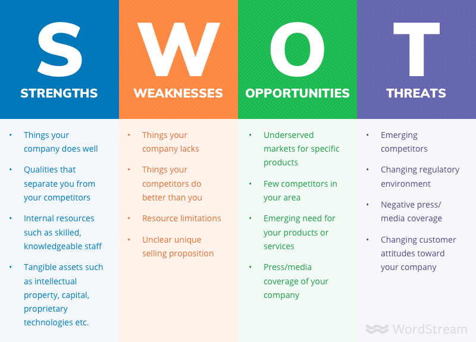

# 银河系跳槽指南

> 这颗行星上存在着 —— 或者说曾经存在 —— 一个问题，那就是：大部分的居民在大部分的时间里都感到不开心。针对这一问题曾提出过各种各样的解决方案，但其中大部分都是紧紧围绕那些绿色小纸片的运动来着手的 —— 这很奇怪，因为实际上并不是这些绿色小纸片不开心。- 《银河系漫游指南》

> 我见过五年换过八份工作的人，也见过对自己没有稳定定位，在几个方向上来回飘的人。我还见过履历倒着来的人 —— 在硅谷，见得多的是 Google - FB - Airbnb 的职业切换，我却见过 FB - Google - MS 的切换（没有贬低 MS 的意思）。这种没有想清楚，仅仅因为 package 一时之高低就随意跳槽，是程序员们的《伤仲永》。 - 《程序员的好日子什么时候才到头》

这几天跟朋友聊的很多的一个话题是跳槽。马老师说员工离职的原因林林总总，只有两点最真实：1. 钱，没给到位；2. 心，委屈了。两个理由合二为一，就是干得不爽。如果把员工跳槽的动机归根于这个，有些过于简单粗暴。干得挺爽还主动拍屁股走人的，也大有人在，毕竟还有更大的世界可以追求。

那么问题来了，打算拍屁股走人的时候，走去哪里？敢问路在何方？

在 Fidelity 里上过 401k 的同学们会有这样的经验：系统会让你选择一个风险承受的系数，然后根据这个承受能力，来调整整个仓位中股票，基金和债券的比例。对我来说，如果把股票看做是 Arcblock，那么基金就是 Tubi，而债券是 Juniper；当然，在你的眼里，股票可能是 nextdoor，基金是 Airbnb，而债券是 Facebook。每个人可以有自己不同的坐标系，这不是重点。重点是你需要知道你自己的风险系数 —— 这是跳槽时向左走向右走的决定因素，否则，就像错配的婚姻，强扭的瓜。

风险系数的计算有时候没有那么精确，但大体上，跟两件事相关。

一是是否年轻。年轻时一片丹心，无所畏惧，可承受的风险大些，年迈时历经磨难，满心苦涩，可承受的风险自然小些。我说年轻而不是年龄，是因为年轻这东西，主要看心态，未必和年龄相关。有些人二十岁活出了四十岁的沉稳，有些人，奔四了比二哈还要傻白甜。

二是有多少东西需要交代。悬而未决的身份，让人叹息的房贷（房租），嗷嗷待哺的婴孩，年事已高的父母等等，这些都是交代 —— 对自己，对家人，对长辈的交代。要交代的东西多了，转角遇见的，都是掣肘，都是生命不能承受之轻，自己就像「被放在草篮里顺水漂着的江流儿」（管氏翅吧撸串时一个咬牙买了西城区学区房把下半身交给银行的朋友红着眼睛说的），承受不起太大的风浪。

精心算计好了自己的风险系数，或者说可以接受的槽位，下一步是认清市场和大的方向。雷军说要顺势而为，这个「势」很重要。那怎么看「势」在何方？每年互联网女皇 Mary Meeker 的 internet trends report 是个很重要的工具，要读，仔细读，然后混入自己的思考和判断。report 里面重点提到的行业要额外花些时间去了解。当然，女皇不是上帝，每年的 report 也不可能面面俱到，还是有不少遗漏（比如今年的 report 竟然没有提 blockchain 及其背后的  token economy，中国的篇幅较去年缩水，印度只字未提）所以用它看全局可以，具体某个方向还需要更多的资料去佐证。

当你算好自己的风险系数，又对市场方向有个自己的判断，可以往下对号入座了。

## 股票 —— 创业公司

风险承受能力强，可以入这个槽位的，看中的是潜力，或者说可兑付的未来。潜力这东西很是玄妙，就像抖音视频里的美女，不相处到天黑卸妆时，你很难窥得真容。然而通过这种方式试错，要命。我打这个比方，大家会乐，心想：SB，老子肯定先看身份证啦。然而到自己找工作时，却连最基本的求证都不做。我一个读者前一阵加入一家区块链初创公司，喜滋滋后台跟我报道，说以后是同行了。我问：

> 创始人 / CEO / CTO 你认识么？__不认识。__
>
> 他们之前做过啥？__bla bla bla（很粗浅的认识）__
>
> 他们为啥要做这个项目？__呃。。。区块链很火，很多机会__
>
> 现在产品和服务都做到哪个地步了？__刚起步，还在搭团队__
>
> 那产品的 roadmap 是啥？__呃。。。我没问。反正是 blockchain 3.0__
>
> 怎么获取用户？__那啥，做好了自然有人用吧。他们市场宣传力度挺大的__
>
> 白皮书写的怎样？有具体跟创始人 / 团队聊白皮书里你的疑惑么？__呃。。。白皮书我还没看完，所以还没啥问题__

问到这里，我已经无话可说了。选股还讲究看看财报，研究基本面啥的，这啥都不知道，啥都不去主动了解，就跟非诚勿扰上节目上看了几个视频就去牵手的女嘉宾，这心多大，胆儿多肥？人家非诚勿扰那是作秀给咱们看，赚的是 dollar；咱们自己何必要拿自己的光阴下注，赌渺茫的未来？

所以去创业公司要尽可能多的了解标的公司的文化，产品，团队，然后了解同行各个公司的文化，产品，团队，对比，多方求证，最好实地考察一下，收集尽可能多的一手资料，然后在 spreadsheet 里做个 SWOT analysis 组织和分析你收集到的信息：

(图片来源：wordstream， Small Business)

Bad code smells。同样的，bad team smells。包装再好的项目，放大镜下总有败絮露出。当你把优(S)劣(W)危(T)机(O)分析清楚后，你也有了最终的目标 —— 也许一番分析之下，本来你情定 A，却牵上了 B。这结果并不重要，重要的是要有这个分析的过程 —— 你把自己的未来紧紧攥在自己手中，而不是交由轮盘赌。

选创业公司是三分看势，三分看人，三分看命。选对了赛道，挑对了人，做足了努力，并不意味着可以全身而退 —— 也许命运还要捉弄你一下，就像取经成功的师徒四人还要被踢下云端再渡一劫。如果是这样，也就认了，毕竟这是风险最大，（成功后）收益也最大的一种选择。

## 基金 —— 增长型公司

落入这个槽位的，一般是想稳妥些，又厌恶成熟期公司的一成不变的人。增长型公司的范围很广，可以从有稳定收入不差钱的 startup，到 Pre-IPO 的公司，再到 IPO 后潜力还未完全兑付的公司。

选这个范畴下的公司，如果已经有标的，angelList，crunchbase 都是你的好助手。看看公司一轮轮融资的情况，创始人和管理层的 linkedIn，公司的官网 —— 如果是 2C 的产品，下载使用，亲身体验；如果是 2B 的产品，能体验最好，不能体验，看看都有哪些公司在用，找身边已经使用该产品的用户，听他们的意见。查询各种公开的（比如 app store 的排名），非公开的数据，把自己当成一个没啥资源又要勉力尽调的小 VC 里的苦逼投资经理，想办法获取更多的资讯。

如果没有标的，那么最简单的方法，女皇的 report 里面提过的公司，一般差不到哪去，挑一个或者几个出来慢慢甄选。比如 2017 年花了些篇幅介绍的 Stitch Fix，年底就敲钟去了。今年 report 里 C 位乱入的唯一一家 blockchain 公司 coinbase（嘀嗒嘀嗒安姐新东家），report 里提到两三次的 intercom，nextdoor，提到一次的安全公司 signifyd 等，也许都可以是深入研究的标的。不要动不动跳槽就冲着 airbnb，uber，netflix 这些大路货的名字，在增长型公司里，有的是潜力比他们高，空缺也许比他们更好的公司。对于国内的同学来说，可能麻烦一些 —— 虽然 report 里高瓴资本写了些中国的公司，但毕竟给老美看的，翻来覆去也就是 BAT 新美大，头条快手这些，要挖掘国内 B 轮往上，有稳定收入且运作良好，重视 R&D 的公司，还是要花一番心血的。

## 债券 —— 成熟期公司

这个不说了，就几家值得去的，而且大家挤破脑袋。没混出来之前，去了也就做做螺丝钉，其实没啥意思，适合养生。有一点注意的：除非你热爱政治斗争，千万千万避开那些名扬四海的，内部充满山头，内斗不止的大公司。

另外，不管你是否欣赏，我建议你都好好研究一下 Amazon。它其实不该算在债券型的成熟期公司里，更应该放在增长型公司 —— 但加入 amazon 对小的个体而言（除了财务回报外）没有太大的成长。Amazon 之所以需要重点研究，是因为它的效率，它对 R&D 近乎疯狂的投入（45% YoY），以及它高市盈率和低得令人发指的融资成本，是横亘在你辛辛苦苦挑选出来的赛道上的一个可能无解的拦路虎。Google / FB 等几乎有自己明确的赛道，而 Amazon 的赛道是飘忽的，不断膨胀的 —— 丫的胃口跟 pacman 一样，不吃光一切糖豆，不会干休；而华尔街却很买这个「不会赚钱」的公司的帐 —— 前两天这货仅仅宣布了 __考虑__ 未来十八个月要对外销售自己的交换机，就让思科的市值蒸发了百亿。

## 禅定时刻

> Don't panic

> 银河系每一个主要文明的历史都会经历三个可以清晰辨识的阶段，即生存、质疑和诡辩，或者也被称为如何、为何以及向何处去三阶段。比如，第一个阶段的特征是这样的问题：我们如何才能跳槽？第二个阶段则是：我们为何要跳槽？第三个阶段就变成了：我们该跳往何处呢？
