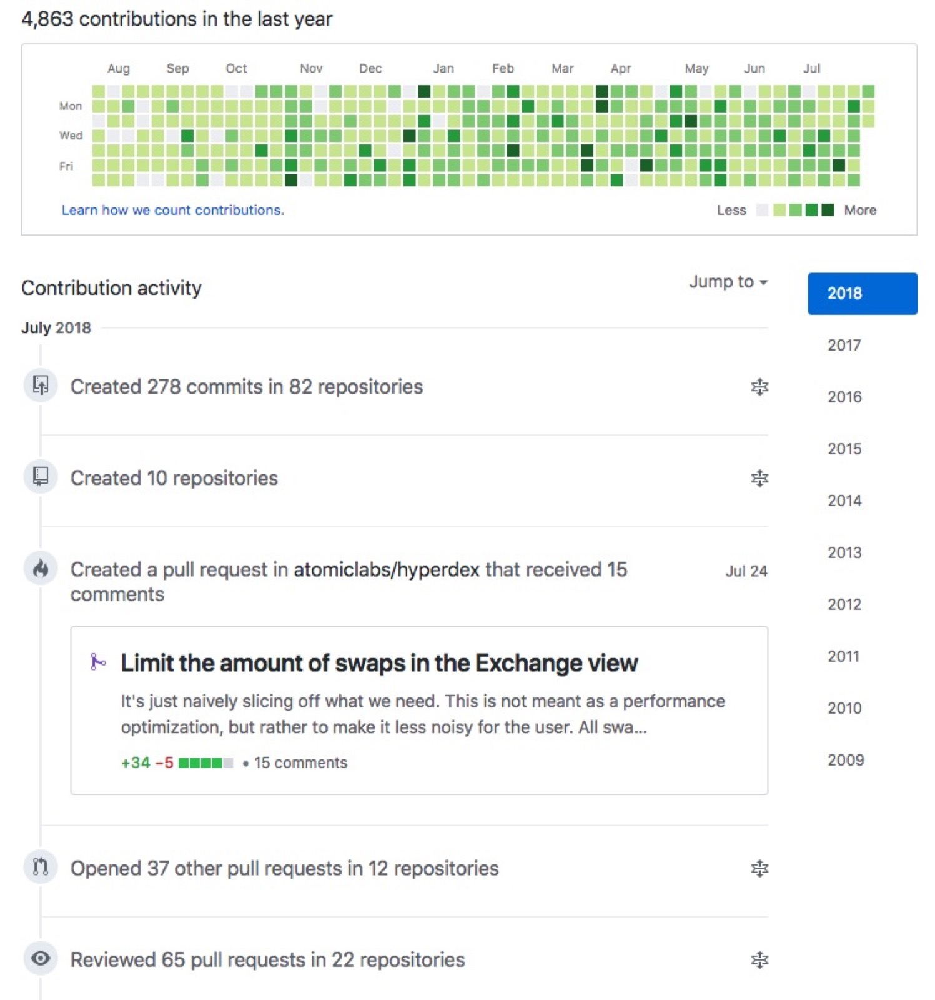
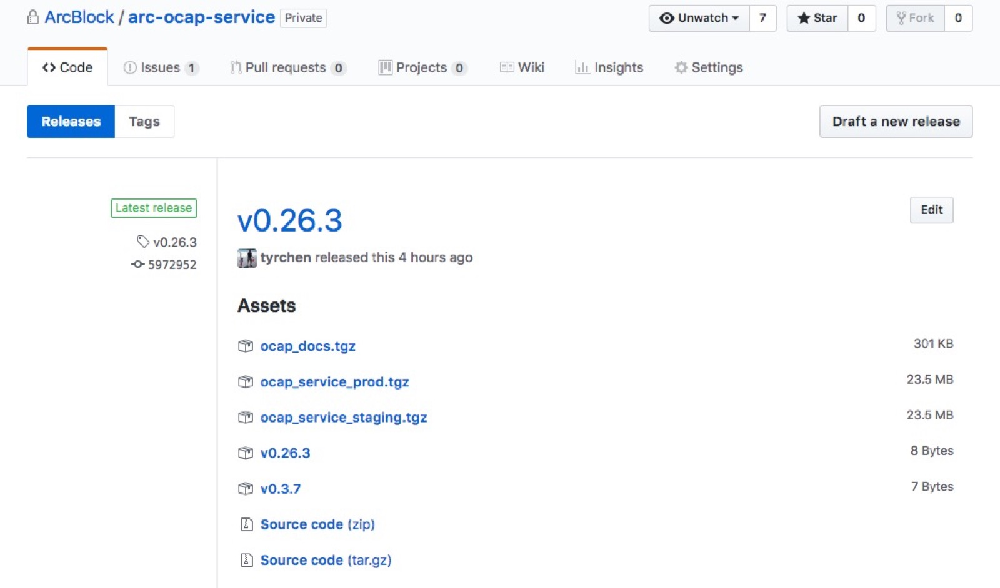

# 如和在几十个 Repo 中游刃有余？

Sindre Sorhus 是我一直 follow 并且仰慕的程序员。他的 github 日常是这个样子的：

很久以来我一直好奇 —— 究竟怎样的工作效率能够让一个人在一个月的时间里工作在几十个 repo 里，创造出好几百的 commits？是对编程的狂热？对代码掌握得游刃有余？还是对自动化的极致追求？

过去的三个月里，我畅游在 elixir，ansible，terraform，javascript，少量 python，少量 erlang 组成的一群 repo 中，慢慢领悟到了这种高效工作之道：建立属于自己（和团队）的工作模型，逐步将其固化成习惯。当习惯养成时，一切就像卖油翁「倒油穿钱」那样，唯手熟尔。当然，熟能生巧只是反馈链上的一环，我们还需要将这种纯熟的技能经过思考后提炼成智慧，反馈回工作模型，让「学」「问」真正成为「学问」。

下面是我自己的一些微末的经验，抛砖引玉。

## 把自动化推进到极致

我在 code is law 里已经提到了不少用工具对流程做自动化的例子，这里不再赘述。自动化不是一种口号，不是简单的一个流程，甚至不该仅仅是某种做事方式，而是一种深入骨髓的思想 —— 我们所做的一切努力都是为了减少我们将来的努力。过去二三十年方兴未艾的互联网革命，上溯到五六十年前一直蓬勃至今的 IT 革命，甚至从第一次工业革命开始，人类社会发展过程中的大部分努力都是在把一切能够自动化的东西自动化。

软件领域的自动化虽然发展了很久，但大部分组织的自动化程度，还处在婴儿期。我们可以从这些角度，考察一下组织的自动化能力：

* TTT (Time to commiT)：一个 feature 从 commit 开始到结束要花多长时间？
* TTDP (Time to DePendency)：一个 feature 从 dependency resolve 开始到结束要花多长时间？
* TTC (Time to Compile)：一个 feature 从 compile 开始到结束要花多长时间？
* TTCI (time to CI)：一个 feature 从 CI 开始到结束要花多长时间？
* TTPR (Time to PR)：一个 feature 从 commit 到创建出 PR 要花多长时间？
* TTR (Time to Release)：一个 feature 从 review 结束到 release 出来要花多长时间？
* TTD (Time to Deploy)：一个 feature 从开始 deploy 到结束要花多长时间？

在 arcblock，拿目前项目占比最高的 elixir 来说，各项时间如下：

* TTT：由于我们 enforce pre-commit hook，所以每次 commit 会走完整个 compile/lint/format/test 的过程，平均 10s。
* TTDP：大部分项目从零开始 resolve / compile dependency 平均需要 5 分钟。
* TTC：和 TTT 在同样的量级，平均 15s。
* TTCI：从零开始做 dep / compile / lint / format / test，平均 6 分钟。
* TTPR：和 TTT 在同样的量级，平均 15s（会自动 update version 和 changelog）
* TTR：从零开始做 dep / compile / lint / format / test / build staging & prod release / upload github release，平均需要 10 分钟。
* TTD：用 ansible 取 github release 里的 asset，然后 rolling upgrade 到线上，平均 45s

我们统计这些数据，是因为它们和我们的效率息息相关，如果这个自动化流程无法做到极致地高效，那么在其之上浪费的每一分钟，都会乘以所有工程师的数量反馈回来。不仅如此，量变还会引发质变，最终导致一系列不好的连锁反应。

举个栗子，从上文的数据中我们发现，TTDP / TTCI / TTR 时间过长，其根源都是 dependency resolve 时间很长，于是我们把所有依赖的 dependency 放在了一个 mix-deps repo 里，用 CI 来完成各种环境下的 dependency 的 resolve 和 compile，然后其他的项目在 CI 开始后先去拿 compile 好的结果，再走正常的流程。结果 TTDP / TTCI / TTR 的平均时间分别变成：2 分钟 / 3 分钟 / 6 分钟。这意味着如果我们一刻不停歇地做 release，原本一天一个 travis concurrent job 可以做 144 个 release，优化之后可以做 240 个，提升了 60%。

降低各种工序所需要的时间有什么好处呢？其实是大幅度降低了程序员的 time to wait，从而间接为一天内处理更多地工作奠定了基础。

注意，这整个流程我们希望问题暴露地越早越好 —— 比如在本地的 git commit 就引入 commit hook，做大部分在 CI 做的事情，表面看拖累了效率，实质上大大提升了后续的效率，从而也间接提升了整体的 throughput。

工作流程的自动化以及对其的不断优化，是自动化的一个重要部分，但并不是全部，我们永远不要忽视：代码自动化。

当你定义某个或者某系列 API 时，API 的 schema 需要定义一遍，对应的 DB schema（如果 API 全部或部分从 DB 拿数据）要定义一遍，两者重合度估计有 70%，然后 API 的 doc 需要再定义一遍，基本是之前 schema 的重复加扩展。在 unit test 里面，需要定义 test，某种程度这是 API doc 里面的 example 的翻版，然后在定义 end-to-end test 时（比如用 runscope），几乎相同的东西再被定义一遍，只不过 test 的方式和 UT 不同（这下不 mock 了，直接假戏真做）。当 API 不断迭代时，同时维护这么多散落各处的代码和文档是对程序员时间上的亵渎。所以我们要引入代码自动化。

代码自动化其实是一个桥接（bridging）的过程。我们不直接写最终形态的代码 Bob，而是写一个更为抽象（更加描述性）的代码 Alice，然后用一个 parser 将 Alice 转化为 Bob。ansible 其实就是一个很好的例子 —— 你只需要用 YAML 描述你期望的状态，至于怎么达到这个状态，ansible 会想办法。代码自动化就是我们自己来写一个又一个类似于 ansible 的工具。在 arcblock，我们用来定义 graphql API 的工具是 goldorin（很快会开源），它让我们节省了大量的从 absinthe 到 ecto，再到 slate 的时间，使得我们可以专注于逻辑层的代码，而无需在展示层和数据层的 schema 上浪费太多时间（详情见：思考，问题和方法）。

代码自动化的另一个方向是 template repo 和 utility belt。

template repo 对拥有复杂项目结构的 framework 非常有用。如果把 framework 看成产品，工程师看成用户，那么 template repo 就是产品的 onboarding 功能。想想看，如果 react 没有类似 create-react-app，phoenix 没有 phx.new，rails 没有 rails new，那么世界将会怎样？

然而，官方的 template 仅仅是最小化的帮助大家更好 onboarding 的 template。一个组织要有自己的 template —— 比如说我们的 elixir repo，travis，makefiles，deps，version，release 这些东西都在 template 设置好，理论上用 ``arcli create:repo`` 创建出来的 repo，只要把 ``travis encrypt`` 相应的 key 后，就能把整个 build pipeline 完成。此外，phoenix + absinthe + ecto 做支持 subscription 的 graphql API，需要大量的前置工作 —— 你要写很多基础的配置和脚手架代码，才能让整个系统可用 —— 这正好是 template repo 的长处。在这些地方，我们完全可以花些时间，前人种树后人乘凉。

utility belt 是另外一种自动化方向，它把你的各种随机写就的 function，随机扔在某个 utils / helpers 目录里的 function，甚至顺手写在当前文件里的某个功能性的 private function，抽取出来，组织在一起 —— 它们可以被单独测试，单独 release，可以被更深刻地设计，可以在需要的时候做更合适的抽象。唯一的缺点是，你需要将其加入你的项目的 dependency 中，在同时本地修改 utility repo 和 feature repo 时，稍稍麻烦一些。不过这种麻烦带来的，也是在更多项目工作时的高效。

## 统一工作接口

如果在几十个项目里面来回切换，工作接口的统一是必备的，它能帮你省去无数时间。比如我们为每个 repo 定义了这些接口：

* make init：项目初始化 —— 安装 submodule，项目依赖的软件，设置 env（比如 python 建立 virtualenv）等等。
* make dep：安装 dependency，如果是 nodejs 项目，就是 npm install，elixir 是 mix deps.get，python 麻烦一些，是先 workon 到项目对应的 virtualenv，再 pip install。
* make build：对代码 compile，nodejs 是 webpack，elixir 是 mix compile 等。
* make run：在本地运行。
* make test：对代码做 unit testing。
* make build-release：将代码在不同环境下的编译结果打包成一个 tarball（方便上传到 github release）。
* make travis：给 travis 做 build 用的。
* make deploy：给  travis deploy release 用的。
* make create-pr：自动 bump version，生成 change log，并创建 github PR

详情见：Code is Law。

当这样的接口统一后，我们可以不管 repo 的目录结构是什么，是哪个语言，语言对应的各种 cli 是什么，一切都可以通过标准的接口处理，非常符合 don't make me think 的思路。这样，工作可以行云流水一样无脑敲键盘，后端改了 API 想看看前端的表现是否正常，可以把前端的 repo 拿下来，``make init; make dep; make run`` 就可以了。

## 让 CI/CD 快一点，再快一点

前文提到了我们通过 mix-deps 来提升 CI 的性能，这只是优化 CI 的冰山一角。CI/CD 是整个开发流程里面最重要的一环 —— 代码写完最后的归属就是上线 —— 如果写的非工具类的代码不是为了某个线上的业务，那写起来有什么意义呢？那么，如果我们衡量一个研发团队的迭代能力，非要找个指标的话，那么我会选 Time to Prod（TTP） —— 一个 feature / bug 从开发结束到 deploy 到生产环境，究竟花费多长时间？（这里以灰度发布一开始为结束，不考虑灰度的整体时间是因为不同的项目，不同的规模，灰度发布从 1% 到 100% 可能延展很长）

注意这个时间不要和别人比，要和自己比才有意义。成熟的互联网公司 TTP 可能几个小数甚至以天为单位，那可能是因为其业务复杂，CI 流程长，CI 结束后可能还要人工干预才能开始发布，所以你自己 TTP 是 30 分钟，然后得知某大公司要 7 小时，千万别自鸣得意。

跟自己比，是看这 30 分钟是不是有优化的空间 —— 我们永远不要低估时间降维之后带来的质变。在 TTP 这里，如果我们把 30 分钟优化成 3 分钟，那么我们处理事情的角度就完全不同了。在 30 分钟这个量级，我们考虑的是，解的几个小 bug，整合在一起再 deploy 吧，因为 deploy 一次反馈时间要半小时，折腾几次就半天时间了；在 3 分钟这个量级，deploy 可以被切割成很小的单元 —— 一个很小的 bug，我们也会倾向于就手 deploy —— 反正也花不了什么时间。

当一个组织里的工程师有就手 deploy 的能力时，整个世界会大大不同。工程师们会自然而然把 feature 切碎，一点点迭代，一点点发布。这很符合人性 —— 越小的发布可控性越强，出问题的几率越小，万一出问题，跟踪定位也更容易，回退更简单。所以谁会没事闲着憋一个大招然后给自己找不痛快？但是，当组织没有这个能力的时候，大家只好被迫累积代码，延迟发布，然后不得不面对复杂场景下的复杂 bug。在 Juniper，我们的发布周期是 3 个月 —— 几千个工程师三个月累积的代码一气发布出去，别说发布了，光是各种 conflict merge 就能让人掉层皮。

在 arcblock，我们很多 repo 至今已经 release 了超过 30 个版本，其中最多的 ocap service，release 了 55 个版本，平均不到两天 release 一个版本：

这一切都归功于我们还算不错的 TTP。目前我们的 elixir 项目的 TTP 在十分钟左右，算可以了。当然，在 CI 上我们还有很多优化的空间 —— 比如说 API docs 我们用了 slate 去生成，slate 的 dependency 是 ruby gems，安装起来很慢，大概要 1 分钟。我们其实可以搞一个 ruby-deps 把 所有 ruby dependency 一网打尽，省下这点时间。

## 把 UT 视作对产品能力的探索

UT，是开发者最不愿意面对的东西 —— 这玩意写起来挺重复的，于代码能力上似乎又没有什么长进，还得费劲巴拉去考虑各种 mock，时不时还搞不清楚 UT 的边界究竟在哪里。这是第一种对待 UT 的态度 —— UT 是流程里不得不做的一部分，应付一下了事吧。

另一种对待 UT 的态度是 TDD —— 先不写代码，先写测试。我见过有公司强制 TDD 却没有真正领悟 TDD 的好 —— 这就尴尬了 —— 大家为了 TDD 而 TDD，流于形式，写一堆最后无用甚至被废止的 test case。

我从来不把测试看成是对开发的桎梏，反而将其看成开发的保护伞。我在之前的文章 如何用正确的姿势打开 TDD？就探讨了如何用 TDD 来进行产品设计上的探索 —— 比如你做一个 API，最终是给其它工程师使用的，那么 API 的设计过程，应该融合在别人怎么调用这个 API 的过程中，而别人怎么调用这件事，可以用 TDD 来设计，来预演。所以，测试时产品能力的探索，也是产品能力的验证。在这个角度上看，测试是弥足珍贵的 —— 我的测试代表了我的产品能力 —— 在这个框架下，只要产品能力不变，我爱怎么折腾代码就怎么折腾。所以好的代码容易 refactor，不单单是代码结构清晰，脉络明确，还是因为其测试保证了 refactor 过程中如果产品行为出现变化，会被抓个现行。

## 随时随地 refactor 代码

雷叔叔说：一个人对代码 refactor 一次不难，难的是一辈子随时随地能 refactor 代码。

随时随地 refactor 与其说是一种态度，不如说是一种能力。一般而言，refactor 的能力和这些有关：

1) UT 覆盖率
2) 代码复杂度
3) 代码耦合度
4) 语言是否对 refactor 提供支持

前文已经说过，UT 覆盖得好，代码是可以随意折腾的，折腾完，CI 打了绿勾，心里就不太会发慌。如果没有对应的 UT，稍微复杂一些的代码，折腾起来就会有些懵逼 —— 墨菲定律在那里候着呢。所以一份能随时随地 refactor 的代码，要有足够的 UT 打底。

程序君说过：复杂是代码的天敌。我们最佳的策略不是去应对复杂，而是把复杂消弭于平日的每一次 commit。对此，我们可以善用 lint 工具 —— 把所有的 lint warning 设置为 lint error，然后将其和 git hook 结合起来。之后每一次 commit 时，pre-commit-hook 都能将不合格的代码挡下，逼迫自己重新思考，用更合理的方式撰写代码 —— 或者换个角度写，或者将复杂的逻辑拆分开来。这样在平日里不断降低代码的复杂度，让熵一直处在一个可控的范畴 —— 这样下来，__你要相信，时间最终会奖励这份勤勉的__。我曾见过长度超过 5000 行的单个 C 函数，里面满是岁月留下的伤痕 —— 就像月亮妹妹胖嘟嘟小脸上那一个个坑 —— 每个坑都是一个 customer issue 留下的丑陋修复。丑是会传染的，洁癖如我，在面对那样的代码时，我也只能默默地继续加上一个 switch case，为本已溃烂的面容上再填一个浓疮。

我们控制代码复杂度的过程，实际就不断 refactor 的过程。

在 C 时代，我们很在意一个函数是否是 re-entrant，如果不是，至少要 thread-safe —— 这其实是把函数和其上下文（context）解耦。一个函数的运行和其上下文强相关是一件很糟糕的事情 —— 它很难测试（比如测试时需要重现其依赖的资源 —— 某个状态，某个 lock，etc.），很难重构（如果不深刻理解其依赖，很可能挖出新坑），也很难被重用。所谓解耦，解的就是上下文。完全无耦合的代码是 pure function，它和数学上的函数类似，是定义域到值域上的一个映射，而完全耦合的代码是 non-re-rentrant function。如果说人类社会是个纺锤形的结构，那么代码在耦合度这个范畴上，也大致是纺锤形的，两头小，中间大。在广阔的中间地带（pure / inpure），每写一段代码，我们都需要悉心选择向左走还是向右走。

这个时候，语言本身的支持很有帮助 —— 比如函数式语言，immutability 决定了你写的任何一段代码都可以在任何一个上下文里运行（参见：永恒的魅力）。于是问题变得轻松起来：我们如何构建出来够用够好的层次，辗转腾挪，让合适的函数出现在合适的位置？

其实好的系统，不管其多么复杂，应该是从简单中孕育出来：我们看人类社会 —— 精密的社会机器下是一个个个体的简单独立行为 —— 而这些独立的个体行为交织在一起却承载着无与伦比的复杂（想想你午餐吃的那份古井烧鹅，从受精卵到被你吃到嘴里，经过了多少工序！）。同样的，一个生物体，活体由一个个器官构成，器官由组织构成，组织由细胞构成。道德经里说：道生一，一生二，二生三，三生万物。就是这个道理。

有些语言，比如 erlang，elixir，天然就模拟自然界的行为，通过自下而上的解耦，让简单承载复杂。在 erlang 的世界里，一个 process 就像一个个独立的，彼此解耦的个体，它们构建起团队（supervision tree），一个个团队构成公司（application），一家家公司进而组织成一个复杂的社会（release）。这样在语言层面对解耦的支持，让 refactor 易如反掌，不仅如此，refactor 带来的意外（比如代码出轨了），也仅仅是由局部来承担 —— 个体挂了，影响的范围也仅仅在那个个体辐射到的团队而已。

做到了上面这些，面对几十个 repo，每天在不同的 repo 上搞几个 commit，若干个 commit 组成的 PR merge 后生成 release，release 并很快部署到线上得到反馈，可以做到千头万绪，却忙而不乱 —— 不畏浮云遮望眼，只缘身在最高层。

## 禅定时刻

惠子谓庄子曰：「子言无用」。庄子曰：「知无用而始可与言用矣。天地非不广且大也，人之所用容足耳。然则削足而垫之，致黄泉，人尚有用乎？」惠子曰：「无用」。庄子曰：「然则无用之为用也亦明矣」。
