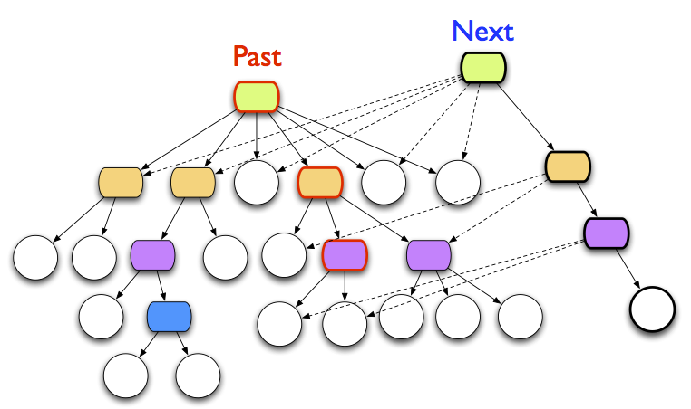
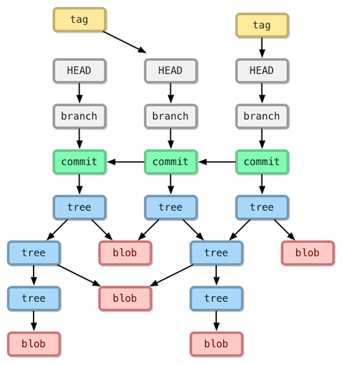

# 数据：逍遥游

> 天之苍苍，其正色邪？其远而无所至极邪？其视下也，亦若是则已矣。 - 《逍遥游》

对程序员来说，数据是我们时刻都在打交道的东西。我们的代码如同一台机器，把进入的数据转换或者映射成出来的数据。数学上，不过是：`y = f(x)` 而已。数据就像庄子口中的鱼，在代码的作用下，一会化身为文件，在文件系统里「沉潜」，一会化身为变量，在内存中「浮动」，一会又扶摇直上，化身为字节流，在网络中「翱翔」。

周易里说：简易，变易，不易。数据再变化多端，复杂深奥，我们只要厘清了它的概念，摸清了它的脾性，就能掌控它，驾驭它；再从它的千变万化之中，找到一些固定的规律，就能成为它的主人。倒时差睡不着觉，突然想到了这个话题，便欲与诸君聊聊。

## 概念

概念是事物的本元。含混不清的概念会导致含混不清的关系，进而把思维拖入含混不清的泥潭。工欲善其事，必先正其名。我们看看，围绕着数据，都有哪些概念。

### 标识

标识是唯一能够代表数据本身的「名字」。这里有两重含义：1）唯一 2）代表。很多时候我们把标识和名字混淆。我的公众号的名字叫「程序人生」，但这个名字并不代表这个公号，任何公号都可以取名「程序人生」。所以标识必须唯一。在实际的工作中，我们往往只是关注到了标识的唯一性，却忽视了它的代表性。想想看，ID 是否是一个标识？99.999% 的情况下我们都会说 ID 等同于标识。我们通过王小二的身份证号可以精准找到王小二这个人，但是身份证号和王小二之间的联系是脆弱的单向连接关系。我找到了王小二，但单独从王小二身上我们并不能推演出他的身份证。80后大概还记得，大概十几年前，我们的身份证号码经历了 15 位到 18 位的更迭，旧的号码依旧唯一，但它失去了和它联系在一起的数据。标识既然能够代表数据，那么，数据理应也能够使用某种算法确定地推导出其标识；同样的，数据的标识不可能改变，也不应该改变。

符合这个条件的标识，对于人来说，是虹膜，指纹，DNA，哪怕王小二改名叫王小三，身份证从中国的换成泰国的，她还是那个他。对数据而言，符合这个条件的标识，是数据的 md5，sha1，sha2，sha3 等。

注意，标识唯一代表数据，但数据的标识可以并不唯一，这个不矛盾。

### 地址

我们剥茧抽丝，把标识从与其纠缠的诸多概念中分离，有利于我们对后续内容的阐述。搞清楚标识后，地址就容易理解多了。地址是用来定位和寻找数据的，它是单向连接的，也是唯一的。从这个角度来说，地址是标识的超集，标识是地址的子集。上文提到的身份证号，就是一个地址。其它常见的地址还有数据库中一条记录的 ID，当然，更准确地说，数据库主机名 + 数据库名 + 表名 + ID，是这条记录的地址。包含完整路径的文件名是文件内容的地址。一个包含 IP 地址和端口的五元组（src ip, src port, dest ip, dest port, protocol）是一个 socket 连接的地址。

地址和地址对应的内容其实构成了一个逻辑上的 kv store。所以一个文件系统，本质上是一个 kv store，给我一个文件名（key），我就可以找到并且给你它的内容（value）。

我们说标识是地址的子集，那么如果我们就用数据的标识来寻址数据呢？这打开了一个奇妙的世界 —— 我们标识指向了数据，而数据本身又能推倒出来标识，从而证明 __我要寻址的内容，的确是我要寻址的内容__。仔细咂摸这句话的威力。举个例子，夜深人静，你猥琐地带上耳机，颤巍巍的右手点开了 苍井空.avi，打开却是「般若波罗蜜多心经」。。。

### 引用

搞懂了地址，那么引用是什么？我们为什么需要引用？引用是一个中间人（middleware），它把数据的地址和处理数据的上下文联系起来。人的名字就是一个最重要的引用。有了名字，人们便不必费力地记忆 9527，而是使用「华安」来指代 9527。在华府的上下文里，9527 是华安，出了华府，就是唐伯虎。所以我们说引用把数据的地址和上下文联系起来。从这个意义上讲，引用是一种隔离（indirection），它让被它隔离的上下两层可以互相不知道对方的存在。计算机世界里有句名言：Any problem in computer science can be solved with another layer of indirection。由此可见引用的巨大威力。Clojure 之父 Rich Hickey 在他的演讲 Simple made easy 中说：引用让我们避免糟糕的 PLOP - PLace Oriented Programming。

有了引用，你可以使用变量名来指代变量的内存地址，从而对数据进行读写，避免了代码被锁死在某种内存地址映射关系上；你可以使用 `git reset HEAD~1` 而不用关心当前的 `HEAD` 究竟指向阿猫还是阿狗；你也可以 symbol link 让 current.log 指向系统中当前的日志文件，从而程序不用关心当前日志文件的具体位置。

## 特性

区分清楚数据的标识，地址和引用后，我们接着讲数据应该具备的特性。

### 不变

数据最重要的一个特性是：数据本质上是不可变的。这个论点很反大家的直觉，但如果我们加上时空的维度，就好理解一些。假设我们有数据 D0，在 t1 时刻，发生了事件 E1，导致这个数据迁移到 D1。这是数据发生变化的基本模式。我们目前的处理方式是：in-place update —— 直接把 D0 指向的内存地址或者文件位置写入 D1 的内容。数据 D0 变成了 D1，所以，我们认为它是可变的。然而，在 t0 时刻，数据依旧是 D0，这个事实是无法改变的。如果我们认清了这一点，不要做 in-place update，就能大大简化我们处理问题的方法。

比如在多线程的上下文，线程 alice，bob 和 tyr 都拿到了 t0 时刻的数据 D0 的引用。alice 使用她的引用，把 D0 迁移到 D1，并不会影响到 bob 和 tyr 对 D0 的使用，在他们各自的世界里，他们依旧看到的是 D0。这样，bob 和 tyr 不必担心 alice 的写入行为导致他们的代码崩溃，因而无所谓关键区的保护和上锁了，也就意味着 alice，bob 和 tyr 尽管作用于同一个数据之上，它们并不需要知道彼此的存在。从这个意义上讲，数据的不可变可以大大降低代码的上下文依赖。

多线程的这个例子放在 git 上，alice，bob 和 tyr 就是从同一个 master 分离出来的几个分支。它们可以独立完成它们的工作，互不干扰。只有当 alice 要把自身的工作合并到 master 时，她才需要看看 master 在最新的时刻和自己从 master 分离出来的时刻发生了哪些变化，自己能否适应这些变化：是 rebase，merge 还是 resolve conflict。

认为数据是不可变的，这样看待数据的方式有着弥足珍贵的价值。

数据在内存中不可变，可以高效解决并发问题。大部分函数式编程语言使用了这一特性，让简洁可并发的代码易如反掌。不可变并不意味着数据不可修改，而是修改之后的状态并不影响修改之前的状态。要达到这样的效果，最直白的方法是只要有修改，就进行内存复制，但这种方式低效。persistent data structure 的发明和使用，让数据的不可变在性能上和效率上具备可操作性。

数据在持久化存储（比如硬盘）上不可变，可以用于追踪版本的变化。git 通过这种方式打造了一个极为特别的文件系统，在 VCS（Version Control System）领域舍我其谁。

不变意味着数据可以用其标识进行寻址，这样数据便和位置无关，可以放在任何地方：可以在远端的自己并不拥有主权的服务器上，也可能在本地的某个角落。它可以被缓存，可以被验真，可以被高效地保存（无损压缩），可以衍生出新的数据并且追踪和验证这些衍生数据。

解释一下数据的衍生。比如说一张 3200x1800 的照片 —— 我们将其衍生出 800x450 的缩略图。照片的寻址使用 sha2，在衍生出来的缩略图中我们携带原图的 sha2 以及衍生过程所使用的算法。假设原图的 sha2 地址是 abcd，缩略图是 efgh，那么，我们可以从衍生出来的缩略图中找到原图的地址 abcd，并且进而拿到原图的内容。之后我们可以用相同的算法算出缩略图，然后计算其地址，如果是 efgh，那么可以证明这个缩略图衍生自原图。

稍稍多说两句 git。

git 对自己的定位是 content-addressable file system。VCS 只是 git 能力的一种体现而已（而代码管理仅仅是 VCS 的一种应用而已，看看，我们就这么暴殄天物）。所谓 content-addressable，就是上文中我们说可以用数据本身的标识来寻址数据。用数据的标识来寻址数据，其先决条件一定是是数据不可变，二者相辅相成。因为唯有数据不可变，数据的标识才不变，才能够用作寻址的手段。git 使用这种方式把一个个文件组织成一棵树，再生成一个指向这棵树的 commit。之后，数据内容的变化导致新的树的产生，最终形成一个庞杂的 DAG（有向无环图）：

然而，我们知道，光有地址还无法无法方便使用数据，我们需要引用，于是有了 head / tag / branch，让我们可以给一个个枯燥难懂的 sha1 地址起名，比如默认的 master branch，某个 release 的 tag，它们都是对一个个 commit 地址的引用：

IPFS（Inter-Planetary File System）进一步把 git 用来描述文件和目录树的 DAG 和 p2p 网络结合起来，打造了一个去中心化的文件系统。我们先抛开 p2p 这部分不谈，看看把整个文件系统用 content-addressable 的方式来描述有什么好处？首先，寻址到的文件能够自证其白，你想要找的 QmarHSr9（苍井空.avi 的 content-address），就是你想要的 avi，一帧不多，一帧不少。其次，你可以在文件的不同版本中漫游。由于每次改动都会导致产生新的标识，从而生成了一个新的树，所以任意时刻的改动都可以很方便地被找到。

和现有的文件系统相比，你也许会担心这种文件系统对资源的额外消耗。的确多了不少，但这是值得的。就跟函数式编程语言的 persistent data structure，浪费了一些内存，但收获到的好处远比这种浪费要多得多。文件现在有了版本，可以恢复到任意状态；
可以自证 —— 地址的的确确代表了内容；由于这种寻址方式和具体的位置无关，我们还可以把文件的不同部分分散到不同的机器上 —— 因为文件的每个部分都可以自证，所以我们不担心恶意的机器上篡改文件内容。让文件的访问和文件在互联网或者局域网上的位置无关，同样的内容全网只会逻辑（物理上还是会有冗余）上存在一份（因为地址相同），可以大大减少存储（想想 江南 style 全网有多少份拷贝），同时提高访问效率 —— 想象一下，5G 时代，网络的速度高于磁盘访问的速度，文件的不同部分存在不同的地方能够更快地获取文件。

5G 时代会大大改变我们获取数据的方式：1) 网络的速度高于磁盘访问的速度，因而数据从本地读取和从网络读取几乎没有差异 2) 本地的存储容量在很短时间内被网络数据塞满（假设 5G 速度达到 10Gbps，你的 1T 硬盘也就能装 20 分钟的流量承载的数据），在这样的环境下，数据的分布式存储是是唯一选择。所以，IPFS 背后的技术，在 5G 到来后会有非常广阔的前景。

### 连接

所谓聚沙成堆，集腋成裘，数据与数据产生连接会有量变到质变的效果。1个字节的数据仅能容纳 256 个状态，而 1GB 数据可以承载王者荣耀。一个文件描述了伏尔加河畔的一个生活场景，而一组文件可以构成恢弘的「战争与和平」。World Wide Web 对人类世界的巨大贡献是数据通过 URI 有了唯一的地址，这些地址进而通过超文本链接的形式被连接起来。于是，原本零零散散于 FTP 之上的文件以一种网状的结构被重新组织 —— 信息不再是孤零零宅着，而是以某种顺序构成一个个鲜活的有机体。

数据的连接大大拓展了数据的边界和数据本身的意义，然而，web 最大的问题也源自于它的组织方式：URI。URI 是 Rich 口中典型的 PLOP，它混淆了地址和标识。URI 背后的网站可能会消失，URI 映射到的内容可能会损坏，因此，你消费一个 URI 是一件不确定的事情：它可能 404，可能 500，可能两小时前和两小时后拿到的内容完全不同。这种不确定性使得我们在处理连接时需要耗费很多额外的精力去处理各种异常。

我们上面讲到，git 通过一棵不可变的树来管理内容。如果内容变化，会产生新的树。如果把一个网站看成是一个 git repo 组成的小树林，那么 web 就是千千万万个小树林交织成的亚马逊。网站 A 连接网站 B 的数据，并不会因为网站 B 修改该数据而失效，因为在 git 的世界里，一个对 commit hash 的引用永远有效（假设 git push -f 被禁用）。

在不远的将来，我们的 web 会以 git 的方式去连接。当这种连接形成后，web 不再仅仅是一种「空间」上的连接，还是一种「时间」上的连接。到那时，就没有 internet archive 什么事了，因为，一切过去，现在，以及未来都会以一种不可变的方式被记录和连接起来。
