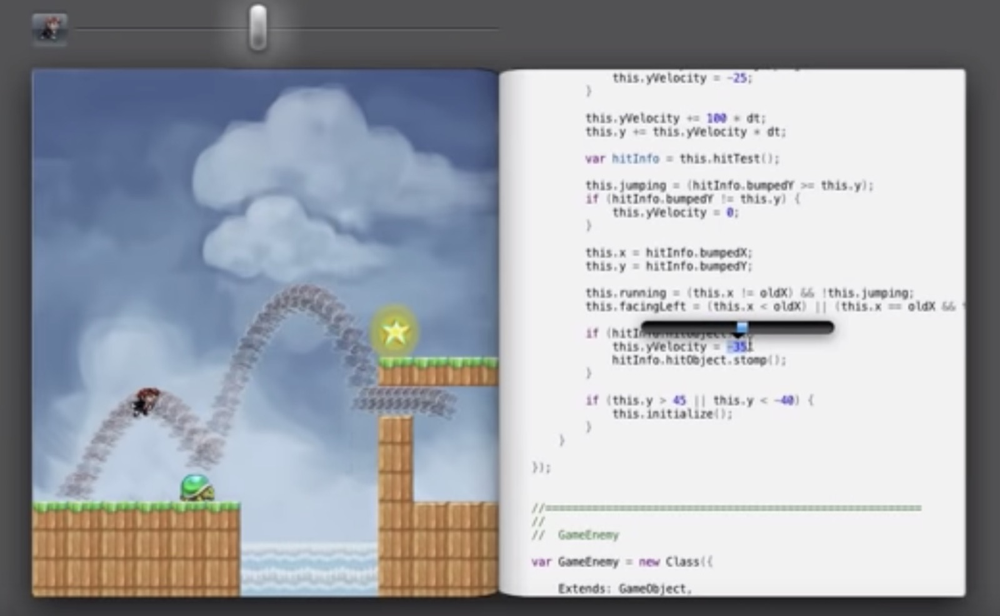
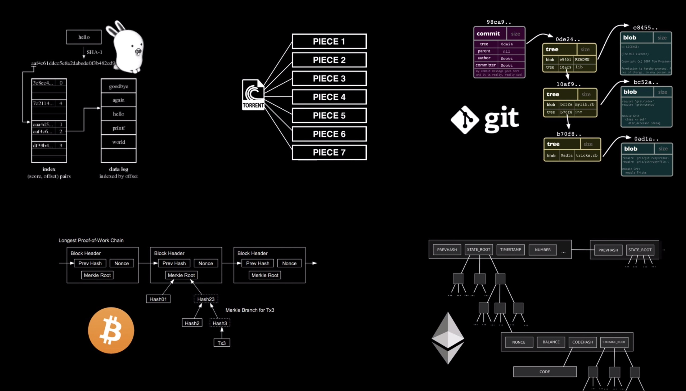

# 在程序中时间旅行

> Nor Time, nor Place, nor Chance, nor Death can bow. My least desires unto the least remove. - "The Time Traveler's Wife"

三年前，当我写下那篇青涩的『永恒不变的魅力』的文章时，我刚刚是 elixir 和 clojure 的入门者。我如饥似渴地从 Bret Victor，Rich Hickey 等人身上吸取思想和力量，来浇筑我对函数式编程的信仰。函数式编程语言中有诸多让人赞不绝口的设计思想，但 immutability（不可变）显然是皇冠上的明珠。它让我们可以肆无忌惮地使用并发，不必考虑 lock，因为没有 critical section 可言；它让我们不必再终日在野指针造成的 segment fault，坏引用导致的 exception 中彷徨哀怨甚至自戕。当我们用一个产品的时候，确定性让我们感到安全和愉悦 —— 你使用微信，发给朋友的信息如果代表发送的小菊花停了没有惊叹号，那就一定成功了，这就是确定性；immutable 给程序员带来的确定性是：我给你一个引用，只要你拿着，就算到了天荒地老，海枯石烂它也能够访问，且还守候着原来的值。

有没有想过，这么好的东西，为什么前辈们不使用呢？

非不为也，实不能也。immutable 是好，但是「浪费」内存啊。

当机器的内存以 KB 为单位时，描述复杂状态的程序都力不从心，自然只能尽可能地重复利用每一个 bit，以期它能发挥最大的作用。什么 “copy on write”，一边去。

八九十年代，内存虽然到了 MB 级别，但 DOS 受限于实模式的寻址能力，还是把内存分成了五环内（低 1M）和五环外（超过 1M 的 expanded memory），所以那时的程序员依旧以扣内存闻名。

千禧年后，内存在亚 GB 级别往 GB 级别过渡，操作系统早已完全采用 32 位保护模式，正往 64 位过渡。大部分应用程序开发者渐渐无需考虑内存的天花板，就算一不小心把物理内存用超了，还有 swap 兜底，管够。但是，牛顿告诉我们，程序员是懒惰的，没有外力作用的时候，会产生惯性，也就是路径依赖。

路径依赖导致 immutable 的思想人人叫好，但依旧只是用在少量的场合，比如 git，docker，react，当然，还有区块链。

还有一个原因。看待世界的方式。我们所运行的世界究竟是一个可变系统（mutable system）还是一个不可变系统（immutable system）？我们先来研究自己的大脑。大多数人第一反应可能会觉得大脑是个可变系统，然而仔细想想，它是不可变的。我们的记忆就像洋葱圈一样，不断叠加，而不会修改。拿我家的电话号码来说，我脑袋里能立刻蹦出来好几个号码，有四位数的，那是小时候家里安装的第一部电话，有广东的，北京的，圣何塞的，西雅图的，等等。所以大脑是个不可变系统，数据一旦产生，大脑只会将其连接起来，并不会修改。我们再看日常发生的各种事件 —— 今天的气温，世界各地的新闻，楼下弹钢琴的孩子，所有这一切都是不可变的。气温看上去在变化，但这取决于建模的方式，如果气温不是一个值而是一个以时间为刻度的 vector 呢？

所以当我们把世界看成一个个只有最终状态的点的时候，它是不断变化的；然而加上时间的维度，它是不可变的 —— 在一个初值 (genesis state) 下，发生了一系列不可变的事件（event），最终导致了当下这个状态（state）。这是我们这个世界运作的方式，可惜，在大部分时间，不是我们撰写程序的方式 —— 即使我们的程序要么和现实世界打交道，要么在模拟现实世界。

Bret Vector 在他著名的讲座 Inventing on principle，展示了改变认知如何让我们拥有一个又一个 voila moment，比如这个截图，游戏中的时间旅行：

在程序中做时间旅行并不是件新鲜事，我们每天使用的 git 就可以让我们自如地在历史上发生的任何一个 commit / tag / branch 上切换：

而 clojure 的一个 pixel editor，Goya，也用时间旅行的方式来做 undo / redo，非常简单：

而要做到这一切，首先我们要引入 immutable 的思想，使用 genesis state + events 的方式来描述应用程序里的世界。在 git 里，一个个 commit 就是一个个 event；在 goya 中，画笔的每一次动作，就是一个 event。

然后，我们需要用一个合适的数据结构来保存 state —— Chris Okasaki 的 Purely Functional Data Structures 向我们揭示了 persistent data structure 的神奇魔力 —— erlang 的发明者，Robert Verding 据说就是照着 PFDS 这本书的例子写出了 erlang 的数据结构的支持。

persistent data structure 是一棵树：

在这里，数据保存在叶子节点上，然后以数据的索引为基础构建出来一棵树。当整个结构的某些数据变更时，我们只需要产生新的数据，然后产生索引该数据和未改变数据的一棵新的树，从而在空间上避免 immutable 产生的拷贝。在函数式编程语言中，旧的树如果没有人用了，GC 就回将其回收，但如果我们把每个 event 产生出来的新的树和旧的树链接起来，或者记录下来，就具备了时间旅行的能力。

git 使用了 Merkle tree（更准确地说 Merkle DAG）来存储所有 commit 的所有 object。和 persistent data structure 思路类似，数据（commit 里的 objects）在叶子节点上，只不过连接叶子节点的索引是其 hash，而非普通的 key。Merkle DAG 的使用非常广泛，从 Plan 9 OS 到 BitTorrent，从 git 到 bitcoin / ethereum，等：

我们知道，通过初始的 genesis state，不断顺序叠加 event，可以构成任意时刻的 state，这样的设计思路是 event sourcing。而使用 event sourcing，把当前的 state 用 Merkle DAG 管理并保存下来，再使用公钥加密算法使所有的 event 和 state 都 public verifiable，就构成了我们所熟知的以太坊。

在以太坊里，其 event 是 transaction，state 使用 Merkle Patricia Tree 保存。如果把以太坊看成是一个自给自足的世界，那么其 fork 就是这个世界在平行宇宙中的另一个世界，而我们人类就像『星际穿越』中的五维人，可以在以太坊世界中进行时间旅行 —— 比如，我要回到 2017 年 1 月 13 日，去探索那个时间点这个世界里所有账户的状态，只需要找到 4904084 这个块里的 state root，找到这个 hash 下面对应的数，然后从这棵树一路往下挖掘信息。

那么，如果我们需要以太坊任意一个时刻的状态呢？在以太坊的世界内，时间究竟是什么？时间是区块的高度。所以，在以太坊内进行时间旅行，就是在获取不同块高下的状态。然而，以太坊自己的时间是晦涩的，所以我们需要先将人类社会的时间映射到以太坊上的块高，然后找到给定的人类时间下最接近的块高，就得到了以太坊下的任意时间内的时间旅行。
