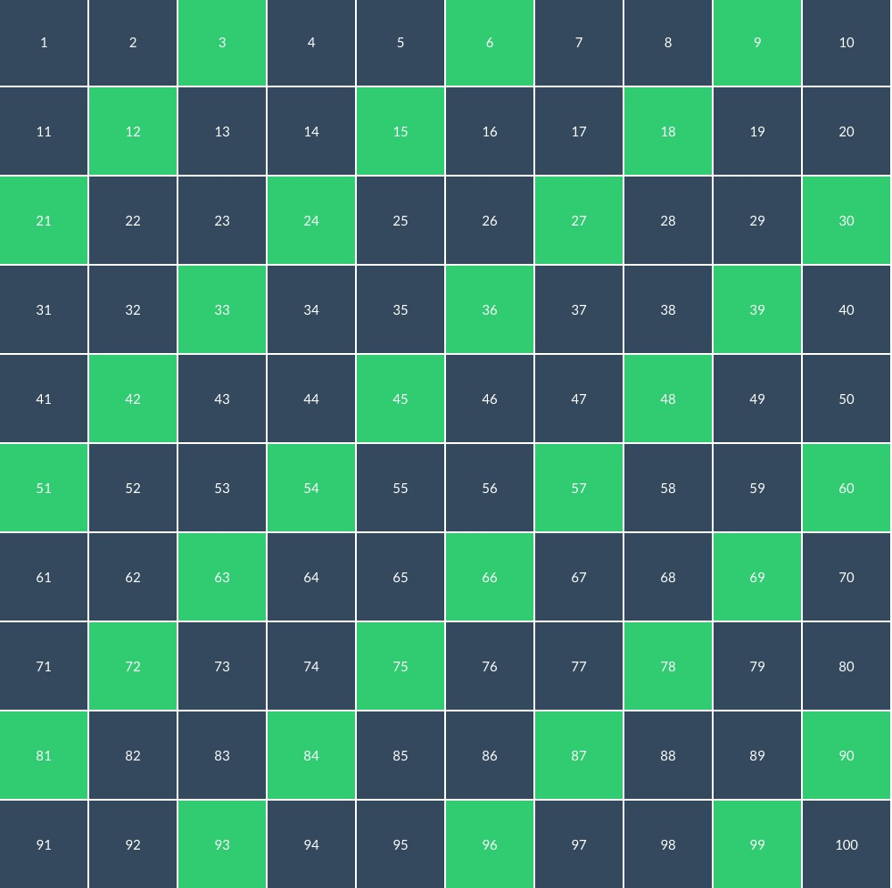
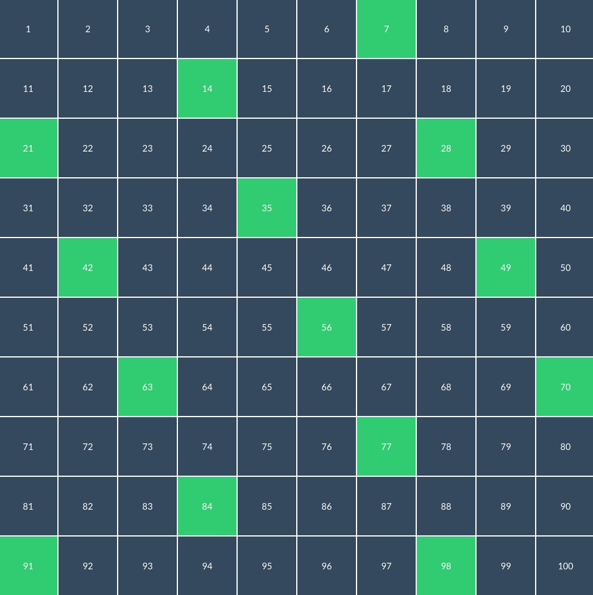
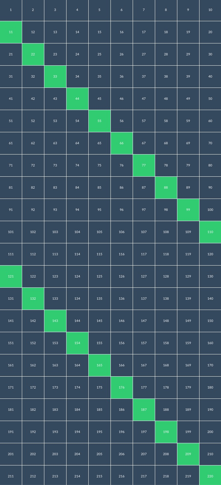
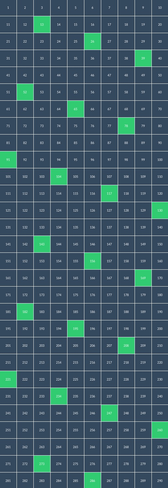
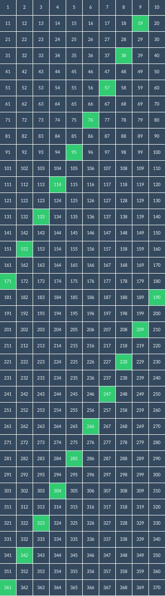
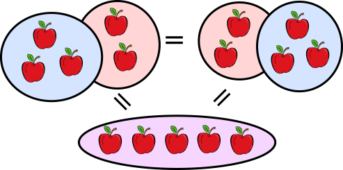

# 数学之美

把数学的美妙绝伦传递给一个六岁的女孩儿并不是件容易的事情。我们可以轻而易举地心算出任何一个 100 以内的数乘以 3 的结果，也可以道出「乘法是加法的累进」这样的总结，但六岁的孩子并不理解其中的奥秘。前两天我老婆许是受了数独的启发，在白纸上画了十乘十的格子，给小宝演示 100 以内任意一个数乘三，乘七，乘十一的结果（因为除法是乘法的逆运算，你也可以理解为可以被三，七，十一整除的数字），当枯燥的数字化作了图形，并且这图形展现出统计意义的规律，小宝本来对数学的好感被大大激发了，从这些图形中发现了很多有趣的事情。老婆便让我做个简单的应用，让小宝能够更好地了解数字及其背后的运算。

这是一个宏大的命题 —— 于是我的开篇便以小宝能够理解的乘法除法开始。代码写完之后随便调了几个数字一运行，我都不敢相信自己的眼睛 —— 原来那些简单的运算，还有如此美妙的分布：

注意个位数字的 9，8，7 ... 3，2，1 和十位数字的 1，2，3，4，5 ...

个位数字的 1，2，3，4，...，十位数字隔行 2，4，6 ...，1，3，5 ...

也是个位数字9，8，7 ... 3，2，1 和十位数字的 1，2，3，4，5 ...，更齐整

个位和十位都以一递增，上百位之后个位数 1，2，3，4，5，...，十位数 2，3，4，5，... 齐整漂亮

向右斜着看十位数以一递增，逢三跳一，向左斜着看，个位数又是 9，8，7，6，5，... 的规律

个位数9，8，7，6，...，十位数重复两次交替 1，3，5，7，9，和 0，2，4，6，8

这些规律是小宝和我在玩的过程中一点点发现的，大部分要归功于她，我只是做一点小小的总结和启发。

当然，本文的重点不在于这些对你而言过于简单的四则运算。我们是程序员，数学给了我们穿越时空的眼睛，我们要用它探究程序的奥义。

## 幂等（idempotent）

幂等是很多程序员的装逼利器。在 code review 大家激烈撕逼的当口，你优雅地吐出最后一个烟圈，掐灭手头的烟蒂，清一清喉咙，嘶哑地来一句：这个 API 幂等么？绝对秒杀现场 99% 的格子衫。如果还能够正确地拼对并且读对 idempotent，基本可以一战封神，不愁找不到女朋友。

那么究竟什么是幂等？

> Idempotent is the property of certain operations in mathematics and computer science whereby they can be applied multiple times without changing the result beyond the initial application. - wikipedia

说白话就是：幂等是指被自己重复运算，结果还等于自己。说人话就是：f x f = f。这个规则放在计算机世界里，稍微弱化成一个函数 f(x) 可以被调用任意多次，其副作用保持不变。注意，这里的不变并不意味着没有副作用 —— 比如删除数据库里的一条主键为 k 的记录，无论调用多少次，其副作用都是 k 这条记录不存在。从这个意义上讲，没有副作用的纯函数（pure function）一定是幂等的，幂等函数不一定是纯函数。

幂等的好处是带来（副作用的）确定性。HTTP GET / PUT / DELETE 被设计成幂等的，是因为资源的获取，替换和删除无论被调用一次还是多次，资源的状态保持不变。这样，调用者可以多次调用（刷新页面）而不必担心引发错误。

在一个分布式的世界里，幂等是皇冠上的钻石。我们要尽可能（或者说不得不）将系统设计为幂等，来应对各种各样的不确定性。比如郭靖通过互联网给华筝转账 10 个金叶子，华筝可能没收到，也可能收到了但是给靖哥哥的回复在网络上丢了，两种情况郭靖都需要重传这笔交易，然而重传导致的后果可能是郭靖明明只需要给华筝转 10 个金叶子，却转了 20 个，打碎了牙只能往心里吞。如果设计成为幂等，我们可以在转账交易中加入一个唯一标识，这样重复的转账就会被丢弃，从而保证一致的副作用。

我们把这个例子稍微抽象一下。在一个消息处理的系统里，如果我们能有以幂等的方式处理消息 —— 就是说同一个消息，我收到 (1, n) 次，其副作用是不变的 —— 那么很多复杂的事务性的问题就迎刃而解了，同时我们也可以降低消息系统的复杂性 —— 我们知道，在一个消息系统里，消息送达的模式有：**at least once** 或者 **at most once**。这两种都很好实现，但要想能够达到 **exactly once** 则几乎是 mission impossible。

这中消息处理的幂等能力在网络协议中很多见，主要用作 anti replay；以太坊的世界里，transaction nonce 就是这个作用。

## 交换律（commutative）

和幂等不同的是，交换律及下面要谈到的结合律都是小学数学就会涉及的范畴（虽然 $f(x) = x * 1$, $g(x) = x / 1$, $h(x) = x + 0$ 这些显然也是幂等的范畴，但小学不会引入幂等的概念），不到特殊场合，拿出来装逼只能贻笑大方。

交换律是说给定任意 x, y，对于运算 "*"，如果 $x * y = y * x$，那么我们就认为这个运算是可交换的。拿人话来说就是我们可以改变处理的事件的顺序而不影响其最终的结果。对我女儿来说，她很容易理解（加法的）交换律：

在计算机的世界里，交换律意味着我们可以打算指令（或者消息）的顺序，进行乱序执行。在我们这个热力学第二定律统治的宇宙下，乱序执行一定比顺序执行更有能效。在一个消息系统里，如果消息要按照发送的序列严格处理，就意味着在接收端需要使用队列来存储和排序已经收到的消息，前一个消息没有处理，不能处理下一个消息，那么，这样的系统效率比较低；如果我们能够将其改进成为消息可以按照收到的顺序处理，也就是满足了交换律，那么，效率可以成量级地提高。

假设我们要计算从网络另一端传输过来的一到一百的数字之和，传输过来顺序可能是：

> 2 7 3 8 1 9 6 5 4 ...

如果我们的算法不满足交换律，那么它需要花 O($nlogn$) 到 O($n^2$) 的时间维护有序列表，同时需要 O(n) 的空间来维护等待处理的队列（比如：收到 1 之前的，排好序的 2 3 7 8）。系统最坏的延迟是 $na + nb + n^2c$（假设 a 是传输一个元素的延时，b 是一次加法所需要的时间，c 是在列表中移动一次并比较的时间）。

如果满足交换律，那么就意味着我收到 2，就可以计算 $0 + 2 = 2$，收到 7，计算 $2 + 7 = 9$，一路下来，不需要花时间和空间维护列表，同时系统的延时只有 $na + b$（假设 a > b，在等待收下一个元素的时间 a 里，当前的元素累加所花的时间 b 已经被包含进去）。

从上面的讨论可以看到，在一个消息系统里，如果一个算法能够满足交换律，那么，其大大降低了系统的复杂性，也大大缩减了系统的延迟。

## 结合律（associative）

结合律是说给定任意的 x, y, z，对于运算 "*"，如果 $(x * y) * z = x * (y * z)$，那么我们就说这个运算是可结合的。拿人话来说就是，只要参与计算的元素的顺序不变，我可以随意改变运算的顺序，而不会影响最终的结果。在初等数学里，实数的加法和乘法都是可结合的，比如 $(1 + 2) + 3 = 1 + (2 + 3)$。

注意，满足交换律并不意味着满足结合律，比如运算 "*" 的定义是 f(x, y) = $x^2 + y^2$，$f(f(x, y), z) = f(z, f(y, x))$，即 $(x^2 + y^2)^2 + z^2 = z^2 + (y^2 + x^2)^2$，显然满足交换律，但：

$f(f(x, y), z) != f(f(x), f(y, z))$，即 $(x^2 + y^2)^2 + z^2 != x^2 + (y^2 + z^2)^2$。显然不满足结合律。

在计算机的世界里，结合律意味着计算的顺序可以发生变化。比如快排算法，在 partition 之后，先处理小于基准点的数组，还是先处理大于基准点的数组，并没有关系，所以它是满足结合律的。

我们进一步思考，可以发现，满足结合律意味着处理过程中的局部状态并不受全局状态的影响，或者说独立于全局状态，于是，结合律还意味着并发处理 —— 对于一个给定的列表，如果处理列表的算法是满足结合律的，那么就意味着我们可以对列表中的子列表进行并发计算，而并不影响最终的结果。反过来表述，一切可以分治的算法，比如 map / reduce，都满足结合律。

## 幂等 x 交换律 x 结合律

在一个分布式网络里，消息的传递是不确定的，这种不确定性有二：

1) 消息可能丢失。丢失是件很讨厌的事情，于是我们加入重传，这样引入新的不确定性：消息有可能重复。接收方可能收到 (1, n) 次。
2) 消息可能乱序。乱系意味着同一个网络中的 n 个节点，他们最终收到的消息序列的顺序可能互不相等，并且不可预测。

假设两个节点 (A, B) 的网络，收到三个消息 (x, y, z)，它们看到的结果可能是：

* A: xzzyzy
* B: yyzzxxxzy

如果 A 和 B 肯定能收全所有消息，并且根据这些消息，可以推导出一致的状态 S，那么我们就称这个系统具备一致性。

一般而言，我们可以引入某种同步机制让所有人看到顺序一致的消息 —— 比如数据库系统会使用 leader election 选出主节点，由主节点来确定顺序；而区块链中会使用算力或者投票权通过某种共识算法选择出某一时刻的主节点，所有节点接受主节点确定的消息顺序。

然而，我们也可以在数据结构和对数据结构的处理上，同时引入幂等，交换律和结合律。这样，从数学的角度，我们可以计算出 A 和 B 的最终状态都会收敛在 x * y * z 上。

我们先不看怎么设计数据结构和算法，如果我们达到这个效果，那么就意味着网络中的所有节点可以各自独立地推导出一致的状态，不需要任何的同步，那么，网络本身运行的效率将会非常高效，且能够不付出太多代价的前提下满足 Crash Fault Tolerance (CFT)，甚至，经过一些改进，满足 Byzantine Fault Tolerance（BFT）。

如果你觉得有意思，以后我们可以讲讲实现这个理想的数据结构 CRDT（Conflict-free Replicated Data Types）。

欢迎回到数学的世界！

