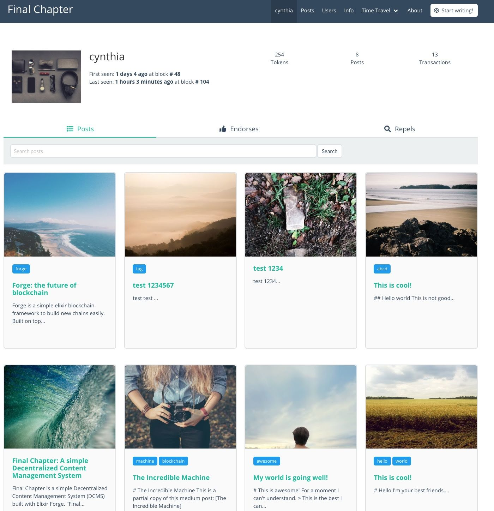

# ArcBlock 一周年

（一）

> 这是我开过的最艰难的一次长途了。从家到 springfield（中转站）570 英里，我早上 8:30 出发，下午 4:50 到。进入 Oregon 之后，天就跟漏了似的，一路时断时续的暴雨，有的山路已经形成洪流，车驶过的时候，轮胎被水流带着，方向盘都有些不听使唤。好在一路车少，有惊无险。 - 程序君 04/28/2018

岁月如梭，光阴似箭，湾区的生活似乎就在昨天，而我成为华州的居民已经一年零一天了。这一年过得跌宕起伏，就像我只身驱车前往华州的旅途一样，前半程傲睨自若，势如破竹；后半程战战兢兢，如履薄冰。好在，最后一切安然。

三月份回湾区参加 Code BEAM 大会，重回 Tubi，见了很多老朋友。Tubi 一片欣欣向荣，全方位不断刷新自己的记录 —— 17 年底搬入的新办公室，仅仅一年多时光，便已已经捉襟见肘，整层楼明显超载；而北京办公室那边，更是不得了，趁着国内互联网公司一片哀嚎从高大上的 Wework 纷纷撤离之际又扩充了大片工位。我跟 haofei 调侃，Tubi 赶紧上市，我好在 Bellevue 买套房，结束租房生涯。回到家跟老婆聊种种往事，老婆问我，从 Tubi 离开，你后悔过么？我笑笑，不后悔啊，虽然整个加密货币市场一地鸡毛，但是我们离一年前的初心，已经无比接近了。

是的，无比接近。

去年这个时候，我踌躇满志地写下了《欢迎来到区块链的世界》，其中谈到了 ArcBlock 看到的机会：

> 第一个方向，是围绕着数字资产的持有者和创造者的产品和应用 —— 已有的大饼如何切。有以下机遇：

> 1. cryptocurrency 交易所。这目前是属于币安们的舞台，很快也会迎来纳斯达克等传统交易所。也许未来 DEX（去中心化交易所）会成为重要甚至主要的力量。
> 2. 数字投行。如果把 爱西欧 对应于 IPO，那么，谁来做区块链时代的高盛？摩根斯坦利？
> 3. 数字投资。如果把 token 看做资产，那么，谁是区块链时代的富达，桥水？谁来帮用户管理数字资产，打造合适的 cryptocurrency portfolio，让其保值和增值？

> 币安每天 $10B 的体量，已经可以和中小国家的证券交易所匹敌，足以说明问题。而若能做成区块链时代的桥水和高盛，想想都能流口水。

> 第二个方向，用区块链取代现有的解决方案。有几个机遇：

> 1. 去中心化金融科技。Fintech 领域也许是目前除了交易所外最成熟的应用领域，如 Ripple。
> 2. 反欺诈。在电商，p2p lending，crowdfunding 等方向有很多机会。
> 3. 数据保全。在知识产权，证书，身份（identity），供应链，以及用户的积分体系等等都有产生高质量用户的机会。
> 4. 智能合约（smart contract）和分布式应用（Dapps）。这是吵得最凶，最滥，关注点最高的领域，但目前除了以太猫（crypto kitty）外，似乎没有太多实质的应用。这个领域需要足够好的思考和最够完善的基础设施才更容易出成果。
> 5. 小额支付/点对点支付。这是一个很重要的方向，目前以我有限的想象力还很难看出有什么需要用区块链取代微信支付的小额支付场景。

> 第三个方向，打造更好的，技术更领先，更快，更容易构建应用的公链，以取代「缓慢」，「buggy」的以太坊。这个方向市场巨大，成则雄霸天下；却也是异常拥挤的红海，几乎 90% 的区块链公司都把自己定位于一个更好的公链，最终的结果是一将功成万骨枯。

> 第四个方向，是围绕打破区块链只是为技术极客设计的樊篱，让这个技术有更大的普惠性 —— 如何扩展这个大饼的边界。这是 ArcBlock 看中的方向。它有以下机遇：

> 1. 打造能够给菜场大妈使用的区块链产品（首当其冲的必然是钱包应用），让「旧时王谢堂前燕，飞入寻常百姓家」。
> 2. 打造产品为第一个和第二个方向的公司服务，成为淘金者身边的李维斯。
> 3. 打造产品以及构建生态，桥接 real world 和 blockchain world —— 让 app 开发者可以简单嵌入一个 SDK 或者调用一些 API，使用 blockchain 的各种能力 —— app 开发者甚至不需要知道 blockchain tech 的存在。就像 app 开发者基本上都会使用 HTTP 来承载网络上的数据，有哪个 app developer 需要读 RFC2616 / RFC7540 呢？blockchain tech 终将需要发展到这一步。

> 这里面的 2 和 3，就是 ArcBlock 的机会。ArcBlock 选择这个方向，是完完全全从用户的角度出发，因为历史一再证明，要想一门有使用场景的技术进入主流市场，简单易理解体验好是起码的要求，而对用户的简单则是对开发者的难题，有时甚至是难以逾越的天堑。ArcBlock 的壁垒将是对 2 和 3 的用户的需求的深刻理解，我们内部的服务提供能力，我们的 node 快速部署的能力，我们的 Blocklet 的 auto scaling 的能力，以及我们在追求正确方向和正确道路上打造出来的创新和学习能力 —— 这些都是冰山下面的部分，是风停了之后我们依旧能够前行的能力。

一年过去了，同行者大多已经不知所踪，而我们依旧在这条路上深耕 —— 更重要的是，我们一步步，从技术上，从产品上，从思想上对链，对应用，对用户体验有了自己独特的洞见，并且将其付诸于产品之上。我们追求的不是大一统的公链，而是万链齐发的应用链，也就是我们提出的链网的概念，因而，我们费尽心思赋予每个应用构建自己的链的能力。我逢人便说，我们的 forge framework 之于区块链，就像 Ruby on Rails 之于 Web 2.0，它终将开启潘多拉魔盒，让区块链成为每个开发者触手可及的，去打造合适的应用的工具，而非币圈先行者们用于圈钱的禁脔。

（二）

这条路并非坦途。一年前，所谓的 dapp（decentralized app）大多就是一些简单的 smart contract，而这些 dapp 的极致代表是 cryptokitties，Fomo 3D 这样出奇制胜的游戏。真正和大家工作生活息息相关的应用，一个也没有。对于 dapp，我们心心念念的是，如何提供基础平台用区块链重塑 taobao，ebay，eventbrite 这样的交易相关的应用（区块链的强项），甚至 wordpress，discuz! 这样内容相关的应用。

这在当时是一个没有人可以（用技术 / 产品）回答的问题。以太坊及其继任者之所以无法回答这个问题，是因为 1) 公链把全网所有的数据糅杂在一起，不但拖累应用的表现，还严重影响应用的开发测试和部署。2) 以太坊的基础设施及 smart contract 的能力，还不足以高效完成足够复杂的业务逻辑。3) 开发者体验太差。

当然，饭要一口口吃，路要一步步走。比特币和以太坊作为最成功的两个区块链项目，值得我们深度学习和研究。我们并未像同期绝大多数项目那样，fork 一个以太坊，改头换面，宣称是自己的项目；相反，我们走了一条艰难的路：通过打造一个跨链的中间层，我们深入比特币和以太坊的奇妙的状态世界，理解他们的运行机理，为我们自己的框架做技术储备；同时，我们运营多条链的节点，学习他们的运作方式，从开发者的角度和节点用户的角度，找出其中的痛点和产品上可以精进的地方。

在这个过程中，我们做了大量的准备工作，有些甚至看上去和链毫无关系。比如我们做的一个代码自动化的项目 Goldorin，可以把 yaml 格式的 schema 描述转换成 GraphQL / Database 相关的代码（见我之前的文章：如何在几十个 Repo 中游刃有余？），它的诞生仅仅是为了提高我们 API 的开发效率，却不料后来被应用到了我们的 ABT Chain Node 上，为 protobuf 接口自动生成 GraphQL 接口立下了汗马功劳。

这就好像柳传志所说的：撒一层土，夯实，再撒一层。

当我们的技术储备和对区块链的理解到达一定层次后，我们也并未立即撸起袖子开干。我们在 tendermint 上做了一个 ex_abci，提供 elixir 的 ABCI 的支持。tendermint 作为一个优秀的 p2p / PBFT consensus layer，定义了一套完善的接口，把区块链的实现和 p2p / consensus 分隔开，这和我们分层处理，屏蔽细节的思路不谋而合。在 ex_abci 的基础上，我们做了一个非常原始的区块链开发框架 —— 使用以太坊的 MPT（Merkle Patricia Tree）的思路管理链上的 state，使用 protobuf 定义 state 和 transaction，用 gRPC 提供对外的 RPC 服务。框架本身只提供最基础的 transaction 支持，比如 transfer，而更加丰富的 transaction 的支持交由 dapp 来完成。因为这个框架的目标是帮助开发者 __锻造__ 他们的应用 __链__，因而取名 Forge：

就着新鲜出炉的 Forge，我们尝试着构建了一个 PoC app —— 一个去中心化的 wordpress。我管它叫 Final Chapter。用户可以在 Final Chapter 里创建文章，endorse（顶）或者 repel（踩）一篇文章。正如你所猜到的那样，create_post / update_post / endorse / repel 都是自定义的 transaction。Final Chapter 前端使用 phoenix，后端使用 Forge，尽管仅仅是一个很原始的 PoC，但它验证了 Forge 的方向的正确性，以及其具备的无穷潜力。我们还意外地发现，巧妙使用 MPT，可以实现区块链世界的时间旅行 —— 一个用户可以在 Final Chapter 的时间轴上自由地翱翔 —— 就像《星际穿越》中，Cooper 在黑洞中进入的四维空间。。

于是，用户发表的文章有了自己的生命线，时间轴上经历的任何一次 update_post，都是一个不可磨灭的版本，同理，每个用户也有他们自己的，一步步迭代的版本，甚至，整个应用的全网数据，在每个 tick（一个区块产生的时间）里，都有独一无二的版本（想了解更多请参阅：在程序中时间旅行）。

Forge 的 PoC 看上去是可行的，接下来我们便为其提供更加丰富的功能 ——

为了支持丰富的钱包类型，我们开发了 Mcrypto，开发者，甚至用户可以决定她在链上使用什么类型的钱包 —— 用 Secp256k1 还是 ED25519 算法制作密钥？用 sha2，sha3 还是以太坊使用的 keccak f1600 来做哈希？

为了让钱包的密钥可以像账户的密码一样为了安全起见不断更新，我们提供了 account migration 的能力。这样，当你的私钥有潜在泄露的风险时，你可以使用 account migration 把旧的密钥迁移到新的密钥 —— 你的朋友们依旧可以给你的旧的钱包地址发送交易，而相关的交易会自动转向新的地址。

为了让节点的升级可以像普通软件的升级一样无缝，我们提供了 auto upgrade node 的能力。当 upgrade 在网络中达成共识后，所有节点会在指定的高度一起停下来，自动更新为新的版本，并重新启动。

为了提供足够丰富的，开发者开箱可用的 transaction，我们开发了丰富的 transaction protocol，从账户的管理到资产的创建和管理，从链上的治理到跨链的支持，从简单的交易形态到非常复杂的交易方式。举个例子，如果你要开发一个应用来销售电影票，每张电影票都是一个 none fungible 的 token（在 Forge 里，我们称之为 asset），影院的管理者可以从销售电影票的过程中获得 token，而购票者付出了 token，得到了 ticket asset。之后这个 ticket asset 作为一个凭证可以在影院入口消费。这整个流程如果用区块链解决，非常具有挑战性（想想你怎么在以太坊上搞？）。类似的场景有很多，比如签证，比如门禁，都是一个机构可以发行 asset，用户可以通过付费或者一些前置条件来获取这些 asset，并且在合适的场合消费。对此，我们提供了类似自动售货机一样的 asset factory 来解决这一类问题。

不仅如此，我们的 transaction protocol 还可以 hot upgrade —— 也就是说，节点不必重启，一个新版本的 protocol 就可以部署至全网。

最后，我们力图让这一切都尽可能简单。我们提供了 forge-cli，两三条命令就可以让开发者运行自己的节点；我们提供了多种语言的 SDK，尽可能扫清开发者开发的障碍；我们的 ABT Chain Node，提供链上数据的可视化服务，对于节点的大部分操作都可以在 web 界面中完成；为了降低开发者大规模部署链上节点以及运营成本，我们开发了 forge-deploy 脚本，可以用两条命令在数分钟左右（取决于节点的数量）在 AWS 全球大部分 region 部署大量 spot instance；对于小白用户，我们还提供了 ABT Chain Node Desktop，可以直接安装使用。

所有这些，都绝非易事，我们需要在和时间赛跑的同时，解决一个又一个没有先例，解空间完全未知的问题，就像出塞三千里追击匈奴的窦将军，或者历经十七载西行求法的陈玄奘，全靠一个坚定的目标和初心，以及百折不挠的坚韧，才在迷途中杀出一条路。

（三）

记得在某一期的《朗读者》里，董卿说过：我们成为什么样的人，可能不在于我们的能力，而在于我们的选择。选择是一次又一次自我重塑的过程，让我们不断成长，不断完善 —— 如果说人生是一次不断选择的旅程，那么千帆阅尽，最终留下的，是一片属于自己的独一无二的风景。

我发现自己似乎在面对选择时，总是做出旁人看来最艰险的决定。

2010 年底，我在 Juniper 顺风顺水，本可在 engineering manager 的位置上一点点向上爬到养老，不用再面对诸如「35 岁的程序员还能不能写得动代码」的问题，我却选择了搭上移动互联网的班车去创业 —— 更确切的说，我把自己的人生赛道从通讯行业切换到了互联网行业

两年后创业失败，面对很多新的机会，我没有立刻进入到下一个项目，而是选择重回 Juniper，一方面为赴美工作铺垫，另一方面也是停下来反思和复盘。尽管看上去我又重新回到了通讯行业，但我清楚地知道，我的未来还在于互联网，我的下一次创业也必然在互联网而非通讯领域。于是在 Juniper 略显悠闲（和创业相比）的工作生活中，我没有选择养生，而是写书来复盘创业的过程，总结经验教训；写公众号来扩大自己的个人品牌的影响力，从而某种程度上弥补我之前创业的一个痛点：影响力不够，进而很难招到合适的人。

2014 年底到了美国之后，面对更加悠闲的美国大公司养老式工作，我每天不到 7 点左右就奔赴公司，七小时工作之余（别笑，我觉得大部分美国同事每天能正儿八经工作五小时就不错了），我硬生生挤出来差不多另外七个小时去探索各种领域；没过多久，我便主动要求调到旧金山的 web security 的团队，尽管从汇报级别上来看，我从汇报给 Sr. Director，变成汇报个 Sr. Manager，很不符合常理，但 web security 贴近我中意的互联网。

2015 年底，Tubi 的机会出现，尽管降薪（不算 option，因为那时 Tubi 的 option 还几乎没有任何价值），并且放弃大量的 RSU，在扫清身份的障碍后，我还是义无反顾地加入了 Tubi。互联网，创业公司，已经验证过的商业模式，糟糕的工程能力，使得当时的 Tubi 对我来说，是天赐良缘（见我的文章：《缘分天注定》），是桑德伯格口中的 rocket ship —— 我一直很青睐桑德伯格的那句话：If you're offered a seat on a rocket ship, don't ask what seat. Just get on。

去年，同样的剧本发生 —— 经历了一番对未来趋势的详细研究，我深深地感到自己未来的赛道在于区块链，或者说，区块链背后的 web 3.0。于是，便有了我的 ArcBlock 一周年，以及这篇文章。

我不知道在另一个平行宇宙的自己，在每次面临人生的十字路口时，都放弃那条《少有人走的路》，而选择理性的 SWOT 分析下来更「正确」的路，将会是什么样。但肯定不会像我这样，以三十七岁高龄（在程序员的世界里，这已经算得上耆耆老者了），每天还花费五六个小时伏案疾书，写就上千行代码。

当然不可避免的，也会少了很多很多可以给儿孙们讲睡前故事的素材。
