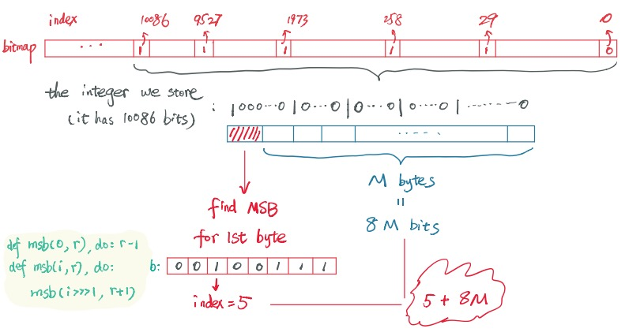
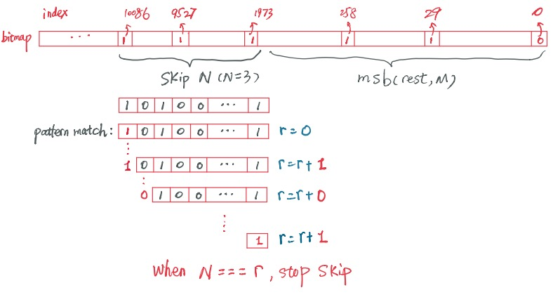

# 谈谈 Bitmap

产品发布在即，同事遇到了一个 API 的性能问题和我探讨：

> 我们产品自带的 explorer 有个 GraphQL API，返回 N 个非空区块。这个 API 可以这么调用：从最新的区块起，跳过 N 个非空区块，返回接下来 M 个非空区块。

在 API 设计中，跳过 N 条数据（为了分页）而返回满足某种过滤条件的 M 个结果，是非常常见但并不太好实现的需求 - 尤其是数据的 filter 并不能简单用 DB query 完成的情况下。在我们这个场景里，区块的数据是存在 kv-based state DB 中，所以过滤是个 O(n) 的操作。从产品需求来说，由于不包含 transaction 的区块只有时钟上的意义，给用户展示上的意义不大，所以我们希望在 UI 上将空的区块折叠；因而需要 API 来返回非空的区块列表。

一开始我们考虑在实际部署时，非空区块远多于空区块，由此在设计上简单处理为从 State DB 里面读取区块，过滤空的区块，然后返回给用户 N 个非空的区块。

然而最近两天，我们内部的测试网络没有运行 simulation，因而没有产生 transaction，空的区块累积了数万个，此时，访问 API 时，需要过滤上万条数据，因此很容易超时。

这是一个典型的可以使用 bitmap 来短平快提速的问题。Wikipedia 这么给 bitmap 定性：

> In computing, a bitmap is a mapping from some domain (for example, a range of integers) to bits. It is also called a bit array or bitmap index.

对于我们的需求，如果把区块的高度和该区块是否有 transaction 映射起来，就可以得到一张 bitmap，而返回 N 个非空区块，就简化成从 bitmap 中寻找 N 个 MSB (Most Significant Bit) 的问题。如图所示：


## 接口设计

循着这个思路出发，我们可以为这个 bitmap 定义如下接口：

* new(): 初始化一个 bitmap
* set(bitmap, index): 设置高度为 index 的 bit 为 1。比如区块 50 有 transaction，那么就调用这个函数
* unset(bitmap, index): 设置高度为 idnex 的 bit 为 0。
* *set?(bitmap, index): 测试高度为 index 的 bit 是否为 1。
* msb(bitmap): 获得 bitmap 最高位 1 的 index，比如 msb(0b1011) = 3
* msb(bitmap, m): 获得 bitmap 头 m 个位是 1 的 index，比如 msb(0b1011, 3) = [3, 1, 0]
```

这样，我们可以这样优化业务逻辑：

1. 当每个高度为 h 的区块创建时，如果其 number of transaction > 0，则调用 `set(bitmap, h)`。
2. API 获取 N 个非空区块，我们先获取 N 个非空区块的高度：`msb(bitmap, N)`。
3. 然后拿到高度的 list 后，依次从 state db 取对应的数据。

到这里，理论上来说，我们的 API 的性能会提升数个量级。不过这个 bitmap 和传统的有固定长度的 bitmap 略微不同，它会随着时间不断扩展。这里我们利用 elixir/erlang 支持任意精度的大整数的能力，做了一个取巧的算法 —— 我们的 bitmap 就用一个整数来标识。


> 注：erlang 的大整数实际上也有限制的 —— 当这个整数有超过 3500万个 bits 时，系统会报错，也就是说，erlang 无法产生和处理一个占用内存超过 4M 字节的整数。考虑到 128 bits 的整数（IPv6）就可以「为地球上每一粒沙子都分配一个 IP 地址」，3500w bits 可以说是个无穷大的整数了

因而：

* set(bitmap, index) 就是一个 __bitmap ||| 1 <<< index__ 的操作；
* unset(bitmap, index) 就是一个 __bitmap &&& ~~~(1 <<< index)__ 的操作；
* set?(bitmap, index) 就是一个 __(bitmap >>> index &&& 1) === 1__ 的操作；

这些操作直接映射到 CPU 的位操作指令，效率非常高。

## MSB

__msb(bitmap)__ 稍微有点复杂，我画了一张图来表述：



首先，我们可以把表述 bitmap 的 integer 转换成其 binary format，这样，获取整个 bitmap 的 MSB 的 index，就变成，这个 bitmap 的 binary 的最高字节的 MSB，加上剩下字节数量 x 8。而获取一个字节的 MSB，可以这样处理：

```elixir
defp get_msb(0, 0), do: 0
defp get_msb(0, r), do: r - 1
defp get_msb(i, r), do: get_msb(i >>> 1, r + 1)
```

而获取一个 bitmap 的 MSB，按照刚才的算法，很简单：

```elixir
def msb(bitmap) do
  <<first::size(8), rest::binary>> = to_binary(bitmap)
  size = byte_size(rest) <<< 3
  get_msb(first, 0) + size
end
```

而获取一个 bitmap 最高 N 个 1 的 index，我们只需要获取其 MSB，unset MSB，然后不断循环即可：

```elixir
defp do_msb(_bitmap, 0, result), do: Enum.reverse(result)

defp do_msb(bitmap, length, result) do
  pos = msb(bitmap)
  do_msb(do_unset(bitmap, pos), length - 1, [pos | result])
end
```

依葫芦画瓢，如果我们要 skip M 个值，取接下来的 MSB，似乎我们可以去 M + N 个 MSB，然后把头 M 个 strip 掉。这样做虽然简单，但是性能较差，尤其 M >> N 的时候，比如一个 1M 大小的 bitmap，我要 skip 1000 个 MSB，然后取 10 个，这时候我们白白做了 1000 次 MSB 的运算，虽然单次效率很高，但架不住聚沙成塔，集腋成裘。

其实 skip M 个 MSB 的时候，我们并不需要知道 skip 掉的 MSB 的 index，理论上我们只要不断向右移位，移出的位使其溢出，如果溢出的位是 1，则结果 r 加 1，当 r === M 的时候，我们就 skip 掉 M 个 MSB 了。在 erlang 下，我们可以通过使用 pattern match 来做这个操作：



代码很简单，两行：

```elixir
defp do_skip(bin, n, acc) when n === acc, do: bin
defp do_skip(<<bit::integer-size(1), rest::bitstring>>, n, acc), do:
  do_skip(rest, n, acc + bit)
```

由此，我们一开始提到的 `msb` 的接口可以扩展一下了：

```elixir
# skip 10 个 MSB，获取接下来 5 个 MSB 的 index
def msb(bitmap, 5, skip: 10)
```

对于静态的 bitmap，这个接口很好用，然而对于动态不断扩张的 bitmap，skip 就有问题了。比如第一次请求 10 个 MSB，第二次 skip 10 个，请求 10 个，如果两次请求之间 bitmap 扩展了几位，那么第二次请求获取的数据就不对了。这种场景下，我们就需要使用 cursor 来记录上一次返回的最后一个值，然后下次调用接口将其传入：

```elixir
# skip 到 index 是 137 的 bit 之后，获取接下来 5 个 MSB 的 index
def msb(bitmap, 5, cursor: 137)
```

对 cursor 的支持很简单，这里就留给朋友们自己思考（思考之后可以参考我写的代码）。

经过这一番骚操作后，我们基本实现了需求。

## Population count

当然，一个完整的 bitmap 的实现，最好还要有 population count，即总共有多少个 bit 置了 1。这是一个经典问题，详情可以 wikipedia Hamming Weight。比如说，stackoverflow 上面经常会出现的用来装逼的代码：

```C
const uint64_t m1  = 0x5555555555555555; //binary: 0101...
const uint64_t m2  = 0x3333333333333333; //binary: 00110011..
const uint64_t m4  = 0x0f0f0f0f0f0f0f0f; //binary:  4 zeros,  4 ones ...
const uint64_t m8  = 0x00ff00ff00ff00ff; //binary:  8 zeros,  8 ones ...
const uint64_t m16 = 0x0000ffff0000ffff; //binary: 16 zeros, 16 ones ...
const uint64_t m32 = 0x00000000ffffffff; //binary: 32 zeros, 32 ones
const uint64_t h01 = 0x0101010101010101; //the sum of 256 to the power of 0,1,2,3...

//This is a naive implementation, shown for comparison,
//and to help in understanding the better functions.
//This algorithm uses 24 arithmetic operations (shift, add, and).
int popcount64a(uint64_t x)
{
    x = (x & m1 ) + ((x >>  1) & m1 ); //put count of each  2 bits into those  2 bits
    x = (x & m2 ) + ((x >>  2) & m2 ); //put count of each  4 bits into those  4 bits
    x = (x & m4 ) + ((x >>  4) & m4 ); //put count of each  8 bits into those  8 bits
    x = (x & m8 ) + ((x >>  8) & m8 ); //put count of each 16 bits into those 16 bits
    x = (x & m16) + ((x >> 16) & m16); //put count of each 32 bits into those 32 bits
    x = (x & m32) + ((x >> 32) & m32); //put count of each 64 bits into those 64 bits
    return x;
}
```

不过如果你理解了上面的 skip MSB 的算法，population count 便不在话下。有趣的是，wikipedia 上有这么一段算法：

```C
//This is better when most bits in x are 0
//This is algorithm works the same for all data sizes.
//This algorithm uses 3 arithmetic operations and 1 comparison/branch per "1" bit in x.
int popcount64d(uint64_t x)
{
  int count;
  for (count=0; x; count++)
    x &= x - 1;
  return count;
}
```

大意是说在 bitmap 里面 0 很多的时候，这个 algorithm 效率更好。注意不要被这句话蒙蔽了 —— 它的前提条件是 64 bit 的整数，所以对于 1 million bit 的整数，这个算法要比我们上边的类似 skip MSB 的 population count 的算法差大概 30%（见文末的 benchmark） —— 这便是所谓的尽信书不如无书，performance 是实际应用场景测出来的，不是拍脑门拍出来的。

## 存储 bitmap

最后，生成了一个 bitmap，必然要涉及到存储。如果我们把整个 bitmap 存在磁盘上，效率不高，1M bits 的 bitmap 需要 128KB disk space —— 浪费空间倒也罢了，关键是写入效率很低。所以我们可以 gzip 一下，对于比较稀疏的 bitmap，压缩后可以只有几百个字节。在写这个 bitmap module 的时候，我本来花了很多心思考虑使用 RAM 和 delayed write 来减少磁盘的写操作，后来 gzip 后一 benchmark，发现无脑写的效率还挺高的，对于我们的应用场景，每出一个区块将 bitmap 存到磁盘毫无压力，因而也就没有继续扣下去。


## 性能

说了这么多，该把结果拉出来溜溜了 —— benchmark result 如下（注意，初始的 bitmap 我使用的是 1 million bits 的 bitmap，所以不要拿 64bit 的 bitmap 的 benchmark 结果和这个比较）：

```elixir
$ make bench
Benchmark the simple bitmap...
Operating System: macOS
CPU Information: Intel(R) Core(TM) i7-7820HQ CPU @ 2.90GHz
Number of Available Cores: 8
Available memory: 16 GB
Elixir 1.8.1
Erlang 21.2.4

Name                                      ips        average  deviation         median         99th %
set random bits                      94140.89      0.0106 ms   ±110.23%     0.00900 ms      0.0330 ms
unset random bits                    46012.36      0.0217 ms    ±57.87%      0.0210 ms      0.0580 ms
load bitmap                           2433.74        0.41 ms    ±27.38%        0.39 ms        0.72 ms
save bitmap                           1132.84        0.88 ms    ±41.45%        0.84 ms        1.38 ms
get msb list                           651.70        1.53 ms    ±14.33%        1.48 ms        2.52 ms
get msb list with random cursor        511.99        1.95 ms    ±26.43%        1.84 ms        3.39 ms
get msb list skip N                    189.12        5.29 ms    ±32.41%        5.35 ms        8.62 ms
population count                        74.11       13.49 ms     ±5.06%       13.34 ms       16.19 ms
population count 1                      50.11       19.96 ms     ±3.97%       19.80 ms       23.25 ms

```

性能还是相当不错滴。目前这是没有优化的版本，前前后后零零散散花了几个小时写的。对于文章一开始我们遇到的问题，以目前 benchmark 出来的 performance 而言，足够用了（后续的瓶颈已经不在这里）。它支持 bitmap 的上限大概在 35 million bits 左右，考虑到几秒钟出一个区块，如果按 10s 来算，350 million seconds 大约是 11 年，足够撑一段时间了。当然，这个算法还有很大的优化的余地 —— 考虑到区块链的特殊性，一个区块生成之后就是只读的，bit 一旦被设置就不会被 unset，这里可以做很多（特殊的）优化；此外，block height，也就是 index 是线性增长的，因而旧的 bitmap（冷数据）可以放在磁盘上，需要再加载，内存中只需保留一个很小的热数据即可，时间和空间上，可以再提升一到几个量级；此外，GraphQL API 层还可以加缓存进一步提升性能。

对源码感兴趣的读者可以戳「阅读原文」，或者移步到 github.com/tyrchen/simple_bitmap 访问。代码很简单，加注释也就两百行。
