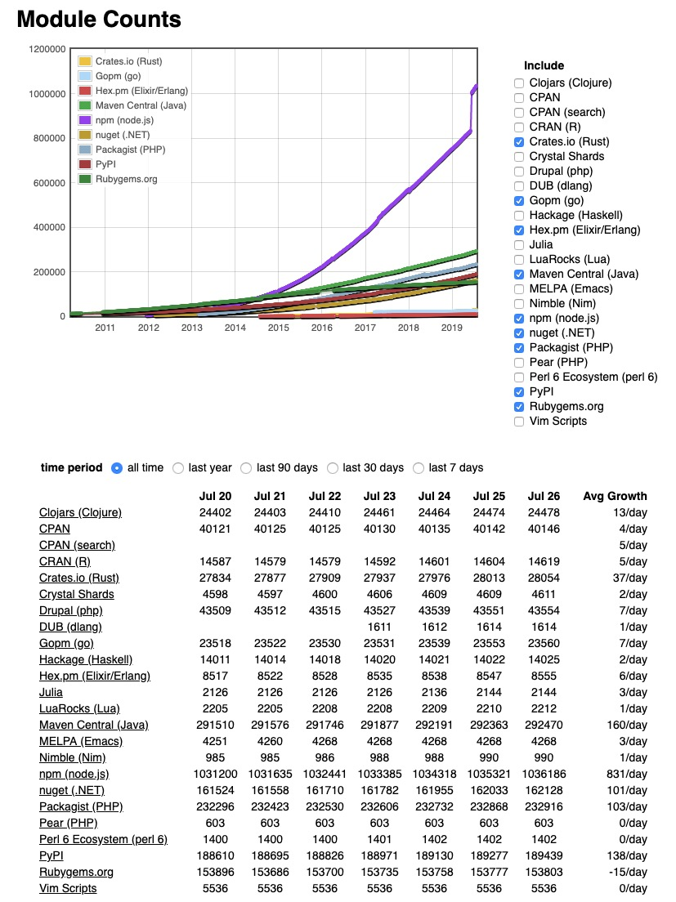
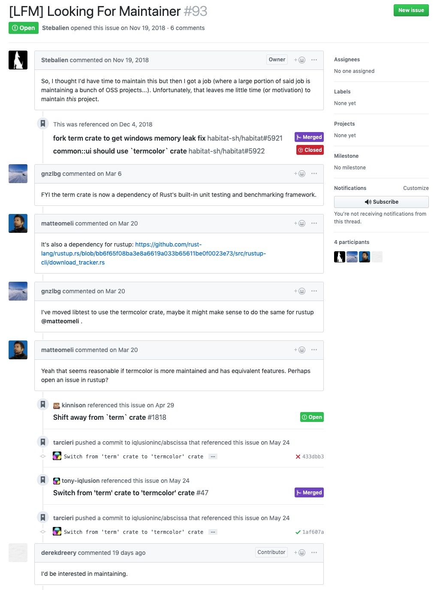

# 软件项目供应链管理的迷思

> 软件项目为什么没有供应链管理呢？如果要为软件项目定义供应链，应该是什么样子呢？它会有什么安全风险？你还记得 leftpad 事件么？你经历过 event-stream 被黑客巧妙利用从而神不知鬼不觉盗窃你的资产的事件么？软件的供应链管理，或者说依赖管理，越来越变得重要起来。

最近伟创力被华为踢出其供应链的事情，想必大家的朋友圈都刷了屏。对于一家硬件公司来说，良好的供应链管理能够保证产品的质量和产能，进而保证企业服务其客户的能力。在全球化的浪潮下，小到一台手机，大到一部汽车，背后都是一整条产业链数百数千家公司竞争合作，最终共同完成成品。如果一家企业的供应链的某个环节出了问题，那么影响产能还算小事，影响到交付到客户手中的产品就非常麻烦了。好几年前我工作过的公司曾经遇到一个非常棘手的问题，我们的企业级防火墙产品在客户的生产环境总会莫名其妙地发生 crash，软件团队花了很多精力研究不同的 crash，无解，只好求助于硬件部门的同事，后来经过一番苦苦探索，发现问题出在某个版本的产品使用的供应商的某个批次的内存芯片上面。在大流量读写，环境温度的条件影响下，有一定几率产生 bit flip。出厂测试无法捕捉到这样的 bug，但客户的环境下就出现了。这种硬件出问题，往往只能召回和替换，因为都是 SoC，无法局部替换；但这个批次的硬件出货量太大，召回是不可能的，只好在软件上想办法。后来总算完美解决，否则会给我们造成巨额的亏损。

我没有点硬件的技能树，因而对硬件的供应链管理只是略懂一二。硬件产品的供应链管理要解决的问题是如何将所有的和产品交付有关的行为协调起来，保证交付的质量。其核心是 BOM (Bill of Material)，也就是物料清单，然后在此之上是物料计划 (Material Planning）—— BOM 里面需要供应链提供的物料的到厂计划。一个精确的，高效的物料计划可以把库存 (inventory) 控制到一个美妙的水准 —— 所谓「增之一分则太长，减之一分则太短」。最后，产品的生产计划的执行，控制和监测。我有时候和搞硬件的朋友戏谑：同样是二战后起家的，做硬件的发展出来真正的科学（比如统筹学）和工程学，做软件的发展出来充满不可知论的玄学（比如人月神话）。

伟创力作死的事儿我看看，笑笑，吐槽之余脑海里突然有一个闪念：__软件项目为什么没有供应链管理呢？如果要为软件项目定义供应链，那么其 BOM 应该是什么？__

于是我搜了一下 software supply chain management。看来没有多少人讨论这个话题 —— google 返给我满屏的 supply chain management software。too simple, too naive。换了个搜索词：software supply chain，总算有了业界外（来自 forbes 和 infoworld）两篇没有太多深度的文章[1][2]。

看来这个想法还是个非常小众的想法。于是我只好让思想自(xia)由(ji)翱(ba)翔(cai)。

早期的闭源软件时代，独立软件开发商（ISV）们做软件产品大多需要局部外购，不过供应商并不算多（比如 Borland，dbase，foxpro），供应链非常简单，可能也不存在管理的需要。有些硬件厂商把软件外包出去时，会把软件作为供应链的一部分管理。我记得毕业后去了东大阿尔派，大连华信等对日外包的企业的同学吐槽日本人的「变态」：不要说算法的细节，连窗口的大小，位置都写在上千页的 spec 里，对着 spec 写代码完全是一个翻译工作。现在想想，这不就把软件当成螺丝钉一样的 inventory 了嘛，没毛病。

随着开源运动的蓬勃发展和互联网的快速崛起，软件开发从「王谢堂前燕」走向「寻常百姓家」。社区里的认可，精神上的激励和潜在的物质回报让百万千万记的程序员投身在开源软件的开发当中，让几乎你遇到的开发问题，都在某处有个对应的模块帮你解决。开源解锁了版权问题，互联网搞定了分发问题 —— 模块唾手可得（也就是 npm install 或者 mix deps.get 的功夫）让开发者愿意去尝试去依赖前人的优秀工作，而这种依赖反过来又极大地促进了提供依赖的开发者继续开发，认真维护，于是车轮滚起来，马太效应越来越明显 —— 新的开源项目层出不穷，解锁了更多小团队的能力去构建更丰富的互联网产品，最终开源软件和互联网互相成就，达到今天的高度。

我们看主流的社区的模块数：



（截图来自：http://www.modulecounts.com/）

其中 nodejs 一枝独秀，唯一跨过百万模块的门槛，傲视群雄。截止我写这篇文章时，连小众的 elixir/erlang 都有九千多个模块，rust 更是近三万多个。

如果你的项目用了 nodejs（前端），java + swift（客户端），elixir + rust（后端），python（数据），那么恭喜你，你有超过 150 万的模块可以选用，或者说，你得从全球一百五十多万个供应商中挑选合适的 BOM 打造你的产品。幸福的烦恼。

翻翻自己手头的项目，看看惊人数量的依赖：

```bash
$ ll forge/deps/ | wc -l
     122
$ ll forge-js/node_modules/ | wc -l
    1766
```

（这里展示的是 forge framework 的依赖，以及 forge js sdk 的依赖）

我们看看 iphone 7 的 BOM：


是不是顿时有种「哎呀，相比软件，硬件好像也没有那么复杂嘛」的窃喜？

在互联网时代，随便一个软件项目，其 BOM 都无比复杂 —— 一方面，我们继承了前人的大量工作，站在巨人的肩膀上，把我们有限的时间花在产品的核心逻辑上，这是好事；另一方面，我们依赖着自己仅仅粗浅了解外部接口的事物，所做产品的基石更像个黑箱，它是否牢靠，我们并不完全清楚，也不能掌控。这就带来了极大的风险。所以软件项目的供应链管理，越来越成为不可忽视的环节。

我们对比硬件产品。

硬件的 BOM，在 PRD 阶段就和多方（软硬件团队，供应商，甚至财务部门）不断推敲，不断审核，PRD 完稿时 BOM 也一并确定，以后或许会小修小补，但只要老板脑袋不要发热，不太会大动。软件的 BOM，立项时（隐含着）敲定一些，架构时顺手添加一些，设计开发甚至测试阶段还都在不断更新。很多大公司在做软件产品时引入新的依赖时会有一个 review 的流程，但多数时候关注点都放在了是否必要，来源是什么，license 合不合规，是否还有稳定的维护等方面，依赖的代码质量，往往晾在一边，能工作就好。

当整个行业都习惯站在一层又一层的巨人们的肩膀上时，失控是不可避免的。如果说上面示例里的 122 个 elixir 的依赖我还可以花时间肉眼排查；JS SDK 里面 1766 个依赖，已经超出了一个工程师甚至一支团队的能力范围。

当然有人说，这些都包含了间接依赖，我们只要管理好直接依赖是不是就足够了。是，也不是。从帕累托原则的角度来看，我们的确应该把有限的精力放在直接依赖上；但和硬件不同的是，产品中供货商出问题，锅由供货商来背，供货商又可以找到它的供货商，一层层追溯源头把锅背下去；软件产品中的 BOM 大多来自 MIT/BSD/GPL 等开源 license 下的产品，其明确说明 "AS IS" without warranty of any kind。所以，产品中所有 BOM 的锅，就是你的锅，谁让你「遇人不淑」呢？

既然软件产品的供应链管理鲜有人谈起，也鲜有人关注，那么，对软件产品的供应链攻击往往能一击即中。伟创力对华为的断供可以看做是一次并不高明的供应链攻击，它攻击的范围仅仅是一家公司，影响有限；软件世界里的供应链攻击，可能是全球性的灾难。

做 javascript 的人应该还记得几年前的 leftpad 事件吧[3]：一个程序员因为 npm 的 admin 私自把他的一个 module "kik" 转给了 kik 这家公司（kik 的律师让他 rename 他不干），进入狂暴模式，愤怒地把他自己名下的二百多个 module 全部 unpublish 泄愤，从此和 npm 相忘于江湖。哥们虽然高产，但不算大 V，本来也掀不起太多波澜，不过他手上一个名为 leftpad 的十几行代码的 module，被众多开源项目直接或者间接使用，其中就包括 react 这样的江湖一哥。一时间，几乎所有的 javascript 项目的 CI 都挂了，无法生成新的 build；而前端工程师们有了难得的半天打酱油玩 pacman 的时间。

leftpad 事件虽然不是一次主动的供应链攻击，但造成的影响非常深远。它让人意识到软件产品的供应链体系的薄弱 —— 如果加上适当的 social engineering，攻击者是不是绕开标的的层层防线，在供应链侧对标的一击必中呢？

的确可以。这便是去年的 event-stream 事件[4]（又是 javascript 这个不省心的孩子）。这是一次可以写入教科书的经典攻击：一个叫 right9ctrl 的用户，在得知 event-stream 的作者无力维护这个项目，想把项目的维护权交给社区时，主动揽下责任，为了赢得信任还做了一些贡献（3.3.5）。后来，他悄悄地为 event-stream 注入了一个名字听上去非常靠谱的依赖：flatmap-stream；而这个依赖的 github 项目里的 index.js 的代码一切正常，但在 npm 上发布的 index.min.js 则注入了攻击代码 —— 为了让攻击代码很难辨识，他加入了诸多混淆。因为 npm 在 publish 代码的时候并不检查 github 上的代码是否和 publish 到 npm 的代码一致，所以 right9ctrl 才有机可乘。他把这个用于攻击的版本做成 patch（3.3.6），这样很多人更新依赖的时候就自动升级；然后再发布主版本更新（4.0.0），移除 flatmap-stream，掩人耳目 —— 因为主版本更新往往意味着 breaking change，所以鲜有人更新。这样 right9ctrl 就达到了神不知鬼不觉让无数用户使用了有攻击代码的 flatmap-stream。费了这么大的劲儿，他想干什么？如果不是为了窃取受害者的信息，那么就是偷盗受害者的财富。如果是财富，那什么财富有足够的价值，在被转移的时候神不知鬼不觉，转移完成后还无法追讨呢？bitcoin！所以 flatmap-stream 里的代码瞄准的是 bitcore-wallet-client —— 它对其一个 `getKeys` 的函数做了 monkey patch，这样在支付时，软件会读取私钥，他就把私钥偷偷传给他自己的服务器，最后洗劫受害者的钱包。所以，只要是用了 event-stream 又使用了 bitcore-wallet-client 这两个依赖的软件就会遭秧。看到这里，你也许会问？谁会傻不愣登地用 web 来使用钱包呢？这个攻击的受众很小吧？很不幸地，copay 这款开源的钱包，为了代码复用，使用 electron / cordova 的方案。。。

对软件系统的供应链攻击，这绝对不是最后一起。相信有了 event-stream 的示范效应后，更多类似事件会发生。比如这个疑似的 social engineering（当然也不排除 derekdreery 是好人）:



对此，我们目前能做的还不多。软件系统的供应链太复杂，每个依赖的版本又很多，使得人工审核可操作性不强。我能想到的未来可行的方案有这么些：

1. 供应链端的自我审查，如 npm audit（github 貌似已经通过 npm audit 的结果给 security alert 了）
2. 通过机器学习发现问题 —— 因为不管作恶的代码如何伪装，都要达成某个效果，比如连接莫名其妙的 IP / 域名，访问不该访问的数据等
3. 在编程语言或者其依赖系统上添加权限控制 —— 就像手机的权限请求那样，默认都不允许，在软件初始化，各个依赖要求额外权限时，程序员再来决定是否允许某些权限。这些权限请求会和依赖文件一样，生成一个文本，可以被 review。

我觉得未来在这个领域，应该会诞生出来一些公司，一些工具。当硬件团队使用 ERP 管理 BOM 时，软件团队的 BOM 管理就像随风而动的纸鸢，也许，未来会有人撬动这里的奶酪？


[1] why you need to understand your software supply chain: https://www.forbes.com/sites/adrianbridgwater/2018/06/06/why-you-need-to-understand-your-software-supply-chain/

[2] building a model of the software supply chain: https://www.infoworld.com/article/3245800/building-a-model-of-the-software-supply-chain.html

[3] hacker news 上 leftpad 事件的讨论：https://news.ycombinator.com/item?id=11340510

[4] Compromised npm Package: event-stream: https://medium.com/intrinsic/compromised-npm-package-event-stream-d47d08605502
