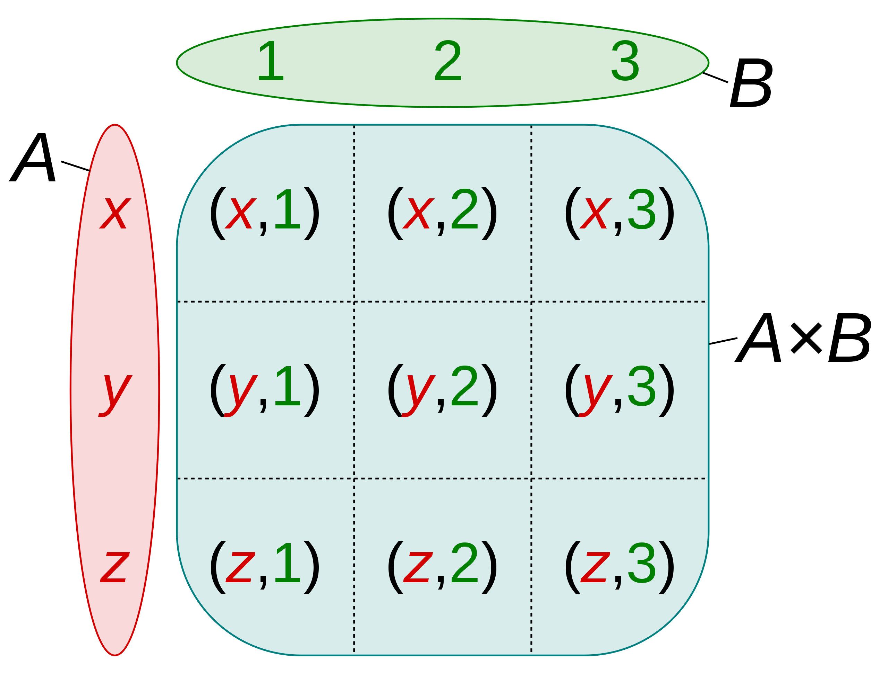

# 沅有芷兮：类型系统的数学之美

对大多数人而言，rust 最令人兴奋的是所有权的概念，零成本抽象的能力，以及通过合适的约束巧妙解决内存安全和线程安全两大难题的优雅 —— 记得看过一个统计，linux kernel 里面这两类 bug 占据了 1/2 强。也就是说，你只要学会了 rust，就躺着消弭了 50% 的难啃的让 kernel developer 都闻之变色的 bug。

但对我来说，rust 的美妙之处在于其为如此底层的语言注入了如此高级的吸收了大量 Haskell 精髓的类型系统。如果你接触过 Haskell / F# / Scala，你大概能了解我的兴奋之处。我们所处的世界往往是鱼与熊掌不可兼得 —— Haskell 长于类型系统，但让程序员失去了对数据在内存中如何排布的控制；C 长于对数据在内存中的精确控制，但没有一个像样的类型系统。rust 几乎做到了二者兼得。虽然我的 haskell 之旅最终从入门走向了放弃，但就像冰火岛上对武功秘籍懵懵懂懂的无忌，那些 monad，monoid，senigroup，sum type，product type 等概念还是烙在我的脑海里，它们尘封着，等待一个契机，让自己重见天日。这个契机，便是 rust。

本文借用 rust，谈谈我对类型系统的一知半解。文章本身和 rust 并不太大，有其它编程语言经验的朋友想必也能读懂。

## primitive type

primitive type，基本类型。基本上每种编程语言都有 —— integer，string，bool，array，list/vector 等。它们就像元素周期表里的一个个元素，不多，但构成了我们这个花花世界。

基本类型没有什么好讲的，不过在我们深入下面的话提前，我们需要问自己一个问题：什么是类型？

对于 u8 来说，它是 [0, 255] 之间的一个整数，是一个集合，可以这么表述：`{ x | x ∈ [0, 255]}`。
对于 String 来说，它是任意字符串的一个集合，`{x | x ∈ ["", "a", ..., "War and Pease", ...]}`。

所以，类型在数学上的意义是集合。

## product type

product type 是几乎我们所知道的编程语言都有的数据类型 —— 在某些语言中它被称作 record (delphi, erlang)，另一些语言中被称作 struct (elixir, rust, go) 或者 object (javascript)。我们平时在软件开发中，最离不开的数据类型就是 product type，就像分子把不同元素的原子组合起来一样，product type 大大丰富了类型的可能性，从而很好地辅助我们做 DDD (Domain Driven Design)。

我们看 product type 数学上的意义。product type，顾名思义，是不同类型的乘积。类型的乘积究竟是什么东西呢？ 假设 x 的定义域是集合 int，y 的定义域是集合 string，x \* y 展开便是 (..., -2, -1, 0, 1, 2, ...) \* ("", "a", "ab", "hello world", ...)，也就是说对于 int 里的任意一个值，都有 string 里的任意一个值与其配对，看起来有些眼熟对不对？这就是笛卡尔积 (Cartesian product)。如图所示：



比如在 rust 里，我们可以这样为一个 user 建模：

```rust
struct User {
  username: String,
  nickname: String,
  email: String,
  email_verified: bool,
}
```

这个 User 类型的集合的取值范围，就是它内部的所有类型的笛卡尔积。

## sum type

笛卡尔积固然能帮助我们构建各式各样的复合类型，但它无法描述这样的场景：我们想为 User 添加一个 payment 的类型，它可以是信用卡，现金，微信，以及 ABT 其中的一种。自然，我们可以这样描述：

```rust
enum Payment {
  Creditcard,
  Cash,
  Wechat,
  Abt,
}
```

但这样的类型并不完备 —— 如果用户选择了信用卡，那么需要信用卡号，过期时间，持卡人等信息，而选择 ABT，则需要钱包地址及其公钥。这该怎么办？我们需要类似于这样的类型：

```
Creditcard(CreditcardType) | Cash(f64) | ... | Abt(WalletType)
```

在集合论中，这被称作 disjoint union（不相交集），表述为 A + B。 如图：


不相交集在数据类型中往往被称作 tagged union (C++) 或者 sum type (haskell, rust)，和 product type 相反的是，大部分编程语言没有 sum type。我们看 rust 是如何使用 sum type 来解决上面的问题的：

```rust
struct CreditcardInfo {
  number: String,
  expiration: chrono::NaiveDate,
  holder: String,
}

struct WalletType {
  address: String,
  pk: [u8; 32]
}

enum CreditcardType {
  Creditcard(CreditcardInfo),
  Cash(f64),
  Wechat(AccountInfo),
  Abt(WalletType)
}
```

sum type 的美妙之处是它解决了类型系统中基本类型和复合类型潜在的不够严谨的问题，比如说这样一个函数：

```rust
fn div(x: f64, y: f64) -> f64 { x / y }
```

从 type signature 上看，似乎没有问题，但在实现层面上，我们很快发现 `x / y` 有约束条件：y 不能是 0。我们要么设计一种新的数据类型 non_zero_f64 把零从中排除出去（这在大多数语言里都很困难），从输入的角度让这个函数的 type signature 完备；要么让返回的结果是一种特殊的类型，它可能是 f64，可能为空。

由于大多数语言不支持 sum type，这种情况就只好用两种方式来解决：

- 函数的返回值可能是 f64，可能是 null。如果一门语言不支持异常，那么就只好检查一下输入，当为 0 时返回 null。
- 函数的返回值依旧是 f64，但除零的时候会抛出异常。对于支持异常的语言，除了上一种方式，我们还可以抛出异常。

第一种方式损害了类型的完备性，因为 type signature 不再有权威 —— 调用者不敢肯定自己一定会拿回一个 f64，所以只好也做相应的条件判断，把这种对于类型的泄露一层层传递出去。第二种方式也是对类型完备性的一种损伤，因为调用者需要知道并且选择处理或者不处理那些「意外」。因为意外不是返回类型的一部分，所以，额外的逻辑是必不可少的。

上面 div 函数的问题只是冰山的一角。我们除了学习写代码和写 PoC 的代码外，其余的时刻都不可能只为 happy ending 写代码，毕竟我们面对的不是童话世界。错误和意外几乎伴随着任何一次互动 —— 和 IO 的互动，和类库（别人的代码）的互动，和系统调用的互动等。Scott Wlaschin 在他著名的 Railway Oriented Programming 里把一个又一个这样的情况拎出来寻求解决之道，而 sum type，就是最佳的选择。

在 Rust 里，我们有类似于 Maybe Monad 的 Option：

```rust
enum Option<T> {
  Some(T),
  None
}
```

对于上面的函数，我们可以用 `Option<f64>` 来完善其 type signature:

```rust
fn div(x: f64, y: f64) -> Option<f64>;
```

当 y 为零，返回 None；不为零，返回 Some(x / y)。表面上看它似乎和上面第一种方式没有区别，但一个形式化完备的类型让很多事情变成了可能。这个函数可以被 pipe，被 compose，调用者不必担心类型的泄露 —— 所有信息都已经在 type signature 里面了，编译器可以做更合适更严格的检查，也可以适当优化 —— 更重要的是，围绕着这个类型，我们可以把一堆原本不断出现在用户代码中的对结果判断的 if else / try catch 抽象出来，成为 Option 类型的一组 behavior，这样让用户代码变得清晰。

同样的思路，在 Rust 里，exception 被抛弃，取而代之的是是 Result，也是一个 sum type:

```rust
enum Result<T, E> {
  Ok(T),
  Err(E),
}
```

和 IO 的互动，和别人家的代码的互动，大家都可以通过 Result 来完成。围绕着 Result，也有一组标准的 behavior 和宏，处理其结果。

围绕着编程语言是否需要 exception，exception 是良药还是毒药，有诸多争议，java / python 是建制派，C++ / haskell 是骑墙派，rust / go 是反对派，erlang / elixir 是无政府主义者，这里便不展开。你问我支持谁？我喜欢尤达大师对卢克说的那句经典台词：do or do not, there's no try。这句话也蕴含了 erlang 的哲理：let it crash。

## generics type

Generics type，或者说泛型，是让人又爱又恨的类型。它简化了代码，提升了抽象程度，但程序员为之付出的代价是陡升的学习曲线。抛开泛型的好坏不提，我们先看看泛型的数学意义是什么。还是以 Option 类型来说事：

```rust
enum Option<T> {
  Some(T),
  None
}
```

T 代表任意类型，Option<T> 是 T 映射到这个 enum 的结果。所以换个角度，我们可以认为泛型是作用在类型上的一种特殊的函数，它接受一种或者多种类型，返回一种新的类型。我们知道，编译器在处理具体的数据时会将泛型展开，比如说 `Option<u8>` 展开后就是：

```rust
enum Option {
  Some(u8),
  None
}
```

这种展开可以无限制延伸下去，但彼此又并不想交，就好像 sum type：

```rust
enum Options {
  U8(enum { Some(u8), None }),
  U16(enum { Some(u16), None }),
  String(enum { Some(String), None }),
  ...
  VectorU8(enum { Some(Vec<u8>), None }),
  VectorU16(enum { Some(Vec<u16>), None }),
  ...
}
```

这个结果就很有意思了。我们知道 sum type 的数学意义是类型之和，我们把 primitive type 记作 X，那么这里就有 n 个 X，`Vector<T>` 可以是 `Option<T>` 的一种类型，因而 `Vector<T>` 可以展开成 nX，类似 `Vector<T>` 这样的类型也有 n 个，那么到现在为止展开的 Options 可以记作 nX + n * nX，同理 HashMap<T, E> 是 n * nX，而 n 个类似 HashMap<T, E> 展开的选项为 n * n * nX，以此类推我们可以得出泛型代表着：

```
n + n^2 + n^3 + n^4 + ....
```

种数据类型的集合。这是一个等比级数，其结果是 `n(1 - n^n) / (1 - n)`。

```rust
enum Result<T, E> {
  Ok(T),
  Err(E),
}
```
