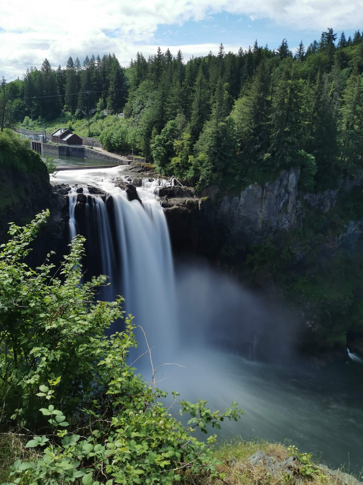

（一）

一晃在美国呆了 1666 天，或者说，四年又二百零五天。如果一个人的职业生涯有四十年，我的十分之一已然耗散在了这片土地。回头看，刚来时的五年计划，完成得还不错：

> 一晃在硅谷已经呆了两年半。
>
> 两年半，在四十年左右的职业生涯中，仅占 1/16，似乎微不足道，但对于一个五年计划来说，它又举足轻重。14年底，当踏上这片土地时，我所考虑的是花上五年的时光，在此立足，然后融入，很简单的计划。
>
> 立足是根本，这体现在「家」和「业」。庄子说：尧舜有天下，子孙无置锥之地。家人为了我的梦想而牺牲，我得为她们准备「置锥之地」。蛰伏了两年，攒了些钱，又薅了一圈长辈的羊毛后（唉，三十而立却未立），终于拍得一陋室。「家」，基本解决了。
>
> 「业」并非一蹴而就。在美工作的异乡人共通的痛就是身份问题。国内的朋友总不理解：都成功肉身翻墙了，还矫情什么绿卡。这个中滋味只有身在其中的人才有感受。有时候稍不留意，要么 I94 过期（合法居留的时间），要么 EAD 过期（合法工作的时间），要么签证过期（合法入境的时间），白白惹上一身腥。就算你自己留意了，律师留意了，USCIS（移民局）的大爷们打个盹，你可能就要遭殃了。我的朋友曾经就遇到过 EAD 提前好几个月续签，结果过期两个月才给签回来的无妄之灾，两个月公司没法「雇佣」并给他发工资。
>
> 我算是幸运，捡漏拿了个 O1a Visa，得以免除 PERM，直接走 EB1A，省下三五年为绿卡奋斗的时光。虽然在 485 上因为各种机缘巧合折腾了一年，但好歹在上个月终于拿到绿卡，算是圆满，十年内我不用愁跟入境，工作，居留等一切和身份有关的破事，可以把心思集中在事业上。
>
> 摘自我 2017 年撰写的，未发表的《长日无痕 4.1》

近五年时间里，我换了五个城市：Sunnyvale, Cupertino, San Jose, Redmond, Issaquah，以及两个州：California, Washington。6 月份准备英国签证时，表格里让我添加过去两年所有住过的地址，我惊奇地发现，2017.6 - 2019.6 间，我像逃犯似的换了四座城市，四个地址。本以为买了房子，有了立锥之地后，能安稳下来，结果发现「安稳」对我而言是奢望，自己的陋室的炕头还没有暖好，人就飞到了西雅图。

朋友们常常让我对比旧金山湾区和大西雅图地区。如果说找五个美国最适合中国人居住的地区，湾区和西雅图地区一定会榜上有名：宜人的气候，合适的收入支出比，不算温吞也并不激烈的工作环境，以及，与我们的肚子息息相关的，遍地的，口味还过得去的各地中华美食。对于程序员来说，这两地几乎是唯二的定居选择 —— 大大小小的科技公司，撑起了这两个地区的工作机会，撑出了亚裔的一片天，当然，也撑高了房价。

从税收的角度来说，华州免州收入税（income tax），从加州搬到华州，意味着工资单上冷不丁多出来 10% ；但因为不征州税，华州的消费税是西部之冠，比加州高一点点。

从总体生活成本上来说，西雅图地区比湾区相对低一些：还可以忍受的房价（七到八折），以及还算良心的房租（八折左右）。因为每月的开支居住是大头，所以西雅图地区生活上的月开销要比加州小不少。不过有得必有失 —— 西雅图地区的水果蔬菜价格（1.5倍），水电煤气（~2倍）等均高出湾区一大截。老婆总吐槽在湾区的大华超市，每周买个菜为了凑够 $30（有代金券）往往殚精竭虑，在这头的百家超市，随便买买就分分钟超过 $50。

养车的成本，西雅图地区要高不少，油价似乎差不太多，都是三四块钱之间浮动，主要高在了保险上。我用 metromile（基本费用 + 里程计费），从加州换到华州后，地址一改，保费几乎翻番。询过 Costco，Gecko 等保险，要比我 metromile 上的价格还高。好在养车在美国来说不是个事，养两辆车的开销可能还不到北京养一辆车的开销。

生活环境上两者各有千秋。美西是出了名的好山好水好寂寞，大家周末大部分时候过的是采菊东篱的田园生活。和湾区比，西雅图地区的山和水都离居住的地方更近 —— 偶尔我们晚上吃过饭，八点多开车十分钟晃悠到 Lake Sammamish State Park，娃儿们去 playground 撒欢，我和老婆倚在湖边赏花赏月赏秋水；周末半小时可达的地方有瀑布；三小时可达的地方有清朗隽秀的雪山，有美国最大的国家公园，有世界最大的温带雨林。

但是西雅图雨多 —— 我来之前，同事马老师提醒我这儿 80% 的时间都在下雨，整个人都会抑郁的。呆了一年多，也许我是命好，总体感觉，糟糕的阴雨天气和爽朗的晴天大概一半一半。每年的 10 月到 4 月，连绵的阴雨像一堵无形的墙，把你按在屋子里限制外出 —— 也难怪，星爸爸诞生于斯，《暮光之城》落户于此。很多沐浴过加州阳光的人，在西雅图没有阳光的半年里，百无聊赖，心都如天气一般阴沉沉的。

我还好，不挑。加州的阳光，我很喜欢，把我从黑古氧化成了炭古；西雅图的阴冷，我也喜欢，把我从炭古还原回黑古。我这人对环境向来是随遇而安，只要有妻儿作伴就好 —— 就像东坡说的那样：「试问岭南好不好，却道，此心安处是吾乡」。

（二）

两周前回国出差，见了很多朋友。有些半年未见，有些一年多未见，普遍的，大家的肚腩又添了一圈年轮。也许我们真的是老了，八零后们饭桌上聊的话题，除了工作，创业，孩子，便是生老病死。马尔克斯说：「父母在时，你和死亡隔着一层垫子；父母离开后，你就直接坐在死亡上面了」。看着孩儿们一天天长大，突然发现，我们自己，也成了那层垫子，在向上下左右的交代中，一点点变薄。

在年复一年的 996 的「福报」荫护下，好些朋友们身体大不如前，体检报告上尽是些触目惊心的病症，让我那中度脂肪肝都不好意思拿出来丢人现眼。有个朋友戏称自己就像五年开了五十万公里还不走心保养的奥拓，挂挡哐哐哐卡齿轮，踩油门突突突冒黑烟。

996 压榨的是身体，还好，千百万年来继承的中华民族的勤劳基因还扛得住；人到中年的焦虑，折磨的是精神，那才是压倒骆驼的最后一根稻草。

勤勤恳恳做中国式好员工的朋友：经济好，没房的忧心房子，有房的忧心换（学区）房；经济不好，都在忧心自己还有没有机会「享受福报」。十多年前意气风发在论坛上激扬文字指点「三十五岁的程序员该何去何从」，真真自己到了这个岁数，发现新闻里生活中全是某某公司清理三十五岁以上的一线员工；某某公司计划未来中层不会提拔三十五岁以上的员工。三十五岁就仿佛一个魔咒，让上有老下有小驼着背的中年大叔在二十出头的小朋友面前挺不起腰杆。

兢兢业业做中国式好老板的朋友：经济好，增加人手加班加点拉新和留存齐飞，让销售数据和核心指标再上一个台阶，杀出一条血路，融到下一轮；经济不好，勒紧裤腰带多快好省熬过冬天熬死同行，熬到下一轮，趟出一片天。好与不好都是上刀上下火海，每天坐着过山车，在 high-low high-low 间狠狠地过着别人无法理解的日子 —— 正所谓知我者谓我心忧，不知我者谓我何求。

反正庙堂之上，江湖之远，大家都活成了范文正公：进亦忧，退亦忧；酒入愁肠，把一颗颗焦虑压栈，化作肥肚腩。

两个没有交集的朋友，前后脚得了甲状腺癌，打开领口的扣子给我看，脖子上的术后的刀疤触目惊心，让人心痛。

呜呼！长太息以掩涕兮！十年帝都梦，一把辛酸泪！

从北京回到西雅图后，许久未出现的返程时差折磨了我一周。上周日的凌晨，睡不着觉，在床上懒懒翻着朋友圈。突然，看到一条噩耗：一位朋友故去了。记得两年前同事 Chun 把他介绍给我时，他说自己上一段（在一家创业公司的）经历太累了，打算离开北京一段时间，回老家休养，所以想找个 remote 的职位。我和他聊了许久，很是中意，想把他拉来 Tubi，无奈当时 CTO 马老师觉得他英语不好，怕 remote 难以沟通，给否了。我们便与同事关系差之毫厘，成了微信上的点赞之交，偶尔聊两句。我微信上朋友加得不少，总能看到某某朋友转发的某某某的噩耗，但这样一个活生生的，我们生命线上有过交集的尚处壮年的朋友的故去，还是头一遭。凝视着他的头像，我还能清晰地回忆起当时我们坐在望京北路启明国际大厦梦想加的沙发座上，酣畅淋漓讨论 js-bridge 和各种前端圈奇淫技巧的情景。

心中烦闷，睡不着觉，我鬼使神差地打开了『复仇者联盟 3』。当看到年轻的蜘蛛侠搂在老迈的铁人身上，灰飞烟灭，嘴里喃喃道：I don’t wanna go。可怜小蜘蛛空有济世之才，却赍志而殁。那一刻，我泪如泉涌。

浑浑噩噩的，我胡乱写下了这样的文字：

> 在生命的旅途中，我们一直和时间赛跑。疾病和死亡，用最决绝的方式，把我们拉偏赛道。在被病魔缠身之前，我们还算得上是时间的主人，可以自主选择这旅途是闲庭散步，还是奋力冲刺，是休养生息，还是蓄势待发；然而生病之后，这选择权被一步步剥夺：先是才干被输液管无情禁锢，接着进取心被痛苦慢慢摧残，随后影响力如潮水般退去，退去之后，也不知能不能遗下丁零知交；最后，就剩乐观还就着卑微的希望不屈地挺立着，和亲情一道，寻觅翻盘的机会。
>
> 剥夺一个人对时间的选择权还不是最糟的。当灭霸的响指弹起，死神的镰刀挥下，一个人未来的时间一下子被清零，再无翻盘的可能。这才是最要命的。离去的永远离去，活着的被悲痛萦绕。
>
> 我一向以一个乐观的傻叉自诩，但那个周日，我实在堵得慌。

（三）

现代中国人最不愿意谈论的话题，一个是性，一个是生死。

对于生死，古人们到是很坦诚。

孔子说「未知生，焉知死？」，知生之道便知死之道。对于生死，他首先是敬畏和珍爱生命的 —— 他说「危邦不入，乱邦不居」，他鄙视那些「暴虎冯河，死而无悔」轻视生命的人，不愿与之共事；在这个前提下，他「无求生以害仁，有杀身以成仁」。他也坦然面对死亡，当自己心爱的弟子伯牛颜渊离去时，他的反应是：「亡之，命矣夫！斯人也而有斯疾也！斯人也而有斯疾也！」，「噫！天丧予！天丧予！」，虽悲痛满怀，但接受天命。正因为如此，他「不怨天，不尤人」，当理想得不到申张，他「乘桴浮于海」。

孟子认为：生于忧患死于安乐。孔子「杀身成仁」，孟子「舍生取义」，成为儒家的道德标准。孔子「知天命」，孟子「修身以俟之」，积极进取，修身养性，面对自己的使命。对孟子而言，君子对自己的生命也是有焦虑的，不光是当下的焦虑，还是一生的焦虑：「是故君子有终身之忧，无一朝之患也。乃若所忧则有之：舜，人也；我，亦人也。舜为法于天下，可传于后世。我由未免为乡人也，是则可忧也。」那焦虑了该怎么办呢？「如舜而已矣」，像舜那样去做呗。有了这样的大格局，便不会有一朝一夕对个人境遇的忧虑。

老子对生死的态度是不蹈死地 —— 「出生入死。生之徒，十有三，死之徒，十有三。人之生生，动皆之死地，亦十有三。夫何故？以其生生之厚。盖闻善摄生者，陆行不遇兕虎，入军不被甲兵。兕无所投其角。虎无所搓其主爪。兵无所容其刃。夫何故？以其无死地。」这点和孔子不要「暴虎冯河」异曲同工。所以他建议我们清心寡欲，「居善地，心善渊，与善仁，言善信」，有自知之明，不争，像水那样柔弱，不要过分「坚强」—— 「故坚强者死之徒，柔弱者生之徒。是以兵强则灭，木强则折。强大处下，柔弱处上」。

对于死亡，庄子特别豁达。他说：「人生天地之间，如白驹过隙，忽然而已」。所以庄子亡妻，惠子凭吊时，却见他席地而坐鼓盆而歌。当庄子自己将要死时，他不让弟子厚葬，要「以天地为棺椁，以日月为连璧，星辰为珠玑，万物为赍送」，这不比厚葬还要牛逼么？弟子们惶恐，怕「乌鸢之食夫子」。庄子笑笑：「在上为乌鸢食，在下为蝼蚁食，夺彼与此，何其偏也！」

我们小时都背过《扁鹊见蔡桓公》这个讳疾忌医最后病入膏肓的故事。相较于韩非的这篇文章，太史公的《扁鹊仓公列传》更值得诵读。因为讲完故事，太史公还摆出了他自己的生命观：

> 使圣人预知微，能使良医得蚤从事，则疾可已，身可活也。人之所病，病疾多；而医之所病，病道少。故病有六不治：骄恣不论於理，一不治也；轻身重财，二不治也；衣食不能适，三不治也；阴阳并，藏气不定，四不治也；形羸不能服药，五不治也；信巫不信医，六不治也。有此一者，则重难治也。

这个生命观，放在现代也非常科学。

第一，有病要遵医理，不要骄恣轻视。
第二，生命和钱财孰轻孰重，要有个谱。
第三，别暴饮暴食，也不要为了风度不管温度。
第四，要有良好的生活习惯，好好休息，少熬夜加班，放宽心，少担忧焦虑，让阴阳错乱，五脏功能不正常。
第五，日常锻炼，强健体魄，别搞得身体羸弱，病恹恹的。
第六，别 TM 折腾偏方，吃乱七八糟的药，做不知所谓的理疗，要找真正的医生而不是巫医大师之流。

作为现代人，如果要为这个生命观加上点什么，那应该是：

第七，珍惜时间，向死而生。买点保险，指定好受益人；早立遗嘱，办理生前信托。

## 补记

《朗读者》第二季有期节目讲生命，建议大家看看。我很喜欢这个开场白：

生命是多么深邃的话题，它包含着人世间一切最极致的体验。生命，可以是能够被毁灭但不能够被打败那般顽强，也可以是“亦余心之所善兮，虽九死其犹未悔”那般博大。生命如果有颜色，会不会看上去，就像梵高的《向日葵》和《星空》；生命如果有态度，是不是听上去，就是贝多芬的《田园》和《英雄》。生命的意义是如此厚重，无论我们怎样全力以赴都不为过，因为我们生而为人，生而为众生。
