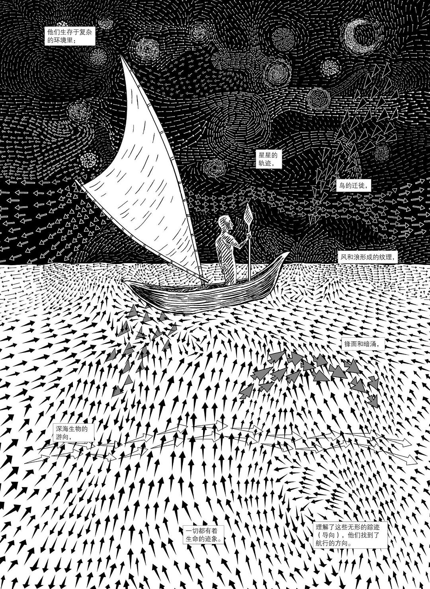

# 所见，所感，所思，所悟 - 读《非平面》

前几日，暑期将尽，老婆准备带孩子回国，问我有什么要捎过来的。我恰好想起朋友圈有好几个朋友先后推荐了《非平面》，于是在豆瓣上查了查，震惊于其是一本以漫画形式呈现的博士论文，忙不迭让她带本回来。书拿回来之后，当晚我就看完了一遍，通体舒畅，似醍醐灌顶，如露入心。恰逢有朋友来美国出差，我便又让其帮忙买了三本带过来我好馈赠好友。随即，我给公司订了两本英文版，后又让国内的同事买几本中文的相互传阅。

过了两日，我又将《非平面》读了一遍，还带着小宝读完了前两章。虽然老婆从图书馆借来了英文版，但我不爱看 —— 我特别讨厌美漫通篇的大写字母 —— 很显然，我脑瓜里的 `toLowerCase()` 函数发育得不够完善。

《非平面》的编辑推荐是这么介绍本书的：

> 本书为哥伦比亚大学首部以漫画形式呈现的学术论文，一部关于漫画的漫画，一部探讨图像与文字关系的图像小说，一部研究视觉思维的视觉作品。作品的形式、内容与研究方法之间高度协调统一，作品本身就是对自身理论的践行，用潜移默化的方式引导读者观赏、理解、接受知识。
>
> 涵盖范围广泛，实际意义深远；能读懂本书，就意味着你已经掌握获取更多知识的方法。
>
> 本书主要研究视觉思维、多维视角、获取知识的方法论，同时涵盖哲学、天文、数学、光学、哲学、生态学、文学、艺术等诸多领域的研究成果。以阅读本书的方法阅读世界，有助于读者逃离“平面国”的禁锢，颠覆固化、僵化、常规的思维，开启动态、高效、多维的视角。
>
> 从一维到多维，从平面国到浩瀚的宇宙，阅读本书如同体验一次头脑的奥德赛之旅，一路上布满丰富的知识和惊喜的启示，图像与文字配合无间，共同创造出史诗般波澜壮阔的场景。

这个措辞，有待商榷，我觉得它低估了这本书的意义。

在读了两遍《非平面》之后，我的感受是：首先，不要将其看做博士论文，否则你将会纠结于书中那些众所周知的内容通过漫画的形式串联起来是否足够严谨，足够深邃，够得上博士论文的冠冕，豆瓣上有些评论便着眼于此，真是以冠补履，舍本逐末。之后，可以平心静气，摒除脑海里时不时冒出来的「这个我知道」「那个我懂」的倨傲，像一个渴求知识的孩童，不设防地，追随着作者的指引，像爱丽丝那样，一头扎进兔子洞，去 __感受__ 沿途不断涌入的美妙的启示。读罢掩卷，不要着急问自己学到了什么，而是继续随着书中的内容放飞意识，让子弹飞一会。过个两三天，再细细读一遍。

有些书，我们读完之后，要感谢作者的：不是他教了我们多少新知识，而是他重新唤醒那些我们已经的知识 —— 就像乔帮主所说的 "connect the dots" 一样 —— 把我们已知的，但已经漠然的，僵化的，荒芜掉的知识换个视角鲜活地串起来；不是他给予了我们多少答案，而是在我们已知答案的情况下，回归到问题本身，通过问题把我们带入曾经的那个懵懂无知但毫不畏惧无所不问的童年，让我们重新拥抱想象力和好奇心；不是他为我们指引了何种做人做事的方向，而是他启发我们自己去构建自己的框架，「穿着私人订制的鞋子，看看我们用自己双脚开创出的独特道路上，有哪些等待被发现的东西」。

《非平面》就是这样一本书。我上次有这种奇妙的感觉，还是大概十年前，修习 Tal-Ben Shahar 的公开课：positive psychology，也就是哈佛幸福课。那课程至今还影响着我，很多生动的小例子我还信手拈来。现在细想，二者有很多似曾相识的感觉 —— 比如 Tal 也说，这门课程是唤醒大家已知的知识；他还说关注什么（问什么问题），就会得到什么。（也许我该重新温习一下这门课程，毕竟子曾经曰过「温故而知新」嘛）

成年之后的我们，要么放弃了儿时的梦想和青少年时代的热血，对知识不再渴求，对世界不再好奇，在碌碌无为和浑浑噩噩中梭哈自己的人生；要么人生的理想被别人的光鲜生活和惊人成功所驱赶，满满的焦虑和不甘，"爱竞逐镜花那美丽，为贪嗔喜恶怒着迷"，片面地追求汲取知识和经验的速度，着急把一切未知变作已知，于是把自己的感观放在一边，不再细致地观察（looking without seeing），不再仔细地聆听（hearing without listening），在忙忙乱乱和得得失失间消耗自己的精神。日复一日，我们活成了平面国里的奴隶，活成了黑客帝国里在母体中寄养的生物电池，继而又将同样的生活态度传递给我们的下一代。

> 他们，曾经睁大双眼，四处穿梭，舞蹈，充满活力和可能性 —— 现在却封闭自我，视野狭窄。人这种活力四射的生物本应有更多潜能，现在却抑制自我，疲于行动，空余单调的「平面」。

所以，我们得行动起来。首先要摆脱系在脖子上的那根看不见的线，从打破陈规开始。

当平静的湖水中被投下一颗石子后，产生的涟漪会扩散，随后，一颗又一颗石子产生出的交织的涟漪，绽放出徇烂的 serendipity。

与此同时，我们要尽可能接纳自己的无知（I don't know what I don't know），重拾想象力和好奇心，换个角度观察和思考，再换个角度。如果留心，生活中处处有玄妙 —— 打开厨房的水龙头，为什么水就会流出来？这是我们的孩子会问我们的问题，我们却习以为常，视而不见。稍作探索，我们便可以进入一场冒险之旅：河流，湖泊和海洋的水蒸发形成了大气中的云，当云中水滴的质量大到上升气流无法将其托住是形成了雨，雨水落入地面，渗入土地，汇集成河流，最终或渗入地下，或流入湖泊和海洋。而供水系统从地下，河流，湖泊中汲取水源，层层净化，然后通过遍布城市的供水系统提供给居民使用，居民使用过的水再经过处理，回到整个循环系统中。如果继续探索下去，我们可以带着孩子驱车去水库，探寻自来水的源头；也可以沿着家里的管道，一路找到小区外的管道；甚至，还可以弄一些简单的材料，构建一个供水系统的模型。

最后，也是最难的部分，设定航向。

## 贤者时刻

> 惠子谓庄子曰：“魏王贻我大瓠之种，我树之成而实五石，以盛水浆，其坚不能自举也。剖之以为瓢，则瓠落无所容。非不呺然大也，吾为其无用而掊之。”庄子曰：“夫子固拙于用大矣。宋人有善为不龟手之药者，世世以洴澼纩为事。客闻之，请买其方百金。聚族而谋曰：‘我世世为洴澼纩，不过数金；今一朝而鬻技百金，请与之。’客得之，以说吴王。越有难，吴王使之将。冬，与越人水战，大败越人，裂地而封之。能不龟手一也，或以封，或不免于洴澼纩，则所用之异也。今子有五石之瓠，何不虑以为大樽而浮乎江湖，而忧其瓠落无所容？则夫子犹有蓬之心也夫！”

惠子对庄子说：“魏王送我大葫芦种子，我将它培植起来后，结出的果实有五石容积。用大葫芦去盛水浆，可是它的坚固程度承受不了水的压力。把它剖开做瓢，却因太大而没有适于它容纳的东西。这个葫芦不是不大呀，我因为它没有什么用处而砸烂了它。”庄子说：“先生实在是不善于使用大东西啊！宋国有一善于调制不皲手药物的人家，世世代代以漂洗丝絮为职业。有个游客听说了这件事，愿意用百金的高价收买他的药方。全家人聚集在一起商量：‘我们世世代代在河水里漂洗丝絮，所得不过数金，如今一下子就可卖得百金。还是把药方卖给他吧。’游客得到药方，来游说吴王。正巧越国发难，吴王派他统率部队，冬天跟越军在水上交战，大败越军，吴王划割土地封赏他。能使手不皲裂，药方是同样的，有的人用它来获得封赏，有的人却只能靠它在水中漂洗丝絮，这是使用的方法不同。如今你有五石容积的大葫芦，怎么不考虑用它来制成腰舟，而浮游于江湖之上，却担忧葫芦太大无处可容？看来先生你还是心窍不通啊！”
