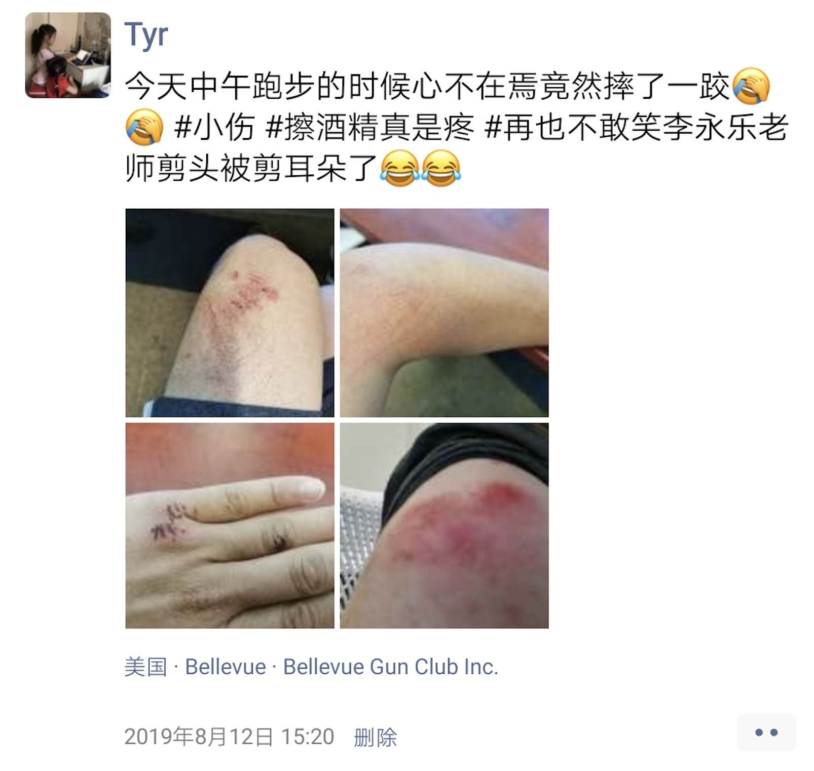
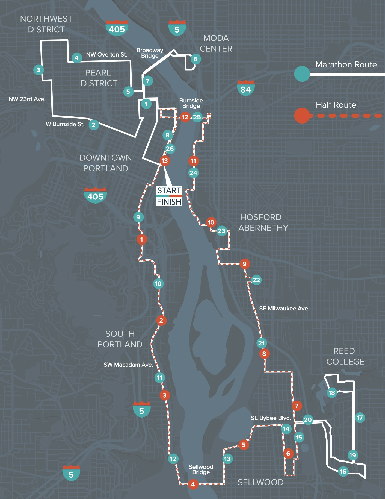
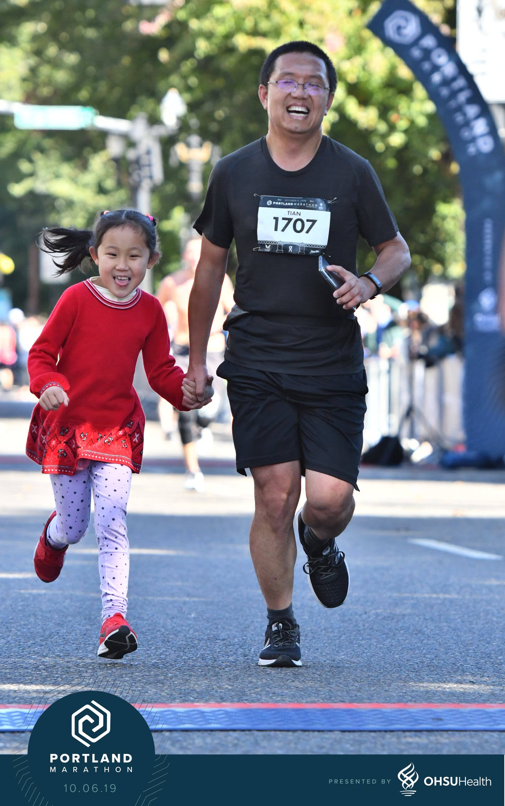
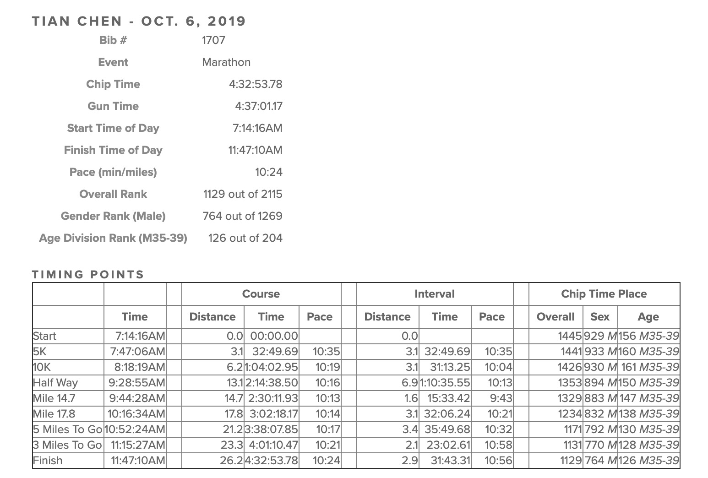

# 就酱，在波特兰跑完了人生第三个正式的马拉松

## 报名

和波特兰马拉松结缘纯属偶然。

2014 年跑完北马，兴奋之余，想感受一下六大赛，结果报名芝加哥马拉松和纽约马拉松先后失败，只好退而求其次，报了波特兰马拉松。没想到，波特兰马拉松别具一格，全程跑下来，我的感觉是「波特兰马拉松，其实是以马拉松的名义，举办了一场全民音乐会」，于是深深地爱上了在这里比赛的感觉。

2016 年，我继续报名了波特兰马拉松，后来因为出差的缘故，提前取消了；2017 年，死心不改，报了名，也勉力训练着（有段时间几乎天天中午在旧金山的海边跑个四十来分钟），但因为自己觉得身体还没到可以参赛的水准，没去；2018 年，迁居西雅图地区，虽然离得更近了，可乱七八糟的事情太多，干脆没报名；2019 年，在镜子里看着自己日渐丰腴的身体，突然有了皇叔「慨然流涕」那样的心境：「吾常身不离鞍，髀肉皆消。今不复骑，髀里肉生。日月若驰，老将至矣」，于是便重新报名，重新训练，决意哪怕排除万难，也要跑上一跑。

## 训练

对于马拉松来说，训练是比赛的一部分，比赛是训练的尾声。就像《英雄交响曲》中的英雄一样，在雄壮豪迈地迎接最终的胜利之前，要经历从踌躇满志，到万念俱灭，再到凤凰涅槃的三个阶段。这也是我在训练中经历的过程。

报名之后，大概是五月份的样子，我开始了第一次训练。公司门前有条小路，一路跑到头再折回来大概是 3.6km，我便拿这段距离重拾对跑步的感觉。虽然许久未跑，可我正处于曹刿口中「一鼓作气」的阶段，凭着对跑马的激情，就这么每天中午跑着，一点点加量。慢慢的，3.6km 升级到了 5km，停留了许久，在七月初的时候，升级到了 7km。随后小腿开始不适，每次跑完小腿侧面会有凸起的鼓包。恰好那时间前后，无意中看到了李永乐老师讲静脉曲张的视频，吓了我一大跳，因为我真有些静脉曲张早期的症状。随后，我跑得谨慎了许多，每次跑完后吃午饭的同时都要按摩小腿达半个小时，直至症状消退才作罢。就这样收着跑了一个多月，静脉曲张的症状没有好转的迹象。

所谓祸不单行，8 月 12 日风和日丽，我吃着火锅唱着歌，啊不，听着 podcast 跑着步，一不留神，脚磕在马路牙子上，重重摔倒，为了保护我那来之不易的 P30 Pro（主要是怕回家跪搓板），我没有用双手缓冲一下，反而是用手臂和手背生生扛了下来，和水泥地来了个亲密接触。

周围经过的车都吓了一大跳。有司机探出头来表示关切。我摆摆手，就那么趴在地上，喘着粗气，又好气又好笑，任凭擦伤的好几块地方火辣辣的。说来也巧，自打那次跌了一跤，小腿上的鼓包似乎有消亡的迹象。

那周周末，我放开跑了个三小时的 LSD (Long Slow Distance)，并无大碍。我觉得，这次马拉松稳了。

9 月份，我刻意练了很多上坡下坡 —— 反正公司附近到处都是起起伏伏的丘陵。2015 年那次跑马，大概 27 公里处的大坡我还记忆犹新，我希望这次我能够跑着上去，而非散步散过去。

## 参赛

10 月 6 日的波特兰清晨，天气异常阴冷。跑前半小时，把外套寄存后，我在寒风中瑟瑟发抖，只能靠不断吃糖丸和热身来抵御冷风。枪响后大概四五分钟，我紧跟着 440 的兔子，迈过了起点。我觉得我能跟住这只兔子，从而有机会冲击我北马的最好成绩：4:48。

头几公里，440 的兔子配速几乎锁在 6'25，上坡时，降到大约 6'45。这次马拉松的线路和上回我参加截然不同，几乎全程都是上上下下的，还好我针对上坡好好练习过，不然还真不好适应。跑了六七公里后，我觉得 440 的兔子速度压得有些过分 —— 或者是我自己自我感觉太好 —— 我就在第一个水站处，超了她。

之后，几乎每个上坡，我都能超出一大票散步的人，然而，我始终连 420 的兔子的尾巴都没见着。反而，跑完半马之后（大约 15 mile 处）的一座桥上，我看到了迎面跑来的 340 的兔子。我当时手头没有地图，并不知道我们间实际有八公里的差距（5 miles），心中窃喜：难道我离四小时竟然不太远？

原来这一切都是假象。过了桥，绕过一个居民区，大部队就进入大名鼎鼎的 Reed College。这是乔布斯的母校 —— 虽然他没上多久就退学了。我深深地记得，乔布斯在斯坦福的毕业典礼上那著名的 connecting the dots —— 乔布斯在 Reed College 学习的不知道有什么用的衬线字体，却阴差阳错被应用在了 Mac 上。Reed College 校园很美很安详，我们的到来打乱了学校的宁静，路边的学生们怪叫着给我们鼓劲。

过了 Reed College，前面两个老爷爷引起了我的注意。老爷爷 A 追上老爷爷 B 后，和他并肩跑着，问：您多大了？老爷爷 B 洪亮地回答：65 了！您呢？老爷爷 A 自豪地说：69！比您痴长了几岁！随后两人爽朗地笑了。我看着两人的背影，羡慕得不得了 —— 要是我六十好几，还能有这样的体格参加马拉松，让一个后生感慨「都难以望其项背」，多好！

趁着又一个上坡，老爷爷们的速度下来了，我便超过他们，继续我自己的征途。也许是之前几个月训练的功效，也许是此次全马每 5km 我就补一包糖浆的作用，总之过了 32km，我还没有撞墙的感觉。老婆发来信息说她们已经停好车，在终点附近的河边玩耍等待我到来。我把沿途的景致发给她们先睹为快。这次波特兰马拉松，组织得相当不错，每个人都像顺丰快递的一件包裹，有一个 tracking url，于是家人可以打开这个 url，随时了解我的动态 —— 老婆对于我每个 mile 的配速，平均速度，预计到达终点的时间，比我自己感知到的还要精确。

一路上，我的配速，除去上厕所和大上坡这种不可抗力导致往下掉一掉，大多保持在 6'20 - 6'40 之间，稳得连我自己都感到吃惊。最后两三个 mile，我虽然一切安好，没有像上次那样，腿部抽筋，但脚底板生疼，有些忍无可忍。「停下来走走」的念头萦绕在我脑海中，不过很快另一个声音将它按了下去：这可能是我有史以来第一次全程都几乎稳在一个速度跑下来的马拉松啊！就差几公里了！我回想起之前在跑过一个居民区的时候，地上插的标语："If it doesn't challenge you, it doesn't change you"，当时我咂摸了很久，此刻化作鸡汤，沁人心扉。这时老婆打来电话问最后三百米小宝想跟我跑，可不可以？我说有何不可？先上车再买票，试试呗。

最后的一公里，华为的健康 app 已经在恭喜我完成了全马，可我离终点还有大概 600 米。我在欢呼的人群中疯狂搜索老婆孩子，终于，在不远处找到了。小宝和小贝兴奋地「爸爸」「爸爸」吼个不停，我冲过去，抄起两个娃一顿猛亲。抱着小贝，牵着小宝合了个影之后，我拉起小宝，做最后的冲刺。围观的群众看到我们两个手拉手跑向重点，喝彩声连绵不绝，到处都是向我竖起的大拇指。小宝兴奋极了，这样热烈的氛围，她也是第一次经历。当我们手拉手即将冲过终点时，主持人热情洋溢地播报：Here comes Tian Chen, from Issaquah! And his lovely daughter!（具体的词儿我也记不清楚了）

小宝既开心又不解地问：爸爸，为什么人家会说你的名字，还知道你来自 Issaquah，却不提我的名字？

我笑着说：因为爸爸报名参赛了，你看我的胸牌：1707，人家一看这个就能查到我的报名信息，知道我的全名，以及我住在哪里。

她恍然大悟：我说嘛，那我下次也要报名，我想冲过终点的时候听到我的名字！

跨过终点的时候，我望了一眼记分牌，上面赫然写着 4:36。我知道，我的净成绩肯定要更好一些，说不定进入 4:30 呢！在休息区，小宝和我大快朵颐，有什么吃什么。我一遍绕着休息区走，一边吃吃喝喝，在连喝了两瓶水，确保轻微脱水的情况有所好转后，才做了些简单的拉伸，然后冲出去，和家人汇合。

后来我拿到了我的成绩，4:32，我开心地像个一百斤的瘦子。三十七岁的自己，终于追上了三十二岁的自己的脚步。

## 当我跑步的时候...

好像谈到跑步，就免不了村上春树 —— 唉，他大概率今年也拿不了诺奖吧。

我之前和跑步有关的几篇，变着法子总要写上："Pain is inevitable, suffering is optional"，进行自我鼓励。今年整个过程没有多少 pain，更谈不上 suffering。不过我还是很喜欢这碗鸡汤，时不时反刍回来让它的滋味在舌尖打个转。

当我跑步的时候，我总是任由思想天马行空。平日的中午跑步时，我脑海里时而冒出数学题 —— 比如根号二如何用连分数表示 —— 这是在准备晚上给小宝的数学课；时而冒出吴王夫差为何不解决卧榻之患而急于黄池争霸的疑问 —— 这是我自己的十万个为什么。

这次波特兰马拉松，我全程都在回顾并思考一件事：究竟做什么事情让我感到最为快乐？或者说，我的人生的终极快乐是什么？

在我懂事的时候，哈雷彗星和神秘的太空是少儿科学画报的常客。那时候无论是在新疆还是酒泉，夏季的夜空，一条白带子裹着数不尽的星星，美轮美奂。长辈们对着夜空给我指点：这是北斗七星，那是织女星...夏天晚上在户外乘着凉，啃着西瓜，数着天上的星星，是我儿时享不尽的快乐。所以，打小我就有一颗成为天文学家的心。

长大以后，跟随父母南下广东，天上的星星日渐模糊起来。初高中同学聚会，大排档里懒散地抠着田螺聊着天，目光已经从天上的星星转向了穿着班尼路T恤真维斯仔裤的女同学 —— 情窦初开的小男生，跟自己心仪的女孩儿聊上几句天，还有什么比这更快乐的事情？

大学四年，打游戏和写代码是两大快乐。打游戏自己真不是那块料，所以后来热情消退；写代码不客气地说我算是系里执牛耳者，大二就开始周末出去凭着手艺赚钱 —— 那时领「工钱」的方式非常魔幻，每个月三十来张百元大钞扎个捆就那么递给我 —— 我感受到了钱攥在手心中的快乐。

大学毕业后，工作是快乐的源泉。负责的每件事，遇上的每个人，都是一个美丽新世界。就算自己住的窝连厕所都要轮流使用，刷牙的时候还能想着在 OSPF（一种路由协议）里优化路由表结构的方案，"Eureka"，"Eureka" 到乐开花。

工作一段时间，觉得充实的人生才是快乐的。于是，读书，充电，甚至在繁忙的工作中抽出时间读个学位，累成狗，但一天结束时合上日记，深吸一口气，感受每个毛孔散发出来的成长的喜悦，那是真的痛并快乐着。

之后人生的快乐，像走马灯似的换个不停，比当时日本首相换届还勤，我把它归成几类：

* 积极向上的，成长的快乐：职场的成长，收入的成长，资产的成长，社交圈的成长，阅历的成长等
* 冒险和挑战自我的快乐：初尝禁果，初为人夫，初为人父，第一次管理团队，第一次创业，第一次出书，第一次出国，第一次出国定居，第一次成为两个娃的父亲等
* 放松心情，重塑活力的快乐：家庭生活的快乐，写代码的快乐，解决问题的快乐，分享知识的快乐，探索未知世界的快乐，写作的快乐，读书的快乐，跑步的快乐等

成长的快乐和挑战自我的快乐，有其保质期。在巅峰体验（peak experience）或者是目标达成前后，快乐是逐渐衰退的。所以除非用鞭子不断地驱使自己，否则激情过后，是空洞的贤者时间。当然，这也是符合 build-measure-learn 这样一个螺旋向上的周期。

那些并非为了达成某个目标，仅仅是单纯地放松心情的快乐，可以持续地非常久远。比如疲惫了一天之后投入家庭的怀抱，在饭桌上谈论各种有趣的话题；写一些和工作无关，仅仅为了好玩，或者「它应该存在」的代码和工具；还有，学到点什么东西，将其嚼碎了，形成自己的解读，再分享出去。

前些日子，我为了读《资治通鉴》方便，制作了资治通鉴的胶片版，可供我随时随地读上一个片段。其实我不止做了那一个 repo，后来我照葫芦画瓢，陆陆续续做了《史记》，《左传》，《孟子》，《论语》，《荀子》，《韩非子》，《老子》和《庄子》（laozhuang.qiaopang.com），《诗经》，《唐诗三百首》和《宋词三百曲》（shici.qiaopang.com），算是自己的厕所读物。这些代码，这些花去的精力，与我开发能力上的精进并无任何帮助，好像也算不上像样的产品，但却是我快乐的源泉，每每坐在马桶上，听着不解其意的《诗经》，回顾小时候全篇背下的《琵琶行》，听听荀子解读《老子》，别有一番滋味。

https://shijing.qiaopang.com/16.html#5

https://shici.qiaopang.com/01.html#73

https://hanfeizi.qiaopang.com/21.html#10

然而这还不算是我的终极快乐。很多次，有朋友问我：如果有一天你退休了，你最想干什么？每次我的回答都差不多：教书育人。如果有大学看得起我，让我去当讲师，那再好不过；如果没有，也许我会自个儿讲点什么。我没有意识到，这件我最想做的事情，仿佛就是我的终极快乐。

早在 Juniper 的时候，我就在我们北京的团队中，努力开展 BBL（Brown Bag Lecture）这种知识经验分享的活动；后来自己创业，在途客圈，类似的午间分享就几乎没有断过；随后我把它带入了 Tubi，带入了 ArcBlock，成为它们各自文化中的一部分。这样的活动，初期总是非常吃力的，没有人上的时候我会自己欣然顶上，分享我自己的知识。在我经历的一家家公司里，我一次次勉力打造一个知识和技能分享的氛围，说明这绝不是偶然，是因为我自己就深爱着这件事情，分享知识对我来说，是一个无比快乐的过程。

如今，我每天晚上跟小宝分享我的知识，比我忙乎自己的工作，忙乎个人的成长，还要不亦乐乎，这不恰恰说明了我能够从中获取更大的快乐么？

这难道不是我的终极快乐？

跑步的路上，整理着这样的思绪，我突然「顿悟」，仿佛聆听到了神谕。很多人喜欢引用村上春树描写他如何步入写作这条不归路时说的这句话：「我还清晰地记得那晴朗的天空，刚刚回复了绿色的草坪的触感，以及棒球发出的悦耳声响。在那一刻，有什么东西静静地从天空中飘然落下，我明白无误地接受了它」。

我的感觉几乎一模一样。
