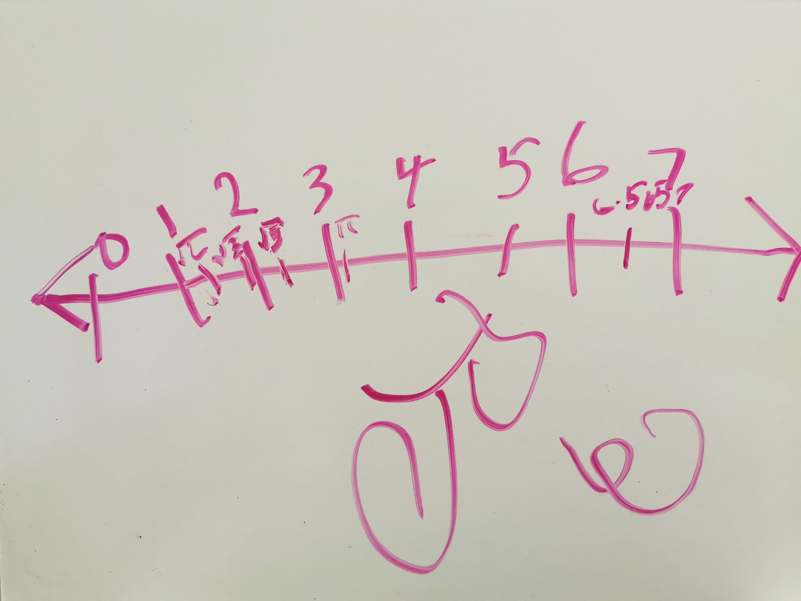

# 长日无痕(5): 天叔奇谈

（一）

在孩子们的成长过程中，我大部分时候都是个甩手掌柜的角色。之前小宝的课业，无论钢琴滑冰舞蹈绘画，还是读书写作算术科学，都是妈妈在操心，更别说小贝。我白天忙工作，早上出门时孩子们还在酣睡，晚上回到家时已是夜幕降临，一家人等着我晚餐。饭前我例行公事似的抱抱孩子们，玩耍几分钟；饭后我就把自己关在书房，忙自己的工作，看自己的书，写自己的文章。孩儿们偶尔冲进来寻求我的关注，大多被我三言两语打发走。等孩子要休息了，我在床边陪着讲个睡前故事，或者一起算道数学题，反而成了一天之中陪孩子最长的时光。

老婆体谅我忙不完的工作和闲事，恳求我一天能抽出半个小时陪孩子读书；我应承着，煞有介事做了几天后便故态复萌。后来她放宽了最低标准，要求我每周至少抽一天晚上花上半小时到一小时教小宝学 scratch，结果这也成了镜中月水中花。

转眼间小宝就要 7 岁，而小贝也 3 岁。老婆周旋于两个孩子之间，已渐渐力不从心。小宝还没形成自律的习惯，离开妈妈的陪伴，钢琴，数学，阅读等一塌糊涂；小贝心底的小怪兽开始觉醒，时刻都想争抢妈妈的注意力。两个孩子各不相让，也没道理可讲，得势的一方洋洋自得，失势的那位便打滚撒泼嚎啕大哭。由于小贝是老二，打自娘胎出来心眼就比小宝多，也比小宝懂得察言观色，讨父母欢心，所以在「抢夺妈妈关注」这块，失势的多是小宝。小宝偏又是赤子之心，本色自然，既不肯服软，又不愿意说好话哄人，生气时怼天怼地，常常惹得妈妈气上加气。老婆被折腾得心力交瘁，常跟我诉苦，我嘴上表示同情，却还是没有任何行动。后来有一日，母女俩因为练琴的事情几近反目，互相之间说了很多气头上的，本不该说出口的狠话。晚上睡觉的时候老婆哭着对我说：你看着办吧，再这样下去，等孩子青春期，我们母女的关系恐怕就要彻底破裂了。

我心里咯噔一下。我想起了有次小宝央求我陪她玩不成，摔门而出留下的那句：「工作，就知道工作！你是一个不管孩子的老爹！」

第二天晚上，一年级新学期的家长会，我破天荒第一次参加。说来惭愧，小宝在 Sunny Hills 上了一年学，我却连之前的老师 Miss Wolfe 长啥样都不知道。美国的公校是一年一届老师，新学年的老师是 Mrs. Dunn。家长会上我虽然带着耳朵听，心头挥之不去的是「在孩子的成长中，怎样尽一个爸爸的责任，来减轻妈妈的压力？」。在反思的过程中，我意识到我有两个问题：1) 我空有一身的知识，愿意花时间通过写文章，做讲座把知识和技能传递给别人，却吝于培养自己的孩子。2) 我自诩有很强的学习能力，能够掌握任何我想掌握的知识，却懒得在如何教育孩子身上下功夫，学相关的知识。思来想去，决定先从解决问题 1) 入手，投入时间来培养孩子；之后，再处理 2)，不断学习来让自己 **有资格** 教育孩子。

于是我在教室 —— 小宝平日里白天上课的教室里，用她平日里学习用的纸和笔，庄重地写下了如下计划：

> 每晚 8 点 30 - 9 点 10 分：
> 
> - 周一：历史故事（和小宝一起探索二十四史中的有趣故事，加深小宝对中华文化认同，以及她对汉字和语文的喜爱）
> - 周二：数学（我们一起探索数字的奥妙，培养她的数感）
> - 周三：Scratch（小宝对编程非常喜爱，我们一起做些有趣的开发，来培养她的逻辑能力，以及把复杂问题拆分的能力）
> - 周四：探索（平日里小宝总问我很多为什么，这些「为什么」我解答得非常肤浅，通过「探索」环节，来更多激发她的好奇心和寻找深度答案的能力）
> - 周五：纪录片（深度讲解一部纪录片，让小宝开拓视野，触及那些「未知的未知」）
> - 周六：几何（其实还是数学，只不过我不想小宝觉得怎么一周会两次数学，几何是从另一个维度解释数学的有力武器）
> - 周日：掷色子或者小宝来选择额外学习哪个内容

从长期可行性来说，这个计划能执行到什么程度，我自己心里没底 —— 我自己是否能坚持另说，小宝会不会过了一开始的兴奋期，觉得「一天净在学习都没有玩的时间」而抵触？

从内容可行性来说，我更是没底。我知道我肚子里的货 —— 周一，周三和周五是最轻松的，我只需要简单准备即可对付；周二和周六，恐怕一段时间之后我得恶补数学 —— 尤其是怎么把枯燥的数学能生动地教给一个不满七岁的孩子；周四，就像薛定谔的猫，不到小宝揭秘她的问题前，我是无法知道这将会是场什么样的挑战。

家长会后，我把我的计划告诉了老婆。她很开心，因为这样能够让她每天轻松近一个小时，只需要面对一个熊孩子。但她也有担忧，怕我方法不当，拔苗助长，反而把孩子的学习兴趣毁了。我说我们先试试，大纲内的知识，还是你继续教；我就负责开拓她的视野，培养她对探索知识的兴趣。

（二）

借着家长会的东风，次日，也就是 9 月 12 日，我和小宝开始了第一次尝试。那一天是周四，所以我们的话题是「探索」。小宝抛出的问题是：世界上现在有多少人？哪些国家人口比较多？人口会减少么？

为了让课堂的效果足够好，我花了些时间备课，找到了一些可以和她一起观看的视频。我是一个笃信 build-measure-learn 的人，一件事如果我要认真去做，我便会详细记录（尤其是自己的感知），以便于不断提升，于是我开了一个新的公众号「天叔奇谈」，把自己备课和上课的碎碎念放了上去。在授课和记录的迭代中，我开始不停思考一件事情：怎么样让孩子能够迷上每天晚上的课程？

使人「着迷」既容易又困难。游戏很容易让人沉迷，所以还需要所谓的「防沉迷系统」来解救沉溺于其中的人；但学习新的事物，如果方法不对，不但不能让人着迷，还可能会引发排斥效应。究其原因，是游戏通过视觉听觉触觉等多种感官建立起吸引力，激发我们的好奇心。有了好奇心，我们愿意尝试和体验，而一旦尝试，很快就能得到反馈，我们就会依据反馈不断调整策略（这个策略往往是简单易行的，或者可以通过单纯的训练变得更好的），从而得到更好的反馈（过关，更高的分数，回血，加命，升级，榜上有名），达到身心的满足感，同时自己（游戏中）的能力得到提升，解锁更多的未知世界。

如果我们把这个模式抽取出来，就是：**建立吸引力 - 诱发好奇心 - 促进尝试 - 立即反馈 - 促进进一步尝试 - 提升成就感和满足感 - 赋能**。我打算把这个模式应用在每日的课程中。

在 9 月 14 日的课程中，这个建立吸引力诱发好奇心的策略就得到了充分的验证。这天是几何课，我跟小宝探索 π。我从宝妈那里觅得一个线团，然后教小宝用圆规画了一个半径 10cm 的圆，然后我们用线一点点量出圆的周长，最后算出来不那么精确的周长和直径之比：$π = 3.135$。这个简单的动手过程大大激发了小宝对 π 的兴趣，以至后来她自己问 Siri π 的值，记录下来，然后一点点把它背了下来 —— 这可是小数点后 50 位！

随着这个模式的不断推进和演化，我们的「课堂」越来越生动活泼。我们把她的儿童自行车倒置，观看脚蹬转动时链条的传动；我们趴在车屁股后面观察排气口，打开钢琴观察琴弦的振动；我们用围棋子儿来进行加减乘除，学习进制系统；我们用「运动」app 来学习统计和各种图表。

（三）

在这里所有的课程中，我最在意的是数学。数学是科学之母，我们生活之中，大到东风快递，小到运动 app，都和数学有关。孩子的认知能力，抽象能力的提升来自于对数学的深刻掌握，而国内或者新加坡的数学教育偏重于对知识点的掌握和训练，略为枯燥，美国的 common core 虽然注重不同的方法和思路，还是摆脱不了枯燥，这让孩子学习的时候往往耽于枯燥的重复，容易对数学敬而远之。

但数学本身不该枯燥。它美丽灵动，就像曹植梦中的洛神 —— 翩若惊鸿，婉若游龙。远而望之，皎若太阳升朝霞；迫而察之，灼若芙蕖出渌波。无论是美妙的黄金分割率，奇幻的杨辉三角形，鬼斧神工般的素数，还是优雅的几何，严谨的逻辑，烧脑的代数，让世事洞明的微积分，抑或那一个个凝结着先贤们智慧结晶却让人望而生畏的公式，定理，都让人如饮醇醪，心旷神怡。

然而我们的数学教材，无论中美，都几乎是公式手册，而老师的作用是将这些公式固化在孩子们的脑袋里，以便让孩子在应该的年龄掌握大纲里要求的内容。怎样掌握？日复一日的练习 —— 就像健身房里的枯燥的肌肉训练。然而它剥夺了孩子们户外登山的乐趣 —— 那种逢山铺路遇水架桥，在实战中解决问题的乐趣 —— 这是学习数学本该享有的乐趣，也是高斯，欧拉，笛卡尔，莱布尼茨，拉马努金们走过的路。

所以我们需要的是大量的探索性的学习 —— 把教科书里用公式构筑的精美殿堂敲碎，引导孩子们重新搭上脚手架，顺着先贤们的思路一点点还原他们探索过的路径，甚至走出他们没有走过的路，这样的学习才更有意义，学到的才是真正的解决问题的能力，而非背公式，套题型的能力。当然，我不否认训练的重要性 —— 学而时习之 —— 在探索的基础上辅以适量的训练加以巩固。但我们不能舍本逐末。动物园里的大猩猩经过训练，也能掌握工具的使用，​而我们与它们的不同之处在于：我们通过探索和思考，能够发现规律，总结规律。​

高斯说：我们需要的是想法，不是符号（What we need are notions，not notations）。我非常赞同。任何一种心智的成长，都来源于自已解决问题，而不是被训练按照既定的方式和步骤去解决。

无奈的是，学校的老师没有义务，更没有动力去因材施教，引导孩子一点点探索出数学家们走过的路，解决他们解决过的问题。对于一个现代社会而言，基础教育必须是普惠的。因而师范学院流水线上产出的数学老师，其工作的动机首先是保证升学率，让更多的孩子能够在适当的年龄达到适当的认知水平，而非努力培养孩子们的解决问题的能力。这是其一。此外，无论在什么国度，社会都是金字塔的结构，越往上，通道越狭窄，为了避免拥挤，自然需要一个过滤器 —— 而考试成绩，就是规模化选拔的最容易实现也最相对公平的入场券。所以，当数学被列入考试科目的那一刻起，大纲选定的知识体系必定是最容易出题的内容，老师所教的内容必定也朝着这个方向强化。这两者决定了面向大纲的内容，以及面向考试的训练是学校教育的主流。于是，数学的历史不再重要，数学家的生平没人关心，他们是怎么一步步构建出如今这华美的大厦也无人问津，就连数学本身的美也同样被扔在了一旁。因为要传递「美」，需要有知识的沉淀，需要有辨析的能力，需要欣赏美的眼光，而唯独不需要的是大纲。对于数学老师来说，除非真心爱好，他们大概不太会读 Richard Courant 的通俗著作《什么是数学：对思想和方法的基本研究》，更不可能费劲去挑战 Serge Lang 的《代数》（Algebra）了。

这便我看到的问题。也是我想花时间解决的问题 —— 至少对于我的孩子们而言。我并不是想挑战教育体制本身 —— 相反我认为其足够公平。我的孩子也必然需要通过「千军万马过独木桥」的厮杀。我想做的是去弥补学校教育无法顾及的部分，像至圣先师孔夫子那样，真正做到「因材施教」，就我的两个孩子来说，这是个挑战，但不是个无法企及的目标。

所以我跟小宝的数学课的基调就是把数学当成一门艺术去探索，让她深度参与其中，提出问题，探索解决问题的方向，尝试，失败，再尝试。我让她感受斐波那契数列不仅仅是一堆数字和几个公式，它还有很多奇妙的属性；我让她感受连分数的美，以及连分数和数列之间微妙的联系；我们用用一支圆珠笔走过白板上的多边形，通过圆珠笔翻转的次数得出内角和公式；我们在地球仪上「走」出一个三角形，探索三角形内角和是 180° 这个命题的限定条件；我们一起背诵 π，一起玩丢番图方程，一起看跑步之后的统计图表，探索各种统计方法的意义；我们循着 π 认识了祖冲之和割圆术，在勾股定理和根号二的有理数危机中了解了毕达哥拉斯和他的学派，通过几何的公理体系认识了欧几里得，因为 0 和 1 的逻辑运算了解了布尔和他愚蠢的妻子。小学初中高中那些泾渭分明的数学内容变得界限模糊起来，数学也不再仅仅是书上那些琳琅满目的公式和符号。

在这个过程中，我渐渐发现，按照年龄划分数学学习的内容可能是不明智的，各种数学方法之间是连续的，不是断代的 —— 我们没法谈算术的时候就完全不碰数论，讲几何的时候不涉及代数，讲初等代数的时候刨除排列组合，讲任何话题的时候避开微积分。数学课堂上的小心翼翼是不必要的，代数放在初中教授，微积分放在高中和大学学习，并不意味着代数和微积分的思想就不能出现在一个小孩子的头脑里。

## 贤者时刻

> It is not worth an intelligent man's time to be in the majority. By definition, there are already enough people to do that.
> 
> - G. H. Hardy

有天周六，小宝上完溜冰课，妈妈带她来我公司休息，准备参加半小时之后的在我公司附近的舞蹈课。在我办公室的白板上，小宝画了一个数轴：

她说：爸爸，你看，这是一个数轴。$\sqrt{2}$ 在这里，π 在这里，我要发明一个数叫 Lindsey，我告诉你它的值：6.5657，你要把这个数记好，因为它跟 π 一样重要。
