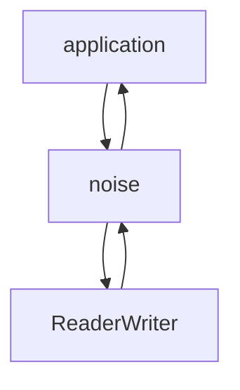
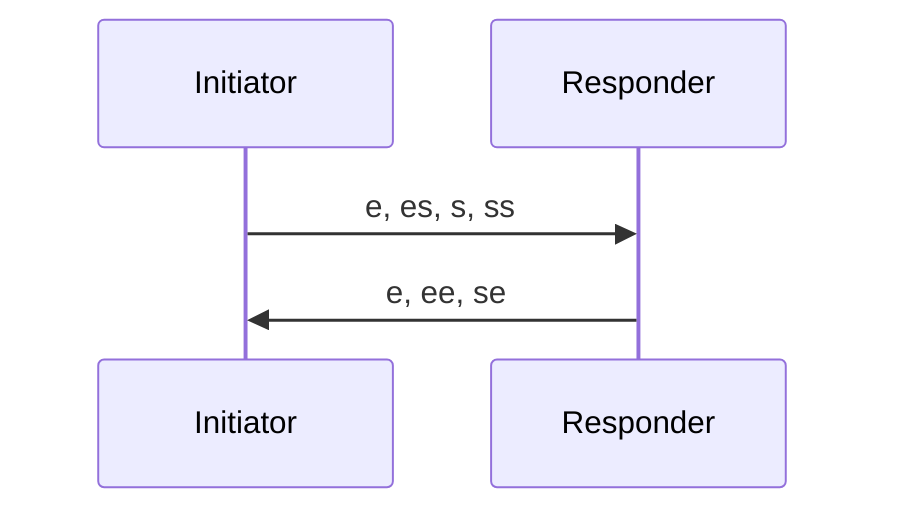

# Noise 框架：构建安全协议的蓝图

Noise Protocol Framework（以下简称 Noise）是一个用于构建安全协议的框架。与 TLS，IPSec 这样的有完整实现的协议不同，Noise 更多像是一个蓝图，它为那些想创建自己的安全协议的开发者提供了一套模板。就好像元编程之于编程，Noise 是协议的元协议（meta-protocol）。

诸君也许会问：既然有了 TLS，我们为何还需要创建自己的安全协议？

虽然 TLS 1.3 相对于前作，已经放弃了很多对老旧的算法的支持，整个协议栈也更加清爽更加「现代」，握手的过程只需要 1-RTT（甚至 0-RTT），这些观点都和 Noise 倡导的方向不谋而合，但使用 TLS 必然牵扯 PKI，需要服务器端证书和客户端证书（可选），而证书需要 CA（无论是公共的 CA 还是私有的 CA） 发放，整个协议栈还是非常复杂，且很难应用到非中心化的 p2p 网络中。

所以，当我们想开发一些直接基于 TCP 或者 UDP 的私有协议时，TLS 颇为笨重，并不是最好的选择，而自己开发的安全协议不一定靠谱，这时，Noise 就是一个安全灵活的选择。

我们在之前讲 WireGuard 的文章中提到过安全信道建立的基石是 DH 算法，即协商安全信道的双方，持有一个私密的随机数，然后交换公开的随机数，通过同余算法两端独立计算出相同的密钥，从而达到不传输密钥就可以协商出相同密钥的方式。DH 算法的一个高效安全的变种是 ECDH：


如果我们要开发自己的安全协议，DH/ECDH 是几乎无法避免的。协商出来密钥之后，我们需要考虑使用什么样的对称加密算法和哈希算法，如何验证双方的身份，如何保证前向安全性（现在使用的密钥泄露不会导致过去使用的密钥泄露），如何在收发两个方向上 rekey（密钥使用一段时间后重新生成新的密钥）等等。这些令人头疼的问题，Noise 协议都做了严格的规定。

## 鸟瞰 Noise 协议

我们先要明确一件事情：Noise 协议虽然其初衷是为网络协议提供安全信道，但它并没有规定使用什么样的通讯协议 — TCP / UDP 甚至是任何满足 read / write 接口的子系统，比如文件，管道（pipe），都可以使用 Noise 协议。



Noise 协议原文除去附录，有 41 页之多，这里面有大量的概念和协议细节的描述，在深入细节之前，我们从用户的角度，或者说产品的角度，看看如何使用一个 Noise 协议做出来的系统。

首先是协议的握手。在握手阶段，发起者和应答者（initiator / responder，注意 Noise 没有使用 Client / Server，但我们可以简单认为 initiator 是 client，而 responder 是 server）通过交换信息对使用何种算法，密钥是什么达成一致。

握手阶段双方需要使用同样的协议变量 —— 和 TLS 不同的是，Noise 把协议变量设计为静态而非协商出来的。这是一个很大的简化，而从用户的角度，用户写出来的使用 Noise 的应用往往是自己的节点跟自己的节点通讯，因而无需协商。我们上次讲到的 WireGuard 使用的是这样的变量：Noise_IKpsk2_25519_ChaChaPoly_BLAKE2s。稍微解释一下：

* I：发起者的固定公钥未加密就直接发给应答者
* K：应答者的公钥发起者预先就知道
* psk2：把预设的密码（Pre-Shared-Key ）放在第 2 个握手包之后
* ChaChaPoly：对称加密算法
* BLAKE2s：哈希算法

协议变量各个部分是这样规定的：Noise _ <握手的模式> _ <公钥算法> _ <对称加密算法> _ <哈希算法>。其中握手模式有很多种，适用于各种不同的场合。其中IK 模式的握手方式是这样的，只需要 1-RTT，我们随后细讲：



握手的过程中，Noise 会生成一个 HandshakeState，它用来记录当前收到的对端传来的固定公钥和临时公钥，以及通过 ECDH 算法算出来的临时数据。当整个握手结束后，双方都有对等的信息，可以生成一致的密钥。于是发起者和应答者对于它们各自的接收端和发送端生成密钥对。

之后，Noise 允许用户将协议状态切换成传输模式（Transport Mode）。切换过程中，HandshakeState 转换成 CipherState，然后就可以用 encrypt / decrypt 来加密和解密应用的数据了。

理论上讲，Noise 的用户接口可以就这么几个：

* `build`：根据协议变量和固定私钥，初始化 HandshakeState。
* `write(msg, buf)`: 根据当前的状态，撰写协议报文或者把用户传入的 buffer 加密
* `read(buf, msg)`：根据当前的状态，读取用户传入的 buffer，处理握手状态机或者把用户传入的 buffer 解密
* `into_transport_mode`：将 HandshakeState 转为 CipherState
* `rekey`：在传输模式下，用户可以调用 rekey 来更新

对于用户的应用程序来说，这个接口无比简单，很容易和现有的系统串联起来。从产品的角度，简单不仅仅意味着美，还意味着很难用错。

## Noise 协议握手细节

Noise 协议的核心部分是握手协议，它总共支持 12 种不同的协商的模式。这些模式可以进一步和 PSK，非对称加密算法，对称加密算法，哈希算法排列组合出数百种不同的协议变量。当然，核心就是这 12 种。每个模式都由两个字母标识，第一个字母代表发起者，第二个字母代表应答者：


其中：

* N：表示自己没有固定公私钥
* K：表示自己的固定公钥对方预先知道（通过其他途径）
* X：表示自己的固定公钥通过网络加密传输给对方（用于身份隐藏）
* I：表示自己的固定公钥明文传输给对方（不考虑身份隐藏），I 状态只会出现在发起端

有了这些概念，我们就好理解每种模式的含义 —— 比如：KX。接收者预先知道发起者的固定公钥，而接收者的固定公钥通过网络加密传输给发起者。因为接收者预先知道发起者的固定公钥，意味着发起者通过某个渠道将其固定公钥 s 在握手之前就发送给了接收者。这就是上图中 `...` 前面的 `-> s` 的意思。`...` 之前的动作都代表预先发送，并不包含在握手之中。

我们接着看 `e, ee` 这些字符代表什么。如果是单个字符，代表箭头方向接收到对方传来的公钥。`s` 是固定公钥，`e` 是临时公钥；如果是两个字符，则代表做 DH 运算 —— 第一个字符代表自己的公钥，第二代表对方的公钥。我们来解释一下 XK（为了便于区分，我们把对端的公钥前面加一个 r，表示 remote）：

* `<- s`：接收方的固定公钥预先提供给了发送方
* `...`：之前的消息是握手阶段就已经完成的消息，属于先验知识
* `-> e, es`：发送方发送自己临时生成的公钥 e，然后用自己的临时公钥 e 和对方的固定公钥 s 做 DH(e, rs)。接收方收到 e 之后，也可以做 DH(re, s)。
* `<- e, ee`：接收方发送自己临时生成的公钥 e，然后做 DH(e, re)；发送方收到对方发来的 e 之后，做 DH(re, e)。
* `-> s, se`：此刻双方已经可以生成一个临时的密钥，发送方用其加密发送自己的固定公钥，然后再做 DH(s, re)；接收方收到对方的 s 后，做 DH(rs, e)。
* 至此，协商结束

XK 是 Noise 里面路径最长的握手模式，其它模式都是 1-RTT。关于 XK（或者其他模式）的安全性分析，可以在 Noise Explorer 里探索，这里就不详述：[https://noiseexplorer.com/patterns/XK/](https://noiseexplorer.com/patterns/XK/)。

Noise 整个握手的过程每次 DH 并不是孤立的事件。从建立 HandshakeState 那一刻起，Noise 就维护一个 chaining key，每次运算的结果都会反映到 chaining key 之中。至于握手过程中 chaining key 是如何计算的，协议的状态机是如何维护的，可以参考 Noise Spec，我就不重复解释了。

## Noise 协议的应用

WireGuard 算是目前最成功的公开的应用。因为 Noise 协议主要应用在提升私有协议的安全能力上，所以很多应用并不为公众所知。根据 官方的 WhatsApp Encryption Overview 文档，Whatsapp 端到端的消息加密使用了 Noise 协议。比特币的闪电网络也使用了 Noise 协议。rust-libp2p 应用了 Noise 协议，这也意味着，polkadot，substrate 以及 facebook 的 libra 也（潜在）使用 Noise 协议。

此外，Noise 协议还可以用于加密文件 —— 只要我有你的公钥，我可以使用单向握手（7.4）加密某个文件（附带握手时发送的消息），然后传输到某个不安全的位置（比如网盘，FTP，IPFS，甚至区块链中），该文件只有拥有私钥的人才能解密。这种应用很有意思，因为它具备非对称加密的安全性，同时又具备对称加密的加解密速度。

如果你对 noise 协议感兴趣，rust 下的 snow crate（程序君验证过），golang 下的 libdisco（未验证） 和 flynn/noise（已经两年未更新）看上去都不错。尤其是 rust 下的 snow，实现精巧，很容易和其它模块如底层的 tokio/async-std，以及上层的 yamux 结合使用​。snow 在不少开源项目中，尤其是区块链和 IoT 的项目中​得到广泛使用。​


但它面向的使用场景主要围绕着 client-server 模式 — 客户端通过验证服务端的证书来「信任」服务端，整个加密信道的建立也围绕着证书来完成。当然 TLS 也支持服务器端验证客户端的证书，但客户端证书的发放就牵扯到服务器端提供 CA 的功能，整个体系

```
                              START <----+
               Send ClientHello |        | Recv HelloRetryRequest
          [K_send = early data] |        |
                                v        |
           /                 WAIT_SH ----+
           |                    | Recv ServerHello
           |                    | K_recv = handshake
       Can |                    V
      send |                 WAIT_EE
     early |                    | Recv EncryptedExtensions
      data |           +--------+--------+
           |     Using |                 | Using certificate
           |       PSK |                 v
           |           |            WAIT_CERT_CR
           |           |        Recv |       | Recv CertificateRequest
           |           | Certificate |       v
           |           |             |    WAIT_CERT
           |           |             |       | Recv Certificate
           |           |             v       v
           |           |              WAIT_CV
           |           |                 | Recv CertificateVerify
           |           +> WAIT_FINISHED <+
           |                  | Recv Finished
           \                  | [Send EndOfEarlyData]
                              | K_send = handshake
                              | [Send Certificate [+ CertificateVerify]]
    Can send                  | Send Finished
    app data   -->            | K_send = K_recv = application
    after here                v
                          CONNECTED
```

## 参考资料

- [gist - Cryptographic Right Answers](https://gist.github.com/tqbf/be58d2d39690c3b366ad)

- [latacora - Cryptographic Right Answers](https://latacora.singles/2018/04/03/cryptographic-right-answers.html)

## 摘抄

Noise is a fantastic set of protocols for building modern cryptographic applications. Here are a few things to look out for:

- The interactions in the protocol are precisely specified

- The exact security properties of the different interactions are precisely specified, including in-depth concepts like the AKE's KCI properties (AKE: authenticated key exchange, KCI: key compromise impersonation, where post-compromise, an attacker can impersonate anyone to the victim, instead of being able to just impersonate the victim to anyone).

- Several mutually compatible reference implementations.

As great as it is, most applications should still rely on TLS for transport security. Noise is primarily for places where TLS' properties aren't suitable.

Another interesting tidbit that might not be obvious: like TLS, Noise is one protocol with many instantiations. Because it builds on a few simple primitives, these can be swapped out, although Noise defines sane defaults. However, an application built on top of Noise is far more likely to have one fixed ciphersuite set (agility, but not negotiation) -- so it wouldn't be unreasonable to think of Noise as a blueprint for a set of protocols.
