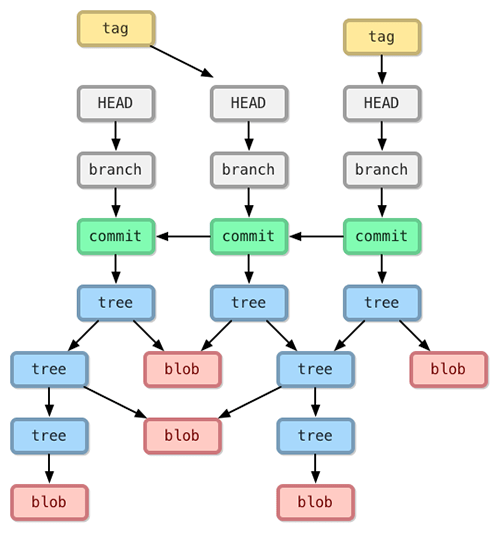

# 10 分钟重新认识 git

最近对 git 的底层实现异常迷恋，周末抽空用 rust 和 rocksdb 实现了一个乞丐版的 object store - 可以存储 blob，tree，commit 三种对象。之所以用 rocksdb，是因为我不太喜欢文件系统里的那些细碎的 git 对象，我也没太研究 packfile 是如何进行差分编码的，rocksdb 恰好解决了这两个不爽。本来想写篇文章讲讲我在实现过程中踩过的坑，但考虑可能大部分读者虽然每天都在用 git，却并不真正了解 git，所以我觉得有必要先通过一些例子回顾一下 git 的思想和主要的对象类型。

## Git 的起源和基础知识

git 是十多年前 Linus 不爽现有的版本控制软件，花了大概 10 天功夫做出来的一个工具（初代）— 大佬就是这么牛逼，不爽就撸袖子干，哪儿那么多废话。相比于 cvs/svn 这些「中心化」的，以 diff 为基础存储更新的传统版本控制软件不同的是，git 认为每个文件一旦写入对象数据库中都是不可更改的（immutable），任何微小的修改，都会在数据库中形成一个新的对象。对象的 id 就是其 sha1 哈希。有了这个基础，文件对象（blob）可以被组织成树（更确切地说是默克尔树），一次 提交（commit）就是根据更改的文件的信息生成新的树的过程，新树和老树共享相同的子树，只有变化的部分才会分叉。在漫长的操作之后，对象数据库中有无数棵树，这些树构成了一个默克尔图（merkle DAG）。通过使用引用（ref），比如 HEAD, heads/master，tags/v0.1，git 可以很方便地追踪用户关心的每一棵树的确切状态。



OK，文字部分就这些，我们稍稍动手来了解 git 的一些实现细节。

## 探索 git 的对象数据库

首先我们在 `/tmp/test` 下 `git init` 生成一个新的仓库。git 会自动创建如下目录：

```bash
.git/
├── HEAD
├── config
├── description
├── hooks
├── info
│   └── exclude
├── objects
│   ├── info
│   └── pack
└── refs
    ├── heads
    └── tags
```

对当前的 terminal 做分屏处理，然后在右半边的窗口运行：`watch -n .5 tree .git` 监控 .git 目录。当我们 `git add README.md` 后（README.md 是一个空文件）：

```bash
.git
    HEAD
    config
    description
    hooks
    index
    info
          exclude
    objects
          e6
                9de29bb2d1d6434b8b29ae775ad8c2e48c5391
          info
          pack
    refs
        heads
        tags

9 directories, 17 files
```

我们看到，在 git 的对象数据库中，创建了一个新的文件。这个文件的内容是 README.md 的内容，文件名是其 sha1 后 base16 编码的字符串。注意这里用了两层目录结构，这样在有很多对象的时候不至于目录内容太多而过载。这样的设计模式在很多系统中都可以见到，比如 nginx cache。

通过 `git show -p e69d` 可以看到这是一个空的文件。

git 内部主要有四种对象：

* blob：存储实际的文件
* tree：存储文件的目录结构
* commit：存储提交信息（主要是当前的树根和上一棵树的树根）
* tag：存储版本信息，相当于对对象库中的某个 commit 显式标记了一下

git 的对象数据库会以相同的方式存储所有这些对象类型，单单通过一个 base16 的对象 id，你无法知道其背后是个什么数据。

我们来提交现在的改动。当我们做 `git commit -m 'create empty readme'` 后：

```bash
.git
    COMMIT_EDITMSG
    HEAD
    config
    description
    hooks
    index
    info
          exclude
    logs
          HEAD
          refs
              heads
                  master
    objects
          66
                d70e87e9fd27f086ebf88c9a725dcd3658d27d
          e6
                9de29bb2d1d6434b8b29ae775ad8c2e48c5391
          f9
                3e3a1a1525fb5b91020da86e44810c87a2d7bc
          info
          pack
    refs
        heads
              master
        tags

14 directories, 23 files
```

对象数据库中多了两个新的对象。我们看看他们都是什么。

f93e 是一个 tree object：

```bash
$ git show --pretty=raw f93e
tree f93e

README.md
```

我们也可以看关于 tree 更详细的信息：

```bash
$ git ls-tree f93e
100644 blob e69de29bb2d1d6434b8b29ae775ad8c2e48c5391    README.md
```

文件的文件名并没有存在 blob 对象中，而是存储在 tree 里。这样有两个好处：1) 相同内容的文件，即便拷贝多份，依然只存储一份数据 — 这多见于二进制文件，比如图片；2) 更改文件名只是生成一个新的 tree，并不需要生成新的 blb。

由此可以看出 git 关心的是项目的 snapshot，并不关心单个文件。

如果你严格按照我之前的步骤操作，至此你的文件 blob 和 tree 两个对象的 sha1 哈希应该和我的一样。这是 git 的伟大之处：任何人，在任何硬件环境下，相同的内容都会生成相同的对象（区块链在此之上加入了计算）。

在 commit 这里，我们的数据会产生分叉。在我的机器上，commit 是 `66d7`，你的可能是另外一个哈希值。这是因为我设置的作者名，邮件，以及我的 PGP key 肯定都和你的不同。因而我的 PGP 签名和你的不同，哈希自然不同。

66d7 是一个 commit object:

```bash
$ git show --pretty=raw 66d7
commit 66d70e87e9fd27f086ebf88c9a725dcd3658d27d
tree f93e3a1a1525fb5b91020da86e44810c87a2d7bc
author Tyr Chen <xxxx@gmail.com> 1573839165 -0800
committer Tyr Chen <xxxx@gmail.com> 1573839165 -0800
gpgsig -----BEGIN PGP SIGNATURE-----

 iQB1BAAWCAAdFiEEDAfXiyARvxtLDYya/74NqNQekKwFAl3O4T0ACgkQ/74NqNQekKxdmgD+Nw+1JNrV148xIkqfrLLGrFNAJdESu1h+StYVCGAbtLgA/R56Za+ABgLAM/IRGxYXRlZ0MwTmlfCwsznYCPdKyC8E
 =6QP9
 -----END PGP SIGNATURE-----


    create empty readme

diff --git a/README.md b/README.md
new file mode 100644
index 0000000..e69de29
```

如果我们把这个文件删除，并 `git commit -a -m "deleted README.md"` 会发生什么事情呢？

```bash
.git
    COMMIT_EDITMSG
    HEAD
    config
    description
    hooks
    index
    info
          exclude
    logs
          HEAD
          refs
              heads
                  master
    objects
          4b
                825dc642cb6eb9a060e54bf8d69288fbee4904
          66
                d70e87e9fd27f086ebf88c9a725dcd3658d27d
          e6
                9de29bb2d1d6434b8b29ae775ad8c2e48c5391
          f9
                3e3a1a1525fb5b91020da86e44810c87a2d7bc
          fd
                03a139f6b861be4d54247888213a723c24eb99
          info
          pack
    refs
        heads
              master
        tags

16 directories, 25 files
```

我们可以看到，新生成了两个文件，猜测一下，一个是 commit 对象，一个是 tree 对象：

```bash
$ git show --pretty=raw fd03
commit fd03a139f6b861be4d54247888213a723c24eb99
tree 4b825dc642cb6eb9a060e54bf8d69288fbee4904
parent 66d70e87e9fd27f086ebf88c9a725dcd3658d27d
author Tyr Chen <tyr.chen@gmail.com> 1573840228 -0800
committer Tyr Chen <tyr.chen@gmail.com> 1573840228 -0800
gpgsig -----BEGIN PGP SIGNATURE-----

 iQB1BAAWCAAdFiEEDAfXiyARvxtLDYya/74NqNQekKwFAl3O5WQACgkQ/74NqNQekKznZwEA+tFOIwzcEAt+j8FD0Sv3722Gfi21ZT56feOHktD1K9gA/3GNilWvdloA4t4mS1kX8HMc1Kr5zvA0iF9F54t3FV4B
 =NGh7
 -----END PGP SIGNATURE-----


    deleted README.md

diff --git a/README.md b/README.md
deleted file mode 100644
index e69de29..0000000
```

以及：

```bash
$ git show --pretty=raw 4b82
tree 4b82
```

可以看到，在 `4b82` 这个 tree 里，没有任何文件了。

希望这样一个简单的介绍，你对 git 有了更深的了解。这周晚点时间，我们介绍用 rust 实现一个乞丐版 git 踩过的坑。
